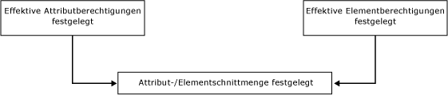
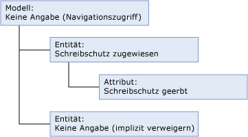
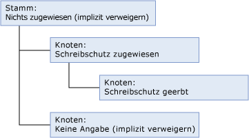
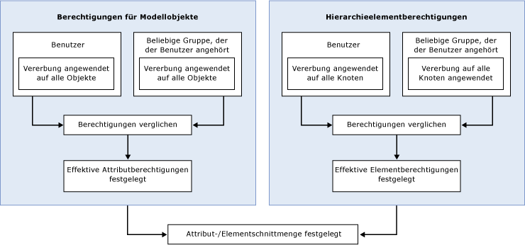

# Vorgehensweise: Festlegen von Berechtigungen (Master Data Services)
  In [!INCLUDE[ssMDSshort](../includes/ssmdsshort-md.md)]ist die einfachste Methode zum Konfigurieren der Sicherheit, Modellobjektberechtigungen einer Gruppe zuzuweisen, deren Mitglied der Benutzer ist.  
  
 Die Sicherheit wird komplexer, wenn:  
  
-   Modellobjekt- und Hierarchieelementberechtigungen zugewiesen werden.  
  
-   Der Benutzer Gruppen angehört und die Berechtigung dem Benutzer und Gruppen zugewiesen wird.  
  
-   Der Benutzer Gruppen angehört und die Berechtigung mehreren Gruppen zugewiesen wird.  
  
## Einer einzelnen Gruppe oder einem Benutzer zugewiesene Berechtigungen  
 Wenn Sie Berechtigungen einer einzelnen Gruppe oder einem Benutzer zuweisen, werden Berechtigungen gemäß dem folgenden Workflow festgelegt.  
  
   
  
### Schritt 1: Effektive Attributberechtigungen werden festgelegt.  
 Die folgende Liste beschreibt, wie effektive Attributberechtigungen festgelegt werden:  
  
-   Modellobjekten zugewiesene Berechtigungen legen fest, auf welche Attribute ein Benutzer zugreifen kann.  
  
-   Von allen Modellobjekten wird die Berechtigung automatisch vom nächst gelegenen Objekt auf einer höheren Ebene in der Modellstruktur geerbt.  
  
-   Objekte auf derselben Ebene wie die Entität werden implizit verweigert.  
  
-   Objekten auf einer höheren Ebene wird abgeleiteter Lesezugriff gewährt. Weitere Informationen zum abgeleiteten Lesezugriff, finden Sie unter [Navigationszugriff &#40;Master Data Services&#41;](../master-data-services/navigational-access-master-data-services.md).  
  
 In diesem Beispiel wird einer Entität die Berechtigung **Lesen** zugewiesen, und diese Berechtigung wird von deren Attribut geerbt, das sich in der Modellstruktur auf einer niedrigeren Ebene befindet. Das Modell stellt für diese Entität und das Attribut abgeleiteten Lesezugriff bereit. Der anderen Entität im Modell wurde keine explizite Berechtigung zugewiesen, und von ihr werden keine Berechtigungen geerbt. Sie wird daher implizit verweigert.  
  
   
  
### Schritt 2: Wenn Hierarchieelementberechtigungen zugewiesen werden, werden effektive Elementberechtigungen festgelegt.  
 Die folgende Liste beschreibt, wie effektive Hierarchieelementberechtigungen festgelegt werden:  
  
-   Hierarchieknoten zugewiesene Berechtigungen legen fest, auf welche Elemente ein Benutzer zugreifen kann.  
  
-   Von allen Knoten in einer Hierarchie wird die Berechtigung automatisch vom nächst gelegenen Objekt auf einer höheren Ebene in der Hierarchiestruktur geerbt.  
  
-   Alle Knoten auf derselben Ebene werden implizit verweigert.  
  
-   Alle Knoten auf höheren Ebenen, denen keine Berechtigungen zugewiesen wurden, werden implizit verweigert.  
  
 In diesem Beispiel wird einem Knoten der Hierarchie die Berechtigung **Lesen** zugewiesen, und diese Berechtigung wird von einem Knoten auf einer niedrigeren Ebene in der Hierarchiestruktur geerbt. Dem Stamm wurde keine Berechtigung zugewiesen, er wird daher implizit verweigert. Dem anderen Knoten in der Hierarchiestruktur wurde keine explizite Berechtigung zugewiesen, und von ihm werden keine Berechtigungen geerbt. Er wird daher implizit verweigert.  
  
   
  
### Schritt 3: Die Schnittmenge von Attribut- und Elementberechtigungen wird bestimmt.  
 Wenn sich die effektiven Attributberechtigungen von den effektiven Elementberechtigungen unterscheiden, müssen Berechtigungen für jeden einzelnen Attributwert festgelegt werden. Weitere Informationen finden Sie unter [Überlappende Modell- und Elementberechtigungen &#40;Master Data Services&#41;](../master-data-services/overlapping-model-and-member-permissions-master-data-services.md).  
  
## Mehreren Gruppen zugewiesene Berechtigungen  
 Wenn ein Benutzer einer oder mehreren Gruppen angehört und Berechtigungen dem Benutzer und den Gruppen zugewiesen werden, wird der Workflow komplexer.  
  
   
  
 In diesem Fall müssen überlappende Benutzer- und Gruppenberechtigungen aufgelöst werden, bevor Modellobjekt- und Hierarchieelementberechtigungen verglichen werden können. Weitere Informationen finden Sie unter [Überlappende Benutzer- und Gruppenberechtigungen &#40;Master Data Services&#41;](../master-data-services/overlapping-user-and-group-permissions-master-data-services.md).  
  
## Siehe auch  
 [Überlappende Benutzer- und Gruppenberechtigungen &#40;Master Data Services&#41;](../master-data-services/overlapping-user-and-group-permissions-master-data-services.md)   
 [Überlappende Modell- und Elementberechtigungen &#40;Master Data Services&#41;](../master-data-services/overlapping-model-and-member-permissions-master-data-services.md)  
  
  
