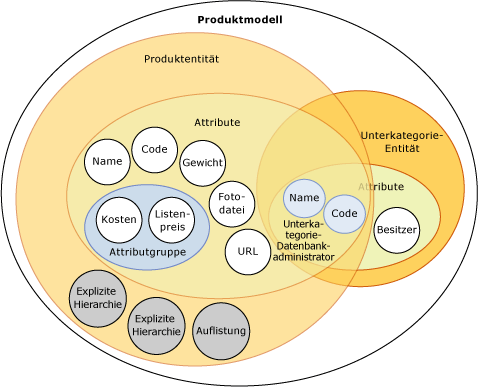
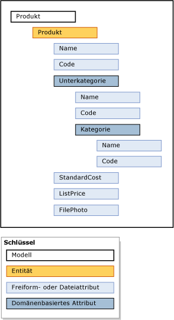

# Modelle (Master Data Services)
  Modelle stellen die höchste Ebene der Datenorganisation in [!INCLUDE[ssMDSshort](../includes/ssmdsshort-md.md)]dar. Ein Modell definiert die Struktur der Daten in der Masterdaten-Verwaltungslösung. Ein Modell enthält die folgenden Objekte:  
  
-   Entitäten  
  
-   Attribute und Attributgruppen  
  
-   Explizite und abgeleitete Hierarchien  
  
-   Auflistungen  
  
 In Modellen wird die Struktur der Masterdaten organisiert. Ihre [!INCLUDE[ssMDSshort](../includes/ssmdsshort-md.md)] -Implementierung kann über ein Modell oder viele Modelle verfügen, von denen jedes Daten ähnlichen Typs gruppiert. Die Masterdaten werden im Allgemeinen in vier Kategorien unterteilt: Personen, Orte, Gegenstände oder Begriffe. Sie können z. B. ein Produktmodell erstellen, das produktbezogene Daten enthält, oder ein Kundenmodell, das kundenbezogene Daten enthält.  
  
 Sie können Benutzern und Gruppen Berechtigungen für die Anzeige und Aktualisierung von Objekten innerhalb des Modells zuweisen. Wenn Sie keine Berechtigung für das Modell gewähren, wird es nicht angezeigt.  
  
 Zu einem beliebigen Zeitpunkt können Sie Kopien der Masterdaten innerhalb eines Modells erstellen. Diese Kopien werden als Versionen bezeichnet.  
  
 Nachdem Sie ein Modell in einer Testumgebung definiert haben, können Sie es mit oder ohne die entsprechenden Daten von der Testumgebung aus in einer Produktionsumgebung bereitstellen. Auf diese Weise erübrigt sich die Neuerstellung der Modelle in der Produktionsumgebung.  
  
## Zusammenhang zwischen Modellen und anderen Objekten  
 Ein Modell enthält Entitäten. Entitäten enthalten Attribute, explizite Hierarchien und Auflistungen. Attribute können in Attributgruppen enthalten sein. Domänenbasierte Attributesind vorhanden, wenn eine Entität für eine andere Entität als Attribut verwendet wird.  
  
 Dieses Bild zeigt die Beziehung zwischen den Objekten in einem Modell an.  
  
   
  
> [!NOTE]  
>  Abgeleitete Hierarchien sind ebenfalls Modellobjekte, sie werden jedoch nicht im Bild angezeigt. Abgeleitete Hierarchien werden von den domänenbasierten Attributbeziehungen abgeleitet, die zwischen Entitäten vorhanden sind. Finden Sie unter [abgeleitete Hierarchien &#40; Master Data Services &#41; ](../master-data-services/derived-hierarchies-master-data-services.md) für Weitere Informationen.  
  
 Masterdaten sind die Daten, die in den Modellobjekten enthalten sind. In [!INCLUDE[ssMDSshort](../includes/ssmdsshort-md.md)]werden Masterdaten als Elemente in einer Entität gespeichert.  
  
 Modellobjekte werden im Funktionsbereich **Systemverwaltung** der [!INCLUDE[ssMDSmdm](../includes/ssmdsmdm-md.md)] -Benutzeroberfläche verwaltet.  
  
## Modellbeispiel  
 Im folgenden Beispiel gruppieren die Objekte im Produktmodell logisch produktbezogene Daten.  
  
   
  
 Weitere allgemeine Modelle:  
  
-   Konten: Mögliche Entitäten sind Bilanzkonten, Gewinn- und Verlustrechnungen, Statistiken und Kontotyp.  
  
-   Kunde: Mögliche Entitäten sind Geschlecht, Ausbildung, Beruf und Familienstand.  
  
-   Geografie: Mögliche Entitäten sind Postleitzahlen, Städte, Landkreise, Staaten, Provinzen, Regionen, Gebiete, Länder und Kontinente.  
  
## Verwandte Aufgaben  
  
|Taskbeschreibung|Thema|  
|----------------------|-----------|  
|Erstellen Sie ein Modell, um die Masterdaten zu organisieren.|[Erstellen Sie ein Modell &#40; Master Data Services &#41;](../master-data-services/create-a-model-master-data-services.md)|  
|Ändern Sie den Namen eines vorhandenen Modells.|[Bearbeiten Sie Modell &#40; Master Data Services &#41;](../master-data-services/edit-model-master-data-services.md)|  
|Löschen Sie ein vorhandenes Modell.|[Löschen eines Modells &#40; Master Data Services &#41;](../master-data-services/delete-a-model-master-data-services.md)|  
  
## Verwandte Inhalte  
  
-   [Übersicht über Master Data Services &#40;MDS&#41;](../master-data-services/master-data-services-overview-mds.md)  
  
-   [Entitäten &#40;Master Data Services&#41;](../master-data-services/entities-master-data-services.md)  
  
-   [Attribute &#40; Master Data Services &#41;](../master-data-services/attributes-master-data-services.md)  
  
-   [Bereitstellen von Modellen &#40; Master Data Services &#41;](../master-data-services/deploying-models-master-data-services.md)  
  
-   [Modellierung von Objektberechtigungen &#40; Master Data Services &#41;](../master-data-services/model-object-permissions-master-data-services.md)  
  
  
