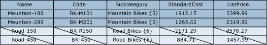
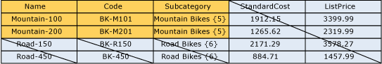

# Überlappende Modell- und Elementberechtigungen (Master Data Services)
  Die einem Element zugewiesene Berechtigung kann mit einer einem Modellobjekt zugewiesenen Berechtigung überlappen. Bei einer Überlappung tritt die restriktivere Berechtigung in Kraft.  
  
 Wenn ein Element über eine Berechtigung verfügt, die sich von der des zugehörigen Modellobjekts unterscheidet, gelten die folgenden Regeln:  
  
-   Mit**Verweigern** werden alle anderen Berechtigungen überschrieben.  
  
-   **Administratorrechte** auf der Modellebene setzen alle anderen Berechtigungen außer Kraft und werden auf untergeordneten Ebenen in "Alle" (CRUD) geändert.  
  
-   Die effektive Zugriffsberechtigungen überschneidet sich mit Berechtigungen für Elemente und Attribute.  
  
     Wenn Elementberechtigungen beispielsweise **Erstellen** und **Aktualisieren**beinhalten, lautet die Berechtigung für Attribute **Aktualisieren**. Die effektive Berechtigung lautet **Aktualisieren**.  
  
 Das folgende Bild zeigt, welche Berechtigungen für einen einzelnen Attributwert wirksam werden, wenn Attributberechtigungen sich von Elementberechtigungen unterscheiden.  
  
   
  
## Beispiel 1  
   
  
 Auf der Registerkarte **Modelle** verfügt die Product-Entität über die zugewiesene Berechtigung **Aktualisieren** . Diese Berechtigung wird von allen Attributen in der Entität geerbt.  
  
 Auf der Registerkarte **Hierarchieelemente** verfügt der Unterkategorieknoten "Mountain Bikes" in einer abgeleiteten Hierarchie über die zugewiesene Berechtigung **Aktualisieren** .  
  
 Ergebnis: In **Explorer**verfügt der Benutzer über die Berechtigung **Aktualisieren** für alle Attributwerte für alle Elemente im Knoten "Mountain Bikes". Alle anderen Elemente und Attribute werden ausgeblendet.  
  
   
  
## Beispiel 2  
   
  
 Auf der Registerkarte **Modelle** verfügt das Subcategory-Attribut über die zugewiesene Berechtigung **Aktualisieren** .  
  
 Auf der Registerkarte **Hierarchieelemente** wird dem Unterkategorieknoten "Mountain Bikes" in einer abgeleiteten Hierarchie die **Leseberechtigung** explizit zugewiesen.  
  
 Ergebnis: In **Explorer**verfügt der Benutzer über die **Leseberechtigung** für die Subcategory-Attributwerte für die Elemente im Knoten "Mountain Bikes". Alle anderen Elemente und Attribute werden ausgeblendet.  
  
   
  
## Beispiel 3  
   
  
 Auf der Registerkarte **Modelle** verfügt das Subcategory-Attribut über die zugewiesene **Leseberechtigung** .  
  
 Auf der Registerkarte **Hierarchieelemente** wird der Unterkategorie "Mountain Bikes" in einer abgeleiteten Hierarchie die Berechtigung **Aktualisieren** explizit zugewiesen.  
  
 Ergebnis: In **Explorer**verfügt der Benutzer über die **Leseberechtigung** für die Attributwerte. Alle anderen Elemente und Attribute werden ausgeblendet.  
  
   
  
## Weitere Informationen finden Sie unter  
 [Vorgehensweise: Festlegen von Berechtigungen &#40;Master Data Services&#41;](../master-data-services/how-permissions-are-determined-master-data-services.md)   
 [Überlappende Benutzer- und Gruppenberechtigungen &#40;Master Data Services&#41;](../master-data-services/overlapping-user-and-group-permissions-master-data-services.md)  
  
  
