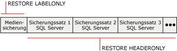

# Sicherungsverlauf und Headerinformationen (SQL Server)
[!INCLUDE[appliesto-ss-xxxx-xxxx-xxx-md](../../includes/appliesto-ss-xxxx-xxxx-xxx-md.md)] Ein vollständiger Verlauf aller [!INCLUDE[ssNoVersion](../../includes/ssnoversion-md.md)]-Sicherungs- und -Wiederherstellungsvorgänge auf einer Serverinstanz wird in der **msdb**-Datenbank gespeichert. Dieses Thema stellt die Sicherungs- und Wiederherstellungsverlaufstabellen vor sowie die [!INCLUDE[tsql](../../includes/tsql-md.md)] -Anweisungen, die zum Zugreifen auf den Sicherungsverlauf verwendet werden. In diesem Thema wird auch erläutert, wann die Auflistung von Datenbank- und Transaktionsprotokolldateien sinnvoll ist und wann Medienheaderinformationen bzw. Sicherungsheaderinformationen verwendet werden sollten.  
  
> [!IMPORTANT]  
>  Sichern Sie **msdb** häufig, um das Risiko des Verlusts der aktuellen Änderungen am Sicherungs- und Wiederherstellungsverlauf zu minimieren. Informationen darüber, welche der Systemdatenbanken Sie sichern müssen, finden Sie unter [Sichern und Wiederherstellen von Systemdatenbanken &#40;SQL Server&#41;](../../relational-databases/backup-restore/back-up-and-restore-of-system-databases-sql-server.md).  
  
 **In diesem Thema:**  
  
-   [Tabellen mit Sicherungs- und Wiederherstellungsverlauf](#BnRHistoryTables)  
  
-   [Transact-SQL-Anweisungen für den Zugriff auf den Sicherungsverlauf](#TsqlStatementsForBackupHistory)  
  
-   [Datenbank- und Transaktionsprotokolldateien](#ListDbTlogFiles)  
  
-   [Medienheaderinformationen](#MediaHeader)  
  
-   [Sicherungsheaderinformationen](#BackupHeader)  
  
-   [Vergleich von Medienheader- und Sicherungsheaderinformationen](#CompareMediaHeaderBackupHeader)  
  
-   [Sicherungsüberprüfung](#Verification)  
  
-   [Verwandte Aufgaben](#RelatedTasks)  
  
##   Tabellen mit Sicherungs- und Wiederherstellungsverlauf  
 In diesem Abschnitt werden die Verlaufstabellen der **msdb** -Datenbank vorgestellt, in denen die Metadaten für die Sicherung und Wiederherstellung gespeichert werden.  
  
|Verlaufstabelle|Description|  
|-------------------|-----------------|  
|[backupfile](../../relational-databases/system-tables/backupfile-transact-sql.md)|Enthält eine Zeile für jede Daten- oder Protokolldatei, die gesichert wird.|  
|[backupfilegroup](../../relational-databases/system-tables/backupfilegroup-transact-sql.md)|Enthält eine Reihe für jede Dateigruppe in einem Sicherungssatz.|  
|[backupmediafamily](../../relational-databases/system-tables/backupmediafamily-transact-sql.md)|Enthält eine Zeile für jede Medienfamilie. Wenn sich eine Medienfamilie in einem gespiegelten Mediensatz befindet, verfügt die Familie über eine separate Zeile für jede Spiegelung im Mediensatz.|  
|[backupmediaset](../../relational-databases/system-tables/backupmediaset-transact-sql.md)|Enthält eine Zeile für jeden Sicherungsmediensatz.|  
|[backupset](../../relational-databases/system-tables/backupset-transact-sql.md)|Enthält eine Zeile für jeden Sicherungssatz.|  
|[restorefile](../../relational-databases/system-tables/restorefile-transact-sql.md)|Enthält eine Zeile für jede wiederhergestellte Datei. Dies gilt auch für Dateien, die indirekt nach Dateigruppennamen wiederhergestellt werden.|  
|[restorefilegroup](../../relational-databases/system-tables/restorefilegroup-transact-sql.md)|Enthält eine Zeile für jede wiederhergestellte Dateigruppe.|  
|[restorehistory](../../relational-databases/system-tables/restorehistory-transact-sql.md)|Enthält eine Zeile für jeden Wiederherstellungsvorgang.|  
  
> [!NOTE]  
>  Wenn eine Wiederherstellung ausgeführt wird, werden Änderungen an den Sicherungsverlaufstabellen und an den Wiederherstellungsverlaufstabellen vorgenommen.  
  
##   Transact-SQL-Anweisungen für den Zugriff auf den Sicherungsverlauf  
 Die Anweisungen zu Wiederherstellungsinformationen korrespondieren mit Informationen, die in bestimmten Sicherungsverlaufstabellen gespeichert sind.  
  
> [!IMPORTANT]  
>  Die Transact-SQL-Anweisungen RESTORE FILELISTONLY, RESTORE HEADERONLY, RESTORE LABELONLY und RESTORE VERIFYONLY erfordern die CREATE DATABASE-Berechtigung. Dadurch werden Ihre Sicherungsdateien und Sicherungsinformationen umfassender geschützt als in vorherigen Versionen. Informationen über diese Berechtigung finden Sie unter [GRANT (Datenbankberechtigungen) &#40;Transact-SQL&#41;](../../t-sql/statements/grant-database-permissions-transact-sql.md).  
  
|Informationsanweisung|Tabelle mit Sicherungsverläufen|Description|  
|---------------------------|--------------------------|-----------------|  
|[RESTORE FILELISTONLY](../../t-sql/statements/restore-statements-filelistonly-transact-sql.md)|[backupfile](../../relational-databases/system-tables/backupfile-transact-sql.md)|Gibt ein Resultset mit einer Liste mit Datenbank- und Protokolldateien zurück, die im angegebenen Sicherungssatz enthalten sind.   Weitere Informationen finden Sie im Abschnitt "Auflisten der Datenbank- und Transaktionsprotokolldateien" weiter unten in diesem Thema.|  
|[RESTORE HEADERONLY](../../t-sql/statements/restore-statements-headeronly-transact-sql.md)|[backupset](../../relational-databases/system-tables/backupset-transact-sql.md)|Ruft alle Sicherungsheaderinformationen für alle Sicherungssätze auf einem bestimmten Sicherungsmedium ab. Das Ergebnis der Ausführung von RESTORE HEADERONLY ist ein Resultset.   Weitere Informationen finden Sie im Abschnitt "Anzeigen der Sicherungsheaderinformationen" weiter unten in diesem Thema.|  
|[RESTORE LABELONLY](../../t-sql/statements/restore-statements-labelonly-transact-sql.md)|[backupmediaset](../../relational-databases/system-tables/backupmediaset-transact-sql.md)|Gibt ein Resultset mit Informationen zu den Sicherungsmedien für ein angegebenes Sicherungsmedium zurück.   Weitere Informationen finden Sie im Abschnitt "Anzeigen der Medienheaderinformationen" weiter unten in diesem Thema.|  
  
##   Datenbank- und Transaktionsprotokolldateien  
 Zu den Informationen, die in den Datenbank- und Transaktionsprotokolldateien in einer Sicherung aufgelistet werden, zählen der logische Name, der physische Name, der Dateityp (Datenbank oder Protokoll), die Mitgliedschaft in Dateigruppen, die Dateigröße (in Bytes), die maximal zulässige Dateigröße und die vordefinierte Größe der Dateivergrößerung (in Bytes). Sie können diese nützlichen Informationen in folgenden Fällen verwenden, um die Namen der Dateien in einer Datenbanksicherung vor dem Wiederherstellen der Datenbanksicherung zu bestimmen:  
  
-   Sie haben einen Datenträger mit einer oder mehreren Dateien für eine Datenbank verloren.  
  
     Sie können die Dateien in der Datenbanksicherung auflisten, um zu bestimmen, welche Dateien betroffen sind, und anschließend bei der Wiederherstellung der gesamten Datenbank diese Dateien auf einem anderen Laufwerk wiederherstellen. Oder Sie stellen nur jene Dateien wieder her und wenden alle Transaktionsprotokollsicherungen an, die seit dem Sichern der Datenbank erstellt wurden.  
  
-   Sie stellen eine Datenbank von einem Server auf einem anderen Server wieder her, aber die Zuordnung für Verzeichnisstrukturen und Laufwerke ist auf dem Server nicht vorhanden.  
  
     Durch das Auflisten der gesicherten Dateien können Sie bestimmen, welche Dateien betroffen sind. Die Sicherung enthält beispielsweise eine Datei, die auf Laufwerk E wiederhergestellt werden soll, doch der Zielserver weist kein Laufwerk E auf. Die Datei muss dann an einen anderen Speicherort (beispielsweise Laufwerk Z) verschoben werden, wenn sie wiederhergestellt wird.  
  
##   Medienheaderinformationen  
 Der Medienheader zeigt Informationen zum Medium selbst an, jedoch nicht zu den Sicherungen auf dem Medium. Zu den angezeigten Medienheaderinformationen zählen Medienname, Beschreibung, Name der Software, mit der der Medienheader erstellt wurde, und das Erstellungsdatum des Medienheaders.  
  
> [!NOTE]  
>  Das Anzeigen des Medienheaders dauert nur kurze Zeit.  
  
 Weitere Informationen finden Sie unter [Vergleich von Medienheader- und Sicherungsheaderinformationen](#CompareMediaHeaderBackupHeader)weiter unten in diesem Thema.  
  
##   Sicherungsheaderinformationen  
 Mit dem Sicherungsheader werden Informationen zu allen [!INCLUDE[ssNoVersion](../../includes/ssnoversion-md.md)] -Sicherungssätzen und zu allen Nicht-[!INCLUDE[ssNoVersion](../../includes/ssnoversion-md.md)] -Sicherungssätzen auf dem Medium angezeigt. Zu den angezeigten Informationen zählen die Typen der verwendeten Sicherungsmedien, die Sicherungstypen (beispielsweise Datenbank, Transaktion, Datei oder differenzielle Datenbank) sowie Informationen zum Anfangs- und Enddatum als auch zur Anfangs- und Beendigungszeit der Sicherung. Diese Informationen sind dann nützlich, wenn Sie bestimmen müssen, welcher Sicherungssatz auf dem Band wiederhergestellt werden soll oder welche Sicherungen auf dem Medium enthalten sind.  
  
> [!NOTE]  
>  Das Anzeigen der Sicherungsheaderinformationen kann bei Bändern mit großen Kapazitäten einige Zeit in Anspruch nehmen, da das gesamte Medium gescannt werden muss, damit Informationen zu einzelnen Sicherungen auf dem Medium angezeigt werden können.  
  
 Weitere Informationen finden Sie unter [Vergleich von Medienheader- und Sicherungsheaderinformationen](#CompareMediaHeaderBackupHeader)weiter unten in diesem Thema.  
  
### Wiederherzustellender Sicherungssatz  
 Anhand der Informationen im Sicherungsheader können Sie den wiederherzustellenden Sicherungssatz identifizieren. Das Datenbankmodul nummeriert jeden Sicherungssatz auf den Sicherungsmedien. Dadurch können Sie den wiederherzustellenden Sicherungssatz mithilfe seiner Position auf dem Medium identifizieren. Beispielsweise enthalten die folgenden Medien drei Sicherungssätze.  
  
   
  
 Um einen bestimmten Sicherungssatz wiederherzustellen, müssen Sie die Positionsnummer des wiederherzustellenden Sicherungssatzes angeben. Geben Sie beispielsweise 2 als wiederherzustellenden Sicherungssatz an, um den zweiten Sicherungssatz wiederherzustellen.  
  
##   Vergleich von Medienheader- und Sicherungsheaderinformationen  
 Die folgende Abbildung stellt ein Beispiel für die Unterschiede beim Anzeigen von Sicherungsheader- und Medienheaderinformationen dar. Für das Abrufen des Medienheaders ist lediglich das Auslesen von Informationen vom Anfang des Bands erforderlich. Dagegen ist für das Abrufen des Sicherungsheaders das Scannen des gesamten Bands erforderlich, damit der Header jedes Sicherungssatzes ausgelesen werden kann.  
  
   
  
> [!NOTE]  
>  Beim Verwenden von Mediensätzen mit mehreren Medienfamilien werden die Medienheader- und Sicherungssätze in alle Medienfamilien geschrieben. Darum ist es nur notwendig, eine einzelne Medienfamilie für diese Berichterstellungsvorgänge zur Verfügung zu stellen.  
  
 Informationen zum Anzeigen des Medienheaders finden Sie im Abschnitt "Anzeigen der Medienheaderinformationen" weiter oben in diesem Thema.  
  
 Informationen zum Anzeigen der Sicherungsheaderinformationen für alle Sicherungssätze auf einem Sicherungsmedium finden Sie unter "Anzeigen der Sicherungsheaderinformationen" weiter oben in diesem Thema.  
  
##   Sicherungsüberprüfung  
 Das Überprüfen von Sicherungen ist zwar nicht erforderlich, aber nützlich. Beim Überprüfen einer Sicherung wird überprüft, ob die Sicherung physisch intakt ist, um sicherzustellen, dass alle Dateien der Sicherung lesbar sind und wiederhergestellt werden können, und ob Sie die Sicherung bei Bedarf wiederherstellen könnten. Es ist wichtig, zu wissen, dass beim Überprüfen einer Sicherung nicht die Struktur der Daten in der Sicherung überprüft wird. Wenn die Sicherung jedoch mit WITH CHECKSUMS erstellt wurde, kann das Überprüfen der Sicherung mit WITH CHECKSUMS gute Hinweise auf die Zuverlässigkeit der Daten in der Sicherung geben.  
  
##   Verwandte Aufgaben  
 **So löschen Sie alte Zeilen aus Sicherungs- und Wiederherstellungsverlaufstabellen**  
  
-   [sp_delete_backuphistory &#40;Transact-SQL&#41;](../../relational-databases/system-stored-procedures/sp-delete-backuphistory-transact-sql.md)  
  
 **So löschen Sie alle Zeilen für eine bestimmte Datenbank aus Sicherungs- und Wiederherstellungsverlaufstabellen**  
  
-   [sp_delete_database_backuphistory &#40;Transact-SQL&#41;](../../relational-databases/system-stored-procedures/sp-delete-database-backuphistory-transact-sql.md)  
  
 **So zeigen Sie die Daten und Protokolldateien in einem Sicherungssatz an**  
  
-   [RESTORE FILELISTONLY &#40;Transact-SQL&#41;](../../t-sql/statements/restore-statements-filelistonly-transact-sql.md)  
  
-   <xref:Microsoft.SqlServer.Management.Smo.Restore.ReadFileList%2A> (SMO)  
  
 **So zeigen Sie die Medienheaderinformationen an**  
  
-   [RESTORE LABELONLY &#40;Transact-SQL&#41;](../../t-sql/statements/restore-statements-labelonly-transact-sql.md)  
  
-   [Anzeigen der Eigenschaften und des Inhalts eines logischen Sicherungsmediums &#40;SQL Server&#41;](../../relational-databases/backup-restore/view-the-properties-and-contents-of-a-logical-backup-device-sql-server.md)  
  
-   [Anzeigen der Inhalte eines Sicherungsbands oder einer -datei &#40;SQL Server&#41;](../../relational-databases/backup-restore/view-the-contents-of-a-backup-tape-or-file-sql-server.md)  
  
-   <xref:Microsoft.SqlServer.Management.Smo.Restore.ReadMediaHeader%2A> (SMO)  
  
 **So zeigen Sie die Sicherungsheaderinformationen an**  
  
-   [RESTORE HEADERONLY &#40;Transact-SQL&#41;](../../t-sql/statements/restore-statements-headeronly-transact-sql.md)  
  
-   [Anzeigen der Inhalte eines Sicherungsbands oder einer -datei &#40;SQL Server&#41;](../../relational-databases/backup-restore/view-the-contents-of-a-backup-tape-or-file-sql-server.md)  
  
-   [Anzeigen der Eigenschaften und des Inhalts eines logischen Sicherungsmediums &#40;SQL Server&#41;](../../relational-databases/backup-restore/view-the-properties-and-contents-of-a-logical-backup-device-sql-server.md)  
  
-   <xref:Microsoft.SqlServer.Management.Smo.Restore.ReadBackupHeader%2A> (SMO)  
  
 **So löschen Sie alte Zeilen aus Sicherungs- und Wiederherstellungsverlaufstabellen**  
  
-   [sp_delete_backuphistory &#40;Transact-SQL&#41;](../../relational-databases/system-stored-procedures/sp-delete-backuphistory-transact-sql.md)  
  
 **So löschen Sie alle Zeilen für eine bestimmte Datenbank aus Sicherungs- und Wiederherstellungsverlaufstabellen**  
  
-   [sp_delete_database_backuphistory &#40;Transact-SQL&#41;](../../relational-databases/system-stored-procedures/sp-delete-database-backuphistory-transact-sql.md)  
  
 **So zeigen Sie die Medienheaderinformationen an**  
  
-   [RESTORE LABELONLY &#40;Transact-SQL&#41;](../../t-sql/statements/restore-statements-labelonly-transact-sql.md)  
  
-   [Anzeigen der Eigenschaften und des Inhalts eines logischen Sicherungsmediums &#40;SQL Server&#41;](../../relational-databases/backup-restore/view-the-properties-and-contents-of-a-logical-backup-device-sql-server.md)  
  
-   [Anzeigen der Inhalte eines Sicherungsbands oder einer -datei &#40;SQL Server&#41;](../../relational-databases/backup-restore/view-the-contents-of-a-backup-tape-or-file-sql-server.md)  
  
-   <xref:Microsoft.SqlServer.Management.Smo.Restore.ReadMediaHeader%2A> (SMO)  
  
 **So zeigen Sie die Sicherungsheaderinformationen an**  
  
-   [RESTORE HEADERONLY &#40;Transact-SQL&#41;](../../t-sql/statements/restore-statements-headeronly-transact-sql.md)  
  
-   [Anzeigen der Inhalte eines Sicherungsbands oder einer -datei &#40;SQL Server&#41;](../../relational-databases/backup-restore/view-the-contents-of-a-backup-tape-or-file-sql-server.md)  
  
-   [Anzeigen der Eigenschaften und des Inhalts eines logischen Sicherungsmediums &#40;SQL Server&#41;](../../relational-databases/backup-restore/view-the-properties-and-contents-of-a-logical-backup-device-sql-server.md)  
  
-   <xref:Microsoft.SqlServer.Management.Smo.Restore.ReadBackupHeader%2A> (SMO)  
  
 **So zeigen Sie die Dateien in einem Sicherungssatz an**  
  
-   [Anzeigen der Daten und Protokolldateien in einem Sicherungssatz &#40;SQL Server&#41;](../../relational-databases/backup-restore/view-the-data-and-log-files-in-a-backup-set-sql-server.md)  
  
-   [RESTORE HEADERONLY &#40;Transact-SQL&#41;](../../t-sql/statements/restore-statements-headeronly-transact-sql.md)  
  
 **So überprüfen Sie eine Sicherung**  
  
-   [RESTORE VERIFYONLY &#40;Transact-SQL&#41;](../../t-sql/statements/restore-statements-verifyonly-transact-sql.md)  
  
-   <xref:Microsoft.SqlServer.Management.Smo.Restore.SqlVerify%2A> (SMO)  
  
## Weitere Informationen finden Sie unter  
 [BACKUP &#40;Transact-SQL&#41;](../../t-sql/statements/backup-transact-sql.md)   
 [Mediensätze, Medienfamilien und Sicherungssätze &#40;SQL Server&#41;](../../relational-databases/backup-restore/media-sets-media-families-and-backup-sets-sql-server.md)   
 [Sicherungsmedien &#40;SQL Server&#41;](../../relational-databases/backup-restore/backup-devices-sql-server.md)   
 [Gespiegelte Sicherungsmediensätze &#40;SQL Server&#41;](../../relational-databases/backup-restore/mirrored-backup-media-sets-sql-server.md)   
 [Mögliche Medienfehler während der Sicherung und Wiederherstellung &#40;SQL Server&#41;](../../relational-databases/backup-restore/possible-media-errors-during-backup-and-restore-sql-server.md)  
  
  
