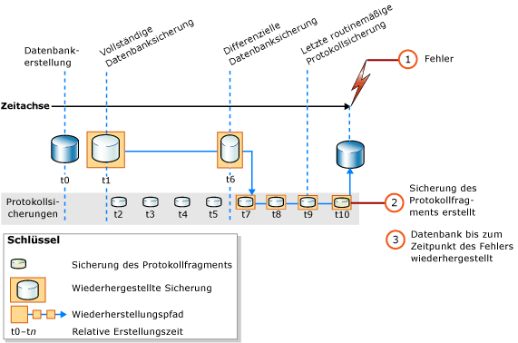

# <a name="complete-database-restores-full-recovery-model"></a>Vollständige Datenbankwiederherstellungen (vollständiges Wiederherstellungsmodell)
[!INCLUDE[appliesto-ss-xxxx-xxxx-xxx-md](../../includes/appliesto-ss-xxxx-xxxx-xxx-md.md)]

  Das Ziel einer vollständigen Datenbankwiederherstellung besteht in der Wiederherstellung der gesamten Datenbank. Die gesamte Datenbank ist für die Dauer der Wiederherstellung offline. Bevor Teile der Datenbank wieder online zur Verfügung gestellt werden können, müssen alle Daten bis zu einem konsistenten Zeitpunkt wiederhergestellt werden. Ein solcher Punkt ist gegeben, wenn für alle Teile der Datenbank derselbe Zeitpunkt gilt und keine Transaktionen ohne Commit vorhanden sind.  
  
 Bei Verwendung des vollständigen Wiederherstellungsmodells müssen Sie nach dem Wiederherstellen der Datensicherung(en) alle nachfolgenden Transaktionsprotokollsicherungen und anschließend die Datenbank wiederherstellen. Sie können eine Datenbank bis zu einem bestimmten *Wiederherstellungspunkt* innerhalb einer dieser Protokollsicherungen wiederherstellen. Der Wiederherstellungspunkt kann einem bestimmten Datum mit einer bestimmten Uhrzeit, einer markierten Transaktion oder einer Protokollsequenznummer (Log Sequence Number, LSN) entsprechen.  
  
 Beim Wiederherstellen einer Datenbank sollten Sie vor allem beim vollständigen und massenprotokollierten Wiederherstellungsmodell eine einzelne Wiederherstellungssequenz verwenden. Eine *Wiederherstellungssequenz* besteht aus mindestens einem Wiederherstellungsvorgang, mit dessen Hilfe Daten mindestens eine Wiederherstellungsphase durchlaufen.  
  
> [!IMPORTANT]  
>  Das Anfügen oder Wiederherstellen von Datenbanken aus unbekannten oder nicht vertrauenswürdigen Quellen wird nicht empfohlen. Diese Datenbanken können bösartigen Code enthalten, der möglicherweise unbeabsichtigten [!INCLUDE[tsql](../../includes/tsql-md.md)] -Code ausführt oder Fehler durch Ändern des Schemas oder der physischen Datenbankstruktur erzeugt. Bevor Sie eine Datenbank aus einer unbekannten oder nicht vertrauenswürdigen Quelle verwenden, führen Sie auf einem Nichtproduktionsserver [DBCC CHECKDB](../../t-sql/database-console-commands/dbcc-checkdb-transact-sql.md) für die Datenbank aus. Überprüfen Sie außerdem den Code in der Datenbank, z.B. gespeicherte Prozeduren oder anderen benutzerdefinierten Code.  
  
 **In diesem Thema:**  
  
-   [Wiederherstellen einer Datenbank bis zum Zeitpunkt des Fehlers](#PointOfFailure)  
  
-   [Wiederherstellen einer Datenbank bis zu einem Punkt in einer Protokollsicherung](#PointWithinBackup)  
  
-   [Verwandte Aufgaben](#RelatedTasks)  
  
> [!NOTE]  
>  Informationen zur Unterstützung von Sicherungskopien früherer [!INCLUDE[ssNoVersion](../../includes/ssnoversion-md.md)]-Versionen finden Sie im Kapitel [RESTORE &#40;Transact-SQL&#41;](../../t-sql/statements/restore-statements-transact-sql.md)im Abschnitt „Kompatibilitätsunterstützung“.  
  
##  <a name="PointOfFailure"></a> Wiederherstellen einer Datenbank bis zum Zeitpunkt des Fehlers  
 Zum Wiederherstellen einer Datenbank bis zum Zeitpunkt des Auftretens eines Fehlers werden in der Regel die folgenden grundlegenden Schritte ausgeführt:  
  
1.  Sichern Sie das aktive Transaktionsprotokoll (das Protokollfragment). Dadurch wird eine Sicherung des Protokollfragments erstellt. Wenn das aktive Transaktionsprotokoll nicht verfügbar ist, gehen alle Transaktionen in diesem Teil des Protokolls verloren.  
  
    > [!IMPORTANT]  
    >  Beim massenprotokollierten Wiederherstellungsmodell ist zum Sichern eines Protokolls, das massenprotokollierte Vorgänge enthält, der Zugriff auf alle Datendateien in der Datenbank erforderlich. Wenn der Zugriff auf die Datendateien nicht möglich ist, kann das Transaktionsprotokoll nicht gesichert werden. In diesem Fall müssen Sie alle Änderungen seit der letzten Protokollsicherung erneut manuell vornehmen.  
  
     Weitere Informationen finden Sie unter [Protokollfragmentsicherungen &#40;SQL Server&#41;](../../relational-databases/backup-restore/tail-log-backups-sql-server.md).  
  
2.  Stellen Sie die letzte vollständige Datenbanksicherung wieder her, ohne die Datenbank selbst wiederherzustellen (RESTORE DATABASE *database_name* FROM *backup_device* WITH NORECOVERY).  
  
3.  Wenn differenzielle Sicherungen vorhanden sind, stellen Sie die neueste Sicherung wieder her, ohne die Datenbank selbst wiederherzustellen (RESTORE DATABASE *database_name* FROM *differential_backup_device* WITH NORECOVERY).  
  
     Durch die Wiederherstellung der neuesten differenziellen Sicherung wird die Anzahl der wiederherzustellenden Protokollsicherungen reduziert.  
  
4.  Stellen Sie ausgehend von der ersten Transaktionsprotokollsicherung, die Sie nach der soeben wiederhergestellten Sicherung erstellt haben, die Protokolle der Reihe nach mit NORECOVERY wieder her.  
  
5.  Stellen Sie die Datenbank wieder her (RESTORE DATABASE *database_name* WITH RECOVERY). Alternativ kann dieser Schritt mit dem Wiederherstellen der letzten Protokollsicherung kombiniert werden.  
  
 Die folgende Abbildung stellt diese Wiederherstellungssequenz dar: Wenn ein Fehler aufgetreten ist (1), wird eine Sicherung des Protokollfragments erstellt (2). Danach wird die Datenbank bis zu dem Zeitpunkt des Auftretens des Fehlers wiederhergestellt. Dieser Vorgang umfasst die Wiederherstellung einer Datenbanksicherung, eine nachfolgende differenzielle Sicherung sowie alle Protokollsicherungen nach der differenziellen Sicherung, einschließlich der Sicherung des Protokollfragments.  
  
   
  
> [!NOTE]  
>  Informationen zum Wiederherstellen einer Datenbanksicherung auf einer anderen Serverinstanz finden Sie unter [Kopieren von Datenbanken durch Sichern und Wiederherstellen](../../relational-databases/databases/copy-databases-with-backup-and-restore.md).  
  
###  <a name="TsqlSyntax"></a> Grundlegende Transact-SQL-RESTORE-Syntax  
 Die grundlegende [RESTORE](../../t-sql/statements/restore-statements-transact-sql.md)[!INCLUDE[tsql](../../includes/tsql-md.md)] -Syntax für die Wiederherstellungssequenz in der vorangehenden Abbildung sieht folgendermaßen aus:  
  
1.  RESTORE DATABASE *database* FROM *full database backup* WITH NORECOVERY;  
  
2.  RESTORE DATABASE *database* FROM *full_differential_backup* WITH NORECOVERY;  
  
3.  RESTORE LOG *database* FROM *log_backup* WITH NORECOVERY;  
  
     Wiederholen Sie diesen Schritt der Protokollwiederherstellung für jede zusätzliche Protokollsicherung.  
  
4.  RESTORE DATABASE *database* WITH RECOVERY;  
  
###  <a name="ExampleToPoFTsql"></a> Beispiel: Wiederherstellen bis zum Zeitpunkt des Fehlers (Transact-SQL)  
 Im folgenden [!INCLUDE[tsql](../../includes/tsql-md.md)] -Beispiel werden die wesentlichen Optionen in einer Wiederherstellungssequenz veranschaulicht, mit der die Datenbank zum Zeitpunkt des Fehlers wiederhergestellt wird. Im Beispiel wird eine Sicherung des Protokollfragments der Datenbank erstellt. Als Nächstes wird im Beispiel eine vollständige Datenbanksicherung und Protokollsicherung wiederhergestellt. Anschließend wird die Sicherung des Protokollfragments wiederhergestellt. Im Beispiel wird die Datenbank in einem separaten, abschließenden Schritt wiederhergestellt.  
  
> [!NOTE]  
>  In diesem Beispiel werden eine Datenbanksicherung und eine Protokollsicherung verwendet, die im Abschnitt „Verwenden von Datenbanksicherungen im vollständigen Wiederherstellungsmodell“ in [Vollständige Datenbanksicherungen &#40;SQL Server&#41;](../../relational-databases/backup-restore/full-database-backups-sql-server.md)im Abschnitt „Kompatibilitätsunterstützung“. Vor der Datenbanksicherung wurde die Beispieldatenbank [!INCLUDE[ssSampleDBobject](../../includes/sssampledbobject-md.md)] zur Verwendung des vollständigen Wiederherstellungsmodells festgelegt.  
  
```  
USE master;  
--Create tail-log backup.  
BACKUP LOG AdventureWorks2012   
TO DISK = 'Z:\SQLServerBackups\AdventureWorksFullRM.bak'    
   WITH NORECOVERY;   
GO  
--Restore the full database backup (from backup set 1).  
RESTORE DATABASE AdventureWorks2012   
  FROM DISK = 'Z:\SQLServerBackups\AdventureWorksFullRM.bak'   
  WITH FILE=1,   
    NORECOVERY;  
  
--Restore the regular log backup (from backup set 2).  
RESTORE LOG AdventureWorks2012   
  FROM DISK = 'Z:\SQLServerBackups\AdventureWorksFullRM.bak'   
  WITH FILE=2,   
    NORECOVERY;  
  
--Restore the tail-log backup (from backup set 3).  
RESTORE LOG AdventureWorks2012   
  FROM DISK = 'Z:\SQLServerBackups\AdventureWorksFullRM.bak'  
  WITH FILE=3,   
    NORECOVERY;  
GO  
--recover the database:  
RESTORE DATABASE AdventureWorks2012 WITH RECOVERY;  
GO  
```  
  
##  <a name="PointWithinBackup"></a> Wiederherstellen einer Datenbank bis zu einem Punkt in einer Protokollsicherung  
 Beim vollständigen Wiederherstellungsmodell kann eine vollständige Datenbankwiederherstellung in der Regel bis zu einem Zeitpunkt, einer markierten Transaktion oder einer LSN in einer Protokollsicherung wiederhergestellt werden. Wenn jedoch beim massenprotokollierten Wiederherstellungsmodell die Protokollsicherung massenprotokollierte Änderungen enthält, ist die Zeitpunktwiederherstellung nicht möglich.  
  
### <a name="sample-point-in-time-restore-scenarios"></a>Beispielszenarien für Zeitpunktwiederherstellungen  
 Im folgenden Beispiel wird angenommen, dass ein unternehmenswichtiges Datenbanksystem vorliegt, für das täglich um Mitternacht eine vollständige Datenbanksicherung erstellt wird. Eine differenzielle Datenbanksicherung wird von Montag bis Samstag stündlich erstellt, und Transaktionsprotokollsicherungen werden tagsüber alle 10 Minuten erstellt. Um die Datenbank in dem Status wiederherzustellen, der am Mittwoch um 5:19 Uhr vorlag, gehen Sie wie folgt vor:  
  
1.  Stellen Sie die vollständige Datenbanksicherung wieder her, die am Dienstag um Mitternacht erstellt wurde.  
  
2.  Stellen Sie die differenzielle Datenbanksicherung wieder her, die am Donnerstag um 5:00 Uhr erstellt wurde.  
  
3.  Wenden Sie die Transaktionsprotokollsicherung an, die am Donnerstag um 5:10 Uhr erstellt wurde.  
  
4.  Wenden Sie die Transaktionsprotokollsicherung an, die am Mittwoch um 5:20 Uhr erstellt wurde, und geben Sie dabei an, dass beim Wiederherstellungsprozess ausschließlich Transaktionen angewendet werden sollen, die vor 5:19 Uhr stattfanden.  
  
 Sie können auch folgendermaßen vorgehen, wenn die Datenbank in dem Status von Donnerstag um 3:04 Uhr wiederhergestellt werden soll, die um 3:00 Uhr erstellte differenzielle Datenbanksicherung jedoch nicht verfügbar ist:  
  
1.  Stellen Sie die Datenbanksicherung wieder her, die am Mittwoch um Mitternacht erstellt wurde.  
  
2.  Stellen Sie die differenzielle Datenbanksicherung wieder her, die am Donnerstag um 2:00 Uhr erstellt wurden.  
  
3.  Wenden Sie alle Transaktionsprotokollsicherungen an, die am Donnerstag zwischen 2:10 Uhr auf 3:00 Uhr geändert. erstellt wurden.  
  
4.  Wenden Sie die Transaktionsprotokollsicherung an, die am Donnerstag um 3:10 Uhr erstellt wurde, und beenden Sie den Wiederherstellungsprozess um 3:04 Uhr.  
  
> [!NOTE]  
>  Ein Beispiel zum Wiederherstellen eines zu einem bestimmten Zeitpunkt bestehenden Datenbankzustands finden Sie unter [Wiederherstellen einer SQL Server-Datenbank zu einem Zeitpunkt &#40;vollständiges Wiederherstellungsmodell&#41;](../../relational-databases/backup-restore/restore-a-sql-server-database-to-a-point-in-time-full-recovery-model.md)im Abschnitt „Kompatibilitätsunterstützung“.  
  
##  <a name="RelatedTasks"></a> Verwandte Aufgaben  
 **So stellen Sie eine vollständige Datenbanksicherung wieder her**  
  
-   [Restore a Database Backup Using SSMS](../../relational-databases/backup-restore/restore-a-database-backup-using-ssms.md)  
  
-   [Wiederherstellen einer Datenbank an einem neuen Speicherort &#40;SQL Server&#41;](../../relational-databases/backup-restore/restore-a-database-to-a-new-location-sql-server.md)  
  
 **So stellen Sie eine differenzielle Datenbanksicherung wieder her**  
  
-   [Wiederherstellen einer differenziellen Datenbanksicherung &#40;SQL Server&#41;](../../relational-databases/backup-restore/restore-a-differential-database-backup-sql-server.md)  
  
 **So stellen Sie eine Transaktionsprotokollsicherung wieder her**  
  
-   [Wiederherstellen einer Transaktionsprotokollsicherung &#40;SQL Server&#41;](../../relational-databases/backup-restore/restore-a-transaction-log-backup-sql-server.md)  
  
 **So stellen Sie eine Sicherung mithilfe von SQL Server Management Objects (SMO) wieder her**  
  
-   <xref:Microsoft.SqlServer.Management.Smo.Restore.SqlRestore%2A>  
  
 **So stellen Sie eine Datenbank bis zu einem Punkt in einer Protokollsicherung wieder her**  
  
-   [Wiederherstellen einer SQL Server-Datenbank zu einem Zeitpunkt &#40;vollständiges Wiederherstellungsmodell&#41;](../../relational-databases/backup-restore/restore-a-sql-server-database-to-a-point-in-time-full-recovery-model.md)  
  
-   [Wiederherstellen verwandter Datenbanken mit einer markierten Transaktion](../../relational-databases/backup-restore/recovery-of-related-databases-that-contain-marked-transaction.md)  
  
-   [Wiederherstellen zu einer Protokollfolgenummer &#40;SQL Server&#41;](../../relational-databases/backup-restore/recover-to-a-log-sequence-number-sql-server.md)  
  
## <a name="see-also"></a>Siehe auch  
 [RESTORE &#40;Transact-SQL&#41;](../../t-sql/statements/restore-statements-transact-sql.md)   
 [BACKUP &#40;Transact-SQL&#41;](../../t-sql/statements/backup-transact-sql.md)   
 [Anwenden von Transaktionsprotokollsicherungen &#40;SQL Server&#41;](../../relational-databases/backup-restore/apply-transaction-log-backups-sql-server.md)   
 [sp_addumpdevice &#40;Transact-SQL&#41;](../../relational-databases/system-stored-procedures/sp-addumpdevice-transact-sql.md)   
 [Vollständige Datenbanksicherungen &#40;SQL Server&#41;](../../relational-databases/backup-restore/full-database-backups-sql-server.md)   
 [Differenzielle Sicherungen &#40;SQL Server&#41;](../../relational-databases/backup-restore/differential-backups-sql-server.md)   
 [Übersicht über Sicherungen &#40;SQL Server&#41;](../../relational-databases/backup-restore/backup-overview-sql-server.md)   
 [Übersicht über Wiederherstellungsvorgänge &#40;SQL Server&#41;](../../relational-databases/backup-restore/restore-and-recovery-overview-sql-server.md)  
  
  
