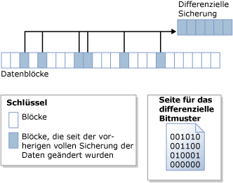

# Differenzielle Sicherungen (SQL Server)
[!INCLUDE[appliesto-ss-xxxx-xxxx-xxx-md](../../includes/appliesto-ss-xxxx-xxxx-xxx-md.md)] Dieses Thema zu Sicherung und Wiederherstellung ist für alle [!INCLUDE[ssNoVersion](../../includes/ssnoversion-md.md)]-Datenbanken relevant.  
  
 Eine differenzielle Sicherung basiert auf der aktuellsten, zuvor ausgeführten vollständigen Datensicherung. Mit einer differenziellen Sicherung werden nur die Daten erfasst, die sich seit dieser vollständigen Sicherung geändert haben. Die vollständige Sicherung, auf der eine differenzielle Sicherung basiert wird, wird als *Basis* der differenziellen Sicherung bezeichnet. Vollständige Sicherungen, mit Ausnahme von Kopiesicherungen, können als Basis für eine Reihe differenzieller Sicherungen dienen, einschließlich Datenbanksicherungen, Teilsicherungen und Dateisicherungen. Die Basissicherung für eine differenzielle Dateisicherung kann in einer vollständigen Sicherung, einer Dateisicherung oder einer Teilsicherung enthalten sein.  
  
  
##   Vorteile  
  
-   Die Erstellung einer differenziellen Sicherung kann im Vergleich zur Erstellung einer vollständigen Sicherung sehr schnell gehen. Bei einer differenziellen Sicherung werden nur die seit der letzten vollständigen Sicherung auf Basis der differenziellen Sicherung geänderten Daten aufgezeichnet. Dadurch werden häufige Datensicherungen erleichtert, wodurch das Risiko des Datenverlusts verringert wird. Vor der Wiederherstellung einer differenziellen Sicherung muss jedoch die entsprechende Basis wiederhergestellt werden. Daher sind bei der Wiederherstellung von einer differenziellen Sicherung mehr Schritte und mehr Zeit erforderlich als bei der Wiederherstellung von einer vollständigen Sicherung, da zwei Sicherungsdateien benötigt werden.  
  
-   Differenzielle Datenbanksicherungen sind besonders dann hilfreich, wenn eine Teilmenge einer Datenbank häufiger geändert wird als die übrigen Daten der Datenbank. In diesen Fällen ermöglichen differenzielle Datenbanksicherungen eine häufige Sicherung ohne den hohen Verwaltungsaufwand vollständiger Datenbanksicherungen.  
  
-   Bei Verwendung des vollständigen Wiederherstellungsmodells kann mithilfe differenzieller Sicherungen die Anzahl der Protokollsicherungen reduziert werden, die wiederhergestellt werden müssen.  
  
##   Übersicht über differenzielle Sicherungen  
 Bei einer differenziellen Sicherung wird der Status aller *Blöcke* (Sammlungen von acht physisch zusammenhängenden Seiten) erfasst, die sich zwischen dem Erstellungszeitpunkt der differenziellen Datenbank und dem Erstellungszeitpunkt der differenziellen Sicherung geändert hat. Das bedeutet, dass die Größe einer bestimmten differenziellen Sicherung von der Menge an Daten abhängt, die seit der Basissicherung geändert wurden. Grundsätzlich gilt: Je älter die Basis, desto größer die neue differenzielle Sicherung. In einer Reihe differenzieller Sicherungen enthält ein häufig aktualisierter Block möglicherweise bei jeder differenziellen Sicherung unterschiedliche Daten.  
  
 In der folgenden Abbildung wird die Funktionsweise einer differenziellen Sicherung veranschaulicht. Die Abbildung zeigt 24 Datenblöcke, von denen sechs geändert wurden. Die differenzielle Sicherung enthält nur diese sechs Datenblöcke. Der differenzielle Sicherungsvorgang basiert auf einer Bitmapseite, die für jeden Block ein Bit enthält. Für jeden seit der Basissicherung aktualisierten Block wird das Bit in der Bitmap auf 1 festgelegt.  
  
   
  
> [!NOTE]  
>  Durch eine Kopiesicherung erfolgt keine Aktualisierung des differenziellen Bitmusters. Daher hat eine Kopiesicherung keine Auswirkungen auf die nachfolgenden differenziellen Sicherungen.  
  
 Eine differenzielle Sicherung wird relativ bald erstellt, nachdem die zugehörige Basis erheblich kleiner geworden ist als die differenzielle Basis. Hierdurch wird Speicherplatz gespart und der Zeitaufwand für die Sicherung reduziert. Im Laufe der Zeit wird aufgrund der in der Datenbank vorgenommenen Änderungen der Unterschied zwischen der Datenbank und einer bestimmten differenziellen Basis jedoch immer größer. Je mehr Zeit zwischen einer differenziellen Sicherung und der zugehörigen Basis liegt, desto umfangreicher wird die differenzielle Sicherung ausfallen. Dies bedeutet, dass letztendlich differenzielle Sicherungen nahezu die Größe der differenziellen Basis erreichen können. Bei einer großen differenziellen Sicherung geht der Vorteil des schnelleren Sicherns und des geringeren Umfangs verloren.  
  
 Mit zunehmender Größe der differenziellen Sicherungen kann das Wiederherstellen einer differenziellen Sicherung den Zeitaufwand zum Wiederherstellen einer Datenbank erheblich erhöhen. Daher sollten Sie in regelmäßigen Abständen neue vollständige Sicherungen ausführen, um eine neue differenzielle Basis für die Daten zu erstellen. Sie können z. B. einmal wöchentlich eine vollständige Sicherung der gesamten Datenbank (also eine vollständige Datenbanksicherung) und während der Woche eine regelmäßige Serie von differenziellen Datenbanksicherungen ausführen.  
  
 Beim Wiederherstellen müssen Sie die Basis wiederherstellen, bevor Sie eine differenzielle Sicherung wiederherstellen. Anschließend müssen Sie lediglich die letzte differenzielle Sicherung wiederherstellen, um die Datenbank auf den Stand dieser differenziellen Sicherung zu bringen. Normalerweise stellen Sie die letzte vollständige Sicherung und anschließend die letzte differenzielle Sicherung, die auf dieser vollständigen Sicherung basiert, wieder her.  
  
## Differenzielle Sicherungen von Datenbanken mit speicheroptimierten Tabellen  
 Weitere Informationen zu differenziellen Sicherungen und Datenbanken mit speicheroptimierten Tabellen finden Sie unter [Sichern einer Datenbank mit speicheroptimierten Tabellen](../../relational-databases/in-memory-oltp/backing-up-a-database-with-memory-optimized-tables.md).  
  
##   Differenzielle Sicherungen schreibgeschützter Datenbanken  
 Für schreibgeschützte Datenbanken sind separate vollständige Sicherungen einfacher zu verwalten als wenn sie zusammen mit differenziellen Sicherungen verwendet werden. Wenn eine Datenbank schreibgeschützt ist, können mit Sicherungen und sonstigen Vorgängen die Metadaten in der Datei nicht geändert werden. Deshalb werden die für eine differenzielle Sicherung erforderlichen Metadaten, z.B. die Protokollfolgenummer (Log Sequence Number, LSN), mit der die differenzielle Sicherung beginnt (die Basis-LSN für eine differenzielle Sicherung), in der **master** -Datenbank gespeichert. Wenn die differenzielle Basis erstellt wird, während die Datenbank schreibgeschützt ist, zeigt das differenzielle Bitmuster mehr Änderungen an als tatsächlich seit der Basissicherung erfolgt sind. Die zusätzlichen Daten werden durch die Sicherung gelesen, jedoch nicht in die Sicherung geschrieben, da die in der **backupset** -Systemtabelle gespeicherte [differential_base_lsn](../../relational-databases/system-tables/backupset-transact-sql.md) verwendet wird, um zu ermitteln, ob die Daten seit der Basissicherung tatsächlich geändert wurden.  
  
 Wenn eine schreibgeschützte Datenbank neu erstellt, wiederhergestellt oder getrennt und dann angefügt wird, gehen die Informationen zur differenziellen Basis verloren. Dies passiert, da die **master** -Datenbank nicht mit der Benutzerdatenbank synchronisiert wird. Mit [!INCLUDE[ssDEnoversion](../../includes/ssdenoversion-md.md)] kann dieses Problem nicht erkannt oder verhindert werden. Spätere differenzielle Sicherungen basieren nicht auf der letzten vollständigen Sicherung und können zu unerwarteten Ergebnissen führen. Zum Einrichten einer neuen differenziellen Basis wird empfohlen, eine vollständige Datenbanksicherung zu erstellen.  
  
### Bewährte Methoden für die Verwendung differenzieller Sicherungen mit einer schreibgeschützten Datenbank  
 Wenn Sie eine vollständige Sicherung einer schreibgeschützten Datenbank erstellt haben und nachfolgend eine differenzielle Sicherung erstellen möchten, sichern Sie die **master** -Datenbank.  
  
 Wenn die **master** -Datenbank verloren geht, stellen Sie sie wieder her, bevor Sie differenzielle Sicherungen einer Benutzerdatenbank wiederherstellen.  
  
 Wenn Sie eine schreibgeschützte Datenbank, für die Sie später differenzielle Sicherungen verwenden möchten, trennen und anfügen, sollten Sie möglichst bald eine vollständige Datenbanksicherung der schreibgeschützten Datenbank und der **master** -Datenbank erstellen.  
  
##   Verwandte Aufgaben  
  
-   [Erstellen einer differenziellen Datenbanksicherung &#40;SQL Server&#41;](../../relational-databases/backup-restore/create-a-differential-database-backup-sql-server.md)  
  
-   [Wiederherstellen einer differenziellen Datenbanksicherung &#40;SQL Server&#41;](../../relational-databases/backup-restore/restore-a-differential-database-backup-sql-server.md)  
  
  
## Weitere Informationen finden Sie unter  
 [Übersicht über Sicherungen &#40;SQL Server&#41;](../../relational-databases/backup-restore/backup-overview-sql-server.md)   
 [Vollständige Datenbanksicherungen &#40;SQL Server&#41;](../../relational-databases/backup-restore/full-database-backups-sql-server.md)   
 [Vollständige Datenbankwiederherstellungen &#40;vollständiges Wiederherstellungsmodell&#41;](../../relational-databases/backup-restore/complete-database-restores-full-recovery-model.md)   
 [Vollständige Datenbankwiederherstellungen &#40;einfaches Wiederherstellungsmodell&#41;](../../relational-databases/backup-restore/complete-database-restores-simple-recovery-model.md)   
 [Transaktionsprotokollsicherungen &#40;SQL Server&#41;](../../relational-databases/backup-restore/transaction-log-backups-sql-server.md)  
  
  
