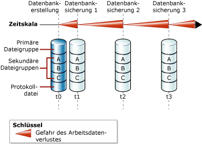
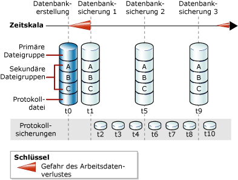

# <a name="full-database-backups-sql-server"></a>Vollständige Datenbanksicherungen (SQL Server)
  Mit einer vollständigen Datenbanksicherung wird die gesamte Datenbank gesichert. Dazu gehört ein Teil des Transaktionsprotokolls, damit nach der Wiederherstellung einer vollständigen Datenbanksicherung die vollständige Datenbank wiederhergestellt werden kann. Vollständige Datenbanksicherungen stellen die Datenbank bei Abschluss der Sicherung dar.  
  
> [!TIP]  
>  Wenn eine Datenbank größer wird, ist zum Abschließen von vollständigen Datenbanksicherungen jedoch mehr Zeit und mehr Speicherplatz erforderlich. Deshalb können Sie bei einer großen Datenbank eine vollständige Datenbanksicherung durch mehrere *differenzielle Datenbanksicherungen*ergänzen. Weitere Informationen finden Sie unter [Differenzielle Sicherungen &#40;SQL Server&#41;](../../relational-databases/backup-restore/differential-backups-sql-server.md).  
  
> [!IMPORTANT]  
>  Bei einer Datenbanksicherung ist TRUSTWORTHY auf OFF festgelegt. Weitere Informationen zum Festlegen von TRUSTWORTHY auf ON finden Sie unter [ALTER DATABASE SET-Optionen &#40;Transact-SQL&#41;](../../t-sql/statements/alter-database-transact-sql-set-options.md).  
  
 **In diesem Thema:**  
  
-   [Datenbanksicherungen im einfachen Wiederherstellungsmodell](#DbBuRMs)  
  
-   [Datenbanksicherungen im vollständigen Wiederherstellungsmodell](#DbBuRMf)  
  
-   [Verwenden einer vollständigen Datenbanksicherung zum Wiederherstellen der Datenbank](#RestoreDbBu)  
  
-   [Verwandte Aufgaben](#RelatedTasks)  
  
##  <a name="DbBuRMs"></a> Datenbanksicherungen im einfachen Wiederherstellungsmodell  
 Im einfachen Wiederherstellungsmodell besteht nach jeder Sicherung die Gefahr, dass in der Datenbank Datenverluste auftreten, wenn ein Notfall auftritt. Die Gefahr des Datenverlusts steigt mit jedem Update bis zur nächsten Sicherung, wenn die Gefahr auf null zurückgeht und ein neuer Zyklus der Datenverlustgefahr beginnt. Die Gefahr des Datenverlusts steigt in der Zeit zwischen den Sicherungen. In der folgenden Abbildung wird die Gefahr des Datenverlusts für eine Sicherungsstrategie veranschaulicht, in der nur vollständige Datenbanksicherungen verwendet werden.  
  
   
  
### <a name="example-includetsqlincludestsql-mdmd"></a>Beispiel ([!INCLUDE[tsql](../../includes/tsql-md.md)])  
 Im folgenden Beispiel wird veranschaulicht, wie eine vollständige Datenbanksicherung erstellt wird, indem WITH FORMAT zum Überschreiben aller vorhandenen Sicherungen und zum Erstellen eines neuen Mediensatzes verwendet wird.  
  
```  
-- Back up the AdventureWorks2012 database to new media set.  
BACKUP DATABASE AdventureWorks2012  
    TO DISK = 'Z:\SQLServerBackups\AdventureWorksSimpleRM.bak'   
    WITH FORMAT;  
GO  
```  
  
##  <a name="DbBuRMf"></a> Datenbanksicherungen im vollständigen Wiederherstellungsmodell  
 Bei Datenbanken, für die die vollständige und massenprotokollierte Wiederherstellung verwendet wird, sind Datensicherungen erforderlich, aber nicht ausreichend. Transaktionsprotokollsicherungen sind ebenfalls erforderlich. In der folgenden Abbildung wird die einfachste Sicherungsstrategie veranschaulicht, die im vollständigen Wiederherstellungsmodell möglich ist.  
  
   
  
 Informationen zum Verwenden von Transaktionsprotokollsicherungen finden Sie unter [Transaktionsprotokollsicherungen &#40;SQL Server&#41;](../../relational-databases/backup-restore/transaction-log-backups-sql-server.md).  
  
### <a name="example-includetsqlincludestsql-mdmd"></a>Beispiel ([!INCLUDE[tsql](../../includes/tsql-md.md)])  
 Im folgenden Beispiel wird veranschaulicht, wie eine vollständige Datenbanksicherung erstellt wird, indem WITH FORMAT zum Überschreiben aller vorhandenen Sicherungen und zum Erstellen eines neuen Mediensatzes verwendet wird. Anschließend wird das Transaktionsprotokoll im Beispiel gesichert. In einer realen Situation müssten Sie mehrere reguläre Protokollsicherungen ausführen. Für dieses Beispiel muss die [!INCLUDE[ssSampleDBobject](../../includes/sssampledbobject-md.md)] -Beispieldatenbank auf die Verwendung des vollständigen Wiederherstellungsmodells festgelegt sein.  
  
```  
USE master;  
ALTER DATABASE AdventureWorks2012 SET RECOVERY FULL;  
GO  
-- Back up the AdventureWorks2012 database to new media set (backup set 1).  
BACKUP DATABASE AdventureWorks2012  
  TO DISK = 'Z:\SQLServerBackups\AdventureWorks2012FullRM.bak'   
  WITH FORMAT;  
GO  
--Create a routine log backup (backup set 2).  
BACKUP LOG AdventureWorks2012 TO DISK = 'Z:\SQLServerBackups\AdventureWorks2012FullRM.bak';  
GO  
```  
  
##  <a name="RestoreDbBu"></a> Verwenden einer vollständigen Datenbanksicherung zum Wiederherstellen der Datenbank  
 Sie können eine gesamte Datenbank in einem Schritt erneut erstellen, indem Sie die Datenbank aus einer vollständigen Datenbanksicherung an einem beliebigen Speicherort wiederherstellen. In der Sicherung ist ein ausreichender Bestandteil des Transaktionsprotokolls enthalten, sodass Sie die Datenbank bis zu dem Zeitpunkt wiederherstellen können, zu dem die Sicherung abgeschlossen war. Die wiederhergestellte Datenbank entspricht dem Zustand der ursprünglichen Datenbank beim Abschluss der Datenbanksicherung, abzüglich aller Transaktionen, für die kein Commit ausgeführt wurde. Bei Verwendung des vollständigen Wiederherstellungsmodells sollten dann alle nachfolgenden Transaktionsprotokollsicherungen wiederhergestellt werden. Wenn die Datenbank wiederhergestellt wurde, wird für Transaktionen ohne Commit ein Rollback ausgeführt.  
  
 Weitere Informationen finden Sie unter [Vollständige Datenbankwiederherstellungen &#40;einfaches Wiederherstellungsmodell&#41;](../../relational-databases/backup-restore/complete-database-restores-simple-recovery-model.md) oder [Vollständige Datenbankwiederherstellungen &#40;vollständiges Wiederherstellungsmodell&#41;](../../relational-databases/backup-restore/complete-database-restores-full-recovery-model.md).  
  
##  <a name="RelatedTasks"></a> Verwandte Aufgaben  
 **So erstellen Sie eine vollständige Datenbanksicherung**  
  
-   [Erstellen einer vollständigen Datenbanksicherung &#40;SQL Server&#41;](../../relational-databases/backup-restore/create-a-full-database-backup-sql-server.md)  
  
-   <xref:Microsoft.SqlServer.Management.Smo.Backup.SqlBackup%2A> (SMO)  
  
 **So planen Sie Sicherungsaufträge**  
  
 [Verwenden des Wartungsplanungs-Assistenten](../../relational-databases/maintenance-plans/use-the-maintenance-plan-wizard.md)  
  
## <a name="see-also"></a>Siehe auch  
 [Sichern und Wiederherstellen von SQL Server-Datenbanken](../../relational-databases/backup-restore/back-up-and-restore-of-sql-server-databases.md)   
 [Übersicht über Sicherungen &#40;SQL Server&#41;](../../relational-databases/backup-restore/backup-overview-sql-server.md)   
 [Sichern und Wiederherstellen von Analysis Services-Datenbanken](../../analysis-services/multidimensional-models/backup-and-restore-of-analysis-services-databases.md)  
  
  
