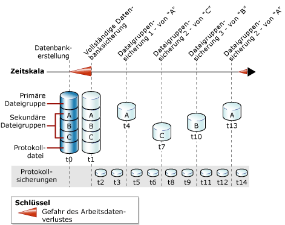

# Vollständige Dateisicherungen (SQL Server)
  Dieses Thema ist nur für [!INCLUDE[ssNoVersion](../../includes/ssnoversion-md.md)] -Datenbanken relevant, die mehrere Dateien oder Dateigruppen enthalten.  
  
 Die Dateien in einer [!INCLUDE[ssNoVersion](../../includes/ssnoversion-md.md)] -Datenbank können einzeln gesichert und wiederhergestellt werden. Sie können auch eine ganze Dateigruppe angeben, statt jede in einer Gruppe enthaltene Datei einzeln anzugeben. Beachten Sie Folgendes: Wenn eine Datei in einer Dateigruppe offline ist (z. B. weil die Datei gerade wiederhergestellt wird), ist die gesamte Dateigruppe offline und kann nicht gesichert werden.  
  
 Dateisicherungen von schreibgeschützten Dateigruppen können mit Teilsicherungen kombiniert werden. Teilsicherungen schließen alle Dateigruppen mit Lese-/Schreibzugriff und optional mindestens eine schreibgeschützte Dateigruppe ein. Weitere Informationen finden Sie unter [Teilsicherungen &#40;SQL Server&#41;](../../relational-databases/backup-restore/partial-backups-sql-server.md).  
  
 Eine Dateisicherung kann als *differenzielle Basis* für differenzielle Dateisicherungen dienen. Weitere Informationen finden Sie unter [Differenzielle Sicherungen &#40;SQL Server&#41;](../../relational-databases/backup-restore/differential-backups-sql-server.md).  
  
> [!NOTE]  
>  Vollständige Dateisicherungen werden in der Regel als *Dateisicherungen bezeichnet*, es sei denn, sie werden ausdrücklich mit *differenziellen Dateisicherungen*verglichen.  
  
 **In diesem Thema:**  
  
-   [Vorteile von Dateisicherungen](#Benefits)  
  
-   [Nachteile von Dateisicherungen](#Disadvantages)  
  
-   [Übersicht zu Dateisicherungen](#Overview)  
  
-   [Verwandte Aufgaben](#RelatedTasks)  
  
##   Vorteile von Dateisicherungen  
 Dateisicherungen bieten gegenüber Datenbanksicherungen folgende Vorteile:  
  
-   Durch das Verwenden von Dateisicherungen kann die Wiederherstellung beschleunigt werden, da Sie nicht die gesamte Datenbank, sondern nur die beschädigten Dateien wiederherstellen.  
  
     Wenn eine Datenbank beispielsweise aus mehreren Dateien besteht, die auf verschiedenen Datenträgern gespeichert sind, und auf einem Datenträger ein Fehler auftritt, muss nur die Datei auf dem fehlerhaften Datenträger wiederhergestellt werden. Die beschädigte Datei kann schnell wiederhergestellt werden, und die Wiederherstellung ist schneller abgeschlossen als für die ganze Datenbank.  
  
-   Dateisicherungen ermöglichen im Vergleich zu vollständigen Datenbanksicherungen eine höhere Flexibilität bei der Zeitplanung und beim Umgang mit Medien. Beispielsweise kann es vorkommen, dass bei sehr umfangreichen Datenbanken vollständige Datenbanksicherungen nicht mehr zu bewältigen sind. Die höhere Flexibilität von Datei- oder Dateigruppensicherungen ist auch für umfangreiche Datenbanken hilfreich, die Daten mit unterschiedlichen Updatemerkmalen enthalten.  
  
##   Nachteile von Dateisicherungen  
  
-   Der wichtigste Nachteil von Dateisicherungen im Vergleich zu vollständigen Datenbanksicherungen ist der zusätzliche Verwaltungsaufwand. Das Verwalten und Nachverfolgen eines vollständigen Sicherungssatzes kann sehr zeitaufwändig sein, wodurch die Speicherplatzanforderungen von vollständigen Datenbanksicherungen möglicherweise aufgehoben werden.  
  
-   Durch einen Medienfehler wird möglicherweise eine gesamte Datenbank nicht mehr wiederherstellbar, wenn keine Sicherung der beschädigten Datei vorhanden ist. Sie müssen deshalb einen vollständigen Dateisicherungssatz verwalten sowie – für das vollständige und massenprotokollierte Wiederherstellungsmodell – eine oder mehrere Protokollsicherungen, die mindestens das Intervall zwischen der ersten vollständigen Dateisicherung und der letzten vollständigen Dateisicherung abdecken.  
  
##   Übersicht zu Dateisicherungen  
 Mit einer vollständigen Dateisicherung werden alle Daten in einer oder mehreren Dateien oder Dateigruppen gesichert. Standardmäßig beinhalten Dateisicherungen genügend Protokolldatensätze, um einen Rollforward der Datei bis zum Ende des Sicherungsvorgangs auszuführen.  
  
 Das Sichern einer schreibgeschützte Datei oder Dateigruppe ist bei jedem Wiederherstellungsmodell gleich. Beim vollständigen Wiederherstellungsmodell entspricht ein vollständiger Satz vollständiger Dateisicherungen zusammen mit ausreichend vielen Protokollsicherungen, die alle Dateisicherungen umfassen, einer vollständigen Datenbanksicherung.  
  
 Es ist jeweils immer nur ein Dateisicherungsvorgang möglich. Sie können mehrere Dateien in einem Vorgang sichern, was jedoch eventuell eine Verlängerung der Wiederherstellungsdauer bewirkt, wenn Sie nur eine einzelne Datei wiederherstellen müssen. Grund dafür ist, dass zum Auffinden der Datei die gesamte Sicherung gelesen wird.  
  
> [!NOTE]  
>  Einzelne Dateien können aus einer Datenbanksicherung wiederhergestellt werden, das Suchen und Wiederherstellen einer Datei aus einer Datenbanksicherung dauert jedoch länger als aus einer Dateisicherung.  
  
### Dateisicherungen und das einfache Wiederherstellungsmodell  
 Im einfachen Wiederherstellungsmodell müssen alle Dateien mit Lese-/Schreibzugriff zusammen gesichert werden. Damit wird sichergestellt, dass die Datenbank bis zu einem bestimmten Zeitpunkt wiederhergestellt werden kann. Verwenden Sie die Option READ_WRITE_FILEGROUPS, statt die Dateien bzw. Dateigruppen mit Lese-/Schreibzugriff einzeln anzugeben. Mit dieser Option werden alle Dateigruppen mit Lese-/Schreibzugriff in der Datenbank gesichert. Eine Sicherung, die durch Angeben von READ_WRITE_FILEGROUPS erstellt wird, wird als Teilsicherung bezeichnet. Weitere Informationen finden Sie unter [Teilsicherungen &#40;SQL Server&#41;](../../relational-databases/backup-restore/partial-backups-sql-server.md).  
  
### Dateisicherungen und das vollständige Wiederherstellungsmodell  
 Beim vollständigen Wiederherstellungsmodell müssen Sie das Transaktionsprotokoll sichern, unabhängig von Ihrer Sicherungsstrategie. Ein vollständiger Satz vollständiger Dateisicherungen zusammen mit ausreichend vielen Protokollsicherungen, die alle Dateisicherungen umfassen, entspricht einer vollständigen Datenbanksicherung.  
  
 Das Wiederherstellen einer Datenbank unter ausschließlicher Verwendung von Datei- und Protokollsicherungen kann komplex sein. Deshalb ist es eine bewährte Methode, wenn möglich vor der ersten Dateisicherung eine vollständige Datenbanksicherung auszuführen und die Protokollsicherungen zu starten. In der folgenden Abbildung wird eine Strategie veranschaulicht, bei der eine vollständige Datenbanksicherung ausgeführt wird (zum Zeitpunkt t1), kurz nachdem die Datenbank erstellt wurde (zum Zeitpunkt t0). Die erste Datenbanksicherung ermöglicht das Starten von Transaktionsprotokollsicherungen. Transaktionsprotokollsicherungen sind in regelmäßigen Abständen geplant. Dateisicherungen werden in Intervallen durchgeführt, die den Geschäftsanforderungen der Datenbank am ehesten entsprechen. In dieser Abbildung wird veranschaulicht, wie die vier Dateigruppen nacheinander gesichert werden. Die Reihenfolge der Sicherung – A, C, B, A – entspricht den Geschäftsanforderungen der Datenbank.  
  
   
  
> [!NOTE]  
>  Beim vollständigen Wiederherstellungsmodell müssen Sie beim Wiederherstellen einer Dateisicherung mit Lese-/Schreibzugriff einen Rollforward für das Transaktionsprotokoll ausführen, um die Konsistenz der Datei mit dem Rest der Datenbank sicherzustellen. Um einen Rollforward für viele Transaktionsprotokollsicherungen zu vermeiden, sollten Sie differenzielle Dateisicherungen verwenden. Weitere Informationen finden Sie unter [Differenzielle Sicherungen &#40;SQL Server&#41;](../../relational-databases/backup-restore/differential-backups-sql-server.md).  
  
##   Verwandte Aufgaben  
 **So erstellen Sie eine Datei- oder Dateigruppensicherung**  
  
-   [Sichern von Dateien und Dateigruppen &#40;SQL Server&#41;](../../relational-databases/backup-restore/back-up-files-and-filegroups-sql-server.md)  
  
-   <xref:Microsoft.SqlServer.Management.Smo.Backup.SqlBackup%2A> (SMO)  
  
> [!NOTE]  
>  Dateisicherungen werden nicht vom Wartungsplanungs-Assistenten unterstützt.  
  
## Siehe auch  
 [BACKUP &#40;Transact-SQL&#41;](../../t-sql/statements/backup-transact-sql.md)   
 [Übersicht über Sicherungen &#40;SQL Server&#41;](../../relational-databases/backup-restore/backup-overview-sql-server.md)   
 [Sicherung und Wiederherstellung: Interoperabilität und Koexistenz &#40;SQL Server&#41;](../../relational-databases/backup-restore/backup-and-restore-interoperability-and-coexistence-sql-server.md)   
 [Differenzielle Sicherungen &#40;SQL Server&#41;](../../relational-databases/backup-restore/differential-backups-sql-server.md)   
 [Dateiwiederherstellungen &#40;einfaches Wiederherstellungsmodell&#41;](../../relational-databases/backup-restore/file-restores-simple-recovery-model.md)   
 [Dateiwiederherstellungen &#40;vollständiges Wiederherstellungsmodell&#41;](../../relational-databases/backup-restore/file-restores-full-recovery-model.md)   
 [Onlinewiederherstellungen &#40;SQL Server&#41;](../../relational-databases/backup-restore/online-restore-sql-server.md)   
 [Schrittweise Wiederherstellungen &#40;SQL Server&#41;](../../relational-databases/backup-restore/piecemeal-restores-sql-server.md)  
  
  
