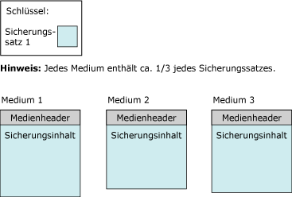

# <a name="media-sets-media-families-and-backup-sets-sql-server"></a>Mediensätze, Medienfamilien und Sicherungssätze (SQL Server)
  **Dieses Thema bietet eine Einführung zur grundlegenden Terminologie bezüglich der Sicherungsmedien für Sicherungen und Wiederherstellungen in [!INCLUDE[ssNoVersion](../../includes/ssnoversion-md.md)] und ist für Leser gedacht, die [!INCLUDE[ssNoVersion](../../includes/ssnoversion-md.md)]noch nicht kennen.** 
  
  Dieses Thema beschreibt das von [!INCLUDE[ssNoVersion](../../includes/ssnoversion-md.md)] verwendete Format für Sicherungsmedien, die Entsprechung zwischen Sicherungsmedien und Sicherungsgeräten und die Organisation von Sicherungen auf Sicherungsmedien sowie verschiedene Aspekte im Zusammenhang mit Mediensätzen und Medienfamilien. Im Thema werden außerdem die Schritte zum Initialisieren oder Formatieren von Sicherungsmedien vor der ersten Verwendung oder das Ersetzen eines alten Mediensatzes durch einen neuen Mediensatz beschrieben. Es enthält zudem Informationen dazu, wie alte Sicherungssätze in einem Mediensatz überschrieben und neue Sicherungssätze an einen Mediensatz angefügt werden.  
  
>**HINWEIS!** Weitere Informationen zur SQL Server-Sicherung im Microsoft Azure-BLOB-Speicherdienst finden Sie unter [SQL Server-Sicherung und -Wiederherstellung mit dem Microsoft Azure Blob Storage Service](../../relational-databases/backup-restore/sql-server-backup-and-restore-with-microsoft-azure-blob-storage-service.md).  
   
##  <a name="TermsAndDefinitions"></a> Begriffe  
 **Mediensatz**  
 Eine geordnete Auflistung von Sicherungsmedien, Bändern oder Dateien auf Datenträgern, die in mindestens einem Sicherungsvorgang mithilfe eines festen Typs sowie einer festen Anzahl von Sicherungsmedien beschrieben wurden.  
  
 **Medienfamilie**  
 Sicherungen, die auf einem einzelnen, nicht gespiegelten Medium oder auf einem Satz gespiegelter Medien in einem Mediensatz erstellt wurden.  
  
**Sicherungssatz**  
 Der Sicherungsinhalt, der bei einem erfolgreichen Sicherungsvorgang einem Mediensatz hinzugefügt wird.  
  

##  <a name="OvMediaSetsFamiliesBackupSets"></a> Übersicht über Mediensätze, Medienfamilien und Sicherungssätze  
 Die Sicherungen eines Satzes aus einem oder mehreren Sicherungsmedien bilden einen Mediensatz. Ein *Mediensatz* ist eine geordnete Sammlung von *Sicherungsmedien*, Bändern, Datenträgerdateien oder Azure-BLOBs, die in mindestens einem Sicherungsvorgang mithilfe eines festen Typs sowie einer festen Anzahl von Sicherungsmedien beschrieben wurden. Für einen bestimmten Mediensatz werden Bandlaufwerke, Datenträgerlaufwerke oder Azure-BLOBs verwendet, die jedoch nicht kombiniert werden können. 
 
**Beispiel:** Bei den mit einem Mediensatz verknüpften Sicherungsmedien kann es sich beispielsweise um drei Bandlaufwerke mit den Bezeichnungen `\\.\TAPE0`, `\\.\TAPE1`und `\\.\TAPE2`handeln. Dieser Mediensatz enthält nur Bänder und beginnt mit mindestens drei Bändern (eins pro Laufwerk). Die Art und Anzahl der Sicherungsmedien werden beim Erstellen eines Mediensatzes festgelegt und können dann nicht mehr geändert werden. Falls erforderlich, können bestimmte Medien jedoch zwischen Sicherungs- und Wiederherstellungsvorgängen durch ein Medium gleichen Typs ersetzt werden.  
  
 Ein Mediensatz wird auf dem Sicherungsmedium während eines Sicherungsvorgangs durch die Formatierung des Sicherungsmediums erstellt. Weitere Informationen finden Sie weiter unten in diesem Thema unter [Erstellen eines neuen Mediensatzes](#CreatingMediaSet). Nach der Formatierung enthält jede Datei oder jedes Band einen Medienheader für den Mediensatz, und die Dateien oder Bänder sind für den Empfang von Sicherungsinhalten bereit. Nach dem Erstellen der Header wird der Sicherungsvorgang fortgesetzt, und die angegebenen Daten werden auf den für den Vorgang angegebenen Sicherungsmedien gesichert.  
  
> **HINWEIS!** Mediensätze können zum Schutz gegen beschädigte Medienvolumes (Band oder Datenträgerdatei) gespiegelt werden. Weitere Informationen finden Sie weiter unten in diesem Thema unter [Gespiegelte Sicherungsmediensätze &#40;SQL Server&#41;](../../relational-databases/backup-restore/mirrored-backup-media-sets-sql-server.md)noch nicht kennen.  
  
 Komprimierte und nicht komprimierte Sicherungen können nicht zusammen in einem Mediensatz enthalten sein. Komprimierte Sicherungen können von allen [!INCLUDE[ssKatmai](../../includes/sskatmai-md.md)] -Versionen und höheren Versionen gelesen werden. Weitere Informationen finden Sie unter [Sicherungskomprimierung &#40;SQL Server&#41;](../../relational-databases/backup-restore/backup-compression-sql-server.md).  

  
## <a name="media-families"></a>Medienfamilien  
 Sicherungen, die auf einem einzelnen, nicht gespiegelten Medium oder auf einem Satz gespiegelter Medien in einem Mediensatz erstellt wurden, bilden eine *Medienfamilie*. Die Anzahl der in einem Mediensatz enthaltenen Medienfamilien wird durch die Anzahl der für den Mediensatz verwendeten Sicherungsmedien bestimmt. Wenn beispielsweise in einem Mediensatz zwei nicht gespiegelte Sicherungsmedien verwendet werden, enthält der Mediensatz zwei Medienfamilien.  
  
In einem gespiegelten Mediensatz werden alle Medienfamilien gespiegelt. Wenn beispielsweise zur Formatierung eines Mediensatzes mit zwei Spiegeln sechs Sicherungsmedien verwendet werden, sind drei Medienfamilien vorhanden, von denen jede zwei gleichwertige Kopien der Sicherungsdaten enthält. Weitere Informationen über gespiegelte Mediensätze finden Sie unter [Gespiegelte Sicherungsmediensätze &#40;SQL Server&#41;](../../relational-databases/backup-restore/mirrored-backup-media-sets-sql-server.md)noch nicht kennen.  
  
 Jedem Band oder Datenträger in einer Medienfamilie wird eine *Mediensequenznummer*zugewiesen. Die Mediensequenznummer eines Datenträgers ist immer 1. In einer Bandmedienfamilie ist die Sequenznummer des ersten Bandes 1, die Sequenznummer des zweiten Bandes 2 usw. Weitere Informationen finden Sie weiter unten in diesem Thema unter [Mediensätze, Medienfamilien und Sicherungssätze (SQL Server)](../../relational-databases/backup-restore/media-sets-media-families-and-backup-sets-sql-server.md)noch nicht kennen.
  
## <a name="the-media-header"></a>Der Medienheader  
 Jedes Volume eines Sicherungsmediums (Datenträgerdatei oder Band) enthält einen Medienheader, der beim ersten Sicherungsvorgang erstellt wird, der das Band (oder den Datenträger) verwendet. Dieser Header bleibt unverändert, bis das Medium neu formatiert wird.  
  
 Der Medienheader enthält alle zum Identifizieren des Mediums (Datenträgerdatei oder Band) erforderlichen Informationen sowie seine Position innerhalb der entsprechenden Medienfamilie. Diese Informationen umfassen Folgendes:  
  
-   Den Namen des Mediums.  
  
     Der Medienname ist optional. Es wird jedoch empfohlen, durchgängig Mediennamen zu verwenden, die eine klare Identifikation der Medien ermöglichen. Mediennamen werden durch den Benutzer zugewiesen, der das Medium formatiert.  
  
-   Eindeutige ID des Mediensatzes.  
  
-   Anzahl der Medienfamilien im Mediensatz.  
  
-   Sequenznummer der Medienfamilie, die dieses Medium enthält.  
  
-   Eindeutige ID für die Medienfamilie.  
  
-   Sequenznummer dieses Mediums in der Medienfamilie. Für eine Datenträgerdatei lautet dieser Wert immer 1.  
  
-   Angabe, ob die Medienbeschreibung eine MTF-Medienbezeichnung oder eine Medienbeschreibung enthält.  
  
    >**HINWEIS!** Alle Medien, die für Sicherungs- oder Wiederherstellungsvorgänge verwendet werden, verwenden das Standardsicherungsformat [!INCLUDE[msCoName](../../includes/msconame-md.md)] Tape Format (MTF). In MTF können Benutzer eine Bandbezeichnung angeben, die eine MTF-spezifische Beschreibung aufweist. [!INCLUDE[ssNoVersion](../../includes/ssnoversion-md.md)] werden alle von anderen Anwendungen geschriebenen MTF-Medienbezeichnungen beibehalten; es werden jedoch keine MTF-Medienbezeichnungen geschrieben.  
  
-   Medienbezeichnung von [!INCLUDE[msCoName](../../includes/msconame-md.md)] Tape Format oder die Medienbeschreibung (als Text).  
  
-   Name der Sicherungssoftware, die die Bezeichnung geschrieben hat.  
  
-   Eindeutige ID des Softwareanbieters, von dem das Medium formatiert wurde.  
  
-   Datum und Uhrzeit, an dem bzw. zu der die Bezeichnung geschrieben wurde.  
  
-   Anzahl der Spiegel im Satz (1 bis 4). Mit 1 wird ein ungespiegeltes Medium angegeben.  
  
 [!INCLUDE[ssCurrent](../../includes/sscurrent-md.md)] kann Medien verarbeiten, die durch frühere Versionen von [!INCLUDE[ssNoVersion](../../includes/ssnoversion-md.md)]formatiert wurden.  
  
## <a name="backup-sets"></a>Sicherungssätze  
 Durch einen erfolgreichen Sicherungsvorgang wird dem Mediensatz ein einzelner *Sicherungssatz* hinzugefügt. Der Sicherungssatz wird anhand des Mediensatzes beschrieben, zu dem die Sicherung gehört. Wenn das Sicherungsmedium nur aus einer Medienfamilie besteht, enthält diese Familie den gesamten Sicherungssatz. Wenn das Sicherungsmedium aus mehreren Medienfamilien besteht, wird der Sicherungssatz auf die Familien verteilt. Auf jedem Medium enthält der Sicherungssatz einen Header für die Beschreibung des Sicherungssatzes.  
  
 Dieses Beispiel zeigt eine [!INCLUDE[tsql](../../includes/tsql-md.md)] -Anweisung, durch die ein Mediensatz mit der Bezeichnung `MyAdvWorks_MediaSet_1` für die [!INCLUDE[ssSampleDBobject](../../includes/sssampledbobject-md.md)] -Datenbank erstellt wird. Hierbei werden drei Bandlaufwerke als Sicherungsmedien verwendet:  
  
```  
BACKUP DATABASE AdventureWorks2012  
TO TAPE = '\\.\tape0', TAPE = '\\.\tape1', TAPE = '\\.\tape2'  
WITH   
   FORMAT,  
   MEDIANAME = 'MyAdvWorks_MediaSet_1'  
```  
  
 Das Ergebnis eines erfolgreichen Sicherungsvorgangs sind ein neuer Mediensatz, der einen neuen Medienheader enthält, sowie ein auf drei Bänder aufgeteilter Sicherungssatz. Die folgende Abbildung veranschaulicht diese Ergebnisse:  
  
   
  
 Nach dem Erstellen eines Mediensatzes werden die Sicherungssätze nachfolgender Sicherungsvorgänge normalerweise nacheinander an den Mediensatz angehängt. Die Gesamtheit aller von einem Sicherungssatz verwendeten Medien bildet den Mediensatz, unabhängig von der Anzahl der beteiligten Medien oder Sicherungsmedien. Sicherungssätze werden ihrer Position im Mediensatz entsprechend sequenziell nummeriert. Auf diese Weise können Sie angeben, welcher Sicherungssatz wiederhergestellt werden soll.  
  
 Jeder Sicherungsvorgang für einen Mediensatz muss auf die gleiche Anzahl sowie auf den gleichen Typ von Sicherungsmedien schreiben. Wenn, wie beim ersten Sicherungssatz, mehrere Medien verwendet werden, wird der Inhalt aller nachfolgenden Sicherungssätze auf alle Sicherungsmedien verteilt. In der Fortsetzung des oben stehenden Beispiels werden Informationen durch einen zweiten Sicherungsvorgang (eine differenzielle Sicherung) an denselben Mediensatz angehängt:  
  
```  
BACKUP DATABASE AdventureWorks2012  
TO TAPE = '\\.\tape0', TAPE = '\\.\tape1', TAPE = '\\.\tape2'  
WITH   
   NOINIT,  
   MEDIANAME = 'AdventureWorksMediaSet1',  
   DIFFERENTIAL  
```  
  
> **HINWEIS!** Die Option NOINIT ist standardmäßig festgelegt und wird aus Gründen der Übersichtlichkeit aufgeführt.  
  
 Wenn der zweite Sicherungsvorgang erfolgreich ist, wird ein zweiter Sicherungssatz in den Mediensatz geschrieben. Dabei wird der Sicherungsinhalt folgendermaßen verteilt:  
  
   
  
 Beim Wiederherstellen von Sicherungen können Sie mit der Option FILE angeben, welche Sicherungen Sie verwenden möchten. Im folgenden Beispiel werden die FILE **=***backup_set_file_number* -Klauseln verwendet, um eine vollständige Datenbanksicherung der [!INCLUDE[ssSampleDBobject](../../includes/sssampledbobject-md.md)] -Datenbank wiederherzustellen. Im Anschluss daran wird für denselben Mediensatz eine differenzielle Datenbanksicherung durchgeführt. Es werden bis zu drei Sicherungsbänder vom Mediensatz verwendet. Diese befinden sich auf den Bandlaufwerken `\\.\tape0`, `tape1`und `tape2`.  
  
```  
RESTORE DATABASE AdventureWorks2012 FROM TAPE = '\\.\tape0', TAPE = '\\.\tape1', TAPE = '\\.\tape2'  
   WITH   
   MEDIANAME = 'AdventureWorksMediaSet1',  
   FILE=1,   
   NORECOVERY;  
RESTORE DATABASE AdventureWorks2012 FROM TAPE = '\\.\tape0', TAPE = '\\.\tape1', TAPE = '\\.\tape2'   
   WITH   
   MEDIANAME = 'AdventureWorksMediaSet1',  
   FILE=2,   
   RECOVERY;  
GO  
```  
  
 Informationen zu den Verlaufstabellen, in denen Informationen zu Mediensätzen und deren Medienfamilien und Sicherungssätze enthalten sind, finden Sie unter [Sicherungsverlauf und Headerinformationen &#40;SQL Server&#41;](../../relational-databases/backup-restore/backup-history-and-header-information-sql-server.md)noch nicht kennen.  
  
 Die Anzahl von Sicherungsmedien in einem Mediensatz hängt von mehreren Faktoren ab:  
  
-   Anzahl der Sicherungsmedien  
  
-   Art der Sicherungsmedien  
  
-   Anzahl der Sicherungssätze  

  
##  <a name="CreatingMediaSet"></a> Creating a new media set  
 Zum Erstellen eines neuen Mediensatzes müssen Sie die Sicherungsmedien (mindestens ein Band oder eine Datenträgerdatei) formatieren. Durch das Formatieren werden die Sicherungsmedien folgendermaßen geändert:  
  
1.  Die alte Kopfzeile wird gelöscht (falls vorhanden), effektiv werden die ursprünglichen Inhalte der Sicherungsmedien gelöscht.  
  
     Durch das Formatieren eines Bandmediums werden alle vorherigen Inhalte des derzeit eingelegten Bands gelöscht. Das Formatieren eines Datenträgers betrifft nur die von Ihnen für die Sicherungsoperation angegebene Datei.  
  
2.  Es wird in jedem Sicherungsmedium ein neuer Medienheader in das Sicherungsmedium geschrieben (Band oder Datenträger).  

  
##  <a name="UseExistingMediaSet"></a> Sichern auf einen vorhandenen Mediensatz  
 Für das Sichern auf einen vorhandenen Mediensatz stehen Ihnen die folgenden zwei Optionen zur Verfügung:  
  
-   Anfügen an den vorhandenen Sicherungssatz.  
  
     Um den verfügbaren Speicherplatz optimal zu nutzen, werden Sicherungssätze normalerweise an vorhandene Mediensätze angefügt. Beim Anfügen an die Sicherung werden alle vorherigen Sicherungen beibehalten. Weitere Informationen finden Sie weiter unten in diesem Abschnitt unter [Anfügen an vorhandene Sicherungssätze](#Appending).  

Das Anfügen (standardmäßiges Verhalten von BACKUP) kann explizit mithilfe der Option NOINIT angegeben werden.  
  
-   Überschreiben aller vorhandenen Sicherungssätze mit der aktuellen Sicherung, wobei der aktuelle Medienheader beibehalten wird.  
  
     [!INCLUDE[ssNoVersion](../../includes/ssnoversion-md.md)] verfügt über Sicherheitsvorrichtungen, um ein versehentliches Überschreiben von Medien zu verhindern. Mithilfe der Sicherung können allerdings Sicherungssätze automatisch überschrieben werden, die ein vordefiniertes Ablaufdatum erreicht haben.  
  
     Bei Bandheadern ist es sinnvoll, den Header beizubehalten. Weitere Informationen finden Sie weiter unten in diesem Abschnitt unter [Überschreiben von Sicherungssätzen](#Overwriting).  

    >  Das Überschreiben vorhandener Sicherungssätze wird mithilfe der Option INIT der BACKUP-Anweisung angegeben.  
  
##  <a name="Appending"></a> Appending to existing backup sets  
 Sicherungen von derselben Datenbank oder von anderen Datenbanken, die zu unterschiedlichen Zeitpunkten ausgeführt werden, können auf denselben Medien gespeichert werden. Durch Anfügen eines weiteren Sicherungssatzes auf vorhandene Medien bleiben die bisherigen Inhalte der Medien erhalten, und die neue Sicherung wird nach dem Ende der letzten Sicherung auf die Medien geschrieben.  
  
 Standardmäßig fügt [!INCLUDE[ssNoVersion](../../includes/ssnoversion-md.md)] neue Sicherungen immer auf Medien an. Sie können Sicherungen nur an das Ende der Medien anfügen. Wenn ein Medienvolume beispielsweise fünf Sicherungssätze enthält, ist es nicht möglich, die ersten drei Sicherungssätze auszulassen, um den vierten Sicherungssatz durch einen neuen Sicherungssatz zu überschreiben.  
  
 Wenn Sie BACKUP WITH NOREWIND für eine Bandsicherung verwenden, bleibt das Band am Ende des Sicherungsvorgangs offen. Das heißt, Sie können auf dem Band weitere Sicherungen anfügen, ohne es zurückspulen und dann wieder vorwärtsspulen zu müssen, um nach dem letzten Sicherungssatz zu suchen. Eine Liste der offenen Bandlaufwerke wird in der dynamischen Verwaltungssicht **sys.dm_io_backup_tapes** angezeigt. Weitere Informationen finden Sie unter [sys.dm_io_backup_tapes &#40;Transact-SQL&#41;](../../relational-databases/system-dynamic-management-views/sys-dm-io-backup-tapes-transact-sql.md).  
  
 Microsoft Windows-Sicherungen und [!INCLUDE[ssNoVersion](../../includes/ssnoversion-md.md)] -Sicherungen können die gleichen Medien gemeinsam verwenden, sind allerdings nicht kompatibel. [!INCLUDE[ssNoVersion](../../includes/ssnoversion-md.md)] -Sicherung können keine Windows-Daten gesichert werden.  
  
> **WICHTIG!** Komprimierte und nicht komprimierte Sicherungen können nicht zusammen in einem Mediensatz enthalten sein. Komprimierte Sicherungen können von allen [!INCLUDE[ssKatmai](../../includes/sskatmai-md.md)] -Versionen und höheren Versionen gelesen werden. Weitere Informationen finden Sie unter [Sicherungskomprimierung &#40;SQL Server&#41;](../../relational-databases/backup-restore/backup-compression-sql-server.md).  
  
 
##  <a name="Overwriting"></a> Overwriting backup sets  
 Das Überschreiben vorhandener Sicherungssätze wird mithilfe der Option INIT der BACKUP-Anweisung angegeben. Durch diese Option werden alle Sicherungssätze auf dem Medium überschrieben, und nur der Medienheader wird, falls vorhanden, beibehalten. Wenn kein Medienheader vorhanden ist, wird einer erstellt.  
  
 Bei Bandheadern ist es sinnvoll, den Header beizubehalten. Bei Datenträgersicherungsmedien werden nur die Dateien überschrieben, die von den Sicherungsmedien beim Sicherungsvorgang verwendet werden. Andere Dateien auf dem Datenträger sind nicht davon betroffen. Beim Überschreiben von Sicherungen wird jeder vorhandene Medienheader beibehalten. Die neue Sicherung wird dann als erste Sicherung auf dem Sicherungsmedium erstellt. Wenn kein Medienheader vorhanden ist, wird automatisch ein gültiger Medienheader mit einem zugehörigen Mediennamen und einer Medienbeschreibung geschrieben. Wenn der vorhandene Medienheader ungültig ist, wird der Sicherungsvorgang beendet. Wenn das Medium leer ist, wird der neue Medienheader mit den angegebenen Werten MEDIANAME, MEDIAPASSWORD und MEDIADESCRIPTION (falls verfügbar) generiert.  
  
 
 Sicherungsmedien werden nicht überschrieben, wenn eine der folgenden Bedingungen vorliegt:  
  
-   Die vorhandenen Sicherungen auf dem Medium sind nicht abgelaufen. (Wenn SKIP angegeben ist, ist das Ablaufen nicht aktiviert.)  
  
     Das Ablaufdatum gibt das Datum an, an dem die Sicherung abläuft, und kann von einer anderen Sicherung überschrieben werden. Sie können das Ablaufdatum angeben, wenn eine Sicherung erstellt wird. Standardmäßig wird das Ablaufdatum durch die Option **Medienbeibehaltung** bestimmt, die mit **sp_configure**festgelegt ist. Weitere Informationen finden Sie weiter unten in diesem Thema unter [sp_configure &#40;Transact-SQL&#41;](../../relational-databases/system-stored-procedures/sp-configure-transact-sql.md)noch nicht kennen.  
  
-   Der Medienname, falls vorhanden, stimmt nicht mit dem Namen des Sicherungsmediums überein.  
  
     Bei einem Mediennamen handelt es sich um einen beschreibenden Namen, mit dem das Medium leicht identifiziert werden kann.  
  
 Wenn Sie sicher sind, dass Sie das vorhandene Medium überschreiben möchten, können diese Überprüfungen explizit ausgelassen werden. Dies ist z. B. der Fall, wenn Sie wissen, dass Sie die Sicherungen auf dem Band nicht mehr benötigen.  
  
 Wenn das Sicherungsmedium durch Microsoft Windows kennwortgeschützt ist, wird von Microsoft SQL Server nicht auf die Medien geschrieben. Wenn Sie ein kennwortgeschütztes Medium überschreiben möchten, müssen Sie das Medium neu initialisieren.  
  

  
##  <a name="SequenceNumbers"></a> Sequenznummern  
 Bei mehreren Medienfamilien innerhalb eines Mediensatzes oder mehreren Sicherungsmedien innerhalb einer Medienfamilie ist die richtige Reihenfolge wichtig. Aus diesem Grund werden bei einer Sicherung folgendermaßen Sequenznummern zugewiesen:  
  
-   Sequenzielle Medienfamilien innerhalb eines Mediensatzes  
  
     Innerhalb eines Mediensatzes werden die Medienfamilien entsprechen ihrer Position im Mediensatz sequenziell nummeriert. Die Medienfamiliennummer wird in der **family_sequence_number** -Spalte der **backupmediafamily** -Tabelle gespeichert.  
  
-   Physische Medien innerhalb einer Medienfamilie  
  
     Die Reihenfolge der physischen Medien innerhalb einer Medienfamilie wird durch eine Mediensequenznummer angegeben. Die Sequenznummer 1 wird für das erste Sicherungsmedium vergeben. Es wird mit 1 markiert. Das zweite Medium (das erste nachfolgende Band) wird mit 2 markiert usw. Beim Wiederherstellen des Sicherungssatzes wird durch die Sequenznummern sichergestellt, dass der Operator, der die Sicherung wiederherstellt, das richtige Medium in der richtigen Reihenfolge einlegt.  
  
###  <a name="MultipleDevices"></a> Mehrere Medien  
 Folgende Überlegungen gelten beim Verwenden mehrerer Banddatenträger oder Datenträgerdateien:  
  
-   Für die Sicherung:  
  
     Der gesamte von einem Sicherungsvorgang erstellte Mediensatz muss von allen nachfolgenden Sicherungsvorgängen verwendet werden. Wenn ein Mediensatz beispielsweise mithilfe von zwei Bandsicherungsmedien erstellt wurde, müssen für alle nachfolgenden Sicherungsvorgänge, die diesen Mediensatz einschließen, zwei Sicherungsmedien verwendet werden.  
  
-   Für die Wiederherstellung:  
  
     Bei einer Wiederherstellung von einer Datenträgersicherung oder jeder Onlinewiederherstellung müssen Sie die gesamte Medienfamilie gleichzeitig bereitstellen. Bei einer Offlinewiederherstellung von Bandsicherungen können Sie die Medienfamilie mit weniger Sicherungsmedien verarbeiten. Jede Medienfamilie wird vollständig verarbeitet, bevor die Verarbeitung einer anderen Medienfamilie begonnen wird. Außer bei der Wiederherstellung mit einem einzelnen Gerät werden Medienfamilien immer parallel verarbeitet.  
  
##  <a name="RelatedTasks"></a> Verwandte Aufgaben  
 **Erstellen eines neuen Mediensatzes**  
  
-   [Erstellen einer vollständigen Datenbanksicherung &#40;SQL Server&#41;](../../relational-databases/backup-restore/create-a-full-database-backup-sql-server.md) (Option **Auf neuen Mediensatz sichern und alle vorhandenen Sicherungssätze löschen**)  
  
-   [BACKUP &#40;Transact-SQL&#41;](../../t-sql/statements/backup-transact-sql.md) (Option FORMAT)  
  
-   <xref:Microsoft.SqlServer.Management.Smo.Backup.FormatMedia%2A>  
  
 **Anfügen von neuen Sicherung an vorhandene Medien**  
  
-   [Erstellen einer vollständigen Datenbanksicherung &#40;SQL Server&#41;](../../relational-databases/backup-restore/create-a-full-database-backup-sql-server.md) (Option **An vorhandenen Sicherungssatz anfügen**)  
  
-   [BACKUP &#40;Transact-SQL&#41;](../../t-sql/statements/backup-transact-sql.md) (Option NOINIT)  
  
 **Überschreiben von vorhandenen Sicherungssätzen**  
  
-   [Erstellen einer vollständigen Datenbanksicherung &#40;SQL Server&#41;](../../relational-databases/backup-restore/create-a-full-database-backup-sql-server.md) (Option **Alle vorhandenen Sicherungssätze überschreiben**)  
  
-   [BACKUP &#40;Transact-SQL&#41;](../../t-sql/statements/backup-transact-sql.md) (Option INIT)  
  
 **Festlegen des Ablaufdatums**  
  
-   [Festlegen des Ablaufdatums für eine Sicherung &#40;SQL Server&#41;](../../relational-databases/backup-restore/set-the-expiration-date-on-a-backup-sql-server.md)  
  
 **Anzeigen von Medien- und Familiensequenznummern**  
  
-   [Anzeigen der Eigenschaften und des Inhalts eines logischen Sicherungsmediums &#40;SQL Server&#41;](../../relational-databases/backup-restore/view-the-properties-and-contents-of-a-logical-backup-device-sql-server.md)  
  
-   [backupmediafamily &#40;Transact-SQL&#41;](../../relational-databases/system-tables/backupmediafamily-transact-sql.md) (**family_sequence_number**-Spalte)  
  
 **Anzeigen von Sicherungssätzen eines bestimmten Sicherungsmediums**  
  
-   [Anzeigen der Daten und Protokolldateien in einem Sicherungssatz &#40;SQL Server&#41;](../../relational-databases/backup-restore/view-the-data-and-log-files-in-a-backup-set-sql-server.md)  
  
-   [Anzeigen der Eigenschaften und des Inhalts eines logischen Sicherungsmediums &#40;SQL Server&#41;](../../relational-databases/backup-restore/view-the-properties-and-contents-of-a-logical-backup-device-sql-server.md)  
  
-   [RESTORE HEADERONLY &#40;Transact-SQL&#41;](../../t-sql/statements/restore-statements-headeronly-transact-sql.md)  
  
 **Lesen des Medienheaders des Mediums auf einem Sicherungsmedium**  
  
-   [RESTORE LABELONLY &#40;Transact-SQL&#41;](../../t-sql/statements/restore-statements-labelonly-transact-sql.md)  
 
  
## <a name="see-also"></a>Siehe auch  
 [Sichern und Wiederherstellen von SQL Server-Datenbanken](../../relational-databases/backup-restore/back-up-and-restore-of-sql-server-databases.md)   
 [Mögliche Medienfehler während der Sicherung und Wiederherstellung &#40;SQL Server&#41;](../../relational-databases/backup-restore/possible-media-errors-during-backup-and-restore-sql-server.md)   
 [Sicherungsverlauf und Headerinformationen &#40;SQL Server&#41;](../../relational-databases/backup-restore/backup-history-and-header-information-sql-server.md)   
 [Gespiegelte Sicherungsmediensätze &#40;SQL Server&#41;](../../relational-databases/backup-restore/mirrored-backup-media-sets-sql-server.md)   
 [BACKUP &#40;Transact-SQL&#41;](../../t-sql/statements/backup-transact-sql.md)   
 [RESTORE &#40;Transact-SQL&#41;](../../t-sql/statements/restore-statements-transact-sql.md)   
 [RESTORE REWINDONLY &#40;Transact-SQL&#41;](../../t-sql/statements/restore-statements-rewindonly-transact-sql.md)   
 [sp_configure &#40;Transact-SQL&#41;](../../relational-databases/system-stored-procedures/sp-configure-transact-sql.md)  
  
  

