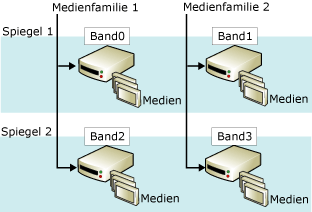

# Gespiegelte Sicherungsmediens&#228;tze (SQL Server)
    
> [!NOTE]  
>  Gespiegelte Sicherungsmediensätze werden nur in der Enterprise Edition von [!INCLUDE[ssNoVersion](../../includes/ssnoversion-md.md)] unterstützt.  
  
 Durch die Spiegelung eines Mediensatzes wird die Zuverlässigkeit erhöht, während sich die Auswirkungen von Funktionsstörungen bei Sicherungsgeräten reduzieren. Diese Funktionsstörungen sind sehr schwerwiegend, da Sicherungen im Hinblick auf den Verlust von Daten die letzte Schutzmaßnahme darstellen. Mit zunehmendem Umfang einer Datenbank nimmt auch die Wahrscheinlichkeit für einen Fehler bei einem Sicherungsgerät oder -medium zu, in dessen Folge eine Sicherung schließlich nicht mehr wiederhergestellt werden kann. Durch die mit der Spiegelung von Sicherungsmedien gebotene Redundanz erhöht sich die Zuverlässigkeit der Sicherungen.  
  
> [!NOTE]  
>  Weitere Informationen über Mediensätze finden Sie unter [Mediensätze, Medienfamilien und Sicherungssätze &#40;SQL Server&#41;](../../relational-databases/backup-restore/media-sets-media-families-and-backup-sets-sql-server.md).  
  
 **In diesem Thema:**  
  
-   [Übersicht über gespiegelte Mediensätze](#OverviewofMirroredMediaSets)  
  
-   [Hardwareanforderungen für Sicherungsspiegel](#HardwareReqs)  
  
-   [Verwandte Aufgaben](#RelatedTasks)  
  
##   Übersicht über gespiegelte Mediensätze  
 Die Medienspiegelung ist eine Eigenschaft des Mediensatzes. Ein *gespiegelter Mediensatz* setzt sich aus mehreren Kopien (*Spiegeln*) des Mediensatzes zusammen. Ein Mediensatz enthält eine oder mehrere Medienfamilien, die jeweils einem Sicherungsmedium entsprechen. Wenn beispielsweise in der TO-Klausel einer BACKUP DATABASE-Anweisung drei Medien aufgelistet sind, werden die Daten mit BACKUP auf drei Medienfamilien aufgeteilt – eine pro Medium. Die Anzahl der Medienfamilien und Spiegel wird definiert, wenn der Mediensatz erstellt wird (durch eine BACKUP DATABASE-Anweisung, mit der WITH FORMAT angegeben wird).  
  
 Ein gespiegelter Mediensatz besitzt zwischen zwei und vier Spiegel. Jeder Spiegel enthält alle Medienfamilien im Mediensatz. Für die Spiegel ist die gleiche Anzahl von Medien erforderlich – eines pro Medienfamilie. Für jeden Spiegel ist ein separates Sicherungsmedium pro Medienfamilie erforderlich. Beispielsweise sind für einen gespiegelten Mediensatz, der aus vier Medienfamilien mit drei Spiegeln besteht, zwölf Sicherungsmedien erforderlich. All diese Medien müssen äquivalent sein. Beispielsweise Bandlaufwerke mit der gleichen Modellnummer vom selben Hersteller.  
  
 In der folgenden Abbildung ist ein Beispiel für einen gespiegelten Mediensatz veranschaulicht, der zwei Medienfamilien mit zwei Spiegeln umfasst. Jede Medienfamilie enthält drei Medienvolumes, die pro Spiegel ein Mal gesichert werden.  
  
   
  
 Einander entsprechende Volumes auf den Spiegeln besitzen identische Inhalte. Somit können sie zum Zeitpunkt der Wiederherstellung ausgetauscht werden. In der vorherigen Abbildung beispielsweise kann das dritte Volume von tape2 mit dem dritten Volume von tape0 ausgetauscht werden.  
  
 Mit [!INCLUDE[ssDEnoversion](../../includes/ssdenoversion-md.md)] wird durch die Synchronisierung der Schreibvorgänge auf die Geräte sichergestellt, dass die Inhalte der gespiegelten Medien übereinstimmen. Wenn ein Spiegel aufgefüllt wird, wird auf alle Spiegel gleichzeitig zugegriffen.  
  
> [!IMPORTANT]  
>  Einen gespiegelten Mediensatz durch das Entfernen eines Spiegels implizit zu brechen (aufzuteilen), ist nicht möglich. Sobald ein Band oder ein Datenträger eines Spiegels beschädigt oder neu formatiert wird, kann dieser Spiegel nicht mehr für Sicherungen verwendet werden. Solange noch ein vollständiger Spiegel intakt bleibt, kann der Mediensatz gelesen werden. Wenn jeder Spiegel eine gegebene Medienfamilie verliert, ist der Mediensatz wertlos.  
  
 Im Hinblick auf die Vollständigkeit der Spiegel gelten bei den verschiedenen Sicherungs- und Wiederherstellungsvorgängen unterschiedliche Anforderungen. Wenn im Rahmen eines Sicherungsvorgangs ein gespiegelter Mediensatz geschrieben (d. h. erstellt oder erweitert) werden soll, müssen alle Spiegel vorhanden sein. Beim Wiederherstellen einer Sicherung von einem gespiegelten Mediensatz können Sie jedoch nur einen Spiegel für jede Medienfamilie angeben. Sie können beim Wiederherstellen weniger Geräte als Familien verwenden, die einzelnen Medienfamilien können jedoch nur ein Mal verarbeitet werden. Falls Fehler auftreten, kann das Vorhandensein der anderen Spiegel jedoch dazu beitragen, dass einige Wiederherstellungsprobleme schneller gelöst werden können. Sie können ein beschädigtes Medienvolume durch das entsprechende Volume eines anderen Spiegels ersetzen. Der Grund dafür ist, dass RESTORE und RESTORE VERIFYONLY das Ersetzen beschädigter Medien durch das entsprechende Sicherungsmedienvolume eines anderen Spiegels unterstützen.  
  
##   Hardwareanforderungen für Sicherungsspiegel  
 Spiegelungen werden auf Datenträger und auf Band angewendet (auf Datenträgern werden keine Anschlussbänder unterstützt). Alle Sicherungsmedien für einen einzelnen Sicherungs- oder Wiederherstellungsvorgang müssen den gleichen Typ, den gleiche Datenträger bzw. das gleiche Band aufweisen.  
  
 In diesen weit gefassten Kategorien müssen wiederum ähnliche Geräte mit übereinstimmenden Eigenschaften verwendet werden. Wenn die Geräte zu unterschiedlich sind, wird eine Fehlermeldung (3212) generiert. Wenn Sie die Gefahr einer Nichtübereinstimmung der Geräte ausschließen möchten, verwenden Sie Geräte, die äquivalent sind, beispielsweise nur Laufwerke mit der gleichen Modellnummer vom selben Hersteller.  
  
##   Verwandte Aufgaben  
 **So sichern Sie Daten auf gespiegelten Sicherungsmedien**  
  
-   [Sichern auf einem gespiegelten Mediensatz &#40;Transact-SQL&#41;](../../relational-databases/backup-restore/back-up-to-a-mirrored-media-set-transact-sql.md)  
  
## Siehe auch  
 [Mögliche Medienfehler während der Sicherung und Wiederherstellung &#40;SQL Server&#41;](../../relational-databases/backup-restore/possible-media-errors-during-backup-and-restore-sql-server.md)   
 [RESTORE VERIFYONLY &#40;Transact-SQL&#41;](../Topic/RESTORE%20VERIFYONLY%20\(Transact-SQL\).md)   
 [Sicherungsmedien &#40;SQL Server&#41;](../../relational-databases/backup-restore/backup-devices-sql-server.md)   
 [Mediensätze, Medienfamilien und Sicherungssätze &#40;SQL Server&#41;](../../relational-databases/backup-restore/media-sets-media-families-and-backup-sets-sql-server.md)  
  
  