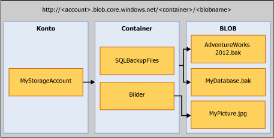

# <a name="sql-server-backup-to-url"></a>SQL Server-Sicherung über URLs
[!INCLUDE[tsql-appliesto-ss2016-xxxx-xxxx-xxx_md](../../includes/tsql-appliesto-ss2016-xxxx-xxxx-xxx-md.md)]

  In diesem Thema werden die Konzepte, die Anforderungen und die Komponenten eingeführt, die notwendig sind, um den Microsoft Azure BLOB-Speicherdienst als Sicherungsziel zu verwenden. Die Sicherungs- und Wiederherstellungsfunktion sind gleich oder ähnlich wie beim Verwenden von DISK oder TAPE, mit wenigen Unterschieden. Diese Unterschiede sowie einige Codebeispiele werden in diesem Thema erörtert.  
  
## <a name="requirements-components-and-concepts"></a>Anforderungen, Komponenten und Konzepte  
 **In diesem Abschnitt:**  
  
-   [Sicherheit](#security)  
  
-   [Einführung in die wichtigsten Komponenten und Konzepte](#intorkeyconcepts)  
  
-   [Microsoft Azure BLOB-Speicherdienst](#Blob)  
  
-   [SQL Server-Komponenten](#sqlserver)  
  
-   [Einschränkungen](#limitations)  
  
-   [Unterstützung für BACKUP-/RESTORE-Anweisungen](#Support)  
  
-   [Verwenden des Sicherungstasks in SQL Server Management Studio](../../relational-databases/backup-restore/sql-server-backup-to-url.md#BackupTaskSSMS)  
  
-   [SQL Server-Sicherung über URLs mithilfe des Wartungsplanungs-Assistenten](../../relational-databases/backup-restore/sql-server-backup-to-url.md#MaintenanceWiz)  
  
-   [Wiederherstellen aus dem Windows Azure-Speicher mithilfe von SQL Server Management Studio](../../relational-databases/backup-restore/sql-server-backup-to-url.md#RestoreSSMS)  
  
###  <a name="security"></a> Sicherheit  
 Die folgenden Sicherheitsüberlegungen und -anforderungen beziehen sich auf die Sicherung oder Wiederherstellung unter Verwendung der Microsoft Azure BLOB-Speicherdienste.  
  
-   Beim Erstellen eines Containers für den Microsoft Azure BLOB-Speicherdienst sollten Sie den Zugriff auf **Privat**festlegen. Dadurch wird der Zugriff auf Benutzer oder Konten beschränkt, die über die erforderlichen Anmeldeinformationen zur Authentifizierung beim Windows Azure-Konto verfügen.  
  
    > [!IMPORTANT]  
    >  [!INCLUDE[ssNoVersion](../../includes/ssnoversion-md.md)] erfordert, dass entweder der Name und Zugriffsschlüssel zur Authentifizierung beim Windows Azure-Konto oder eine Shared Access Signature und das Zugriffstoken in [!INCLUDE[ssNoVersion](../../includes/ssnoversion-md.md)] -Anmeldeinformationen gespeichert werden. Mithilfe dieser Informationen wird im Fall von Sicherungs- und Wiederherstellungsvorgängen die Authentifizierung beim Windows Azure-Konto ausgeführt.  
  
-   Das zum Ausgeben von BACKUP- oder RESTORE-Befehlen verwendete Benutzerkonto sollte Mitglied der Datenbankrolle **db_backup operator** sein und über Berechtigungen zum **Ändern beliebiger Anmeldeinformationen** verfügen.  
  
###  <a name="intorkeyconcepts"></a> Einführung in die wichtigsten Komponenten und Konzepte  
 In den folgenden beiden Abschnitten werden der Microsoft Azure BLOB-Speicherdienst sowie die bei der Sicherung oder Wiederherstellung unter Verwendung des Microsoft Azure BLOB-Speicherdiensts verwendeten [!INCLUDE[ssNoVersion](../../includes/ssnoversion-md.md)] -Komponenten eingeführt. Es ist wichtig, die jeweiligen Komponenten und Interaktionen zwischen den einzelnen Komponenten zu verstehen, um Daten mit dem Microsoft Azure BLOB-Speicherdienst zu sichern oder wiederherzustellen.  
  
 Der erste Schritt in diesem Verfahren besteht im Erstellen eines Windows Azure-Speicherkontos innerhalb Ihres Azure-Abonnements. Dieses Speicherkonto ist ein Administratorkonto, das über vollständige Administratorrechte für alle mit dem Speicherkonto erstellten Container und Objekte verfügt. [!INCLUDE[ssNoVersion](../../includes/ssnoversion-md.md)] kann entweder den Namen und Zugriffsschlüsselwert zur Authentifizierung beim Windows Azure-Konto sowie zum Schreiben und Lesen von BLOBs im Microsoft Azure BLOB-Speicherdienst oder ein Shared Access Signature-Token verwenden, das für bestimmte Container generiert wurde und Lese- und Schreibrechte erteilt. Weitere Informationen zu Azure-Speicherkonten finden Sie unter [Informationen zu Azure-Speicherkonten](http://azure.microsoft.com/en-us/documentation/articles/storage-create-storage-account/) , und weitere Informationen zu Shared Access Signatures finden Sie unter [Shared Access Signatures, Teil 1: Grundlagen zum SAS-Modell](http://azure.microsoft.com/en-us/documentation/articles/storage-dotnet-shared-access-signature-part-1/). Diese Authentifizierungsinformationen werden in den [!INCLUDE[ssNoVersion](../../includes/ssnoversion-md.md)] -Anmeldeinformationen gespeichert und bei Sicherungs- und Wiederherstellungsvorgängen verwendet.  
  
###  <a name="Blob"></a> Microsoft Azure BLOB-Speicherdienst  
 **Speicherkonto:** Das Speicherkonto ist der Ausgangspunkt für alle Speicherdienste. Um auf den Microsoft Azure BLOB-Speicherdienst zuzugreifen, erstellen Sie zunächst ein Windows Azure-Speicherkonto. Weitere Informationen finden Sie unter [Erstellen eines Speicherkontos](http://azure.microsoft.com/en-us/documentation/articles/storage-create-storage-account/).  
  
 **Container:** In einem Container können mehrere BLOBs gruppiert und eine unbegrenzte Anzahl von BLOBs gespeichert werden. Damit eine [!INCLUDE[ssNoVersion](../../includes/ssnoversion-md.md)] -Sicherung in den Microsoft Azure BLOB-Speicherdienst geschrieben werden kann, muss mindestens der Stammcontainer erstellt werden. Sie können ein Shared Access Signature-Token für einen Container generieren und den Zugriff nur auf Objekte in einem bestimmten Container gewähren.  
  
 **BLOB:** Eine Datei eines beliebigen Typs und beliebiger Größe. Es gibt zwei Arten von BLOBs, die im Microsoft Azure BLOB-Speicherdienst gespeichert werden können: Block-BLOBs und Seiten-BLOBs. [!INCLUDE[ssNoVersion](../../includes/ssnoversion-md.md)] Je nach der verwendeten Transact-SQL-Syntax können bei der Sicherung beide BLOB-Typen verwendet werden. BLOBs sind im folgenden URL-Format adressierbar: „https://\<Speicherkonto>.blob.core.windows.net/\<Container>/\<BLOB>“. Weitere Informationen zum Microsoft Azure BLOB-Speicherdienst finden Sie unter [Verwenden des Speicherdiensts von .NET](http://www.windowsazure.com/develop/net/how-to-guides/blob-storage/). Weitere Informationen zu Seiten- und Block-BLOBs finden Sie unter [Grundlegendes zu Block- und Seiten-BLOBs](http://msdn.microsoft.com/library/windowsazure/ee691964.aspx).  
  
   
  
 **Azure-Momentaufnahme:** Eine Momentaufnahme eines Azure-BLOBs zu einem bestimmten Zeitpunkt. Weitere Informationen finden Sie unter [Erstellen einer Momentaufnahme eines BLOBs](https://msdn.microsoft.com/library/azure/hh488361.aspx). [!INCLUDE[ssNoVersion](../../includes/ssnoversion-md.md)] Die Sicherung unterstützt jetzt Azure Momentaufnahmesicherungen von Datenbankdateien im Microsoft Azure BLOB-Speicherdienst. Weitere Informationen finden Sie unter [Dateimomentaufnahme-Sicherungen für Datenbankdateien in Azure](../../relational-databases/backup-restore/file-snapshot-backups-for-database-files-in-azure.md).  
  
###  <a name="sqlserver"></a> [!INCLUDE[ssNoVersion](../../includes/ssnoversion-md.md)] Components  
 **URL:** Eine URL gibt einen URI (Uniform Resource Identifier) für eine eindeutige Sicherungsdatei an. Mit der URL werden Speicherort und Name der [!INCLUDE[ssNoVersion](../../includes/ssnoversion-md.md)] -Sicherungsdatei angegeben. Die URL muss auf ein tatsächliches BLOB, nicht nur auf einen Container verweisen. Wenn das BLOB nicht vorhanden ist, wird es erstellt. Wird ein vorhandenes BLOB angegeben, erzeugt BACKUP einen Fehler, es sei denn, die WITH FORMAT-Option ist angegeben, um die vorhandene Sicherungsdatei im BLOB zu überschreiben.  
  
 Hier ist ein Beispiel-URL-Wert: „http[s]://ACCOUNTNAME.blob.core.windows.net/\<CONTAINER>/\<DATEINAME.bak>“. HTTPS ist zwar nicht erforderlich, aber empfehlenswert.  
  
 **Anmeldeinformationen:** [!INCLUDE[ssNoVersion](../../includes/ssnoversion-md.md)] -Anmeldeinformationen sind ein Objekt zum Speichern von Authentifizierungsinformationen, die für die Verbindung mit einer Ressource außerhalb von SQL Server erforderlich sind. Hier werden Anmeldeinformationen von [!INCLUDE[ssNoVersion](../../includes/ssnoversion-md.md)] -Sicherungs- und Wiederherstellungsvorgängen verwendet, um sich beim Microsoft Azure BLOB-Speicherdienst sowie den zugehörigen Container- und BLOB-Objekten zu authentifizieren. Als Anmeldeinformationen werden entweder der Name und die **Zugriffsschlüsselwerte** des Speicherkontos oder die Container-URL und das zugehörige Shared Access Signature-Token gespeichert. Sobald die Anmeldeinformationen erstellt wurden, bestimmt die Syntax der BACKUP/RESTORE-Anweisungen den Typ des BLOBs und die erforderlichen Anmeldeinformationen.  
  
 Ein Beispiel zum Erstellen einer Shared Access Signature finden Sie in den Beispielen zum [Erstellen einer Shared Access Signature](../../relational-databases/backup-restore/sql-server-backup-to-url.md#SAS) weiter unten in diesem Thema. Informationen zum Erstellen von [!INCLUDE[ssNoVersion](../../includes/ssnoversion-md.md)] -Anmeldeinformationen finden Sie in den Beispielen unter [Erstellen von Anmeldeinformationen](../../relational-databases/backup-restore/sql-server-backup-to-url.md#credential) weiter unten in diesem Thema.  
  
 Weitere allgemeine Informationen über Anmeldeinformationen finden Sie unter [Anmeldeinformationen](http://msdn.microsoft.com/library/ms161950.aspx).  
  
 Informationen mit weiteren Beispielen zur Verwendung von Anmeldeinformationen finden Sie unter [Erstellen eines Proxys für den SQL Server-Agent](http://msdn.microsoft.com/library/ms175834.aspx).  
  
###  <a name="limitations"></a> Einschränkungen  
  
-   Das Sichern auf Premium-Speicher wird nicht unterstützt.  
  
-   Die maximal unterstützte Größe von Sicherungen bei Verwendung eines Seiten-BLOBs wird durch die maximale Größe eines einzelnen Seiten-BLOBs beschränkt, d. h. 1 TB. Die maximal unterstützte Größe von Sicherungen bei Verwendung eines Block-BLOBs wird nicht durch die maximale Größe eines Block-BLOBs (200 GB) beschränkt, da die Sicherung in Block-BLOBs das Striping und somit erheblich größere Sicherungen unterstützt.  
  
-   Sie können Sicherungs- oder Wiederherstellungsanweisungen ausgeben, indem Sie TSQL, SMO, PowerShell-Cmdlets, SQL Server Management Studio Backup oder den Wiederherstellungs-Assistenten verwenden.   
  
-   Das Erstellen von Namen für logische Geräte wird nicht unterstützt. Folglich ist es nicht möglich, eine URL mithilfe von sp_dumpdevice oder über SQL Server Management Studio als Sicherungsmedium hinzuzufügen.  
  
-   Das Anfügen an vorhandene Sicherungs-BLOBs wird nicht unterstützt. Sicherungen auf einem vorhandenen BLOB können nur unter Verwendung der Option **WITH FORMAT** überschrieben werden. Allerdings ist das Argument **WITH FORMAT** bei Verwendung von Dateimomentaufnahme-Sicherungen (mit dem Argument **WITH FILE_SNAPSHOT** ) nicht zulässig, um zu vermeiden, dass Dateimomentaufnahmen, die mit der ursprünglichen Dateimomentaufnahme-Sicherung erstellt wurden, verwaist zurückbleiben.  
  
-   Um Daten in einem einzigen Sicherungsvorgang in mehrere BLOBs zu sichern, müssen Sie Block-BLOBs und ein SAS-Token anstelle der Speicherkontoschlüssel für die SQL-Anmeldeinformationen verwenden.  
  
-   Das Angeben von **BLOCKSIZE** wird für Seiten-Blobs nicht unterstützt. 
  
-   Das Angeben von **MAXTRANSFERSIZE** wird für Seiten-Blobs nicht unterstützt. 
  
-   Die Angabe von Sicherungssatzoptionen mit **RETAINDAYS** und **EXPIREDATE** wird nicht unterstützt.  
  
-   [!INCLUDE[ssNoVersion](../../includes/ssnoversion-md.md)] auf 259 Zeichen begrenzt. Da BACKUP TO URL 36 Zeichen für die erforderlichen Elemente zur Angabe der URL „https://.blob.core.windows.net//.bak“ beansprucht, verbleiben insgesamt noch 223 Zeichen für Konto-, Container- und BLOB-Namen.  
  
###  <a name="Support"></a> Unterstützung für BACKUP-/RESTORE-Anweisungen  
  
|BACKUP-/RESTORE-Anweisung|Unterstützt|Ausnahmen|Kommentare|
|-|-|-|-|
|BACKUP|√|BLOCKSIZE und MAXTRANSFERSIZE werden für Block-Blobs unterstützt. Sie werden nicht für Seiten-Blobs unterstützt. | Die Sicherung in einem Block-Blob erfordert eine SAS, die in einer SQL Server-Anmeldeinformation gespeichert ist. Die Sicherung auf einem Seiten-Blob erfordert den Speicherkontoschlüssel, der in einer [!INCLUDE[ssNoVersion](../../includes/ssnoversion-md.md)]-Anmeldeinformation gespeichert ist, und erfordert das Argument WITH CREDENTIAL, um festgelegt zu werden.|  
|RESTORE|√||Erfordert die Definition von [!INCLUDE[ssNoVersion](../../includes/ssnoversion-md.md)] -Anmeldeinformationen sowie die Angabe des Arguments WITH CREDENTIAL, wenn die [!INCLUDE[ssNoVersion](../../includes/ssnoversion-md.md)] -Anmeldeinformationen mithilfe des Speicherkontoschlüssels als geheimem Schlüssel definiert werden.|  
|RESTORE FILELISTONLY|√||Erfordert die Definition von [!INCLUDE[ssNoVersion](../../includes/ssnoversion-md.md)] -Anmeldeinformationen sowie die Angabe des Arguments WITH CREDENTIAL, wenn die [!INCLUDE[ssNoVersion](../../includes/ssnoversion-md.md)] -Anmeldeinformationen mithilfe des Speicherkontoschlüssels als geheimem Schlüssel definiert werden.|  
|RESTORE HEADERONLY|√||Erfordert die Definition von [!INCLUDE[ssNoVersion](../../includes/ssnoversion-md.md)] -Anmeldeinformationen sowie die Angabe des Arguments WITH CREDENTIAL, wenn die [!INCLUDE[ssNoVersion](../../includes/ssnoversion-md.md)] -Anmeldeinformationen mithilfe des Speicherkontoschlüssels als geheimem Schlüssel definiert werden.|  
|RESTORE LABELONLY|√||Erfordert die Definition von [!INCLUDE[ssNoVersion](../../includes/ssnoversion-md.md)] -Anmeldeinformationen sowie die Angabe des Arguments WITH CREDENTIAL, wenn die [!INCLUDE[ssNoVersion](../../includes/ssnoversion-md.md)] -Anmeldeinformationen mithilfe des Speicherkontoschlüssels als geheimem Schlüssel definiert werden.|  
|RESTORE VERIFYONLY|√||Erfordert die Definition von [!INCLUDE[ssNoVersion](../../includes/ssnoversion-md.md)] -Anmeldeinformationen sowie die Angabe des Arguments WITH CREDENTIAL, wenn die [!INCLUDE[ssNoVersion](../../includes/ssnoversion-md.md)] -Anmeldeinformationen mithilfe des Speicherkontoschlüssels als geheimem Schlüssel definiert werden.|  
|RESTORE REWINDONLY|−|||  
  
 Allgemeine und Syntaxinformationen zu BACKUP-Anweisungen finden Sie unter [BACKUP &#40;Transact-SQL&#41;](../../t-sql/statements/backup-transact-sql.md).  
  
 Allgemeine und Syntaxinformationen zu RESTORE-Anweisungen finden Sie unter [RESTORE &#40;Transact-SQL&#41;](../../t-sql/statements/restore-statements-transact-sql.md).  
  
### <a name="support-for-backup-arguments"></a>Unterstützung für BACKUP-Argumente  

|Argument|Unterstützt|Exception|Kommentare|  
|-|-|-|-|  
|DATABASE|√|||  
|LOG|√|||  
||  
|TO (URL)|√|Bei URL wird das Angeben bzw. Erstellen eines logischen Namens im Gegensatz zu DISK und TAPE nicht unterstützt.|Dieses Argument wird verwendet, um den URL-Pfad der Sicherungsdatei anzugeben.|  
|MIRROR TO|√|||  
|**WITH-OPTIONEN:**||||  
|CREDENTIAL|√||WITH CREDENTIAL wird nur unterstützt, wenn die Option BACKUP TO URL zur Sicherung in den Microsoft Azure BLOB-Speicherdienst verwendet wird und die [!INCLUDE[ssNoVersion](../../includes/ssnoversion-md.md)] -Anmeldeinformationen mithilfe des Speicherkontoschlüssels als geheimem Schlüssel definiert werden.|  
|FILE_SNAPSHOT|√|||  
|ENCRYPTION|√||Wird das Argument **WITH ENCRYPTION** angegeben, gewährleistet die [!INCLUDE[ssNoVersion](../../includes/ssnoversion-md.md)] -Dateimomentaufnahme-Sicherung, dass die gesamte Datenbank vor dem Erstellen der Sicherung mit TDE verschlüsselt wurde, und verschlüsselt die Dateimomentaufnahme-Sicherungsdatei selbst in diesem Fall mit dem für TDE in der Datenbank angegebenen Algorithmus. Die Sicherung schlägt fehl, wenn nicht alle Daten in der gesamten Datenbank verschlüsselt sind (z. B. wenn der Verschlüsselungsvorgang noch nicht abgeschlossen ist).|  
|DIFFERENTIAL|√|||  
|COPY_ONLY|√|||  
|COMPRESSION&#124;NO_COMPRESSION|√|Wird für Dateimomentaufnahme-Sicherungen nicht unterstützt||  
|DESCRIPTION|√|||  
|NAME|√|||  
|EXPIREDATE &#124; RETAINDAYS|−|||  
|NOINIT &#124; INIT|−||Das Anfügen an BLOBs ist nicht möglich. Verwenden Sie zum Überschreiben einer Sicherung das Argument **WITH FORMAT** . Allerdings ist das Argument **WITH FORMAT** bei Verwendung von Dateimomentaufnahme-Sicherungen (mit dem Argument **WITH FILE_SNAPSHOT**) nicht zulässig, um zu vermeiden, dass Dateimomentaufnahmen, die mit der ursprünglichen Dateimomentaufnahme-Sicherung erstellt wurden, verwaist zurückbleiben.|  
|NOSKIP &#124; SKIP|−|||  
|NOFORMAT &#124; FORMAT|√||Eine Sicherung, die auf ein vorhandenes BLOB geschrieben wird, ist nur erfolgreich, wenn **WITH FORMAT** angegeben wird. Das vorhandene BLOB wird bei Angabe von **WITH FORMAT** überschrieben. Allerdings ist das Argument FORMAT bei Verwendung von Dateimomentaufnahme-Sicherungen (mit dem Argument **WITH FILE_SNAPSHOT** ) nicht zulässig, um zu vermeiden, dass Dateimomentaufnahmen, die mit der ursprünglichen Dateimomentaufnahme-Sicherung erstellt wurden, verwaist zurückbleiben. Allerdings ist das Argument **WITH FORMAT** bei Verwendung von Dateimomentaufnahme-Sicherungen (mit dem Argument **WITH FILE_SNAPSHOT** ) nicht zulässig, um zu vermeiden, dass Dateimomentaufnahmen, die mit der ursprünglichen Dateimomentaufnahme-Sicherung erstellt wurden, verwaist zurückbleiben.|  
|MEDIADESCRIPTION|√|||  
|MEDIANAME|√|||  
|BLOCKSIZE|√|Nicht für Seiten-Blob unterstützt. Unterstützt für Block-Blob.| Empfohlen BLOCKSIZE = 65536 zum Optimieren der Verwendung von 50.000 Blöcken, die in einem Block-Blob zulässig sind. |  
|BUFFERCOUNT|√|||  
|MAXTRANSFERSIZE|√|Nicht für Seiten-Blob unterstützt. Unterstützt für Block-Blob.| Der Standardwert ist 1048576. Der Wert kann in einem Bereich bis zu 4 MB in Schritten von 65.536 Bytes liegen.</br> Empfohlen MAXTRANSFERSIZE = 4194304 zum Optimieren der Verwendung von 50.000 Blöcken, die in einem Block-Blob zulässig sind. |  
|NO_CHECKSUM &#124; CHECKSUM|√|||  
|STOP_ON_ERROR &#124; CONTINUE_AFTER_ERROR|√|||  
|STATS|√|||  
|REWIND &#124; NOREWIND|−|||  
|UNLOAD &#124; NOUNLOAD|−|||  
|NORECOVERY &#124; STANDBY|√|||  
|NO_TRUNCATE|√|||  
  
 Weitere Informationen zu BACKUP-Argumenten finden Sie unter [BACKUP &#40;Transact-SQL&#41;](../../t-sql/statements/backup-transact-sql.md).  
  
### <a name="support-for-restore-arguments"></a>Unterstützung für RESTORE-Argumente  
  
|Argument|Unterstützt|Ausnahmen|Kommentare|  
|-|-|-|-|  
|DATABASE|√|||  
|LOG|√|||  
|FROM (URL)|√||Das FROM URL-Argument wird verwendet, um den URL-Pfad der Sicherungsdatei anzugeben.|  
|**WITH Options:**||||  
|CREDENTIAL|√||WITH CREDENTIAL wird nur unterstützt, wenn Daten mit der RESTORE FROM URL-Option vom Microsoft Azure BLOB-Speicherdienst wiederhergestellt werden.|  
|PARTIAL|√|||  
|RECOVERY &#124; NORECOVERY &#124; STANDBY|√|||  
|LOADHISTORY|√|||  
|MOVE|√|||  
|REPLACE|√|||  
|RESTART|√|||  
|RESTRICTED_USER|√|||  
|FILE|−|||  
|PASSWORD|√|||  
|MEDIANAME|√|||  
|MEDIAPASSWORD|√|||  
|BLOCKSIZE|√|||  
|BUFFERCOUNT|−|||  
|MAXTRANSFERSIZE|−|||  
|CHECKSUM &#124; NO_CHECKSUM|√|||  
|STOP_ON_ERROR &#124; CONTINUE_AFTER_ERROR|√|||  
|FILESTREAM|√|Wird für Momentaufnahmesicherungen nicht unterstützt||  
|STATS|√|||  
|REWIND &#124; NOREWIND|−|||  
|UNLOAD &#124; NOUNLOAD|−|||  
|KEEP_REPLICATION|√|||  
|KEEP_CDC|√|||  
|ENABLE_BROKER &#124; ERROR_BROKER_CONVERSATIONS &#124; NEW_BROKER|√|||  
|STOPAT &#124; STOPATMARK &#124; STOPBEFOREMARK|√|||  
  
 Weitere Informationen zu RESTORE-Argumenten finden Sie unter [RESTORE-Argumente &#40;Transact-SQL&#41;](../../t-sql/statements/restore-statements-arguments-transact-sql.md).  
  
##  <a name="BackupTaskSSMS"></a> Verwenden des Sicherungstasks in SQL Server Management Studio  
Sie können eine Datenbank über URL mit dem Sicherungstask in SQL Server Management Studio mithilfe einer SQL-Server-Anmeldeinformation schützen.  
  
> [!NOTE]  
>  Sie müssen Sie allerdings Transact-SQL, Powershell oder C# anstelle des Sicherungstasks in SQL Server Management Studio verwenden, um eine [!INCLUDE[ssNoVersion](../../includes/ssnoversion-md.md)] -Dateimomentaufnahme-Sicherung zu erstellen oder einen vorhandenen Mediensatz zu überschreiben.  
  
 Die folgenden Schritte beschreiben die Änderungen, die am Task „Datenbank sichern“ in SQL Server Management Studio vorgenommen wurde, um das Sichern im Windows Azure-Speicher zu ermöglichen:  
  
1.  Stellen Sie im **Objekt-Explorer**eine Verbindung mit einer Instanz des SQL Server-Datenbankmoduls her, und erweitern Sie anschließend diese Instanz.

2.  Erweitern Sie **Datenbanken**, klicken Sie mit der rechten Maustaste auf die gewünschte Datenbank, zeigen Sie auf **Tasks**, und klicken Sie anschließend auf **Back Up...**(Sichern).
  
3.  Die Option **URL** ist in der Dropdownliste **Back up to:** (Sichern auf:) auf der Seite **Allgemein** im Abschnitt **Ziel** verfügbar.  Die Option **URL** wird verwendet, um eine Sicherung im Windows Azure-Speicher zu erstellen. Klicken Sie auf **Hinzufügen** . Das Dialogfeld **Sicherungsziel auswählen** wird geöffnet:
   
    1.  **Azure-Speichercontainer:** Der Name des Windows Azure-Speichercontainers, um die Sicherungsdateien zu speichern.  Wählen Sie einen vorhandenen Container aus der Dropdown Liste aus, oder geben Sie ihn manuell ein. 
  
    2.  **Richtlinie für den gemeinsamen Zugriff:** Geben Sie die SAS (Shared Access Signature) für einen manuell eingegebenen Container an.  Dieses Feld ist nicht verfügbar, wenn ein vorhandener Container ausgewählt wurde. 
  
    3.  **Sicherungsdatei:** Name der Sicherungsdatei.
    
    4.  **Neuen Container:** Wird verwendet, um einen vorhandenen Container zu registrieren, für den Sie über keine SAS verfügen.  Weitere Informationen finden Sie unter [Connect to A Microsoft Azure Subscription](../../relational-databases/backup-restore/connect-to-a-microsoft-azure-subscription.md)(Herstellen einer Verbindung zu einem Microsoft Azure-Abonnement).
  
> [!NOTE] 
>  **Hinzufügen** unterstützt mehrere Sicherungsdateien und Speichercontainer für einen einzelnen Mediensatz.
  
 Wenn Sie eine **URL** als Ziel auswählen, sind bestimmte Optionen auf der Seite **Medienoptionen** deaktiviert.  Die folgenden Themen enthalten weitere Informationen zum Dialogfeld Datenbank sichern:  
  
 [Datenbank sichern &#40;Seite Allgemein&#41;](../../relational-databases/backup-restore/back-up-database-general-page.md)  
  
 [Datenbank sichern &#40;Seite 'Medienoptionen'&#41;](../../relational-databases/backup-restore/back-up-database-media-options-page.md)  
  
 [Datenbank sichern &#40;Seite 'Sicherungsoptionen'&#41;](../../relational-databases/backup-restore/back-up-database-backup-options-page.md)  
  
 [Erstellen von Anmeldeinformationen – Authentifizieren beim Azure-Speicher](../../relational-databases/backup-restore/create-credential-authenticate-to-azure-storage.md)  
  
##  <a name="MaintenanceWiz"></a> SQL Server-Sicherung über URLs mithilfe des Wartungsplanungs-Assistenten  
 Ähnlich dem zuvor beschriebenen Sicherungstask umfasst der Wartungsplanungs-Assistent in SQL Server Management Studio **URL** als eine der Zieloptionen sowie andere unterstützende Objekte, die erforderlich sind, um Daten im Windows Azure-Speicher zu sichern, z.B. die SQL-Anmeldeinformationen. Weitere Informationen finden Sie unter der **Definieren von Sicherungstasks** im Abschnitt [Using Maintenance Plan Wizard](../../relational-databases/maintenance-plans/use-the-maintenance-plan-wizard.md#SSMSProcedure).  
  
> [!NOTE]  
>  Sie müssen Transact-SQL, Powershell oder C# anstelle des Sicherungstasks im Wartungsplanungs-Assistenten verwenden, um einen Sicherungssatz im Stripesetformat, eine [!INCLUDE[ssNoVersion](../../includes/ssnoversion-md.md)] -Dateimomentaufnahme-Sicherung oder SQL-Anmeldeinformationen unter Verwendung eines Shared Access-Tokens zu erstellen.  
  
##  <a name="RestoreSSMS"></a> Wiederherstellen aus dem Microsoft Azure-Speicher mithilfe von SQL Server Management Studio  
Die Aufgabe „Datenbank wiederherstellen“ enthält als Medium eine **URL** , von der aus wiederhergestellt wird.  Die folgenden Schritte beschreiben die Verwendung des Wiederherstellungstasks für die Wiederherstellung aus dem Microsoft Azure BLOB-Speicherdienst: 
  
1.  Klicken Sie mit der rechten Maustaste auf **Datenbanken** , und wählen Sie **Restore Database...**(Datenbank... wiederherstellen) aus. 
  
2.  Wählen Sie auf der Seite **Allgemein** im Abschnitt **Quelle** die Option **Gerät** aus.
  
3.  Klicken Sie auf die Schaltfläche zum Durchsuchen (...), um das Dialogfeld **Sicherungsmedien auswählen** zu öffnen. 

4.  Wählen Sie eine **URL** aus der Dropdownliste **Sicherungsmedientyp:** aus.  Klicken Sie auf **Hinzufügen** , um das Dialogfeld **Speicherort der Sicherungsdatei auswählen** zu öffnen.

    1.  **Azure-Speichercontainer:** Der vollqualifizierte Name des Windows Azure-Speichercontainers, mit dem Sicherungsdateien gespeichert werden.  Wählen Sie einen vorhandenen Container aus der Dropdownliste aus, oder geben Sie manuell einen vollqualifizierten Containernamen ein.
      
    2.  **Shared Access Signature:**  Wird verwendet, um die SAS für den angegebenen Container einzugeben.
      
    3.  **Hinzufügen:**  Wird verwendet, um einen vorhandenen Container zu registrieren, für den Sie über keine SAS verfügen.  Weitere Informationen finden Sie unter [Connect to A Microsoft Azure Subscription](../../relational-databases/backup-restore/connect-to-a-microsoft-azure-subscription.md)(Herstellen einer Verbindung zu einem Microsoft Azure-Abonnement).
      
    4.  **OK:**    SQL Server stellt mithilfe der angegebenen SQL-Anmeldeinformationen eine Verbindung mit dem Microsoft Azure-Speicher her und öffnet das Dialogfeld **Sicherungsdatei in Microsoft Azure suchen** . Die Sicherungsdateien, die sich im Speichercontainer befinden, werden auf dieser Seite angezeigt. Wählen Sie die Datei aus, die Sie zum Wiederherstellen verwenden möchten, und klicken Sie auf **OK**. Dadurch werden Sie wieder zum Dialogfeld **Sicherungsmedien auswählen** geleitet. Wenn Sie in diesem Dialogfeld auf **OK** klicken, wird das Hauptdialogfeld **Wiederherstellen** aufgerufen, in dem Sie die Wiederherstellung abschließen können. 
  
     [Datenbank wiederherstellen &#40;Seite „Allgemein“&#41;](../../relational-databases/backup-restore/restore-database-general-page.md)  
  
     [Datenbank wiederherstellen &#40;Seite Dateien&#41;](../../relational-databases/backup-restore/restore-database-files-page.md)  
  
     [Datenbank wiederherstellen &#40;Seite Optionen&#41;](../../relational-databases/backup-restore/restore-database-options-page.md)  
  
##  <a name="Examples"></a> Codebeispiele  
 Dieser Abschnitt enthält die folgenden Beispiele.  
  
-   [Erstellen von Anmeldeinformationen](#credential)  
  
-   [Sichern einer vollständigen Datenbank](#complete)  
    
-   [Wiederherstellen eines bestimmten Zeitpunkts mithilfe von STOPAT](#PITR)  
  
> [!NOTE]  
>  Ein Tutorial zur Verwendung von SQL Server 2016 mit Microsoft Azure Blob Storage finden Sie unter [Tutorial: Verwenden von SQL Server 2016-Datenbanken mit Microsoft Azure Blob Storage](https://msdn.microsoft.com/library/dn466438.aspx)  
  
###  <a name="SAS"></a> Erstellen einer Shared Access Signature  
 In dem folgenden Beispiel werden Shared Access Signatures erstellt, die zum Erstellen von [!INCLUDE[ssNoVersion](../../includes/ssnoversion-md.md)] -Anmeldeinformationen für einen neu erstellten Container verwendet werden können. Das Skript erstellt eine Shared Access Signature, die einer gespeicherten Zugriffsrichtlinie zugeordnet ist. Weitere Informationen finden Sie unter [Shared Access Signatures, Teil 1: Grundlagen zum SAS-Modell](http://azure.microsoft.com/en-us/documentation/articles/storage-dotnet-shared-access-signature-part-1/). Dieses Beispiel erfordert Microsoft Azure PowerShell. Informationen zum Installieren und Verwenden von Azure PowerShell finden Sie unter [Installieren und Konfigurieren von Azure PowerShell](https://azure.microsoft.com/documentation/articles/powershell-install-configure/).  

> [!NOTE] 
>  Diese Skripts wurden mit Azure PowerShell 5.0.10586 geschrieben.

**Shared Access Signature, die einer gespeicherten Zugriffsrichtlinie zugeordnet ist**  
  
```Powershell  
# Define global variables for the script  
$prefixName = '<a prefix name>'  # used as the prefix for the name for various objects  
$subscriptionName='<your subscription name>'   # the name of subscription name you will use  
$locationName = '<a data center location>'  # the data center region you will use  
$storageAccountName= $prefixName + 'storage' # the storage account name you will create or use  
$containerName= $prefixName + 'container'  # the storage container name to which you will attach the SAS policy with its SAS token  
$policyName = $prefixName + 'policy' # the name of the SAS policy  


# Set a variable for the name of the resource group you will create or use  
$resourceGroupName=$prefixName + 'rg'   

# adds an authenticated Azure account for use in the session   
Login-AzureRmAccount

# set the tenant, subscription and environment for use in the rest of   
Set-AzureRmContext -SubscriptionName $subscriptionName   

# create a new resource group - comment out this line to use an existing resource group  
New-AzureRmResourceGroup -Name $resourceGroupName -Location $locationName   

# Create a new ARM storage account - comment out this line to use an existing ARM storage account  
New-AzureRmStorageAccount -Name $storageAccountName -ResourceGroupName $resourceGroupName -Type Standard_RAGRS -Location $locationName   

# Get the access keys for the ARM storage account  
$accountKeys = Get-AzureRmStorageAccountKey -ResourceGroupName $resourceGroupName -Name $storageAccountName  

# Create a new storage account context using an ARM storage account  
$storageContext = New-AzureStorageContext -StorageAccountName $storageAccountName -StorageAccountKey $accountKeys[0].Key1 

# Creates a new container in blob storage  
$container = New-AzureStorageContainer -Context $storageContext -Name $containerName  
$cbc = $container.CloudBlobContainer  

# Sets up a Stored Access Policy and a Shared Access Signature for the new container  
$permissions = $cbc.GetPermissions();  
$policyName = $policyName  
$policy = new-object 'Microsoft.WindowsAzure.Storage.Blob.SharedAccessBlobPolicy'  
$policy.SharedAccessStartTime = $(Get-Date).ToUniversalTime().AddMinutes(-5)  
$policy.SharedAccessExpiryTime = $(Get-Date).ToUniversalTime().AddYears(10)  
$policy.Permissions = "Read,Write,List,Delete"  
$permissions.SharedAccessPolicies.Add($policyName, $policy)  
$cbc.SetPermissions($permissions);  

# Gets the Shared Access Signature for the policy  
$policy = new-object 'Microsoft.WindowsAzure.Storage.Blob.SharedAccessBlobPolicy'  
$sas = $cbc.GetSharedAccessSignature($policy, $policyName)  
Write-Host 'Shared Access Signature= '$($sas.Substring(1))''  

# Outputs the Transact SQL to the clipboard and to the screen to create the credential using the Shared Access Signature  
Write-Host 'Credential T-SQL'  
$tSql = "CREATE CREDENTIAL [{0}] WITH IDENTITY='Shared Access Signature', SECRET='{1}'" -f $cbc.Uri,$sas.Substring(1)   
$tSql | clip  
Write-Host $tSql  
```  
  
###  <a name="credential"></a> Erstellen von Anmeldeinformationen  
 In den folgenden Beispielen werden [!INCLUDE[ssNoVersion](../../includes/ssnoversion-md.md)] -Anmeldeinformationen für die Authentifizierung bei einem Microsoft Azure BLOB-Speicherdienst erstellt.  
  
1.  **Verwenden der Identität und des Zugriffsschlüssels eines Speicherkontos**  
  
    ```Transact-sql  
    IF NOT EXISTS  
    (SELECT * FROM sys.credentials   
    WHERE name = '<mycredentialname>')  
    CREATE CREDENTIAL [<mycredentialname>] WITH IDENTITY = '<mystorageaccountname>'  
    ,SECRET = '<mystorageaccountaccesskey>';  
    ```  
  
2.  **Verwenden von Shared Access Signature**  
  
    ```Transact-sql  
    IF NOT EXISTS  
    (SELECT * FROM sys.credentials   
    WHERE name = 'https://<mystorageaccountname>.blob.core.windows.net/<mystorageaccountcontainername>')  
    CREATE CREDENTIAL [https://<mystorageaccountname>.blob.core.windows.net/<mystorageaccountcontainername>] WITH IDENTITY = 'SHARED ACCESS SIGNATURE'  
    ,SECRET = '<SAS_TOKEN>';  
    ```  
  
###  <a name="complete"></a> Ausführen einer vollständigen Datenbanksicherung  
 In den folgenden Beispielen wird eine vollständige Sicherung der AdventureWorks2016-Datenbank in den Microsoft Azure BLOB-Speicherdienst ausgeführt.  
  
1.  **Zur URL unter Verwendung der Identität und des Zugriffsschlüssels des Speicherkontos**  
  
    ```Transact-SQL
    BACKUP DATABASE AdventureWorks2016  
    TO URL = 'https://<mystorageaccountname>.blob.core.windows.net/<mycontainername>/AdventureWorks2016.bak'   
          WITH CREDENTIAL = '<mycredentialname>'   
         ,COMPRESSION  
         ,STATS = 5;  
    GO   
    ```  
  
2.  **Zur URL unter Verwendung von Shared Access Signature**  
  
    ```Transact-SQL  
    BACKUP DATABASE AdventureWorks2016   
    TO URL = 'https://<mystorageaccountname>.blob.core.windows.net/<mycontainername>/AdventureWorks2016.bak';  
    GO   
    ```  
  

  
  
###  <a name="PITR"></a> Wiederherstellen eines bestimmten Zeitpunkts mithilfe von STOPAT  
 Im folgenden Beispiel wird der Zustand der AdventureWorks2016-Beispieldatenbank zu einem bestimmten Zeitpunkt wiederhergestellt und ein Wiederherstellungsvorgang veranschaulicht.  
  
1.  **Von URL unter Verwendung von Shared Access Signature**  
  
    ```Transact-SQL
    RESTORE DATABASE AdventureWorks2016 FROM URL = 'https://<mystorageaccountname>.blob.core.windows.net/<mycontainername>/AdventureWorks2016_2015_05_18_16_00_00.bak'   
    WITH MOVE 'AdventureWorks2016_data' to 'C:\Program Files\Microsoft SQL Server\<myinstancename>\MSSQL\DATA\AdventureWorks2016.mdf'  
    ,MOVE 'AdventureWorks2016_log' to 'C:\Program Files\Microsoft SQL Server\<myinstancename>\MSSQL\DATA\AdventureWorks2016.ldf'  
    ,NORECOVERY  
    ,REPLACE  
    ,STATS = 5;  
    GO   
  
    RESTORE LOG AdventureWorks2016 FROM URL = 'https://<mystorageaccountname>.blob.core.windows.net/<mycontainername>/AdventureWorks2016_2015_05_18_18_00_00.trn'   
    WITH   
    RECOVERY   
    ,STOPAT = 'May 18, 2015 5:35 PM'   
    GO  
    ```  
  
## <a name="see-also"></a>Siehe auch  
 [SQL Server-URL-Sicherung – bewährte Methoden und Problembehandlung](../../relational-databases/backup-restore/sql-server-backup-to-url-best-practices-and-troubleshooting.md)   
 [Sichern und Wiederherstellen von Systemdatenbanken &#40;SQL Server&#41;](../../relational-databases/backup-restore/back-up-and-restore-of-system-databases-sql-server.md)   
 [Tutorial: Verwenden von SQL Server 2016-Datenbanken mit Microsoft Azure Blob Storage](https://msdn.microsoft.com/library/dn466438.aspx)  
  
  
