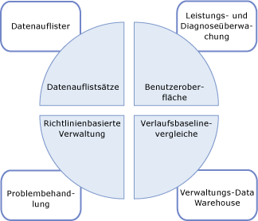
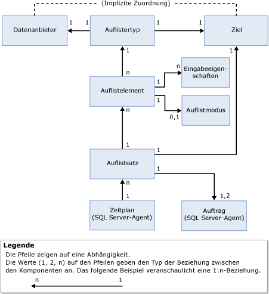

# Datensammlung
  Der Datensammler ist eine Komponente von [!INCLUDE[ssCurrent](../../includes/sscurrent-md.md)] , die verschiedene Datensätze sammelt. Die Datensammlung erfolgt entweder durchgängig oder nach einem benutzerdefinierten Zeitplan. Der Datensammler speichert die gesammelten Daten dann in einer relationalen Datenbank, die als Verwaltungs-Data Warehouse bezeichnet wird.  
  
## Was ist ein Datensammler? 
 Der Datensammler ist eine Kernkomponente der Datensammlungsplattform von [!INCLUDE[ssCurrent](../../includes/sscurrent-md.md)] und der von [!INCLUDE[ssNoVersion](../../includes/ssnoversion-md.md)]bereitgestellten Tools. Der Datensammler stellt über Datenbankserver und Anwendungen einen zentralen Punkt für die Datensammlung bereit. Dieser Sammlungspunkt kann Daten von einer Vielzahl von Quellen abrufen und ist nicht auf Leistungsdaten beschränkt, wie es bei der SQL-Ablaufverfolgung der Fall ist.  
  
 Mit dem Datensammler können Sie außerdem den Umfang der Datensammlung an Ihre Test- und Produktionsumgebungen anpassen. Der Datensammler verwendet auch ein Data Warehouse, eine relationale Datenbank, mit der Sie die gesammelten Daten durch Festlegen unterschiedlicher Aufbewahrungsdauern verwalten können.  
  
 Der Datensammler unterstützt eine dynamische Optimierung der Datensammlung und ist durch seine API erweiterbar. Weitere Informationen finden Sie unter [Data Collector Programming](http://msdn.microsoft.com/library/53b4752b-055d-4716-b2bc-75b4cce84101).  
  
 In den folgenden Abbildungen wird dargestellt, wie der Datensammler in die Gesamtstrategie für die Datensammlung und Datenverwaltung in [!INCLUDE[ssCurrent](../../includes/sscurrent-md.md)]passt.  
  
   
  
## Konzepte  
 Der Datensammler ist in den [!INCLUDE[ssNoVersion](../../includes/ssnoversion-md.md)] -Agent und in [!INCLUDE[ssISnoversion](../../includes/ssisnoversion-md.md)]integriert und verwendet beides intensiv. Bevor Sie mit dem Datensammler arbeiten, sollten Sie Kenntnisse über bestimmte Konzepte hinsichtlich dieser beiden [!INCLUDE[ssNoVersion](../../includes/ssnoversion-md.md)] -Komponenten haben.  
  
 [!INCLUDE[ssNoVersion](../../includes/ssnoversion-md.md)]-Agent wird zum Planen und Ausführen von Sammlungsaufträgen verwendet. Sie sollten mit den folgenden Konzepten vertraut sein:  
  
-   Auftrag  
  
-   Auftragsschritt  
  
-   Auftragszeitplan  
  
-   Subsystem  
  
-   Proxykonten  
  
 Weitere Informationen finden Sie unter [Automatisierte Administrationstasks &#40;SQL Server Agent&#41;](http://msdn.microsoft.com/library/541ee5ac-2c9f-4b74-b4f0-13b7bd5920b0).  
  
 [!INCLUDE[ssISnoversion](../../includes/ssisnoversion-md.md)] ([!INCLUDE[ssIS](../../includes/ssis-md.md)]) wird verwendet, um Pakete auszuführen, die Daten von einzelnen Datenanbietern auflisten. Sie sollten mit den folgenden Tools und Konzepten von [!INCLUDE[ssIS](../../includes/ssis-md.md)] vertraut sein:  
  
-   [!INCLUDE[ssIS](../../includes/ssis-md.md)] Paket  
  
-   [!INCLUDE[ssIS](../../includes/ssis-md.md)]-Paketkonfiguration  
  
 Weitere Informationen finden Sie unter [Integration Services-Pakete &#40;SSIS&#41;](../../integration-services/integration-services-ssis-packages.md).  
  
## Terminologie  
 **Ziel**  
 Eine Instanz von [!INCLUDE[ssDE](../../includes/ssde-md.md)] in einer Version von [!INCLUDE[ssNoVersion](../../includes/ssnoversion-md.md)] mit Unterstützung für Datensammlung. Weitere Informationen zu unterstützten Versionen finden Sie unter [Von den SQL Server 2016-Editionen unterstützte Funktionen](~/sql-server/editions-and-supported-features-for-sql-server-2016.md)im Abschnitt „Verwaltbarkeit“.  
  
 Ein *Zielstamm* definiert eine Teilstruktur in der Zielhierarchie. Ein *Zielsatz* ist die Gruppe von Zielen, die aus dem Anwenden eines Filters auf eine von einem Zielstamm definierte Unterstruktur resultiert. Ein Zielstamm kann eine Datenbank, eine Instanz von [!INCLUDE[ssNoVersion](../../includes/ssnoversion-md.md)]oder eine Computerinstanz sein.  
  
**Zieltyp**  
 Der Typ des Ziels, das bestimmte Eigenschaften und Verhaltensweisen aufweist. Zum Beispiel hat ein [!INCLUDE[ssNoVersion](../../includes/ssnoversion-md.md)] -Instanzziel andere Eigenschaften als ein [!INCLUDE[ssNoVersion](../../includes/ssnoversion-md.md)] -Datenbankziel.  
  
 **Datenanbieter**  
 Eine bekannte, für einen Zieltyp spezifische Datenquelle, die einem Sammlertyp Daten bereitstellt.  
  
**Sammlertyp**  
 Ein logischer Wrapper für die [!INCLUDE[ssIS](../../includes/ssis-md.md)] -Pakete, der den eigentlichen Mechanismus für das Sammeln von Daten und Hochladen der Daten in das Verwaltungs-Data Warehouse bereitstellt.  
  
 **Sammelelement**  
 Eine Instanz eines Sammlertyps. Ein Sammelelement wird mit einem bestimmten Satz von Eingabeeigenschaften und einer Sammlungshäufigkeit erstellt.  
  
 **Sammlungssatz**  
 Eine Gruppe von Sammelelementen. Ein Sammlungssatz ist eine Einheit der Datensammlung, mit der ein Benutzer über die Benutzeroberfläche interagieren kann.  
  
 **Sammlungsmodus**  
 Die Art und Weise, in der die Daten gesammelt und gespeichert werden. Der Auflistmodus kann zwischengespeichert oder nicht zwischengespeichert sein. Der zwischengespeicherte Modus unterstützt die kontinuierliche Sammlung, während der nicht zwischengespeicherte Modus für bedarfsgesteuerte Sammlungen oder eine Sammlungsmomentaufnahme vorgesehen ist.  
  
 **Verwaltungs-Data Warehouse**  
 Die relationale Datenbank, die zum Speichern der gesammelten Daten verwendet wird.  
  
 In der folgenden Abbildung sind die Abhängigkeiten und die Beziehungen zwischen den Komponenten des Datensammlers dargestellt.  
  
   
  
 Wie in der Abbildung dargestellt, befindet sich der Datenanbieter außerhalb des Datensammlers und hat definitionsgemäß eine implizite Beziehung zu dem Ziel. Der Datenanbieter ist für ein bestimmtes Ziel spezifisch (z. B. für einen [!INCLUDE[ssNoVersion](../../includes/ssnoversion-md.md)] -Dienst, wie etwa das relationale Modul) und liefert Daten, wie beispielsweise Systemsichten in [!INCLUDE[ssNoVersion](../../includes/ssnoversion-md.md)], Leistungsindikatoren und WMI-Anbieter, die vom Datensammler verwendet werden können.  
  
 Der Sammlertyp ist für einen Zieltyp spezifisch und basiert auf der logischen Zuordnung eines Datenanbieters zu einem Zieltyp. Der Sammlertyp definiert, wie Daten von einem bestimmten Datenanbieter (mithilfe schematisierter Parameter) gesammelt werden, und gibt das Datenspeicherschema an. Das Datenanbieterschema und das Speicherschema sind für das Speichern der gesammelten Daten erforderlich. Der Sammlertyp liefert auch den Speicherort des Verwaltungs-Data Warehouse, das sich auf dem Computer, auf dem die Datensammlung ausgeführt wird, oder auf einem anderen Computer befinden kann.  
  
 Ein Sammelelement, wie in der Abbildung dargestellt, ist eine Instanz eines spezifischen Sammlertyps, das mit Eingabeparametern parametrisiert ist, z. B. das XML-Schema für den Sammlertyp. Alle Sammelelemente müssen auf dem gleichen Zielstamm oder einem leeren Zielstamm ausgeführt werden. Auf diese Weise kann der Datensammler Sammlertypen aus dem Betriebssystem oder von einem spezifischen Zielstamm, jedoch nicht von unterschiedlichen Zielstämmen kombinieren.  
  
 Ein Sammelelement verfügt über eine definierte Sammlungshäufigkeit, durch die bestimmt wird, wie häufig Momentaufnahmen von Werten abgerufen werden. Ein Sammelelement ist zwar ein grundlegender Baustein eines Sammlungssatzes, kann jedoch nicht alleine vorhanden sein.  
  
 Sammlungssätze werden auf einer Serverinstanz definiert und bereitgestellt und können unabhängig voneinander ausgeführt werden. Jeder Sammlungssatz kann auf ein Ziel angewendet werden, das den Zieltypen aller Sammlertypen entspricht, die Teil eines Sammlungssatzes sind. Der Sammlungssatz wird von Aufträgen eines [!INCLUDE[ssNoVersion](../../includes/ssnoversion-md.md)] -Agents ausgeführt, und die Daten werden gemäß einem vordefinierten Zeitplan in das Verwaltungs-Data Warehouse hochgeladen.  
  
 Alle von unterschiedlichen Instanzen gesammelten Daten innerhalb des Sammlungssatzes werden basierend auf dem gleichen Zeitplan in das Verwaltungs-Data Warehouse hochgeladen. Dieser Zeitplan ist als ein freigegebener [!INCLUDE[ssNoVersion](../../includes/ssnoversion-md.md)] -Agent-Zeitplan definiert und kann von mehreren Sammlungssätzen verwendet werden. Ein Sammlungssatz wird als einzelne Entität aktiviert bzw. deaktiviert; Sammelelemente können nicht einzeln aktiviert bzw. deaktiviert werden.  
  
 Wenn Sie einen Sammlungssatz erstellen oder aktualisieren, können Sie den Auflistmodus für das Sammeln von Daten und das Hochladen der Daten in das Verwaltungs-Data Warehouse konfigurieren. Der Zeitplantyp wird vom Typ der Sammlung bestimmt: zwischengespeichert oder nicht zwischengespeichert. Wenn die Sammlung zwischengespeichert wird, werden die Datensammlung und das Hochladen jeweils in einem separaten Auftrag ausgeführt. Die Sammlung wird anhand eines Plans ausgeführt, der beginnt, wenn der [!INCLUDE[ssNoVersion](../../includes/ssnoversion-md.md)] -Agent gestartet wird, und wird in Abhängigkeit von der im Sammelelement angegebenen Häufigkeit ausgeführt. Der Upload wird gemäß dem vom Benutzer angegebenen Zeitplan ausgeführt.  
  
 Bei der nicht zwischengespeicherten Sammlung werden sowohl die Datensammlung als auch der Upload in einem einzigen Auftrag ausgeführt, jedoch in zwei Schritten: Der erste Schritt umfasst die Sammlung, der zweite Schritt das Hochladen. Für die bedarfsgesteuerte Sammlung ist kein Zeitplan erforderlich.  
  
 Nachdem ein Sammlungssatz aktiviert wurde, kann die Datensammlung beginnen, entweder nach einem Zeitplan oder bei Bedarf. Wenn die Datensammlung beginnt, erzeugt der [!INCLUDE[ssNoVersion](../../includes/ssnoversion-md.md)] -Agent einen Prozess für den Datensammler, der wiederum die [!INCLUDE[ssISnoversion](../../includes/ssisnoversion-md.md)] -Pakete für den Sammlungssatz lädt. Die Sammelelemente, die Sammlertypen darstellen, sammeln Daten von den entsprechenden Datenanbietern an den angegebenen Zielen. Wenn der Sammlungszyklus abgeschlossen ist, werden diese Daten in das Verwaltungs-Data Warehouse hochgeladen.  
  
## Was Sie tun können  
  
|Beschreibung|Thema|  
|----------------------|-----------|  
|Verwalten von unterschiedlichen Aspekten der Datensammlung, wie z.B. das Aktivieren oder Deaktivieren der Datensammlung, das Ändern einer Sammlungssatzkonfiguration oder das Anzeigen von Daten im Verwaltungs-Data Warehouse.|[Verwalten von Datensammlungen](../../relational-databases/data-collection/manage-data-collection.md)|  
|Verwenden von Berichten, um Informationen zum Überwachen der Systemkapazität und zur Behandlung von Problemen mit der Systemleistung abzurufen.|[Berichte der Systemdaten-Sammlungssätze](../../relational-databases/data-collection/system-data-collection-set-reports.md)|  
|Verwenden des Verwaltungs-Data Warehouse, um Daten von einem Server zu erfassen, der ein Datensammlungsziel ist.|[Verwaltungs-Data Warehouse](../../relational-databases/data-collection/management-data-warehouse.md)| 
|Nutzen der serverseitigen Ablaufverfolgungsfunktionen von SQL Server Profiler, um eine Ablaufverfolgungsdefinition für das Erstellen eines Sammlungssatzes zu exportieren, der den generischen Sammlertyp für die SQL-Ablaufverfolgung verwendet.| [Verwenden von SQL Server Profiler zum Erstellen eines Sammlungssatzes der SQL-Ablaufverfolgung (SQL Server Management Studio)](https://msdn.microsoft.com/library/cc645955(v=sql.130).aspx)
  
  

