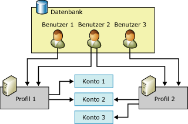

# Konfigurationsobjekte für Datenbank-E-Mail
[!INCLUDE[appliesto-ss-xxxx-xxxx-xxx-md](../../includes/appliesto-ss-xxxx-xxxx-xxx-md.md)] Datenbank-E-Mail verfügt über zwei Konfigurationsobjekte: Mit den Datenbankkonfigurationsobjekten können Sie die Einstellungen konfigurieren, die von Datenbank-E-Mail beim Senden einer E-Mail von der Datenbankanwendung oder vom [!INCLUDE[ssNoVersion](../../includes/ssnoversion-md.md)]-Agent verwendet werden sollen.  
  
-   Datenbank-E-Mail-Konten  
  
-   Datenbank-E-Mail-Profile  
  
  
##   Beziehung der Konfigurationsobjekte für Datenbank-E-Mail  
 In der Abbildung werden zwei Profile, drei Konten und drei Benutzer veranschaulicht. Benutzer 1 kann auf Profil 1 zugreifen. Dieses Profil verwendet Konto 1 und Konto 2. Benutzer 3 kann auf Profil 2 zugreifen. Dieses Profil verwendet Konto 2 und Konto 3. Benutzer 2 kann auf Profil 1 und Profil 2 zugreifen.  
  
   
  
  
##   Datenbank-E-Mail-Konto  
 Ein Datenbank-E-Mail-Konto enthält die Informationen, die Microsoft [!INCLUDE[ssNoVersion](../../includes/ssnoversion-md.md)] zum Senden von E-Mail-Nachrichten an einen SMTP-Server verwendet. Jedes Konto enthält Informationen für einen E-Mail-Server.  
  
 Datenbank-E-Mail unterstützt drei Methoden der Authentifizierung für die Kommunikation mit einem SMTP-Server:  
  
-   Windows-Authentifizierung: Datenbank-E-Mail verwendet dieselben Anmeldeinformationen wie das [!INCLUDE[ssDEnoversion](../../includes/ssdenoversion-md.md)] Windows-Dienstkonto zur Authentifizierung auf dem SMTP-Server.  
  
-   Standardauthentifizierung: Datenbank-E-Mail verwendet den angegebenen Benutzernamen und das angegebene Kennwort zur Authentifizierung auf dem SMTP-Server.  
  
-   Anonyme Authentifizierung: Der SMTP-Server erfordert keinerlei Authentifizierung.  Datenbank-E-Mail verwendet keinerlei Anmeldeinformationen zur Authentifizierung auf dem SMTP-Server.  
  
 Die Kontoinformationen werden in der **msdb** -Datenbank gespeichert. Jedes Konto besteht aus den folgenden Informationen:  
  
-   Der Name des Kontos.  
  
-   Eine Beschreibung des Kontos.  
  
-   Die E-Mail-Adresse des Kontos.  
  
-   Der Anzeigename des Kontos.  
  
-   Die E-Mail-Adresse, die als Antwortinformation für das Konto verwendet werden soll.  
  
-   Der Name des E-Mail-Servers.  
  
-   Der Typ des E-Mail-Servers. Bei [!INCLUDE[msCoName](../../includes/msconame-md.md)] [!INCLUDE[ssNoVersion](../../includes/ssnoversion-md.md)]handelt es sich dabei immer um Simple Mail Transfer Protocol (SMTP).  
  
-   Die Portnummer des E-Mail-Servers  
  
-   Eine Spalte des bit-Datentyps gibt an, ob die Verbindung zum SMTP-Mailserver mithilfe von SSL (Secure Sockets Layer) hergestellt wird.  
  
-   Eine Spalte des bit-Datentyps gibt an, ob die Verbindung zum SMTP-Server mithilfe der für [!INCLUDE[ssDEnoversion](../../includes/ssdenoversion-md.md)]konfigurierten Anmeldeinformationen hergestellt wird.  
  
-   Der Benutzername für die Authentifizierung beim E-Mail-Server, wenn der E-Mail-Server eine Authentifizierung erfordert.  
  
-   Das Kennwort für die Authentifizierung beim E-Mail-Server, wenn der E-Mail-Server eine Authentifizierung erfordert.  
  
 Der Assistent zum Konfigurieren von Datenbank-E-Mail bietet bequeme Möglichkeiten zum Erstellen und Verwalten von Konten. Sie können auch die gespeicherten Konfigurationsprozeduren in **msdb** zum Erstellen und Verwalten von Konten verwenden.  
  
  
##   Datenbank-E-Mail-Profil  
 Ein Datenbank-E-Mail-Profil ist eine sortierte Sammlung zusammengehöriger Datenbank-E-Mail-Konten. In Anwendungen, mit denen E-Mails mithilfe von Datenbank-E-Mail gesendet werden, werden Profile angegeben und Konten nicht direkt verwendet. Das Trennen der Informationen zu den einzelnen E-Mail-Servern von den Objekten, die die Anwendung verwendet, verbessert die Flexibilität und Zuverlässigkeit: Profile stellen automatisches Failover bereit; wenn ein E-Mail-Server nicht reagiert, kann Datenbank-E-Mail E-Mails automatisch an einen anderen E-Mail-Server senden. Datenbankadministratoren können Konten hinzufügen, entfernen oder neu konfigurieren, ohne dass Änderungen am Anwendungscode oder den Auftragsschritten erforderlich sind.  
  
 Über Profile können Datenbankadministratoren auch den E-Mail-Zugriff besser kontrollieren. Die Mitgliedschaft in **DatabaseMailUserRole** ist zum Senden von Datenbank-E-Mail erforderlich. Profile bieten Administratoren bei der Steuerung der Benutzer, die E-Mails senden, und der verwendeten Konten zusätzliche Flexibilität.  
  
 Ein Profil kann öffentlich oder privat sein.  
  
 **Öffentliche Profile** sind für alle Mitglieder der Datenbankrolle **DatabaseMailUserRole** in der **msdb** -Datenbank verfügbar. Damit können Mitglieder der Datenbankrolle **DatabaseMailUserRole** mithilfe des Profils E-Mails versenden.  
  
 **Private Profile** werden für Sicherheitsprinzipale in der **msdb** -Datenbank definiert. Sie ermöglichen nur bestimmten Datenbankbenutzern, -rollen und Mitgliedern der festen Serverrolle **sysadmin** das Senden von E-Mail mithilfe des Profils. Standardmäßig ist ein Profil privat, und der Zugriff darauf kann nur durch Mitglieder der festen Serverrolle **sysadmin** erfolgen. Um ein privates Profil zu verwenden, muss **sysadmin** Benutzern die Berechtigung zum Verwenden des Profils erteilen. Darüber hinaus wird die EXECUTE-Berechtigung für die gespeicherte Prozedur **sp_send_dbmail** nur Mitgliedern von **DatabaseMailUserRole**erteilt. Ein Systemadministrator muss der Datenbankrolle **DatabaseMailUserRole** den Benutzer hinzufügen, damit der Benutzer E-Mail-Nachrichten senden kann.  
  
 Profile verbessern die Zuverlässigkeit in Fällen, in denen ein E-Mail-Server nicht erreichbar ist oder die Nachrichten nicht verarbeiten kann. Jedes im Profil enthaltene Konto besitzt eine Sequenznummer. Über die Sequenznummer wird die Reihenfolge festgelegt, in der Konten im Profil von Datenbank-E-Mail verwendet werden. Bei einer neuen E-Mail-Nachricht verwendet Datenbank-E-Mail das letzte Konto, über das eine Nachricht erfolgreich gesendet wurde, oder – falls noch keine Nachricht gesendet wurde – das Konto mit der niedrigsten Sequenznummer. Wenn dieses Konto fehlschlägt, verwendet Datenbank-E-Mail das Konto mit der nächsthöheren Sequenznummer usw., bis entweder Datenbank-E-Mail die Nachricht erfolgreich versendet oder das Konto mit der höchsten Sequenznummer fehlschlägt. Wenn das Konto mit der höchsten Sequenznummer fehlschlägt, unterbricht die Datenbank-E-Mail die Versuche zum Senden der E-Mail für den Zeitraum, der im **AccountRetryDelay** -Parameter von **sysmail_configure_sp**konfiguriert ist. Danach wird das Senden der E-Mail erneut gestartet, wobei mit der niedrigsten Sequenznummer begonnen wird. Verwenden Sie den **AccountRetryAttempts** -Parameter von **sysmail_configure_sp**, um zu konfigurieren, wie oft der externe Mailprozess versuchen soll, die E-Mail-Nachricht mithilfe der einzelnen Konten im angegebenen Profil zu senden.  
  
 Sind mehrere Konten mit der gleichen Sequenznummer vorhanden, verwendet Datenbank-E-Mail nur eines dieser Konten für eine bestimmte E-Mail-Nachricht. In diesem Fall kann Datenbank-E-Mail nicht sicherstellen, welches der Konten für diese Sequenznummer verwendet wird oder dass für die einzelnen Nachrichten jeweils dasselbe Konto verwendet wird.  
  
  
##   Konfigurationstasks von Datenbank-E-Mail  
 In der folgenden Tabelle werden die Konfigurationstasks von Datenbank-E-Mail beschrieben.  
  
|Konfigurationstask|Themenlink|  
|------------------------|----------------|  
|Beschreibt, wie Datenbank-E-Mail-Konten erstellt werden|[Erstellen eines Kontos für Datenbank-E-Mail](../../relational-databases/database-mail/create-a-database-mail-account.md)|  
|Beschreibt, wie Datenbank-E-Mail-Profile erstellt werden|[Erstellen eines Profils für Datenbank-E-Mail](../../relational-databases/database-mail/create-a-database-mail-profile.md)|  
|Beschreibt, wie Datenbank-E-Mail konfiguriert wird|[Konfigurieren des Datenbank-E-Mail-Features](../../relational-databases/database-mail/configure-database-mail.md)|  
|Beschreibt, wie ein Konfigurationsskript für Datenbank-E-Mail anhand von Vorlagen erstellt wird||  
  
  
##   Zusätzliche Datenbankkonfigurationstasks (gespeicherte Systemprozeduren)  
 Die gespeicherten Prozeduren für das Konfigurieren von Datenbank-E-Mail befinden sich in der **msdb** -Datenbank.  
  
 In den folgenden Tabellen sind die gespeicherten Prozeduren aufgelistet, die zum Konfigurieren und Verwalten von Datenbank-E-Mail verwendet werden.  
  
### Datenbank-E-Mail-Einstellungen  
  
|Name|Beschreibung|  
|----------|-----------------|  
|[sysmail_configure_sp (Transact-SQL)](../../relational-databases/system-stored-procedures/sysmail-configure-sp-transact-sql.md)|Ändert Konfigurationseinstellungen für Datenbank-E-Mail.|  
|[sysmail_help_configure_sp (Transact-SQL)](../../relational-databases/system-stored-procedures/sysmail-help-configure-sp-transact-sql.md)|Zeigt Konfigurationseinstellungen für Datenbank-E-Mail an.|  
  
### Konten und Profile  
  
|Name|Beschreibung|  
|----------|-----------------|  
|[sysmail_add_profileaccount_sp (Transact-SQL)](../../relational-databases/system-stored-procedures/sysmail-add-profileaccount-sp-transact-sql.md)|Fügt einem Datenbank-E-Mail-Profil ein E-Mail-Konto hinzu.|  
|[sysmail_delete_account_sp (Transact-SQL)](../../relational-databases/system-stored-procedures/sysmail-delete-account-sp-transact-sql.md)|Löscht ein Datenbank-E-Mail-Konto.|  
|[sysmail_delete_profile_sp (Transact-SQL)](../../relational-databases/system-stored-procedures/sysmail-delete-profile-sp-transact-sql.md)|Löscht ein Datenbank-E-Mail-Profil.|  
|[sysmail_delete_profileaccount_sp (Transact-SQL)](../../relational-databases/system-stored-procedures/sysmail-delete-profileaccount-sp-transact-sql.md)|Entfernt ein Konto aus einem Datenbank-E-Mail-Profil.|  
|[sysmail_help_account_sp (Transact-SQL)](../../relational-databases/system-stored-procedures/sysmail-help-account-sp-transact-sql.md)|Listet Informationen zu Datenbank-E-Mail-Konten auf.|  
|[sysmail_help_profile_sp (Transact-SQL)](../../relational-databases/system-stored-procedures/sysmail-help-profile-sp-transact-sql.md)|Listet Informationen zu einem oder mehreren Datenbank-E-Mail-Profilen auf.|  
|[sysmail_help_profileaccount_sp (Transact-SQL)](../../relational-databases/system-stored-procedures/sysmail-help-profileaccount-sp-transact-sql.md)|Listet die Konten auf, die einem oder mehreren Datenbank-E-Mail-Profilen zugeordnet sind.|  
|[sysmail_update_account_sp (Transact-SQL)](../../relational-databases/system-stored-procedures/sysmail-update-account-sp-transact-sql.md)|Aktualisiert die Informationen in einem vorhandenen Datenbank-E-Mail-Konto.|  
|[sysmail_update_profile_sp (Transact-SQL)](../../relational-databases/system-stored-procedures/sysmail-update-profile-sp-transact-sql.md)|Ändert die Beschreibung oder den Namen eines Datenbank-E-Mail-Profils.|  
|[sysmail_update_profileaccount_sp (Transact-SQL)](../../relational-databases/system-stored-procedures/sysmail-update-profileaccount-sp-transact-sql.md)|Aktualisiert die Sequenznummer eines Kontos innerhalb eines Datenbank-E-Mail-Profils.|  
  
### Sicherheit  
  
|Name|Beschreibung|  
|----------|-----------------|  
|[sysmail_add_principalprofile_sp (Transact-SQL)](../../relational-databases/system-stored-procedures/sysmail-add-principalprofile-sp-transact-sql.md)|Erteilt einem Datenbankprinzipal die Berechtigung, ein Datenbank-E-Mail-Profil zu verwenden.|  
|[sysmail_delete_principalprofile_sp (Transact-SQL)](../../relational-databases/system-stored-procedures/sysmail-delete-principalprofile-sp-transact-sql.md)|Entfernt die Berechtigung eines Datenbankbenutzers, ein öffentliches oder privates Datenbank-E-Mail-Profil zu verwenden.|  
|[sysmail_help_principalprofile_sp (Transact-SQL)](../../relational-databases/system-stored-procedures/sysmail-help-principalprofile-sp-transact-sql.md)|Listet Informationen zum Datenbank-E-Mail-Profil für einen bestimmten Datenbankbenutzer auf.|  
|[sysmail_update_principalprofile_sp (Transact-SQL)](../../relational-databases/system-stored-procedures/sysmail-update-principalprofile-sp-transact-sql.md)|Aktualisiert die Berechtigungsinformationen für einen bestimmten Datenbankbenutzer.|  
  
### Systemstatus  
  
|Name|Beschreibung|  
|----------|-----------------|  
|[sysmail_start_sp &#40;Transact-SQL&#41;](../../relational-databases/system-stored-procedures/sysmail-start-sp-transact-sql.md)|Startet das externe Datenbank-E-Mail-Programm und die zugehörige SQL Service Broker-Warteschlange.|  
|[sysmail_stop_sp &#40;Transact-SQL&#41;](../../relational-databases/system-stored-procedures/sysmail-stop-sp-transact-sql.md)|Beendet das externe Datenbank-E-Mail-Programm und die zugehörige SQL Service Broker-Warteschlange.|  
|[sysmail_help_status_sp &#40;Transact-SQL&#41;](../../relational-databases/system-stored-procedures/sysmail-help-status-sp-transact-sql.md)|Zeigt an, ob Datenbank-E-Mail gestartet wird.|  
  
##   Zusätzliche Referenzen  
  
-   [Datenbank-E-Mail-Protokoll und -Überwachung](../../relational-databases/database-mail/database-mail-log-and-audits.md)  
  
  
  
