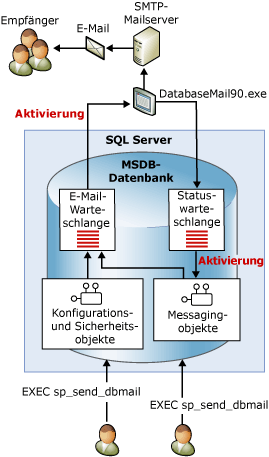

# Datenbank-E-Mail
  Datenbank-E-Mail bietet eine Unternehmenslösung, die zum Senden von E-Mail-Nachrichten mit [!INCLUDE[ssDEnoversion](../../includes/ssdenoversion-md.md)] verwendet werden kann. Mit Datenbank-E-Mail können Datenbankanwendungen E-Mail-Nachrichten an Benutzer senden. Diese Nachrichten können neben Abfrageergebnissen auch Dateien von anderen Ressourcen im Netzwerk enthalten.  
  
 **In diesem Thema:**  
  
-   [Vorteile der Verwendung von Datenbank-E-Mail](#Benefits)  
  
-   [Architektur der Datenbank-E-Mail](#VisualElement)  
  
-   [Einführung in Datenbank-E-Mail-Komponenten](#ComponentsAndConcepts)  
  
-   [Verwandte Inhalte](#RelatedContent)  
  
##   Vorteile der Verwendung von Datenbank-E-Mail  
 Datenbank-E-Mail zeichnet sich durch Zuverlässigkeit, Skalierbarkeit, Sicherheit sowie Unterstützbarkeit aus.  
  
### Zuverlässigkeit  
  
-   Datenbank-E-Mail verwendet zum Senden von E-Mail das standardmäßige SMTP (Simple Mail Transfer Protocol). Sie können Datenbank-E-Mail auch dann verwenden, wenn auf dem Computer mit [!INCLUDE[ssNoVersion](../../includes/ssnoversion-md.md)] kein Client für erweitertes MAPI installiert ist.  
  
-   Prozessisolierung. Zur Verringerung der Auswirkungen auf [!INCLUDE[ssNoVersion](../../includes/ssnoversion-md.md)] wird die Komponente zur Übermittlung von E-Mail in einem separaten Prozess, außerhalb von [!INCLUDE[ssNoVersion](../../includes/ssnoversion-md.md)], ausgeführt. [!INCLUDE[ssNoVersion](../../includes/ssnoversion-md.md)] fügt E-Mail-Nachrichten auch dann weiter in die Warteschlange ein, wenn der externe Prozess beendet wird oder einen Fehler erzeugt. Die Nachrichten in der Warteschlange werden gesendet, sobald der externe Prozess oder der SMTP-Server online geschaltet werden.  
  
-   Failoverkonten. Mit den Profilen von Datenbank-E-Mail können Sie mehrere SMTP-Server angeben. Falls ein SMTP-Server nicht verfügbar ist, können die E-Mail-Nachrichten an einen anderen SMTP-Server übermittelt werden.  
  
-   Clusterunterstützung. Datenbank-E-Mail ist clusterabhängig und wird auf einem Cluster vollständig unterstützt.  
  
### Skalierbarkeit  
  
-   Übermittlung im Hintergrund: Datenbank-E-Mail stellt die Übermittlung im Hintergrund bzw. asynchrone Übermittlung bereit. Wenn Sie zum Senden einer Nachricht **sp_send_dbmail** aufrufen, fügt Datenbank-E-Mail eine Anforderung zu einer [!INCLUDE[ssSB](../../includes/sssb-md.md)]-Warteschlange hinzu. Die gespeicherte Prozedur liefert sofort eine Rückgabe. Die externe E-Mail-Komponente empfängt die Anforderung und übermittelt die E-Mail-Nachricht.  
  
-   Mehrere Profile: Mit Datenbank-E-Mail können Sie innerhalb einer [!INCLUDE[ssNoVersion](../../includes/ssnoversion-md.md)]-Instanz mehrere Profile erstellen. Wahlweise können Sie auch das Profil auswählen, mit dem Datenbank-E-Mail Nachrichten senden soll.  
  
-   Mehrere Konten: Alle Profile können mehrere Failoverkonten enthalten. Sie können verschiedene Profile mit verschiedenen Konten konfigurieren, um E-Mail-Nachrichten über mehrere E-Mail-Server zu verteilen.  
  
-   64-Bit-Kompatibilität: Datenbank-E-Mail wird in 64-Bit-Versionen von [!INCLUDE[ssNoVersion](../../includes/ssnoversion-md.md)] vollständig unterstützt.  
  
### Sicherheit  
  
-   Standardmäßig deaktiviert: Um die Oberfläche von [!INCLUDE[ssNoVersion](../../includes/ssnoversion-md.md)]zu verringern, sind die gespeicherten Prozeduren von Datenbank-E-Mail standardmäßig deaktiviert.  
  
-   E-Mail-Sicherheit: Zum Senden von Datenbank-E-Mail müssen Sie Mitglied der **DatabaseMailUserRole** -Datenbankrolle in der **msdb** -Datenbank sein.  
  
-   Profilsicherheit: Datenbank-E-Mail erzwingt die Sicherheit von Mailprofilen. Wählen Sie die Benutzer oder Gruppen der **msdb** -Datenbank aus, die Zugriff auf ein Profil von Datenbank-E-Mail besitzen. Sie können entweder nur bestimmten oder allen Benutzern von **msdb**Zugriff erteilen. Durch private Profile wird der Zugriff auf eine bestimmte Liste von Benutzern eingeschränkt. Öffentliche Profile sind für alle Benutzer einer Datenbank verfügbar.  
  
-   Kontrolle der Anlagengröße: Datenbank-E-Mail erzwingt ein konfigurierbares Limit für die Größe von Anlagendateien. Sie können dieses Limit mithilfe der gespeicherten Prozedur [sysmail_configure_sp](../../relational-databases/system-stored-procedures/sysmail-configure-sp-transact-sql.md) ändern.  
  
-   Unzulässige Dateierweiterungen: Datenbank-E-Mail verwaltet eine Liste mit unzulässigen Dateierweiterungen. Dateien, die eine in der Liste aufgeführte Erweiterung besitzen, können nicht angefügt werden. Sie können diese Liste mithilfe von sysmail_configure_sp ändern.  
  
-   Datenbank-E-Mai wird unter dem [!INCLUDE[ssNoVersion](../../includes/ssnoversion-md.md)]-Moduldienstkonto ausgeführt. Um eine Datei aus einem Ordner einer E-Mail anhängen zu können, muss das [!INCLUDE[ssNoVersion](../../includes/ssnoversion-md.md)] -Modulkonto über die Berechtigungen zum Zugriff auf den Ordner mit der Datei verfügen.  
  
### Unterstützbarkeit  
  
-   Integrierte Konfiguration: Datenbank-E-Mail verwaltet die Informationen für E-Mail-Konten in [!INCLUDE[ssDEnoversion](../../includes/ssdenoversion-md.md)]. Mailprofile müssen daher nicht in einer externen Clientanwendung verwaltet werden. Der Assistent zum Konfigurieren von Datenbank-E-Mail stellt eine geeignete Benutzeroberfläche zum Konfigurieren von Datenbank-E-Mail bereit. Sie können die Konfigurationen für Datenbank-E-Mail auch mithilfe von [!INCLUDE[tsql](../../includes/tsql-md.md)]erstellen und verwalten.  
  
-   Anmeldung. Datenbank-E-Mail protokolliert die E-Mail-Aktivität in [!INCLUDE[ssNoVersion](../../includes/ssnoversion-md.md)], dem Microsoft Windows-Anwendungsereignisprotokoll und in Tabellen in der **msdb**-Datenbank.  
  
-   Überwachung: Datenbank-E-Mail speichert Kopien von Nachrichten und Anlagen, die innerhalb der **msdb** -Datenbank gesendet wurden. Sie können die Verwendung von Datenbank-E-Mail auf einfache Weise überwachen und die gespeicherten Nachrichten überprüfen.  
  
-   Unterstützung von HTML: Mit Datenbank-E-Mail können Sie E-Mail im HTML-Format senden.  
  
 [&#91;Nach oben&#93;](#Top)  
  
##   Architektur der Datenbank-E-Mail  
 Datenbank-E-Mail wurde basierend auf einer Warteschlangenarchitektur entwickelt, in der Service Broker-Technologien zum Einsatz kommen. Wenn Benutzer **sp_send_dbmail** ausführen, fügt die gespeicherte Prozedur ein Element in die E-Mail-Warteschlange ein und erstellt einen Datensatz, in dem die E-Mail-Nachricht enthalten ist. Durch das Einfügen des neuen Eintrags in die E-Mail-Warteschlange wird der externe Prozess von Datenbank-E-Mail (DatabaseMail.exe) gestartet. Der externe Prozess liest die E-Mail-Informationen und sendet die E-Mail-Nachricht an den entsprechenden E-Mail-Server bzw. an mehrere E-Mail-Server. Der externe Prozess fügt für das Ergebnis des Sendevorgangs ein Element in die Statuswarteschlange ein. Durch das Einfügen des neuen Eintrags in die Statuswarteschlange wird eine interne gespeicherte Prozedur gestartet, mit der der Status der E-Mail-Nachricht aktualisiert wird. Zusätzlich zum Speichern der gesendeten (oder nicht gesendeten) E-Mail-Nachricht werden von Datenbank-E-Mail auch alle E-Mail-Anhänge in den Systemtabellen gespeichert. In den Sichten von Datenbank-E-Mail wird der Status der Nachrichten zur Problembehandlung gezeigt. Die Warteschlange von Datenbank-E-Mail kann mithilfe gespeicherter Prozeduren verwaltet werden.  
  
   
  
 [&#91;Nach oben&#93;](#Top)  
  
##   Einführung in Datenbank-E-Mail-Komponenten  
 In Datenbank-E-Mail sind die folgenden Hauptkomponenten enthalten:  
  
-   Konfigurations- und Sicherheitskomponenten  
  
     Datenbank-E-Mail speichert die Konfigurations- und Sicherheitsinformationen in der **msdb** -Datenbank. Konfigurations- und Sicherheitsobjekte erstellen Profile und Konten, die von Datenbank-E-Mail verwendet werden.  
  
-   Messagingkomponenten  
  
     Die **msdb**-Datenbank fungiert als Mailhost-Datenbank, in der die Messagingobjekte enthalten sind, mit denen Datenbank-E-Mail Nachrichten sendet. Zu diesen Objekten zählen die gespeicherte Prozedur **sp_send_dbmail** und die Datenstrukturen mit Informationen zu den Nachrichten.  
  
-   Ausführbare Datei von Datenbank-E-Mail  
  
     Die ausführbare Datei von Datenbank-E-Mail ist ein externes Programm, das Nachrichten aus einer Warteschlange in der **msdb**-Datenbank liest und an E-Mail-Server sendet.  
  
-   Protokollierungs- und Überwachungskomponenten  
  
     Datenbank-E-Mail zeichnet die Protokollinformationen in der **msdb** -Datenbank und im [!INCLUDE[msCoName](../../includes/msconame-md.md)] Windows Anwendungsereignisprotokoll auf.  
  
 **Konfigurieren des Agents zur Verwendung von Datenbank-E-Mail:**  
  
 Der SQL Server-Agent kann zur Verwendung von Datenbank-E-Mail konfiguriert werden. Dies ist für Warnbenachrichtigungen und die automatische Benachrichtigung über den Abschluss von Aufträgen erforderlich.  
  
> [!WARNING]  
>  Einzelne Auftragsschritte innerhalb eines Auftrags können ebenfalls E-Mails senden, ohne dass dazu der [!INCLUDE[ssNoVersion](../../includes/ssnoversion-md.md)]-Agent zur Verwendung von Datenbank-E-Mail konfiguriert werden muss. Ein [!INCLUDE[tsql](../../includes/tsql-md.md)]-Auftragsschritt kann beispielsweise Datenbank-E-Mail verwenden, um die Ergebnisse einer Abfrage an eine Reihe von Empfängern zu senden.  
  
 Sie können den [!INCLUDE[ssNoVersion](../../includes/ssnoversion-md.md)]-Agent so konfigurieren, dass E-Mail-Nachrichten in folgenden Fällen an vordefinierte Operatoren gesendet werden:  
  
-   Eine Warnung wird ausgelöst. Warnungen können so konfiguriert werden, dass Benachrichtigungen über bestimmte Ereignisse per E-Mail gesendet werden. Warnungen können beispielsweise so konfiguriert werden, dass ein Operator über bestimmte Datenbankereignisse oder Betriebssystemzustände benachrichtigt wird, die umgehende Maßnahmen erfordern. Weitere Informationen zum Konfigurieren von Warnungen finden Sie unter [Warnungen](../../ssms/agent/alerts.md).  
  
-   Ein geplanter Task, z. B. eine Datenbanksicherung oder ein Replikationsereignis, wird erfolgreich durchgeführt oder erzeugt einen Fehler. Sie können mithilfe von [!INCLUDE[ssNoVersion](../../includes/ssnoversion-md.md)]-Agent-Mail beispielsweise Operatoren benachrichtigen, wenn ein Fehler bei der Verarbeitung am Monatsende auftritt.  
  
 [&#91;Nach oben&#93;](#Top)  
  
##   Themen zu Datenbank-E-Mail-Komponenten  
  
-   [Konfigurationsobjekte für Datenbank-E-Mail](../../relational-databases/database-mail/database-mail-configuration-objects.md)  
  
-   [Messagingobjekte für Datenbank-E-Mail](../../relational-databases/database-mail/database-mail-messaging-objects.md)  
  
-   [Externes Datenbank-E-Mail-Programm](../../relational-databases/database-mail/database-mail-external-program.md)  
  
-   [Datenbank-E-Mail-Protokoll und -Überwachung](../../relational-databases/database-mail/database-mail-log-and-audits.md)  
  
-   [Konfigurieren von SQL Server-Agent-Mail zum Verwenden von Datenbank-E-Mails](../../relational-databases/database-mail/configure-sql-server-agent-mail-to-use-database-mail.md)  
  
 [&#91;Nach oben&#93;](#Top)  
  
  