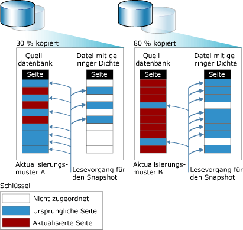

# Datenbank-Momentaufnahmen (SQL Server)
  Eine Datenbankmomentaufnahme ist eine schreibgeschützte statische Sicht einer [!INCLUDE[ssNoVersion](../../includes/ssnoversion-md.md)] -Datenbank (die *Quelldatenbank*). Die Datenbankmomentaufnahme ist hinsichtlich der Transaktionen mit der Quelldatenbank zum Zeitpunkt der Momentaufnahmeerstellung konsistent. Eine Datenbankmomentaufnahme befindet sich immer auf derselben Serverinstanz wie ihre Quelldatenbank. Beim Aktualisieren der Quelldatenbank wird auch die Datenbankmomentaufnahme aktualisiert. Daher wird wahrscheinlich der verfügbare Speicherplatz aufgebraucht, je länger eine Datenbankmomentaufnahme besteht.  
  
 In einer bestimmten Quelldatenbank können mehrere Momentaufnahmen vorhanden sein. Jede Datenbankmomentaufnahme ist so lange vorhanden, bis sie explizit vom Datenbankbesitzer gelöscht wird.  
  
> [!NOTE]  
>  Datenbank-Momentaufnahmen stehen in keinerlei Zusammenhang mit Momentaufnahmesicherungen, Momentaufnahmeisolationen von Transaktionen oder Momentaufnahmereplikationen.  
  
 **In diesem Thema:**  
  
-   [Übersicht über die Funktionen](#FeatureOverview)  
  
-   [Vorteile der Datenbankmomentaufnahmen](#Benefits)  
  
-   [Begriffe und Definitionen](#TermsAndDefinitions)  
  
-   [Voraussetzungen und Einschränkungen bei Datenbankmomentaufnahmen](#LimitationsRequirements)  
  
-   [Verwandte Aufgaben](#RelatedTasks)  
  
##   Übersicht über die Funktionen  
 Datenbankmomentaufnahmen arbeiten auf der Ebene der Datenseiten. Bevor eine Seite der Quellendatenbank zum ersten Mal geändert wird, wird die Originalseite der Quellendatenbank auf die Momentaufnahme kopiert. In der Momentaufnahme wird die Originalseite gespeichert, wodurch die Datensätze in dem Zustand erhalten werden, wie sie zum Zeitpunkt der Momentaufnahmeerstellung vorhanden waren. Der gleiche Vorgang wird für jede Seite wiederholt, die zum ersten Mal geändert wird. Für den Benutzer scheint sich eine Datenbankmomentaufnahme niemals zu ändern, weil von Lesevorgängen auf einer Datenbankmomentaufnahme immer auf die Originaldatenseiten zugegriffen wird, unabhängig von deren Speicherort.  
  
 Um die kopierten Originalseiten zu speichern, wird von der Momentaufnahme mindestens eine *Datei mit geringer Dichte*verwendet. Ursprünglich ist eine Datei mit geringer Dichte im Wesentlichen eine leere Datei, die keine Benutzerdaten enthält und für die noch kein Speicherplatz für Benutzerdaten auf einem Speichermedium zugeordnet worden ist. Je mehr Seiten in der Quellendatenbank aktualisiert werden, desto größer wird die Datei. Die folgende Abbildung veranschaulicht die Auswirkungen zweier unterschiedlicher Updatemuster auf die Größe einer Momentaufnahme. Das Updatemuster A spiegelt eine Umgebung wider, in der nur 30 Prozent der Originalseiten während der Lebensspanne der Momentaufnahme aktualisiert werden. Das Updatemuster B spiegelt eine Umgebung wider, in der 80 Prozent der Originalseiten während der Lebensspanne der Momentaufnahme aktualisiert werden.  
  
   
  
##   Vorteile der Datenbankmomentaufnahmen  
  
-   Momentaufnahmen können zur Berichterstellung verwendet werden.  
  
     Datenbankmomentaufnahmen können auch von den Clients abgefragt werden und sind daher beim Schreiben von Berichten hilfreich, die auf den zum Zeitpunkt der Momentaufnahmeerstellung verfügbaren Daten basieren.  
  
-   Verwalten von Vergangenheitsdaten zur Berichterstellung.  
  
     Eine Momentaufnahme kann Benutzerzugriff auf Daten eines bestimmten Zeitpunkts erweitern. Beispielsweise können Sie eine Datenbankmomentaufnahme am Ende einer bestimmten Periode (z. B. ein Geschäftsquartal) erstellen, um später auf dieser Grundlage einen Bericht zu generieren. Auf diese Weise können Sie Quartalsabschlussberichte in der Momentaufnahme ausführen. Bei ausreichendem Speicherplatz können Sie diese Quartalsabschluss-Momentaufnahmen für unbestimmte Zeit aufbewahren. Darüber hinaus können Sie zu den Ergebnissen dieser Quartale Abfragen ausführen, z. B. um die Leistung des Unternehmens zu ermitteln.  
  
-   Verwenden einer Spiegeldatenbank, die aus Gründen der Verfügbarkeit verwaltet wird, für die ausgelagerte Berichterstellung.  
  
     Wenn Sie Datenbankmomentaufnahmen mit Datenbankspiegelungen verwenden, können Sie die auf dem Spiegelserver gespeicherten Daten für die Berichterstellung zugreifbar machen. Darüber hinaus können Sie in der Spiegeldatenbank Abfragen ausführen und so auf dem Prinzipal Ressourcen freigeben. Weitere Informationen finden Sie unter [Datenbankspiegelung und Datenbankmomentaufnahmen &#40;SQL Server&#41;](../../database-engine/database-mirroring/database-mirroring-and-database-snapshots-sql-server.md)verwendet.  
  
-   Schützen der Daten vor administrativen Fehlern.  
  
-   Sie können bei einem Benutzerfehler auf einer Quellendatenbank die Quellendatenbank in den Zustand zurückversetzen, in der sie zum Zeitpunkt der Erstellung einer bestimmten Datenbankmomentaufnahme gewesen ist. Der Datenverlust beschränkt sich auf Updates der Datenbank, die nach der Erstellung der Momentaufnahme vorgenommen wurden.  
  
     Beispiel: Vor dem Ausführen wesentlicher Updates, wie beispielsweise eines Massenupdates oder einer Schemaänderung, sollten Sie die Daten sichern, indem Sie eine Datenbankmomentaufnahme von der Datenbank erstellen. Im Falle eines Fehlers können Sie die Datenbank mithilfe des Snapshots in dem Status wiederherstellen, der bei Erstellen des Snapshots vorlag. Diese Art der Wiederherstellung kann für diesen Zweck potenziell schneller ausgeführt werden als die Wiederherstellung von Daten aus einer Sicherung. Allerdings können Sie anschließend keinen Rollforward ausführen.  
  
    > [!IMPORTANT]  
    >  Die Wiederherstellung kann nicht für Offlinedatenbanken oder für beschädigte Datenbanken verwendet werden. Regelmäßige Sicherungen und Tests des Wiederherstellungsplans sind deshalb für den Schutz einer Datenbank erforderlich.  
  
    > [!NOTE]  
    >  Datenbankmomentaufnahmen sind von der Quelldatenbank abhängig. Die Wiederherstellung von Datenbanken mithilfe von Datenbankmomentaufnahmen stellt daher keinen Ersatz für eine reguläre Sicherungs- und Wiederherstellungsstrategie dar. Daher ist es wichtig, dass Sie die Sicherungen wie geplant ausführen. Wenn Sie die Quelldatenbank zu dem Zeitpunkt wiederherstellen müssen, an dem Sie eine Datenbankmomentaufnahme erstellt haben, implementieren Sie eine Sicherungsrichtlinie, die Ihnen dies ermöglicht.  
  
-   Schützen der Daten vor Benutzerfehlern.  
  
     Indem Sie regelmäßig Datenbankmomentaufnahmen erstellen, können Sie die Auswirkungen von schwerwiegenden Benutzerfehlern, z. B. eine gelöschte Tabelle, verringern. Bei einer hohen Sicherheitsstufe sollten Sie für einen ausreichend großen Zeitraum eine Reihe von Datenbankmomentaufnahmen erstellen, sodass die meisten Benutzerfehler erkannt werden und entsprechend reagiert werden kann. Beispielsweise können Sie je nach den verfügbaren Datenträgerressourcen für einen 24-Stunden-Zyklus 6 bis 12 parallele Momentaufnahmen verwalten. Immer wenn eine neue Momentaufnahme erstellt wird, kann die jeweils älteste Momentaufnahme gelöscht werden.  
  
    -   Bei der Wiederherstellung im Falle eines Benutzerfehlers können Sie die Datenbank in dem Status des Snapshots wiederherstellen, der unmittelbar vor Auftreten des Fehlers erstellt wurde. Diese Art der Wiederherstellung kann für diesen Zweck potenziell schneller ausgeführt werden als die Wiederherstellung von Daten aus einer Sicherung. Allerdings können Sie anschließend keinen Rollforward ausführen.  
  
    -   Wahlweise können Sie eine gelöschte Tabelle oder andere verlorene Daten auch auf Basis der in einer Momentaufnahme verfügbaren Informationen wiederherstellen. Beispielsweise können Sie die Daten aus der Momentaufnahme in die Datenbank massenkopieren und die Daten manuell mit den in der Datenbank gespeicherten Daten zusammenführen.  
  
    > [!NOTE]  
    >  Die jeweiligen Gründe für die Verwendung von Datenbankmomentaufnahmen entscheiden darüber, wie viele gleichzeitige Momentaufnahmen von einer Datenbank benötigt werden, wie regelmäßig eine neue Momentaufnahme erstellt wird und wie lange eine Momentaufnahme aufbewahrt wird.  
  
-   Verwalten einer Testdatenbank  
  
     In einer Testumgebung kann es hilfreich sein, wenn beim wiederholten Ausführen eines Testprotokolls die Datenbank zu Beginn jeder Testrunde immer dieselben Daten enthält. Vor der ersten Testrunde kann ein Anwendungsentwickler oder -tester eine Datenbankmomentaufnahme für die Testdatenbank erstellen. Nach jeder Testrunde kann die Datenbank durch Wiederherstellen des Datenbankmomentaufnahmen schnell wieder in den früheren Zustand zurückversetzt werden.  
  
##   Begriffe und Definitionen  
 Datenbank-Momentaufnahme  
 Eine im Hinblick auf Transaktionen konsistente, schreibgeschützte statische Sicht einer Datenbank (die Quelldatenbank).  
  
 Quelldatenbank  
 Bei einer Datenbankmomentaufnahme die Datenbank, für die die Momentaufnahme erstellt wurde. Datenbankmomentaufnahmen sind von der Quelldatenbank abhängig. Die Momentaufnahmen einer Datenbank müssen sich auf der gleichen Serverinstanz wie die Datenbank selbst befinden. Ist diese Datenbank außerdem aus irgendeinem Grund nicht verfügbar, stehen die zugehörigen Datenbankmomentaufnahmen ebenfalls nicht zur Verfügung.  
  
 Datei mit geringer Dichte  
 Eine vom NTFS-Dateisystem bereitgestellte Datei, die so verarbeitet wird, dass sie viel weniger Speicherplatz benötigt als bei gewöhnlicher Verarbeitung. Eine Datei mit geringer Dichte wird zum Speichern von in eine Datenbankmomentaufnahme kopierten Seiten verwendet. Unmittelbar nach dem Erstellen beanspruchen Dateien mit geringer Dichte nur wenig Speicherplatz. Während Daten in eine Datenbankmomentaufnahme geschrieben werden, ordnet NTFS der entsprechenden Datei mit geringer Dichte schrittweise den Speicherplatz zu.  
  
##   Voraussetzungen und Einschränkungen bei Datenbankmomentaufnahmen  
 **In diesem Abschnitt:**  
  
-   [Erforderliche Komponenten](#Prerequisites)  
  
-   [Einschränkungen für die Quelldatenbank](#LimitsOnSourceDb)  
  
-   [Einschränkungen für Datenbankmomentaufnahmen](#LimitsOnDbSS)  
  
-   [Anforderungen an den Datenträgerspeicher](#DiskSpace)  
  
-   [Datenbankmomentaufnahmen mit Offlinedateigruppen](#OfflineFGs)  
  
###   Erforderliche Komponenten  
 Die Quelldatenbank, die ein Wiederherstellungsmodell verwenden kann, muss die folgenden Voraussetzungen erfüllen:  
  
-   Die Serverinstanz muss auf einer Edition von [!INCLUDE[ssNoVersion](../../includes/ssnoversion-md.md)] ausgeführt werden, die Datenbankmomentaufnahmen unterstützt. Weitere Informationen finden Sie unter [Von den SQL Server 2016-Editionen unterstützte Funktionen](~/sql-server/editions-and-supported-features-for-sql-server-2016.md).  
  
-   Die Quelldatenbank muss online sein, es sei denn, bei der Datenbank handelt es sich um eine Spiegeldatenbank innerhalb einer Datenbank-Spiegelungssitzung.  
  
-   Sie können auf jeder primären oder sekundären Datenbank in einer Verfügbarkeitsgruppe eine Datenbankmomentaufnahme erstellen. Die Replikatrolle muss entweder PRIMARY oder SECONDARY sein und darf nicht den Status RESOLVING aufweisen.  
  
     Der Datenbanksynchronisierungsstatus sollte SYNCHRONIZING oder SYNCHRONIZED sein, wenn Sie eine Datenbankmomentaufnahme erstellen. Datenbankmomentaufnahmen können jedoch auch erstellt werden, wenn der Datenbanksynchronisierungsstatus NOT SYNCHRONIZING lautet.  
  
     Weitere Informationen finden Sie unter [Datenbankmomentaufnahmen bei Always On-Verfügbarkeitsgruppen (SQL Server)](../../database-engine/availability-groups/windows/database-snapshots-with-always-on-availability-groups-sql-server.md).  
  
-   Zum Erstellen einer Datenbankmomentaufnahme für die Spiegeldatenbank muss sich die Datenbank im synchronisierten Spiegelungsstatus befinden.  
  
-   Die Quelldatenbank kann nicht als skalierbare freigegebene Datenbank konfiguriert werden.  

-   Die Quelldatenbank darf keine MEMORY_OPTIMIZED_DATA-Dateigruppe enthalten.  Weitere Informationen finden Sie unter [Nicht unterstützte SQL Server-Funktionen für In-Memory OLTP](../../relational-databases/in-memory-oltp/unsupported-sql-server-features-for-in-memory-oltp.md).
  
> [!NOTE]  
>  Alle Wiederherstellungsmodelle unterstützen Datenbankmomentaufnahmen.  
  
###   Einschränkungen für die Quelldatenbank  
 Solange eine Datenbankmomentaufnahme vorhanden ist, sind die folgenden Einschränkungen für die Quelldatenbank der Momentaufnahme vorhanden:  
  
-   Die Datenbank kann nicht gelöscht, getrennt oder wiederhergestellt werden.  
  
    > [!NOTE]  
    >  Das Sichern der Quelldatenbank arbeitet normal. Datenbankmomentaufnahmen haben hierauf keine Auswirkungen.  
  
-   Die Leistung ist aufgrund einer Erhöhung der E/A-Vorgänge in der Quelldatenbank reduziert. Diese Erhöhung wird dadurch verursacht, dass bei jeder Aktualisierung einer Seite ein Kopie-bei-Schreibvorgang in der Momentaufnahme ausgeführt wird.  
  
-   In der Quelldatenbank oder in den Momentaufnahmen können keine Dateien gelöscht werden.  
  
###   Einschränkungen für Datenbankmomentaufnahmen  
 Für Datenbankmomentaufnahmen gelten die folgenden Einschränkungen:  
  
-   Eine Datenbankmomentaufnahme muss auf der gleichen Serverinstanz erstellt und gespeichert werden, auf der sich auch die Quelldatenbank befindet.  
  
-   Datenbankmomentaufnahmen gelten immer für die gesamte Datenbank.  
  
-   Datenbankmomentaufnahmen sind von der Quelldatenbank abhängig und sind kein redundanter Speicher. Sie schützen nicht vor Datenträgerfehlern oder anderen Formen der Beschädigung. Die Wiederherstellung von Datenbanken mithilfe von Datenbankmomentaufnahmen stellt daher keinen Ersatz für eine reguläre Sicherungs- und Wiederherstellungsstrategie dar. Daher ist es wichtig, dass Sie die Sicherungen wie geplant ausführen. Wenn Sie die Quelldatenbank zu dem Zeitpunkt wiederherstellen müssen, an dem Sie eine Datenbankmomentaufnahme erstellt haben, implementieren Sie eine Sicherungsrichtlinie, die Ihnen dies ermöglicht.  
  
-   Wenn eine Seite, die gerade in der Quelldatenbank aktualisiert wird, mithilfe von Push in eine Momentaufnahme übertragen wird und für dei Momentaufnahme dabei nicht genügend Speicherplatz vorhanden ist oder ein anderer Fehler in der Momentaufnahme auftritt, wird die Momentaufnahme fehlerverdächtig und muss gelöscht werden.  
  
-   Momentaufnahmen sind schreibgeschützt. Da sie schreibgeschützt sind, können sie nicht aktualisiert werden. Deshalb sind Datenbankmomentaufnahmen nach einer Aktualisierung nicht mehr gültig.  
  
-   Momentaufnahmen der Datenbanken **model**, **master**und **tempdb** sind nicht zulässig.  
  
-   Sie können die Spezifikationen der Datenbankmomentaufnahmedateien nicht ändern.  
  
-   Sie können in einer Datenbankmomentaufnahme keine Dateien löschen.  
  
-   Sie können Datenbankmomentaufnahmen nicht sichern oder wiederherstellen.  
  
-   Sie können Datenbankmomentaufnahmen nicht anfügen oder trennen.  
  
-   Sie können keine Datenbankmomentaufnahmen auf Partitionen mit dem FAT32-Dateisystem oder auf RAW-Partitionen erstellen. Die von Datenbankmomentaufnahmen verwendeten Dateien mit geringer Dichte werden vom NTFS-Dateisystem bereitgestellt.  
  
-   Die Volltextindizierung wird für Datenbankmomentaufnahmen nicht unterstützt. Volltextkataloge werden nicht von der Quelldatenbank aus weitergegeben.  
  
-   Eine Datenbankmomentaufnahme erbt die Sicherheitseinschränkungen seiner Quelldatenbank zum Zeitpunkt der Erstellung der Momentaufnahme. Da Momentaufnahmen schreibgeschützt sind, können geerbte Berechtigungen nicht geändert werden, und an der Quelle vorgenommene Berechtigungsänderungen werden nicht in vorhandenen Momentaufnahmen wiedergegeben.  
  
-   Eine Momentaufnahme gibt stets den Status von Dateigruppen zum Zeitpunkt der Erstellung der Momentaufnahmen wieder: Onlinedateigruppen bleiben online und Offlinedateigruppen offline. Weitere Informationen finden Sie unter "Datenbankmomentaufnahmen mit Offlinedateigruppen" weiter unten in diesem Thema.  
  
-   Wenn eine Quelldatenbank den Status RECOVERY_PENDING erhält, kann auf ihre Datenbankmomentaufnahmen möglicherweise nicht mehr zugegriffen werden. Nachdem das Problem mit der Quelldatenbank gelöst wurde, sollten ihre Momentaufnahmen jedoch wieder verfügbar werden.  
  
-   Die Wiederherstellung wird für schreibgeschützte oder komprimierte NTFS-Dateien in der Datenbank nicht unterstützt.  Wiederherstellungsversuche für eine Datenbank mit diesen Typen von Dateigruppen schlagen fehl.  
  
-   In einer Protokollversandkonfiguration können Datenbankmomentaufnahmen nur für die primäre Datenbank erstellt werden, nicht für eine sekundäre Datenbank. Falls Sie die Rollen zwischen der primären Serverinstanz und einer sekundären Serverinstanz vertauschen, müssen Sie alle Datenbankmomentaufnahmen löschen, bevor Sie die primäre Datenbank als sekundäre Datenbank einrichten können.  
  
-   Eine Datenbankmomentaufnahme kann nicht als skalierbare freigegebene Datenbank konfiguriert werden.  
  
-   FILESTREAM-Dateigruppen werden von Datenbankmomentaufnahmen nicht unterstützt. Wenn in einer Quelldatenbank FILESTREAM-Dateigruppen vorhanden sind, werden diese in den entsprechenden Datenbankmomentaufnahmen als offline markiert, und die Datenbankmomentaufnahmen können nicht für das Zurückversetzen der Datenbank in den früheren Zustand verwendet werden.  
  
    > [!NOTE]  
    >  In einer SELECT-Anweisung, die für eine Datenbankmomentaufnahme ausgeführt wird, darf keine FILESTREAM-Spalte angegeben werden, da andernfalls die folgende Fehlermeldung zurückgegeben wird: `Could not continue scan with NOLOCK due to data movement.`  
  
-   Wenn Statistiken zu einer schreibgeschützten Momentaufnahme fehlen oder veraltet sind, erstellt und verwaltet [!INCLUDE[ssDE](../../includes/ssde-md.md)] temporäre Statistiken in tempdb. Weitere Informationen finden Sie unter [Statistics](../../relational-databases/statistics/statistics.md).  
  
###   Anforderungen an den Datenträgerspeicher  
 Datenbankmomentaufnahmen belegen Datenträgerspeicher. Wenn für eine Datenbankmomentaufnahme nicht genügend Speicherplatz vorhanden ist, wird er als fehlerverdächtig gekennzeichnet und muss gelöscht werden. (Auf die Quelldatenbank hat dies jedoch keine Auswirkungen. Aktionen in ihr werden normal fortgesetzt.) Im Vergleich zu einer vollständigen Kopie einer Datenbank sind Momentaufnahmen jedoch äußerst speicherplatzeffizient. Bei einer Momentaufnahme ist nur genügend Speicher für die Seiten erforderlich, die während seiner Lebensdauer geändert werden. Im Allgemeinen werden Momentaufnahmen nur für eine begrenzte Zeit gespeichert. Daher spielt ihre Größe keine wesentliche Rolle.  
  
 Je länger eine Momentaufnahme jedoch gespeichert wird, desto wahrscheinlicher belegt er verfügbaren Speicherplatz. Die maximale Größe, auf die eine Datei mit geringer Dichte anwachsen kann, ist die Größe der entsprechenden Quelldatenbankdatei zum Zeitpunkt der Erstellung der Momentaufnahme. Wenn für eine Datenbankmomentaufnahme nicht genügend Speicherplatz vorhanden ist, muss sie gelöscht werden.  
  
> [!NOTE]  
>  Abgesehen vom Dateispeicherplatz nimmt eine Datenbankmomentaufnahme ungefähr so viele Ressourcen in Anspruch wie eine Datenbank.  
  
###   Datenbankmomentaufnahmen mit Offlinedateigruppen  
 Offlinedateigruppen in der Quelldatenbank haben Auswirkungen auf Datenbankmomentaufnahmen, wenn Sie versuchen, einen der folgenden Vorgänge auszuführen:  
  
-   Erstellen einer Momentaufnahme  
  
     Wenn eine Quelldatenbank über eine oder mehrere Offlinedateigruppen verfügt, verläuft die Erstellung der Momentaufnahme erfolgreich, wenn die Dateigruppen offline sind. Dateien mit geringer Dichte werden für die Offlinedateigruppen nicht erstellt.  
  
-   Offlineschalten einer Dateigruppe  
  
     Sie können eine Datei in der Quelldatenbank offline schalten. Die Dateigruppe bleibt in Datenbankmomentaufnahmen jedoch online, wenn sie zum Zeitpunkt der Erstellung der Momentaufnahme online war. Wenn die abgefragten Daten seit der Erstellung der Momentaufnahme geändert wurden, kann in der Momentaufnahme auf die ursprüngliche Datenseite zugegriffen werden. Abfragen, die mithilfe der Momentaufnahmen auf ungeänderte Daten in der Dateigruppe zugreifen, schlagen jedoch wahrscheinlich mit E/A-Fehlern fehl.  
  
-   Onlineschalten einer Dateigruppe  
  
     Sie können eine Dateigruppe in einer Datenbank, die über eine Datenbankmomentaufnahme verfügt, nicht online schalten. Wenn sich eine Dateigruppe während der Momentaufnahmeerstellung offline befindet oder offline geschaltet wird, während eine Datenbankmomentaufnahme vorhanden ist, bleibt die Dateigruppe offline. Das liegt daran, dass eine Datei beim Onlineschalten wiederhergestellt wird; dies ist jedoch nicht möglich, wenn in der Datenbank eine Datenbankmomentaufnahme vorhanden ist.  
  
-   Wiederherstellen der Quelldatenbank mit der Momentaufnahme  
  
     Für das Wiederherstellen einer Quelldatenbank aus einer Datenbankmomentaufnahme ist es erforderlich, dass alle Dateigruppen online sind, mit Ausnahme der Dateigruppen, die zum Zeitpunkt der Erstellung der Momentaufnahme offline waren.  
  
##   Verwandte Aufgaben  
  
-   [Erstellen einer Datenbankmomentaufnahme &#40;Transact-SQL&#41;](../../relational-databases/databases/create-a-database-snapshot-transact-sql.md)  
  
-   [Anzeigen einer Datenbank-Momentaufnahme &#40;SQL Server&#41;](../../relational-databases/databases/view-a-database-snapshot-sql-server.md)  
  
-   [Anzeigen der Größe der Datei mit geringer Dichte einer Datenbank-Momentaufnahme &#40;SQL Server&#41;](../../relational-databases/databases/view-the-size-of-the-sparse-file-of-a-database-snapshot-transact-sql.md)  
  
-   [Wiederherstellen einer Datenbank zu einer Datenbank-Momentaufnahme](../../relational-databases/databases/revert-a-database-to-a-database-snapshot.md)  
  
-   [Löschen einer Datenbankmomentaufnahme &#40;Transact-SQL&#41;](../../relational-databases/databases/drop-a-database-snapshot-transact-sql.md)  
  
## Siehe auch  
 [Datenbankspiegelung und Datenbankmomentaufnahmen &#40;SQL Server&#41;](../../database-engine/database-mirroring/database-mirroring-and-database-snapshots-sql-server.md)  
  
  

