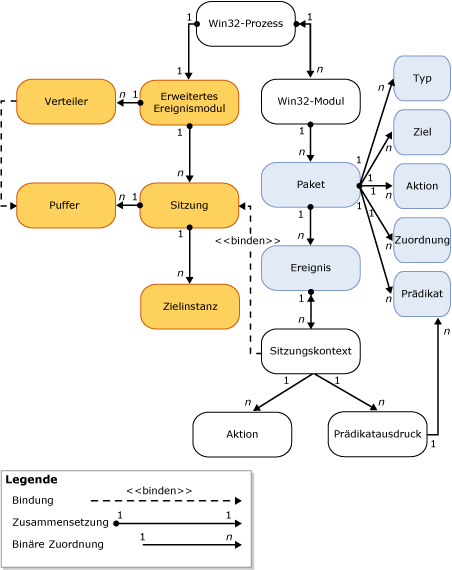

# Modul f&#252;r erweiterte Ereignisse von SQL Server
[!INCLUDE[tsql-appliesto-ss2014-asdb-xxxx-xxx_md](../../includes/tsql-appliesto-ss2014-asdb-xxxx-xxx-md.md)]

  Das [!INCLUDE[ssNoVersion](../../includes/ssnoversion-md.md)] Extended Events-Modul ist eine Sammlung von Diensten und Objekten, die:  
  
-   die Definition von Ereignissen ermöglichen,  
  
-   die Verarbeitung von Ereignisdaten ermöglichen,  
  
-   Dienste und Objekte für erweiterte Ereignisse im System verwalten und  
  
-   eine Liste von Sitzungen für erweiterte Ereignisse führen und den Zugriff auf diese Liste verwalten.  
  
 Das Modul für erweiterte Ereignisse selbst stellt keine Ereignisse oder beim Auslösen eines Ereignisses erforderlichen Aktionen bereit. Die Prozesse, die das Modul für erweiterte Ereignisse verwenden, definieren die Interaktion mit dem Modul. Diese Prozesse fügen Ereignispunkte hinzu und stellen die bei Auslösung eines Ereignisses erforderlichen Aktionen bereit.  
  
 Die folgende Abbildung zeigt eine vereinfachte Ansicht einer Sitzung für erweiterte Ereignisse. Weitere Informationen finden Sie unter [SQL Server Extended Events Sessions](../../relational-databases/extended-events/sql-server-extended-events-sessions.md).  
  
   
  
 Beachten Sie Folgendes:  
  
-   Jeder Windows-Prozess kann über ein oder mehrere Module (**Win32-Prozess**, **Win32-Modul**) verfügen. Diese werden auch als *Binärdateien* oder *ausführbare Module*bezeichnet.  
  
-   Jedes Windows-Prozessmodul kann mindestens ein Paket für erweiterte Ereignisse (**Paket**) enthalten, das wiederum mindestens ein Objekt für erweiterte Ereignisse (**Typ**, **Ziel**, **Aktion**, **Zuordnung**, **Prädikat** und **Ereignis**) enthalten kann.  
  
-   Ein Hostprozess kann nur eine Instanz des Moduls für erweiterte Ereignisse (**Modul für erweiterte Ereignisse**) aufweisen. Dieses führt die folgenden Aufgaben aus:  
  
    -   Es verwaltet einige Aspekte der Sitzung (z. B. das Aufzählen von Sitzungen).  
  
    -   Es übernimmt die Verteilung (**Verteiler**). Dies ist mit einem Threadpool vergleichbar.  
  
    -   Es verarbeitet Speicherpuffer (**Puffer**) für Ereignisse. Wenn Puffer aufgefüllt sind, werden sie an Ziele verteilt.  
  
-   Wenn eine Sitzung erstellt wurde und optional Ereignisse an die Sitzung (**Sitzungskontext**) gebunden wurden:  
  
    -   Es können auch Instanzen von Zielen (**Zielinstanz**) erstellt und der Sitzung hinzugefügt werden.  
  
    -   Wenn Puffer aufgefüllt sind, werden diese an Ziele verteilt.  
  
## Siehe auch  
 [Erweiterte Ereignisse](../../relational-databases/extended-events/extended-events.md)  
  
  