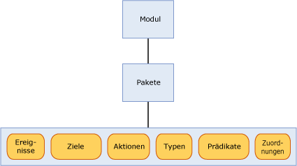

# <a name="sql-server-extended-events-packages"></a>Pakete für erweiterte Ereignisse von SQL Server
[!INCLUDE[tsql-appliesto-ss2014-asdb-xxxx-xxx_md](../../includes/tsql-appliesto-ss2014-asdb-xxxx-xxx-md.md)]

  Ein Paket ist ein Container für Objekte für erweiterte Ereignisse von [!INCLUDE[ssNoVersion](../../includes/ssnoversion-md.md)] . Es gibt drei Arten von Paketen für erweiterte Ereignisse, dazu zählen die folgenden:  
  
-   package0 - Extended Events-Systemobjekte. Dies ist das Standardpaket.  
  
-   sqlserver - Objekte für [!INCLUDE[ssNoVersion](../../includes/ssnoversion-md.md)] .  
  
-   sqlos - Objekte für das [!INCLUDE[ssNoVersion](../../includes/ssnoversion-md.md)] -Betriebssystem (SQLOS).  
  
> [!NOTE]  
>  Das SecAudit-Paket wird von [!INCLUDE[ssNoVersion](../../includes/ssnoversion-md.md)] Audit verwendet. Kein Objekt im Paket ist über die Datendefinitionssprache (Data Definition Language, DDL) für erweiterte Ereignisse verfügbar.  
  
 Pakete werden durch einen Namen, eine GUID und das binäre Modul identifiziert, in dem das Paket enthalten ist. Weitere Informationen finden Sie unter [sys.dm_xe_packages &#40;Transact-SQL&#41;](../../relational-databases/system-dynamic-management-views/sys-dm-xe-packages-transact-sql.md).  
  
 Ein Paket kann eines oder alle der folgenden Objekte enthalten. Eine detailliertere Beschreibung der Objekte finden Sie weiter unten in diesem Thema:  
  
-   Ereignisse  
  
-   Ziele  
  
-   Aktionen  
  
-   Typen  
  
-   Prädikate  
  
-   Karten  
  
 Objekte aus verschiedenen Paketen können in einer Ereignissitzung gemischt werden. Weitere Informationen finden Sie unter [SQL Server Extended Events Sessions](../../relational-databases/extended-events/sql-server-extended-events-sessions.md).  
  
## <a name="package-contents"></a>Paketinhalt  
 In der folgenden Abbildung werden die Objekte dargestellt, die in den in einem Modul enthaltenen Paketen vorhanden sein können. Bei einem Modul kann es sich um eine ausführbare Datei oder eine DLL (Dynamic Link Library) handeln.  
  
   
  
### <a name="events"></a>Ereignisse  
 Mithilfe von Ereignissen werden relevante Punkte im Ausführungspfad eines Programms überwacht, z. B. [!INCLUDE[ssNoVersion](../../includes/ssnoversion-md.md)]. Das Auslösen eines Ereignisses bedeutet immer auch, dass der relevante Punkt erreicht wurde, und liefert Informationen über den Status zu dem Zeitpunkt, an dem das Ereignis ausgelöst wurde.  
  
 Ereignisse können ausschließlich für Ablaufverfolgungszwecke oder auslösende Aktionen verwendet werden. Diese Aktionen können synchron oder asynchron sein.  
  
> [!NOTE]  
>  Ein Ereignis hat keine Kenntnis der Aktionen, die in Reaktion auf das Auslösen des Ereignisses ausgelöst werden können.  
  
 Eine Gruppe von Ereignissen in einem Paket kann nicht geändert werden, nachdem das Paket mit Extended Events registriert wurde.  
  
 Alle Ereignisse weisen ein versionsspezifisches Schema auf, mit dem der Inhalt definiert wird. Dieses Schema besteht aus Ereignisspalten mit wohldefinierten Typen. Ein Ereignis eines bestimmten Typs muss seine Daten stets in genau der Reihenfolge bereitstellen, die im Schema angegeben ist. Allerdings muss ein Ereignisziel nicht alle Daten verarbeiten, die bereitgestellt werden.  
  
#### <a name="event-categorization"></a>Ereigniskategorisierung  
 Extended Events verwendet ein Ereigniskategorisierungsmodell ähnlich der Ereignisablaufverfolgung für Windows (Event Tracing for Windows, ETW). Zwei Ereigniseigenschaften werden für die Kategorisierung verwendet, und zwar Kanal und Schlüsselwort. Durch die Verwendung dieser Eigenschaften wird die Integration von Extended Events in ETW und die zugehörigen Tools unterstützt.  
  
 **Channel**  
  
 Ein Kanal identifiziert die Zielgruppe für ein Ereignis. Eine Beschreibung zu diesen Kanälen finden Sie in der folgenden Tabelle.  
  
|Begriff|Definition|  
|----------|----------------|  
|Admin|Admin-Ereignisse sind hauptsächlich für Endbenutzer, Administratoren und Supportmitarbeiter vorgesehen. Die Ereignisse, die in den Admin-Kanälen gefunden werden, weisen auf ein Problem mit einer wohldefinierten Lösung hin, zu dessen Behebung ein Administrator Maßnahmen ergreifen kann. Ein Beispiel für ein Admin-Ereignis ist, wenn beim Herstellen einer Verbindung mit einem Drucker ein Fehler auftritt. Diese Ereignisse sind entweder umfassend beschrieben oder weisen eine Meldung mit Hinweisen zur Behebung des Fehlers auf.|  
|Operational|Operational-Ereignisse werden zum Analysieren und Diagnostizieren eines Problems oder eines Vorkommens verwendet. Mit ihnen können basierend auf dem Problem oder dem Vorkommen Tools oder Tasks ausgelöst werden. Ein Beispiel für ein solches Ereignis ist, wenn ein Drucker einem System hinzugefügt oder daraus entfernt wird.|  
|Analytic|Analytic-Ereignisse werden in großem Umfang veröffentlicht. Sie beschreiben Programmvorgänge und werden in der Regel in Leistungsuntersuchungen verwendet.|  
|Debuggen|Debug-Ereignisse werden ausschließlich von Entwicklern zum Diagnostizieren eines Problems verwendet, das Debuggen erforderlich macht.<br /><br /> Bei Ereignissen im Debug-Kanal werden interne implementierungsbezogene Statusdaten zurückgegeben. Die Schemas und Daten, die die von den Ereignissen zurückgegeben werden, werden in künftigen Versionen von SQL Server möglicherweise geändert oder werden ungültig. Daher werden Ereignisse im Debug-Kanal in künftigen Versionen von SQL Server unter Umständen ohne vorherigen Hinweis geändert oder entfernt.|  
  
 **Schlüsselwort**  
  
 Ein Schlüsselwort ist anwendungsspezifisch und ermöglicht eine differenziertere Gruppierung ähnlicher Ereignisse. Auf diese Weise wird das Angeben und Abrufen eines Ereignisses zum Verwenden in einer Sitzung vereinfacht. Mithilfe der folgenden Abfrage können Sie Schlüsselwortinformationen abrufen.  
  
```  
select map_value Keyword from sys.dm_xe_map_values  
where name = 'keyword_map'  
```  
  
> [!NOTE]  
>  Schlüsselwörter weisen eine hohe Übereinstimmung mit der aktuellen Gruppierung von Ereignissen der SQL-Ablaufverfolgung auf.  
  
### <a name="targets"></a>Ziele  
 Ziele sind Ereignisconsumer. Ziele verarbeiten Ereignisse entweder synchron für den Thread, der das Ereignis auslöst, oder asynchron für einen vom System bereitgestellten Thread. Erweiterte Ereignisse stellt mehrere Ziele zur Verfügung, mit denen Sie die Ereignisausgabe lenken können. Weitere Informationen finden Sie unter [SQL Server Extended Events Targets](http://msdn.microsoft.com/library/e281684c-40d1-4cf9-a0d4-7ea1ecffa384).  
  
### <a name="actions"></a>Aktionen  
 Eine Aktion ist eine programmgesteuerte Reaktion oder Folge von Reaktionen auf ein Ereignis. Aktionen sind an ein Ereignis gebunden, und jedes Ereignis kann eine eindeutige Gruppe von Aktionen aufweisen.  
  
> [!NOTE]  
>  Aktionen, die für eine bestimmte Gruppe von Ereignissen bestimmt sind, können nicht an unbekannte Ereignisse gebunden werden.  
  
 Eine an ein Ereignis gebundene Aktion wird synchron für den Thread aufgerufen, der das Ereignis ausgelöst hat. Es gibt zahlreiche Typen von Aktionen, die alle eine Vielzahl von Funktionen aufweisen. Aktionen können folgende Aufgaben ausführen:  
  
-   Aufzeichnen eines Stapeldumps und Überprüfen von Daten  
  
-   Speichern von Statusinformationen in einem lokalen Kontext mithilfe der variablen Speicherung  
  
-   Aggregieren von Ereignisdaten  
  
-   Anfügen von Daten an Ereignisdaten  
  
 Nachfolgend werden typische und bekannte Beispiele für Aktionen aufgeführt:  
  
-   Stapeldumper  
  
-   Ausführungsplanerkennung (nur[!INCLUDE[ssNoVersion](../../includes/ssnoversion-md.md)] )  
  
-   [!INCLUDE[tsql](../../includes/tsql-md.md)] Stapelauflistung (nur[!INCLUDE[ssNoVersion](../../includes/ssnoversion-md.md)] )  
  
-   Ausführen von Zeitstatistikberechnungen  
  
-   Sammeln von Benutzereingaben bei Ausnahmen  
  
### <a name="predicates"></a>Prädikate  
 Prädikate sind eine Gruppe logischer Regeln, mit denen Ereignisse während ihrer Verarbeitung ausgewertet werden. Dadurch kann der Extended Events-Benutzer anhand bestimmter Kriterien ausgewählte Ereignisdaten erfassen.  
  
 Prädikate können Daten in einem lokalen Kontext speichern, mit dem Prädikate erstellt werden können, die alle *n* Minuten oder alle *n* Male, dass ein Ereignis ausgelöst wird, den Wert TRUE zurückgeben. Durch das Speichern in lokalem Kontext kann das Prädikat zudem dynamisch aktualisiert werden, wodurch ein zukünftiges Auslösen von Ereignissen unterdrückt werden kann, wenn die Ereignisse ähnliche Daten aufweisen.  
  
 Prädikate können Kontextinformationen wie die Thread-ID sowie ereignisspezifische Daten abrufen. Prädikate werden als vollständige boolesche Ausdrücke ausgewertet und unterstützen Kurzschlussoperationen am ersten Punkt, an dem der gesamte Ausdruck mit FALSE ausgewertet wird.  
  
> [!NOTE]  
>  Prädikate mit Nebeneffekten können ggf. nicht ausgewertet werden, wenn bei einer vorherigen Prädikatüberprüfung ein Fehler auftritt.  
  
### <a name="types"></a>Typen  
 Da es sich bei Daten um eine Auflistung aneinandergereihter Bytes handelt, werden zum Interpretieren der Daten die Länge und die Eigenschaften der Byte-Auflistung benötigt. Diese Informationen werden im Typ-Objekt gekapselt. Die folgenden Typen werden für Paketobjekte bereitgestellt:  
  
-   Ereignis  
  
-   action  
  
-   target  
  
-   pred_source  
  
-   pred_compare  
  
-   Typ  
  
 Weitere Informationen finden Sie unter [sys.dm_xe_objects &#40;Transact-SQL&#41;](../../relational-databases/system-dynamic-management-views/sys-dm-xe-objects-transact-sql.md).  
  
### <a name="maps"></a>Karten  
 In einer Zuordnungstabelle wird ein interner Wert einer Zeichenfolge zugeordnet, sodass der Benutzer erkennt, was durch den Wert dargestellt wird. Statt lediglich eines numerischen Werts erhält der Benutzer eine aussagekräftige Beschreibung des internen Werts. In der folgenden Abfrage wird dargestellt, wie Zuordnungswerte abgerufen werden.  
  
```  
select map_key, map_value from sys.dm_xe_map_values  
where name = 'lock_mode'  
```  
  
 Die vorhergehende Abfrage erzeugt die folgende Ausgabe.  
  
 `map_key     map_value`  
  
 `---------------------`  
  
 `0           NL`  
  
 `1           SCH_S`  
  
 `2           SCH_M`  
  
 `3           S`  
  
 `4           U`  
  
 `5           X`  
  
 `6           IS`  
  
 `7           IU`  
  
 `8           IX`  
  
 `9           SIU`  
  
 `10          SIX`  
  
 `11          UIX`  
  
 `12          BU`  
  
 `13          RS_S`  
  
 `14          RS_U`  
  
 `15          RI_NL`  
  
 `16          RI_S`  
  
 `17          RI_U`  
  
 `18          RI_X`  
  
 `19          RX_S`  
  
 `20          RX_U`  
  
 `21          RX_X`  
  
 `21          RX_X`  
  
 Ausgehend von dieser Tabelle wird als Beispiel eine Spalte mit dem Namen mode und dem Wert 5 angenommen. Die Tabelle gibt an, dass 5 zu X zugeordnet wird. Das bedeutet, dass der Sperrentyp Exclusive ist.  
  
## <a name="see-also"></a>Siehe auch  
 [SQL Server Extended Events Sessions](../../relational-databases/extended-events/sql-server-extended-events-sessions.md)   
 [Modul für erweiterte Ereignisse von SQL Server](../../relational-databases/extended-events/sql-server-extended-events-engine.md)   
 [SQL Server Extended Events Targets](http://msdn.microsoft.com/library/e281684c-40d1-4cf9-a0d4-7ea1ecffa384)  
  
  
