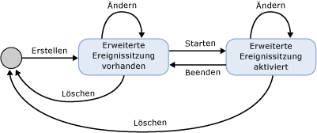
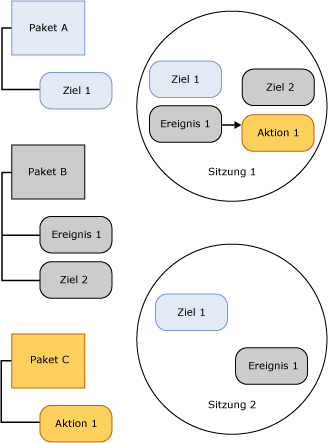

# Sitzungen für erweiterte Ereignisse von SQL Server
[!INCLUDE[tsql-appliesto-ss2014-asdb-xxxx-xxx_md](../../includes/tsql-appliesto-ss2014-asdb-xxxx-xxx-md.md)]

  Eine [!INCLUDE[ssNoVersion](../../includes/ssnoversion-md.md)] -Sitzung für erweiterte Ereignisse wird in dem [!INCLUDE[ssNoVersion](../../includes/ssnoversion-md.md)] -Prozess erstellt, der das Modul für erweiterte Ereignisse hostet. Die folgenden Aspekte einer Sitzung für erweiterte Ereignisse bieten grundlegende Informationen zur Extended Events-Infrastruktur und zur allgemeinen Verarbeitung, die stattfindet:  
  
-   Sitzungsstatus. Die verschiedenen Status, in denen sich eine Sitzung für erweiterte Ereignisse befindet, wenn die Anweisungen CREATE EVENT SESSION und ALTER EVENT SESSION ausgeführt werden.  
  
-   Sitzungsinhalt und -eigenschaften. Der Inhalt einer Sitzung für erweiterte Ereignisse, z. B. Ziele und Ereignisse, und wie die Objekte in einer Sitzung oder zwischen Sitzungen miteinander verbunden sind.  
  
## Sitzungsstatus  
 Im Folgenden werden die verschiedenen Status einer Sitzung für erweiterte Ereignisse veranschaulicht.  
  
   
  
 In Bezug auf die vorangehende Abbildung müssen Sie beachten, dass sich der Sitzungsstatus ändert, wenn die verschiedenen DDL-Befehle für eine Ereignissitzung ausgegeben werden. Eine Beschreibung dieser Statusänderungen finden Sie in der folgenden Tabelle.  
  
|Bezeichnung in der Abbildung|DDL-Anweisung|Beschreibung|  
|------------------------|-------------------|-----------------|  
|Erstellen|CREATE EVENT SESSION|Der Hostprozess erstellt ein Sitzungsobjekt, das die durch CREATE EVENT SESSION bereitgestellten Metadaten enthält. Der Hostprozess überprüft die Sitzungsdefinition und die Benutzerberechtigungsebene und speichert die Metadaten in der master-Datenbank. Zu diesem Zeitpunkt ist die Sitzung nicht aktiv.|  
|Alter|ALTER EVENT SESSION, STATE=START|Der Hostprozess startet die Sitzung. Der Hostprozess liest die gespeicherten Metadaten, überprüft die Sitzungsdefinition und die Benutzerberechtigungsebene und erstellt die Sitzung. Sitzungsobjekte wie Ereignisse und Ziele werden geladen, und die Ereignisbehandlung ist aktiv.|  
|Alter|ALTER EVENT SESSION, STATE=STOP|Der Hostprozess beendet die aktive Sitzung, behält jedoch die Metadaten.|  
|Drop|DROP EVENT SESSION|Abhängig davon, ob die Sitzung aktiv oder nicht aktiv ist, löscht Drop (DROP SESSION) die Metadaten und schließt die aktive Sitzung, oder die Sitzungsmetadaten werden gelöscht.|  
  
> [!NOTE]  
>  Sowohl ALTER EVENT SESSION als auch DROP EVENT SESSION können auf die Metadaten oder auf eine aktive Sitzung und die Metadaten angewendet werden.  
  
## Sitzungsinhalt und -eigenschaften  
 Extended Event-Sitzungen weisen insofern implizite Grenzen auf, als durch die Konfiguration einer Sitzung nicht die Konfiguration einer anderen Sitzung geändert wird. Allerdings kann dadurch nicht verhindert werden, dass ein Ereignis oder ein Ziel in mehr als einer Sitzung verwendet wird.  
  
 In der folgenden Abbildung werden der Sitzungsinhalt und die Beziehung zwischen Paketen und Sitzungen veranschaulicht.  
  
   
  
 Beachten Sie in Bezug auf die vorangegangene Abbildung Folgendes:  
  
-   Die Zuordnung zwischen Paketobjekten und Sitzungen lautet m:n. Das bedeutet, dass ein Objekt in mehreren Sitzungen vertreten sein kann und eine Sitzung mehrere Objekte aufweisen kann.  
  
-   Ein Ereignis (Ereignis 1) oder Ziel (Ziel 1) kann in mehreren Sitzungen aktiviert sein.  
  
 Sitzungen besitzen die folgenden Eigenschaften:  
  
-   Aktionen und Prädikate sind für eine Sitzung an Ereignisse gebunden. Wenn Ereignis 1 in Sitzung A mit Aktion 1 und Prädikat Z vorkommt, hat dies keinerlei Auswirkungen auf Ereignis 1 in Sitzung B mit Aktion 2 und Aktion 3 ohne Prädikat.  
  
-   Richtlinien werden an Sitzungen zum Zweck der Behandlung von Pufferung und Verteilung sowie zur Kausalitätsverfolgung angefügt.  
  
 **Pufferung und Verteilung**  
  
 Pufferung bezieht sich auf das Speichern von Ereignisdaten beim Ausführen einer Ereignissitzung.  In Richtlinien für die Pufferung wird neben dem Arbeitsspeicher für Ereignisdaten die Verlustrichtlinie für die Ereignisse angegeben. Verteilung bezieht sich auf die Dauer, für die Ereignisse in Puffern verbleiben, bevor sie zum Verarbeiten an Ziele gesendet werden.  
  
 **Kausalitätsverfolgung**  
  
 Die Kausalitätsverfolgung ermöglicht das Nachverfolgen der Arbeit über mehrere Tasks. Wenn die Kausalitätsverfolgung aktiviert ist, verfügt jedes ausgelöste Ereignis systemweit über eine eindeutige Aktivitäts-ID. Die Aktivitäts-ID setzt sich aus einem GUID-Wert, der für alle Ereignisse in Bezug auf einen Task konstant bleibt, und einer Sequenznummer zusammen, die bei jeder Ereignisauslösung erhöht wird. Wenn ein Task das Ausführen eines anderen Tasks verursacht, wird die Aktivitäts-ID des übergeordneten Tasks an den untergeordneten Task gesendet. Der untergeordnete Task gibt beim ersten Auslösen eines Ereignisses die Aktivitäts-ID des übergeordneten Tasks aus.  
  
 Die Architektur für erweiterte Ereignisse stellt ein flexibles System bereit, in dem eine Vielzahl von Objekten zusammen verwendet werden kann, um bestimmte Probleme zu beheben.  
  
## Siehe auch  
 [Erweiterte Ereignisse](../../relational-databases/extended-events/extended-events.md)  
  
  
