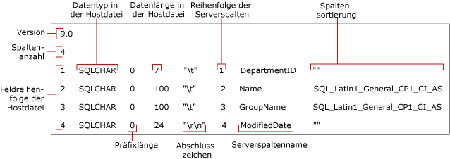

# <a name="non-xml-format-files-sql-server"></a>Nicht-XML-Formatdateien (SQL Server)
[!INCLUDE[appliesto-ss-asdb-asdw-pdw-md](../../includes/appliesto-ss-asdb-asdw-pdw-md.md)] In [!INCLUDE[ssCurrent](../../includes/sscurrent-md.md)] werden zwei Typen von Formatdateien zum Massenexportieren und -importieren unterstützt: *Nicht-XML-Formatdateien* und *XML-Formatdateien*.  
  
 **In diesem Thema:**  
  
-   [Vorteile](#Benefits)  
  
-   [Struktur von Nicht-XML-Formatdateien](#Structure)  
  
-   [Beispiel für eine Nicht-XML-Formatdatei](#Examples)  
  
-   [Verwandte Aufgaben](#RelatedTasks)  
  
##  <a name="Benefits"></a> Vorteile von Nicht-XML-Formatdateien  
  
-   Sie können eine Nicht-XML-Formatdatei automatisch erstellen, indem Sie die **format** -Option in einem **bcp** -Befehl angeben.  
  
-   Wenn Sie eine vorhandene Formatdatei in einem **bcp** -Befehl angeben, verwendet der Befehl die in der Formatdatei aufgezeichneten Werte, und Sie werden nicht aufgefordert, Dateispeichertyp, Präfixlänge, Feldlänge oder Feldabschlusszeichen anzugeben.  
  
-   Sie können eine Formatdatei für einen bestimmten Datentyp z. B. Zeichendaten oder systemeigene Daten erstellen.  
  
-   Sie können Nicht-XML-Formatdateien erstellen, die interaktiv angegebene Attribute für jedes Datenfeld enthalten. Weitere Informationen finden Sie unter [Angeben von Datenformaten für die Kompatibilität bei Verwendung von „bcp“ &#40;SQL Server&#41;](../../relational-databases/import-export/specify-data-formats-for-compatibility-when-using-bcp-sql-server.md).  
  
> [!NOTE]  
>  XML-Formatdateien bieten verschiedene Vorteile gegenüber Nicht-XML-Formatdateien. Weitere Informationen finden Sie unter [XML-Formatdateien &#40;SQL Server&#41;](../../relational-databases/import-export/xml-format-files-sql-server.md).  
  
##  <a name="Structure"></a> Struktur von Nicht-XML-Formatdateien  
 Bei einer Nicht-XML-Formatdatei handelt es sich um eine Textdatei mit einer speziellen Struktur. Die Nicht-XML-Formatdatei enthält Informationen zu Dateispeichertyp, Präfixlänge, Feldlänge und Feldabschlusszeichen jeder Tabellenspalte.  
  
 In der folgenden Abbildung werden die Felder der Formatdatei in einem Beispiel einer Nicht-XML-Formatdatei gezeigt.  
  
 
  
 Die Felder **Version** und **Anzahl der Spalten** kommen nur einmal vor. Die Bedeutung dieser Felder wird in der folgenden Tabelle beschrieben.  
  
|Feld in der Formatdatei|Beschreibung|  
|------------------------|-----------------|  
|Version|Versionsnummer des Hilfsprogramms **bcp** :<br /><br /> 9.0 = [!INCLUDE[ssVersion2005](../../includes/ssversion2005-md.md)]<br /><br /> 10.0 = [!INCLUDE[ssKatmai](../../includes/sskatmai-md.md)]<br /><br /> 11.0 = [!INCLUDE[ssSQL11](../../includes/sssql11-md.md)]<br /><br /> 12.0 = [!INCLUDE[ssSQL14](../../includes/sssql14-md.md)]<br /><br /> Die Versionsnummer wird nur von **bcp**erkannt, nicht von [!INCLUDE[tsql](../../includes/tsql-md.md)].<br /><br /> <br /><br /> Hinweis: Die Version des zum Lesen der Formatdatei verwendeten Hilfsprogramms **bcp** (Bcp.exe) muss mit der Version, mit der die Formatdatei erstellt wurde, übereinstimmen oder höher sein. [!INCLUDE[ssSQL11](../../includes/sssql11-md.md)] **bcp** liest z.B. Formatdateien der Version 10.0, die von [!INCLUDE[ssKatmai](../../includes/sskatmai-md.md)] **bcp** generiert wurden, aber [!INCLUDE[ssKatmai](../../includes/sskatmai-md.md)] **bcp** liest keine Formatdateien der Version 12.0, die von [!INCLUDE[ssSQL14](../../includes/sssql14-md.md)] **bcp** generiert wurden.|  
|Anzahl der Spalten|Anzahl der Felder in der Datendatei. Diese Anzahl muss für alle Zeilen identisch sein.|  
  
 Die anderen Felder der Formatdatei beschreiben die Datenfelder, die massenimportiert bzw. exportiert werden sollen. Jedes Datenfeld nimmt eine eigene Zeile in der Formatdatei ein. Jede Zeile der Formatdatei enthält Werte für die Felder der Formatdatei. Diese Felder werden in der folgenden Tabelle beschrieben.  
  
|Feld in der Formatdatei|Beschreibung|  
|------------------------|-----------------|  
|**Reihenfolge der Felder der Hostdatei**|Eine Zahl, die die Position jedes Felds in der Datendatei angibt. Das erste Feld in der Zeile ist 1 usw.|  
|**Datentyp in der Hostdatei**|Gibt den Datentyp an, der in einem bestimmten Feld der Datendatei gespeichert wird. Bei ASCII-Datendateien verwenden Sie SQLCHAR, bei Datendateien im systemeigenen Format verwenden Sie Standarddatentypen. Weitere Informationen finden Sie unter [Angeben des Dateispeichertyps mithilfe von bcp &#40;SQL Server&#41;](../../relational-databases/import-export/specify-file-storage-type-by-using-bcp-sql-server.md).|  
|**Präfixlänge**|Anzahl der Längenpräfixzeichen für dieses Feld. Die gültigen Präfixlängen sind 0, 1, 4 und 8. Um das Längenpräfix nicht angeben zu müssen, legen Sie die Länge auf 0 fest. Ein Längenpräfix muss angegeben werden, wenn das Feld NULL-Datenwerte enthält. Weitere Informationen finden Sie unter [Angeben der Präfixlänge in Datendateien mittels bcp &#40;SQL Server&#41;](../../relational-databases/import-export/specify-prefix-length-in-data-files-by-using-bcp-sql-server.md).|  
|**Datenlänge in der Hostdatei**|Maximale Länge (in Byte) des Datentyps, der in diesem Feld der Datendatei gespeichert ist.<br /><br /> Wenn Sie eine Nicht-XML-Formatdatei für eine durch Tabstopps getrennte Textdatei erstellen, können Sie für die Hostdatei 0 als Datenlänge jedes Datenfelds angeben. Wenn in eine durch Tabstopps getrennte Textdatei mit einer Präfixlänge von 0 ein Zeilenabschlusszeichen importiert wird, wird die Feldlänge ignoriert, da der von dem Feld in Anspruch genommene Speicherplatz der Länge der Daten plus Abschlusszeichen entspricht.<br /><br /> Weitere Informationen finden Sie unter [Angeben der Feldlänge mithilfe von bcp &#40;SQL Server&#41;](../../relational-databases/import-export/specify-field-length-by-using-bcp-sql-server.md).|  
|**Abschlusszeichen**|Trennzeichen, um die Felder in der Datendatei voneinander zu trennen. Häufig verwendete Trennzeichen sind Komma (,), Tabstopp (\t) und Zeilenende (\r\n). Weitere Informationen finden Sie unter [Angeben von Feld- und Zeilenabschlusszeichen &#40;SQL Server&#41;](../../relational-databases/import-export/specify-field-and-row-terminators-sql-server.md).|  
|**Reihenfolge der Serverspalten**|Die Reihenfolge, in der die Spalten in der [!INCLUDE[ssNoVersion](../../includes/ssnoversion-md.md)] -Tabelle angezeigt werden. Wenn beispielsweise das vierte Feld in der Datendatei der sechsten Spalte in einer [!INCLUDE[ssNoVersion](../../includes/ssnoversion-md.md)] -Tabelle zugeordnet wird, wird das vierte Feld in der Serverspalte 6 eingefügt.<br /><br /> Um zu verhindern, dass eine Spalte in der Tabelle Daten aus der Datendatei empfängt, legen Sie den Wert für die Reihenfolge der Serverspalten auf 0 fest.|  
|**Name der Serverspalte**|Der Name der aus der [!INCLUDE[ssNoVersion](../../includes/ssnoversion-md.md)] -Tabelle kopierten Spalte. Der tatsächliche Name des Felds muss nicht unbedingt verwendet werden, aber das Feld in der Formatdatei darf nicht leer sein.|  
|**Spaltensortierung**|Die Sortierung zum Speichern von Zeichendaten und Unicode-Daten in der Datendatei.|  
  
> [!NOTE]  
>  Sie können eine Formatdatei so ändern, dass Sie einen Massenimport aus einer Datendatei ausführen können, in der die Anzahl oder Reihenfolge der Felder von der Anzahl oder Reihenfolge der Tabellenspalten abweicht. Weitere Informationen finden Sie weiter unten in diesem Thema unter [Verwandte Aufgaben](#RelatedTasks) .  
  
##  <a name="Examples"></a> Beispiel für eine Nicht-XML-Formatdatei  
 Das folgende Beispiel zeigt eine zuvor erstellte Nicht-XML-Formatdatei (`myDepartmentIdentical-f-c.fmt`). Diese Datei beschreibt ein Zeichendatenfeld für jede Spalte in der `HumanResources.Department` -Tabelle der `AdventureWorks2012` -Beispieldatenbank.  
  
 Die generierte Formatdatei `myDepartmentIdentical-f-c.fmt`enthält die folgenden Informationen:  
  
```  
12.0  
4  
1       SQLCHAR       0       7       "\t"     1     DepartmentID     ""  
2       SQLCHAR       0       100     "\t"     2     Name             SQL_Latin1_General_CP1_CI_AS  
3       SQLCHAR       0       100     "\t"     3     GroupName        SQL_Latin1_General_CP1_CI_AS  
4       SQLCHAR       0       24      "\r\n"   4     ModifiedDate     ""  
```  
  
> [!NOTE]  
>  Eine Abbildung der Felder der Formatdatei in Bezug auf diese Nicht-XML-Formatdatei finden Sie unter [Struktur von Nicht-XML-Formatdateien](#Structure)weiter oben in diesem Thema.  
  
##  <a name="RelatedTasks"></a> Verwandte Aufgaben  
  
-   [Erstellen einer Formatdatei &#40;SQL Server&#41;](../../relational-databases/import-export/create-a-format-file-sql-server.md)  
  
-   [Massenimport von Daten mithilfe einer Formatdatei &#40;SQL Server&#41;](../../relational-databases/import-export/use-a-format-file-to-bulk-import-data-sql-server.md)  
  
-   [Überspringen einer Tabellenspalte mithilfe einer Formatdatei &#40;SQL Server&#41;](../../relational-databases/import-export/use-a-format-file-to-skip-a-table-column-sql-server.md)  
  
-   [Auslassen eines Datenfelds mithilfe einer Formatdatei &#40;SQL Server&#41;](../../relational-databases/import-export/use-a-format-file-to-skip-a-data-field-sql-server.md)  
  
-   [Verwenden einer Formatdatei zum Zuordnen von Tabellenspalten zu Datendateifeldern &#40;SQL Server&#41;](../../relational-databases/import-export/use-a-format-file-to-map-table-columns-to-data-file-fields-sql-server.md)  
  
## <a name="see-also"></a>Siehe auch  
 [bcp (Hilfsprogramm)](../../tools/bcp-utility.md)   
 [Erstellen einer Formatdatei &#40;SQL Server&#41;](../../relational-databases/import-export/create-a-format-file-sql-server.md)   
 [XML-Formatdateien &#40;SQL Server&#41;](../../relational-databases/import-export/xml-format-files-sql-server.md)   
 [Formatdateien zum Importieren oder Exportieren von Daten &#40;SQL Server&#41;](../../relational-databases/import-export/format-files-for-importing-or-exporting-data-sql-server.md)  
  
  
