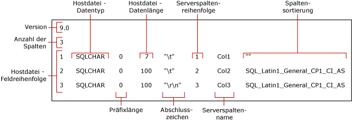

# <a name="use-a-format-file-to-skip-a-table-column-sql-server"></a>Überspringen einer Tabellenspalte mithilfe einer Formatdatei (SQL Server)
  In diesem Thema werden Formatdateien beschrieben. Mit einer Formatdatei können Sie das Importieren einer Tabellenspalte überspringen, wenn das zugehörige Feld in der Datendatei nicht vorhanden ist. Eine Datendatei kann nur dann weniger Felder enthalten, als Spalten in der Tabelle vorliegen, wenn die ausgelassenen Spalten NULL-Werte unterstützen und/oder einen Standardwert aufweisen.  
  
## <a name="sample-table-and-data-file"></a>Beispieltabelle und Datendatei  
 Für die folgenden Beispiele muss in der `myTestSkipCol` -Beispieldatenbank unter dem [!INCLUDE[ssSampleDBnormal](../../includes/sssampledbnormal-md.md)] dbo **-Schema eine Tabelle mit der Bezeichnung** erstellt werden. Erstellen Sie diese Tabelle folgendermaßen  
  
```sql
USE AdventureWorks2012;  
GO  
CREATE TABLE myTestSkipCol   
   (  
   Col1 smallint,  
   Col2 nvarchar(50) NULL,  
   Col3 nvarchar(50) not NULL  
   );  
GO  
```  
  
 In den folgenden Beispielen wird die Beispieldatendatei `myTestSkipCol2.dat`verwendet, in der nur zwei Felder enthalten sind, obwohl die zugehörige Tabelle drei Spalten enthält:  
  
```  
1,DataForColumn3  
1,DataForColumn3  
1,DataForColumn3  
```  
  
 Damit ein Massenimport von Daten aus `myTestSkipCol2.dat` in die `myTestSkipCol` -Tabelle ausgeführt werden kann, muss `Col1`das erste Datenfeld von der Formatdatei zugeordnet werden, `Col3`muss das zweite Feld zugeordnet werden. `Col2`wird ausgelassen.  
  
## <a name="using-a-non-xml-format-file"></a>Verwenden einer Nicht-XML-Formatdatei  
 Sie können eine Nicht-XML-Formatdatei ändern, um eine Tabellenspalte auszulassen. Im Allgemeinen ist das **bcp** -Hilfsprogramm erforderlich, um eine standardmäßige Nicht-XML-Formatdatei zu erstellen und die Standarddatei in einem Text-Editor zu ändern. Die vorhandenen Datenfelder müssen von der geänderten Formatdatei den entsprechenden Tabellenspalten zugeordnet werden, und es muss angegeben werden, welche Tabellenspalten ausgelassen werden. Für die Bearbeitung einer standardmäßigen Nicht-XML-Datendatei stehen zwei Alternativen zur Verfügung. Beide Alternativen zeigen, dass das Datenfeld in der Datendatei nicht vorhanden ist und dass keine Daten in die entsprechende Tabellenspalte eingefügt werden.  
  
### <a name="creating-a-default-non-xml-format-file"></a>Erstellen einer standardmäßigen Nicht-XML-Formatdatei  
 In diesem Thema wird die standardmäßige Nicht-XML-Formatdatei verwendet, die mithilfe des folgenden `myTestSkipCol` bcp **-Befehls für die** -Beispieltabelle erstellt wurde:  
  
```cmd
bcp AdventureWorks2012..myTestSkipCol format nul -f myTestSkipCol_Default.fmt -c -T  
```  
  
 Mit dem zuvor angeführten Befehl wird die Nicht-XML-Formatdatei `myTestSkipCol_Default.fmt`erstellt: Diese Formatdatei wird auch als *Standardformatdatei* bezeichnet. Es handelt sich hierbei um die Form, in der Dateien von **bcp**generiert werden. Im Allgemeinen wird mit einer Standardformatdatei eine 1:1-Entsprechung zwischen den Feldern in der Datendatei und den Spalten in der Tabelle beschrieben.  
  
> [!IMPORTANT]  
>  Möglicherweise müssen Sie den Namen der Serverinstanz angeben, mit der Sie eine Verbindung herstellen. Außerdem kann es erforderlich sein, den Benutzernamen und das entsprechende Kennwort anzugeben. Weitere Informationen finden Sie unter [bcp Utility](../../tools/bcp-utility.md).  
  
 In der folgenden Abbildung werden Werte in diesen Beispiel-Standardformatdateien gezeigt. In der Abbildung werden außerdem die Namen der einzelnen Formatdateifelder angegeben.  
  
   
  
> [!NOTE]  
>  Weitere Informationen zu Formatdateifeldern finden Sie unter [Nicht-XML-Formatdateien &#40;SQL Server&#41;](../../relational-databases/import-export/non-xml-format-files-sql-server.md).  
  
### <a name="methods-for-modifying-a-non-xml-format-file"></a>Methoden zum Ändern von Nicht-XML-Formatdateien  
 Sie können eine Tabellenspalte auslassen, indem Sie eine standardmäßige Nicht-XML-Formatdatei bearbeiten und die Datei mithilfe einer der folgenden alternativen Methoden ändern:  
  
-   Die bevorzugte Methode umfasst drei grundlegende Schritte. Löschen Sie zuerst alle Formatdateizeilen, in denen Felder beschrieben werden, die in der Datendatei fehlen. Ändern Sie anschließend den Wert "Reihenfolge der Felder der Hostdatei" für die einzelnen Formatdateizeilen, die auf eine gelöschte Zeile folgen. Das Ziel besteht darin, mithilfe der „Host file field order“-Werte (Reihenfolge der Felder der Hostdatei) von 1 bis *n*die eigentliche Position der einzelnen Datenfelder in der Datendatei zu erhalten. Abschließend muss der Wert im Feld "Spaltenanzahl" entsprechend der tatsächlichen Anzahl der Felder in der Datendatei verringert werden.  
  
     Das folgende Beispiel basiert auf der Standardformatdatei für die `myTestSkipCol` -Tabelle, die unter "Erstellen einer standardmäßigen Nicht-XML-Formatdatei" weiter oben in diesem Thema erstellt wurde. In dieser geänderten Formatdatei wird `Col1`das erste Datenfeld zugeordnet, `Col2`wird ausgelassen, und das zweite Datenfeld wird `Col3`zugeordnet. Die Zeile für `Col2` wurde gelöscht.  
  
    ```  
    9.0  
    2  
    1       SQLCHAR       0       7       "\t"     1     Col1         ""  
    2       SQLCHAR       0       100     "\r\n"   3     Col3         SQL_Latin1_General_CP1_CI_AS  
    ```  
  
-   Alternativ können Sie eine Tabellenspalte auslassen, indem Sie die Definition der Formatdateizeile ändern, die der Tabellenspalte entspricht. In dieser Formatdateizeile müssen die Werte "prefix length", "host file data length" und "server column order" auf 0 festgelegt werden. Außerdem müssen die Felder "terminator" und "column collation" auf "" (NULL) festgelegt werden.  
  
     Für "server column name" muss eine Zeichenfolge eingegeben werden, die nicht leer ist; dabei muss es sich jedoch auch nicht um den tatsächlichen Spaltennamen handeln. Für die verbleibenden Formatfelder sind die entsprechenden Standardwerte erforderlich.  
  
     Das folgende Beispiel wird ebenfalls von der Standardformatdatei der `myTestSkipCol` -Tabelle abgeleitet.  
  
    ```  
    9.0  
    3  
    1       SQLCHAR       0       7       "\t"     1     Col1         ""  
    2       SQLCHAR       0       0       ""       0     Col2         ""  
    3       SQLCHAR       0       100     "\r\n"   3     Col3         SQL_Latin1_General_CP1_CI_AS  
    ```  
  
### <a name="examples"></a>Beispiele  
 Die folgenden Beispiele beruhen ebenfalls auf der `myTestSkipCol` -Beispieltabelle und der `myTestSkipCol2.dat` -Beispieldatendatei, die unter "Beispieltabelle und -datendatei" weiter oben in diesem Thema erstellt wurden.  
  
#### <a name="using-bulk-insert"></a>Verwenden von BULK INSERT  
 Für dieses Beispiel wird eine der geänderten Nicht-XML-Formatdateien verwendet, die weiter oben in diesem Thema unter "Methoden zum Ändern von Nicht-XML-Formatdateien" erstellt wurden. In diesem Beispiel lautet der Name der geänderten Formatdatei `C:\myTestSkipCol2.fmt`. Führen Sie im Abfrage-Editor von `BULK INSERT` den folgenden Code aus, um mithilfe von `myTestSkipCol2.dat` einen Massenimport der [!INCLUDE[ssManStudioFull](../../includes/ssmanstudiofull-md.md)] -Datendatei auszuführen:  
  
```sql  
USE AdventureWorks2012;  
GO  
BULK INSERT myTestSkipCol   
   FROM 'C:\myTestSkipCol2.dat'   
   WITH (FORMATFILE = 'C:\myTestSkipCol2.fmt');  
GO  
SELECT * FROM myTestSkipCol;  
GO  
```  
  
## <a name="using-an-xml-format-file"></a>Verwenden einer XML-Formatdatei  
 Bei einer XML-Formatdatei ist es nicht möglich, beim direkten Importieren in eine Tabelle mit dem Befehl **bcp** oder der BULK INSERT-Anweisung eine Spalte auszulassen. Sie können jedoch Daten in alle Spalten einer Tabelle mit Ausnahme der letzten Spalte importieren. Wenn Sie eine andere Spalte als die letzte auslassen müssen, müssen Sie eine Sicht der Zieltabelle erstellen, die nur die in der Datendatei enthaltenen Spalten enthält. Anschließend können Sie Daten aus dieser Datei in die Sicht massenimportieren.  
  
 Um eine Tabellenspalte mithilfe von OPENROWSET(BULK...) mit einer XML-Formatdatei auszulassen, muss folgendermaßen eine explizite Liste von Spalten in der Auswahlliste und auch in der Zieltabelle angegeben werden:  
  
 INSERT ...<column_list> SELECT <column_list> FROM OPENROWSET(BULK...)  
  
### <a name="creating-a-default-xml-format-file"></a>Erstellen einer standardmäßigen XML-Formatdatei  
 Die Beispiele der geänderten Formatdateien beruhen auf der `myTestSkipCol` -Beispieltabelle und der Datendatei, die unter "Beispieltabelle und -datendatei" weiter oben in diesem Thema erstellt wurden. Mit dem folgenden **bcp** -Befehl wird eine standardmäßige XML-Formatdatei für die `myTestSkipCol` -Tabelle erstellt:  
  
```cmd
bcp AdventureWorks2012..myTestSkipCol format nul -f myTestSkipCol_Default.xml -c -x -T  
```  
  
 In der erstellten standardmäßigen Nicht-XML-Formatdatei wird eine 1:1-Entsprechung zwischen den Feldern in der Datendatei und den Spalten in der Tabelle beschrieben. Dies erfolgt folgendermaßen:  
  
```xml
\<?xml version="1.0"?>  
\<BCPFORMAT xmlns="http://schemas.microsoft.com/sqlserver/2004/bulkload/format" xmlns:xsi="http://www.w3.org/2001/XMLSchema-instance">  
 <RECORD>  
  \<FIELD ID="1" xsi:type="CharTerm" TERMINATOR="\t" MAX_LENGTH="7"/>  
  \<FIELD ID="2" xsi:type="CharTerm" TERMINATOR="\t" MAX_LENGTH="100" COLLATION="SQL_Latin1_General_CP1_CI_AS"/>  
  \<FIELD ID="3" xsi:type="CharTerm" TERMINATOR="\r\n" MAX_LENGTH="100" COLLATION="SQL_Latin1_General_CP1_CI_AS"/>  
 </RECORD>  
 <ROW>  
  \<COLUMN SOURCE="1" NAME="Col1" xsi:type="SQLSMALLINT"/>  
  \<COLUMN SOURCE="2" NAME="Col2" xsi:type="SQLNVARCHAR"/>  
  \<COLUMN SOURCE="3" NAME="Col3" xsi:type="SQLNVARCHAR"/>  
 </ROW>  
</BCPFORMAT>  
```  
  
> [!NOTE]  
>  Informationen zur Struktur von XML-Formatdateien finden Sie unter [XML-Formatdateien &#40;SQL Server&#41;](../../relational-databases/import-export/xml-format-files-sql-server.md).  
  
### <a name="examples"></a>Beispiele  
 Für die Beispiele in diesem Abschnitt werden die `myTestSkipCol` -Beispieltabelle und die `myTestSkipCol2.dat` -Beispieldatendatei verwendet, die unter "Beispieltabelle und -datendatei" weiter oben in diesem Thema erstellt wurden. Zum Importieren der Daten aus `myTestSkipCol2.dat` in die `myTestSkipCol` -Tabelle wird in den Beispielen die folgende geänderte XML-Formatdatei verwendet: `myTestSkipCol2-x.xml`. Diese Datei basiert auf der Formatdatei, die unter "Erstellen einer standardmäßigen XML-Formatdatei" weiter oben in diesem Thema erstellt wurde.  
  
```xml
\<?xml version="1.0"?>  
\<BCPFORMAT xmlns="http://schemas.microsoft.com/sqlserver/2004/bulkload/format" xmlns:xsi="http://www.w3.org/2001/XMLSchema-instance">  
 <RECORD>  
  \<FIELD ID="1" xsi:type="CharTerm" TERMINATOR="," MAX_LENGTH="7"/>  
  \<FIELD ID="2" xsi:type="CharTerm" TERMINATOR="\r\n" MAX_LENGTH="100" COLLATION="SQL_Latin1_General_CP1_CI_AS"/>  
 </RECORD>  
 <ROW>  
  \<COLUMN SOURCE="1" NAME="Col1" xsi:type="SQLSMALLINT"/>  
  \<COLUMN SOURCE="2" NAME="Col3" xsi:type="SQLNVARCHAR"/>  
 </ROW>  
</BCPFORMAT>  
```  
  
#### <a name="using-openrowsetbulk"></a>Verwenden von OPENROWSET(BULK...)  
 Im folgenden Beispiel werden der Massenrowsetanbieter `OPENROWSET` und die Formatdatei `myTestSkipCol2.xml` verwendet. Die Datendatei `myTestSkipCol2.dat` wird per Massenimport in die `myTestSkipCol` -Tabelle übertragen. Die Anweisung enthält anforderungsgemäß eine explizite Liste der Spalten in der Auswahlliste und in der Zieltabelle.  
  
 Führen Sie im Abfrage-Editor von [!INCLUDE[ssManStudioFull](../../includes/ssmanstudiofull-md.md)] folgenden Code aus:  
  
```sql  
USE AdventureWorks2012;  
GO  
INSERT INTO myTestSkipCol  
  (Col1,Col3)  
    SELECT Col1,Col3  
      FROM  OPENROWSET(BULK  'C:\myTestSkipCol2.Dat',  
      FORMATFILE='C:\myTestSkipCol2.Xml'    
       ) as t1 ;  
GO  
```  
  
#### <a name="using-bulk-import-on-a-view"></a>Verwenden von BULK IMPORT für eine Sicht  
 Im folgenden Beispiel wird für die `v_myTestSkipCol` -Tabelle die Sicht `myTestSkipCol` erstellt. In dieser Sicht wird die zweite Tabellenspalte, `Col2`, ausgelassen. Anschließend wird mit `BULK INSERT` die Datendatei `myTestSkipCol2.dat` in die Sicht importiert.  
  
 Führen Sie im Abfrage-Editor von [!INCLUDE[ssManStudioFull](../../includes/ssmanstudiofull-md.md)] folgenden Code aus:  
  
```sql  
CREATE VIEW v_myTestSkipCol AS  
    SELECT Col1,Col3  
    FROM myTestSkipCol;  
GO  
  
USE AdventureWorks2012;  
GO  
BULK INSERT v_myTestSkipCol  
FROM 'C:\myTestSkipCol2.dat'  
WITH (FORMATFILE='C:\myTestSkipCol2.xml');  
GO  
```  
  
## <a name="see-also"></a>Siehe auch  
 [bcp Utility](../../tools/bcp-utility.md)   
 [BULK INSERT &#40;Transact-SQL&#41;](../../t-sql/statements/bulk-insert-transact-sql.md)   
 [OPENROWSET &#40;Transact-SQL&#41;](../../t-sql/functions/openrowset-transact-sql.md)   
 [Auslassen eines Datenfelds mithilfe einer Formatdatei &#40;SQL Server&#41;](../../relational-databases/import-export/use-a-format-file-to-skip-a-data-field-sql-server.md)   
 [Verwenden einer Formatdatei zum Zuordnen von Tabellenspalten zu Datendateifeldern &#40;SQL Server&#41;](../../relational-databases/import-export/use-a-format-file-to-map-table-columns-to-data-file-fields-sql-server.md)   
 [Massenimport von Daten mithilfe einer Formatdatei &#40;SQL Server&#41;](../../relational-databases/import-export/use-a-format-file-to-bulk-import-data-sql-server.md)  
  
  

