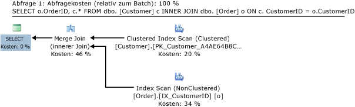
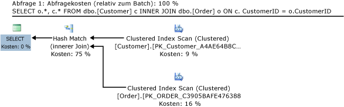
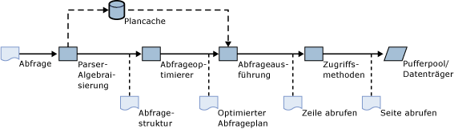
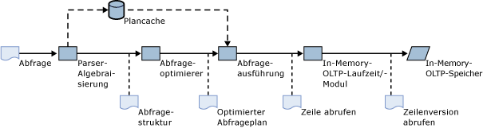
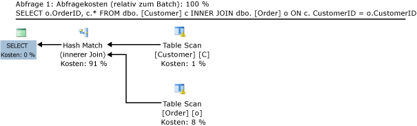
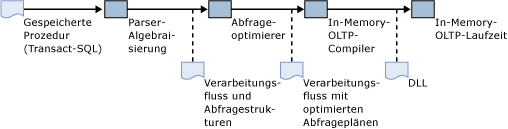
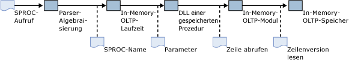
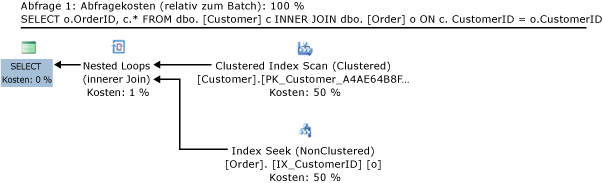

# <a name="a-guide-to-query-processing-for-memory-optimized-tables"></a>Anleitung zur Abfrageverarbeitung für speicheroptimierte Tabellen
[!INCLUDE[appliesto-ss-asdb-xxxx-xxx-md](../../includes/appliesto-ss-asdb-xxxx-xxx-md.md)]

  Mit In-Memory OLTP werden speicheroptimierte Tabellen und systemintern kompilierte gespeicherte Prozeduren in [!INCLUDE[ssNoVersion](../../includes/ssnoversion-md.md)]eingeführt. Dieser Artikel gibt eine Übersicht über die Abfrageverarbeitung für speicheroptimierte Tabellen und systemintern kompilierte gespeicherte Prozeduren.  
  
 In diesem Dokument wird erläutert, wie Abfragen in speicheroptimierten Tabellen kompiliert und ausgeführt werden. Die Themen umfassen:  
  
-   Abfrageverarbeitungspipeline in [!INCLUDE[ssNoVersion](../../includes/ssnoversion-md.md)] für datenträgerbasierte Tabellen  
  
-   Abfrageoptimierung; die Rolle der Statistiken für speicheroptimierte Tabellen sowie der Richtlinien für die Problembehandlung von ungültigen Abfrageplänen  
  
-   Verwendung von interpretiertem [!INCLUDE[tsql](../../includes/tsql-md.md)] für den Zugriff auf speicheroptimierte Tabellen  
  
-   Überlegungen zur Abfrageoptimierung für den Zugriff auf speicheroptimierte Tabellen  
  
-   Kompilierung und Verarbeitung systemintern kompilierter gespeicherter Prozeduren  
  
-   Statistiken, die vom Abfrageoptimierer für die Kostenschätzung verwendet werden.  
  
-   Möglichkeiten zur Reparatur ungültiger Abfragepläne  
  
## <a name="example-query"></a>Beispielabfrage  
 Im folgenden Beispiel werden die Abfrageverarbeitungskonzepte veranschaulicht, die in diesem Artikel erläutert werden.  
  
 Wir gehen von zwei Tabellen aus: "Customer" und "Order". Das folgende [!INCLUDE[tsql](../../includes/tsql-md.md)] -Skript enthält die Definitionen für diese beiden Tabellen und zugehörige Indizes in ihrer (herkömmlichen) datenträgerbasierten Form:  
  
```sql  
CREATE TABLE dbo.[Customer] (  
  CustomerID nchar (5) NOT NULL PRIMARY KEY,  
  ContactName nvarchar (30) NOT NULL   
)  
GO  
  
CREATE TABLE dbo.[Order] (  
  OrderID int NOT NULL PRIMARY KEY,  
  CustomerID nchar (5) NOT NULL,  
  OrderDate date NOT NULL  
)  
GO  
CREATE INDEX IX_CustomerID ON dbo.[Order](CustomerID)  
GO  
CREATE INDEX IX_OrderDate ON dbo.[Order](OrderDate)  
GO  
```  
  
 Zum Erstellen der in diesem Artikel dargestellten Abfragepläne werden die beiden Tabellen mit Beispieldaten aus der Northwind-Beispieldatenbank aufgefüllt. Diese können Sie von [Northwind and pubs Sample Databases for SQL Server 2000](http://www.microsoft.com/download/details.aspx?id=23654)(Northwind and pubs-Beispieldatenbanken für SQL Server 2000) herunterladen.  
  
 Betrachten wir die folgende Abfrage, in der die Tabellen "Customer" und "Order" verknüpft sind und die die Bestell-ID und die zugehörigen Kundeninformationen zurückgibt:  
  
```sql  
SELECT o.OrderID, c.* FROM dbo.[Customer] c INNER JOIN dbo.[Order] o ON c.CustomerID = o.CustomerID  
```  
  
 Der geschätzte Ausführungsplan wird von [!INCLUDE[ssManStudioFull](../../includes/ssmanstudiofull-md.md)] wie folgt angezeigt  
  
   
Abfrageplan für einen Join datenträgerbasierter Tabellen.  
  
 Informationen zu diesem Abfrageplan:  
  
-   Die Zeilen der Customer-Tabelle werden aus dem gruppierten Index abgerufen, der die primäre Datenstruktur darstellt und die vollständigen Tabellendaten enthält.  
  
-   Daten aus der Reihenfolge-Tabelle werden mithilfe des nicht gruppierten Indexes für die CustomerID-Spalte abgerufen. Dieser Index enthält die Spalte CustomerID, die für diesen Join verwendet wird, und die Primärschlüsselspalte OrderID, die an den Benutzer zurückgegeben wird. Das Zurückgeben zusätzlicher Spalten aus der Order-Tabelle würde Suchen im gruppierten Index für die Order-Tabelle erfordern.  
  
-   Der logische Operator **Inner Join** wird vom physischen Operator **Merge Join**implementiert. Die anderen physischen Jointypen sind **Nested Loops** und **Hash Join**. Der **Merge Join** -Operator nutzt die Tatsache, dass beide Indizes nach der Joinspalte CustomerID sortiert werden.  
  
 Betrachten wir eine leichte Abwandlung dieser Abfrage, die alle Zeilen aus der Order-Tabelle zurückgibt, nicht nur OrderID:  
  
```sql  
SELECT o.*, c.* FROM dbo.[Customer] c INNER JOIN dbo.[Order] o ON c.CustomerID = o.CustomerID  
```  
  
 Der geschätzte Plan für diese Abfrage ist:  
  
   
Abfrageplan für einen Hashjoin datenträgerbasierter Tabellen.  
  
 In dieser Abfrage werden Zeilen aus der Order-Tabelle mithilfe des gruppierten Indexes abgerufen. Der physische Operator **Hash Match** wird jetzt für **Inner Join**verwendet. Der gruppierte Index für Order wird nicht nach CustomerID sortiert. Deshalb würde **Merge Join** einen Sortieroperator erfordern, der sich auf die Leistung auswirkt. Beachten Sie die relativen Kosten des **Hash Match** -Operators (75%), verglichen mit den Kosten des **Merge Join** -Operators im vorherigen Beispiel (46%). Der Optimierer hätte den **Hash Match** -Operator auch im vorherigen Beispiel in Betracht gezogen, hat aber festgestellt, dass der **Merge Join** -Operator eine bessere Leistung bietet.  
  
## <a name="includessnoversionincludesssnoversion-mdmd-query-processing-for-disk-based-tables"></a>[!INCLUDE[ssNoVersion](../../includes/ssnoversion-md.md)] Abfrageverarbeitung für datenträgerbasierte Tabellen  
 Das folgende Diagramm zeigt den Abfrageverarbeitungsfluss in [!INCLUDE[ssNoVersion](../../includes/ssnoversion-md.md)] für Ad-hoc-Abfragen:  
  
   
Abfrageverarbeitungspipeline in SQL Server.  
  
 In diesem Szenario:  
  
1.  Der Benutzer gibt eine Abfrage aus.  
  
2.  Der Parser und die Algebraisierung erstellen eine Abfragestruktur mit logischen Operatoren auf Grundlage des [!INCLUDE[tsql](../../includes/tsql-md.md)] -Texts, der vom Benutzer bereitgestellt wurde.  
  
3.  Der Abfrageoptimierer erstellt einen optimierten Abfrageplan, der physische Operatoren enthält (beispielsweise einen Join geschachtelter Schleifen). Nach der Optimierung kann der Plan im Plancache gespeichert werden. Dieser Schritt wird umgangen, wenn der Plancache bereits einen Plan für diese Abfrage enthält.  
  
4.  Das Abfrageausführungsmodul verarbeitet eine Interpretation des Abfrageplans.  
  
5.  Für jeden Index Seek-, Index Scan- und Table Scan-Operator fordert das Ausführungsmodul Zeilen aus den entsprechenden Index- und Tabellenstrukturen von Zugriffsmethoden an.  
  
6.  Über Zugriffsmethoden werden die Zeilen aus den Index- und Datenseiten im Pufferpool abgerufen und Seiten nach Bedarf vom Datenträger in den Pufferpool geladen.  
  
 Für die erste Beispielabfrage fordert das Ausführungsmodul von Zugriffsmethoden Zeilen im gruppierten Index für Customer und im nicht gruppierten Index für Order an. Zugriffsmethoden durchläuft die B-Struktur-Indexstrukturen, um die angeforderten Zeilen abzurufen. In diesem Fall werden alle Zeilen abgerufen, da der Plan vollständige Indexscans fordert.  
  
## <a name="interpreted-includetsqlincludestsql-mdmd-access-to-memory-optimized-tables"></a>Interpretierter [!INCLUDE[tsql](../../includes/tsql-md.md)] -Zugriff auf speicheroptimierte Tabellen  
 [!INCLUDE[tsql](../../includes/tsql-md.md)] werden auch als interpretiertes [!INCLUDE[tsql](../../includes/tsql-md.md)]. "Interpretiert" bezieht sich auf die Tatsache, dass der Abfrageplan vom Abfrageausführungsmodul für jeden Operator im Abfrageplan interpretiert wird. Das Ausführungsmodul liest den Operator und die Parameter und führt den Vorgang aus.  
  
 Interpretiertes [!INCLUDE[tsql](../../includes/tsql-md.md)] kann verwendet werden, um auf speicheroptimierte und datenträgerbasierte Tabellen zuzugreifen. Die folgende Abbildung veranschaulicht die Abfrageverarbeitung für den interpretierten [!INCLUDE[tsql](../../includes/tsql-md.md)] -Zugriff auf speicheroptimierte Tabellen:  
  
   
Abfrageverarbeitungspipeline für interpretierten Transact-SQL-Zugriff auf speicheroptimierte Tabellen.  
  
 Wie in der Abbildung veranschaulicht, bleibt die Abfrageverarbeitungspipeline größtenteils unverändert:  
  
-   Der Parser und die Algebraisierung erstellen die Abfragestruktur.  
  
-   Der Abfrageoptimierer erstellt den Ausführungsplan.  
  
-   Das Abfrageausführungsmodul interpretiert den Ausführungsplan.  
  
 Der Hauptunterschied zur herkömmlichen Abfrageverarbeitungspipeline (Abbildung 2) ist, dass Zeilen für speicheroptimierte Tabellen nicht über Zugriffsmethoden aus dem Pufferpool abgerufen werden. Stattdessen werden Zeilen mit dem In-Memory OLTP-Modul aus den speicherresidenten Datenstrukturen abgerufen. Aufgrund der Unterschiede in den Datenstrukturen wählt der Abfrageoptimierer in manchen Fällen verschiedene Pläne aus, wie im folgenden Beispiel veranschaulicht wird.  
  
 Das folgende [!INCLUDE[tsql](../../includes/tsql-md.md)] -Skript enthält speicheroptimierte Versionen der Order- und Customer-Tabellen, wobei Hashindizes verwendet werden:  
  
```sql  
CREATE TABLE dbo.[Customer] (  
  CustomerID nchar (5) NOT NULL PRIMARY KEY NONCLUSTERED,  
  ContactName nvarchar (30) NOT NULL   
) WITH (MEMORY_OPTIMIZED=ON)  
GO  
  
CREATE TABLE dbo.[Order] (  
  OrderID int NOT NULL PRIMARY KEY NONCLUSTERED,  
  CustomerID nchar (5) NOT NULL INDEX IX_CustomerID HASH(CustomerID) WITH (BUCKET_COUNT=100000),  
  OrderDate date NOT NULL INDEX IX_OrderDate HASH(OrderDate) WITH (BUCKET_COUNT=100000)  
) WITH (MEMORY_OPTIMIZED=ON)  
GO  
```  
  
 Betrachten wir die gleiche Abfrage bei der Ausführung mit speicheroptimierten Tabellen:  
  
```sql  
SELECT o.OrderID, c.* FROM dbo.[Customer] c INNER JOIN dbo.[Order] o ON c.CustomerID = o.CustomerID  
```  
  
 Der geschätzte Plan lautet wie folgt:  
  
   
Abfrageplan für den Join speicheroptimierter Tabellen.  
  
 Beachten Sie die folgenden Unterschiede beim Plan für die gleiche Abfrage mit datenträgerbasierten Tabellen (Abbildung 1):  
  
-   Dieser Plan enthält einen Tabellenscan statt eines Scans des gruppierten Indexes für die Customer-Tabelle:  
  
    -   Die Definition der Tabelle enthält keinen gruppierten Index.  
  
    -   Gruppierte Indizes werden nicht bei speicheroptimierten Tabellen unterstützt. Stattdessen muss jede speicheroptimierte Tabelle mindestens über einen nicht gruppierten Index verfügen, und alle Indizes für speicheroptimierte Tabellen können effizient auf alle Spalten in der Tabelle zugreifen, ohne dass sie im Index gespeichert werden müssen oder dass auf einen gruppierten Index zurückgegriffen werden muss.  
  
-   Dieser Plan enthält ein **Hash Match** anstelle eines **Merge Join**. Die Indizes der Order- und Customer-Tabelle sind Hashindizes und werden daher nicht sortiert. Ein **Merge Join** würde Sortieroperatoren erfordern, die die Leistung verringern würden.  
  
## <a name="natively-compiled-stored-procedures"></a>Systemintern kompilierte gespeicherte Prozeduren  
 Systemintern kompilierte gespeicherte Prozeduren sind gespeicherte [!INCLUDE[tsql](../../includes/tsql-md.md)] -Prozeduren, die in Computercode kompiliert werden, statt durch das Abfrageausführungsmodul interpretiert zu werden. Das folgende Skript erstellt eine systemintern kompilierte gespeicherte Prozedur, die die Beispielabfrage ausführt (aus dem Abschnitt Beispielabfrage).  
  
```sql  
CREATE PROCEDURE usp_SampleJoin  
WITH NATIVE_COMPILATION, SCHEMABINDING, EXECUTE AS OWNER  
AS BEGIN ATOMIC WITH   
(  TRANSACTION ISOLATION LEVEL = SNAPSHOT,  
  LANGUAGE = 'english')  
  
  SELECT o.OrderID, c.CustomerID, c.ContactName   
FROM dbo.[Order] o INNER JOIN dbo.[Customer] c   
  ON c.CustomerID = o.CustomerID  
  
END  
```  
  
 Systemintern kompilierte gespeicherte Prozeduren werden zur Erstellungszeit kompiliert, während interpretierte gespeicherte Prozeduren bei der ersten Ausführung kompiliert werden. (Ein Teil der Kompilierung, insbesondere die Analyse und die Algebraisierung, erfolgt während der Erstellung. Für interpretierte gespeicherte Prozeduren findet die Optimierung der Abfragepläne bei der ersten Ausführung statt.) Die Neukompilierungslogik ist ähnlich. Systemintern kompilierte gespeicherte Prozeduren werden bei der ersten Ausführung der Prozedur erneut kompiliert, wenn der Server neu gestartet wird. Interpretierte gespeicherte Prozeduren werden erneut kompiliert, wenn sich der Plan nicht mehr im Plancache befindet. In der folgenden Tabelle wird zusammengefasst, wann kompilierte und interpretierte gespeicherte Prozeduren kompiliert bzw. erneut kompiliert werden:  
  
||Systemintern kompiliert|Interpretierter|  
|-|-----------------------|-----------------|  
|Ursprüngliche Kompilierung|Bei der Erstellung|Bei der ersten Ausführung|  
|Automatische Neukompilierung|Bei der ersten Ausführung der Prozedur nach einem Datenbank- oder Serverneustart.|Beim Serverneustart. Oder Entfernung aus dem Plancache, normalerweise aufgrund von Schema- oder Statusänderungen oder wegen Arbeitsspeichermangels.|  
|Manuelle Neukompilierung|Verwenden Sie **sp_recompile**.|Verwenden Sie **sp_recompile**. Sie können den Plan manuell aus dem Cache entfernen, beispielsweise durch DBCC FREEPROCCACHE. Sie können auch die gespeicherte Prozedur WITH RECOMPILE erstellen. Diese gespeicherte Prozedur wird bei jeder Ausführung erneut kompiliert.|  
  
### <a name="compilation-and-query-processing"></a>Kompilierung und Abfrageverarbeitung  
 Das folgende Diagramm veranschaulicht den Kompilierungsprozess systemintern kompilierte gespeicherte Prozeduren:  
  
   
Systeminterne Kompilierung gespeicherter Prozeduren.  
  
 Der Prozess lässt sich folgendermaßen beschreiben:  
  
1.  Der Benutzer gibt eine **CREATE PROCEDURE** -Anweisung an [!INCLUDE[ssNoVersion](../../includes/ssnoversion-md.md)]aus.  
  
2.  Der Parser und die Algebraisierung erstellen den Verarbeitungsfluss für die Prozedur sowie die Abfragestrukturen für die [!INCLUDE[tsql](../../includes/tsql-md.md)] -Abfragen in der gespeicherten Prozedur.  
  
3.  Der Abfrageoptimierer erstellt optimierte Abfrageausführungspläne für alle Abfragen in der gespeicherten Prozedur.  
  
4.  Der In-Memory OLTP-Compiler nimmt den Verarbeitungsfluss mit eingebetteten optimierten Abfrageplänen auf und generiert eine DLL, die den Computercode für die Ausführung der gespeicherten Prozedur enthält.  
  
5.  Die generierte DLL wird in den Arbeitsspeicher geladen.  
  
 Der Aufruf einer systemintern kompilierten gespeicherten Prozedur wird in einen Funktionsaufruf in der DLL übersetzt.  
  
   
Ausführung systemintern kompilierter gespeicherten Prozeduren.  
  
 Der Aufruf einer systemintern kompilierten gespeicherten Prozedur lässt sich folgendermaßen beschreiben:  
  
1.  Der Benutzer gibt eine **EXEC***usp myproc*-Anweisung aus.  
  
2.  Der Parser extrahiert den Namen und die Parameter der gespeicherten Prozedur.  
  
     Wenn die Anweisung vorbereitet wurde, beispielsweise mithilfe von **sp_prep_exec**, muss der Parser den Prozedurnamen und die Parameter nicht zur Ausführungszeit extrahieren.  
  
3.  Die In-Memory OLTP-Laufzeit sucht den DLL-Einstiegspunkt für die gespeicherte Prozedur.  
  
4.  Der Computercode in der DLL wird ausgeführt, und die Ergebnisse werden an den Client zurückgegeben.  
  
 **Parameterermittlung**  
  
 Interpretierte gespeicherte [!INCLUDE[tsql](../../includes/tsql-md.md)] -Prozeduren werden im Gegensatz zu systemintern kompilierten gespeicherten Prozeduren, die zur Erstellungszeit kompiliert werden, bei der ersten Ausführung kompiliert. Wenn interpretierte gespeicherte Prozeduren beim Aufruf kompiliert werden, werden die Werte der Parameter, die für diesen Aufruf angegeben werden, bei der Erstellung des Ausführungsplans vom Abfrageoptimierer verwendet. Diese Verwendung von Parametern während der Kompilierung wird als Parameterermittlung bezeichnet.  
  
 Die Parameterermittlung wird nicht zum Kompilieren von systemintern kompilierten gespeicherten Prozeduren verwendet. Es wird angenommen, dass alle Parameter für die gespeicherte Prozedur UNBEKANNTE Werte haben. Systemintern kompilierte gespeicherte Prozeduren unterstützen genauso wie interpretierte gespeicherte Prozeduren den **OPTIMIZE FOR** -Hinweis. Weitere Informationen finden Sie unter [Abfragehinweise &#40;Transact-SQL&#41;](../../t-sql/queries/hints-transact-sql-query.md).  
  
### <a name="retrieving-a-query-execution-plan-for-natively-compiled-stored-procedures"></a>Abrufen eines Abfrageausführungsplans für systemintern kompilierte gespeicherte Prozeduren  
 Der Abfrageausführungsplan für eine nativ kompilierte gespeicherte Prozedur kann mithilfe des **geschätzten Ausführungsplans** in [!INCLUDE[ssManStudio](../../includes/ssmanstudio-md.md)]oder mithilfe der Option SHOWPLAN_XML in [!INCLUDE[tsql](../../includes/tsql-md.md)]abgerufen werden. Zum Beispiel:  
  
```sql  
SET SHOWPLAN_XML ON  
GO  
EXEC dbo.usp_myproc  
GO  
SET SHOWPLAN_XML OFF  
GO  
```  
  
 Der Ausführungsplan, der vom Abfrageoptimierer erstellt wird, besteht aus einer Struktur mit Abfrageoperatoren für die Knoten und Blätter der Struktur. Der Aufbau der Struktur bestimmt die Interaktion (den Fluss von Zeilen von einem Operator zu anderen) zwischen Operatoren. In der grafischen Darstellung von [!INCLUDE[ssManStudioFull](../../includes/ssmanstudiofull-md.md)]verläuft der Fluss von rechts nach links. Beispielsweise enthält der Abfrageplan in Abbildung 1 zwei Index Scan-Operatoren, die Zeilen für einen Merge Join-Operator ausgeben. Der Merge Join-Operator stellt Zeilen für den Select-Operator bereit. Der Select-Operator gibt schließlich die Zeilen an den Client zurück.  
  
### <a name="query-operators-in-natively-compiled-stored-procedures"></a>Abfrageoperatoren in systemintern kompilierten gespeicherten Prozeduren  
 In der folgenden Tabelle werden die unterstützten Abfrageoperatoren in systemintern kompilierten gespeicherten Prozeduren zusammengefasst:  
  
|Operator|Beispielabfrage|Hinweise|  
|--------------|------------------|-----------|  
|SELECT|`SELECT OrderID FROM dbo.[Order]`||  
|INSERT|`INSERT dbo.Customer VALUES ('abc', 'def')`||  
|UPDATE|`UPDATE dbo.Customer SET ContactName='ghi' WHERE CustomerID='abc'`||  
|Delete|`DELETE dbo.Customer WHERE CustomerID='abc'`||  
|Compute Scalar|`SELECT OrderID+1 FROM dbo.[Order]`|Dieser Operator wird für systeminterne Funktionen und Typkonvertierungen verwendet. Nicht alle Funktionen und Typkonvertierungen werden in systemintern kompilierten gespeicherten Prozeduren unterstützt.|  
|Join geschachtelter Schleifen|`SELECT o.OrderID, c.CustomerID FROM dbo.[Order] o INNER JOIN dbo.[Customer] c`|Der Operator für geschachtelte Schleifen ist der einzige Joinoperator, der in systemintern kompilierten gespeicherten Prozeduren unterstützt wird. Alle Pläne, die Joins enthalten, verwenden den Operator für geschachtelte Schleifen, selbst wenn der Plan für die gleiche Abfrage in interpretiertem [!INCLUDE[tsql](../../includes/tsql-md.md)] einen Hashjoin oder einen Zusammenführungsjoin enthält.|  
|Sort|`SELECT ContactName FROM dbo.Customer ORDER BY ContactName`||  
|TOP|`SELECT TOP 10 ContactName FROM dbo.Customer`||  
|Top-sort|`SELECT TOP 10 ContactName FROM dbo.Customer  ORDER BY ContactName`|Der **TOP** -Ausdruck (die Anzahl von zurückzugebenden Zeilen) darf 8.000 Zeilen nicht überschreiten. Weniger, wenn die Abfrage auch Join- und Aggregationsoperatoren enthält. Joins und Aggregationen reduzieren normalerweise die Anzahl der zu sortierenden Zeilen im Vergleich zur Zeilenanzahl der Basistabellen.|  
|Stream Aggregate|`SELECT count(CustomerID) FROM dbo.Customer`|Beachten Sie, dass der Hash Match-Operator keine Aggregationen unterstützt. Daher verwenden alle Aggregationen in den systemintern kompilierten gespeicherten Prozeduren den Stream Aggregate-Operator, selbst wenn der Plan für die gleiche Abfrage in interpretiertem [!INCLUDE[tsql](../../includes/tsql-md.md)] den Hash Match-Operator verwendet.|  
  
## <a name="column-statistics-and-joins"></a>Spaltenstatistiken und Joins  
 [!INCLUDE[ssNoVersion](../../includes/ssnoversion-md.md)] werden Statistiken für Werte in den Indexschlüsselspalten beibehalten, damit die Kosten für bestimmte Vorgänge wie Indexscans und Indexsuchen geschätzt werden können. (Von [!INCLUDE[ssNoVersion](../../includes/ssnoversion-md.md)] werden auch Statistiken zu Nicht-Indexschlüsselspalten erstellt, wenn Sie sie explizit erstellen, oder wenn sie vom Abfrageoptimierer in Reaktion auf eine Abfrage mit einem Prädikat erstellt werden.) Das wesentliche Maß für die Kostenschätzung ist die Anzahl der Zeilen, die von einem einzelnen Operator verarbeitet werden. Beachten Sie, dass für datenträgerbasierte Tabellen die Anzahl der Seiten, auf die von einem bestimmten Operator zugegriffen wird, für die Kostenschätzung maßgeblich ist. Da die Seitenanzahl bei speicheroptimierten Tabellen jedoch nicht von Bedeutung ist (da sie immer 0 ist), steht hier die Zeilenanzahl im Vordergrund. Die Schätzung beginnt mit den Index Seek- und Index Scan-Operatoren im Plan und schließt danach die anderen Operatoren wie den Join-Operator ein. Die geschätzte Anzahl der von einem Joinoperator zu verarbeitenden Zeilen basiert auf der Schätzung für den zugrunde liegenden Index-, Seek- und Scan-Operator. Beim interpretierten [!INCLUDE[tsql](../../includes/tsql-md.md)] -Zugriff auf speicheroptimierte Tabellen können Sie den tatsächlichen Ausführungsplan beobachten, um den Unterschied zwischen der geschätzten und der tatsächlichen Zeilenanzahl für die Operatoren im Plan herauszufinden.  
  
 Für das Beispiel in Abbildung 1 gilt:  
  
-   Der Scan des gruppierten Indexes für Customer ergibt 91 geschätzte und 91 tatsächliche Zeilen.  
  
-   Der Scan des nicht gruppierten Indexes für CustomerID ergibt 830 geschätzte und tatsächliche Zeilen.  
  
-   Der Merge Join-Operator ergibt 815 geschätzte und 830 tatsächliche Zeilen.  
  
 Die Schätzungen für die Indexscans sind genau. [!INCLUDE[ssNoVersion](../../includes/ssnoversion-md.md)] behält die Zeilenanzahl für datenträgerbasierte Tabellen bei. Schätzungen für vollständige Tabellen- und Indexscans sind immer genau. Die Schätzung für den Join ist auch ziemlich genau.  
  
 Wenn sich diese Schätzungen ändern, ändern sich auch die Kostenüberlegungen für verschiedene Planalternativen. Wenn beispielsweise eine der Seiten des Joins eine geschätzte Zeilenanzahl von 1 oder nur einige Zeilen hat, ist die Verwendung von Joins geschachtelter Schleifen kostengünstiger.  
  
 Im Folgenden finden Sie den Plan für die Abfrage:  
  
```  
SELECT o.OrderID, c.* FROM dbo.[Customer] c INNER JOIN dbo.[Order] o ON c.CustomerID = o.CustomerID  
```  
  
 Nachdem alle Zeilen bis auf eine in der Customer-Tabelle gelöscht wurden:  
  
   
  
 Bei diesem Abfrageplan:  
  
-   Die Hashübereinstimmung wurde durch einen physischen Joinoperator für geschachtelte Schleifen ersetzt.  
  
-   Der vollständige Indexscan für IX_CustomerID wurde durch eine Indexsuche ersetzt. Dies führte zum Scannen von 5 Zeilen anstelle der für den vollständigen Indexscan erforderlichen 830 Zeilen.  
  
## <a name="see-also"></a>Weitere Informationen finden Sie unter  
 [Speicheroptimierte Tabellen](../../relational-databases/in-memory-oltp/memory-optimized-tables.md)  
  
  
