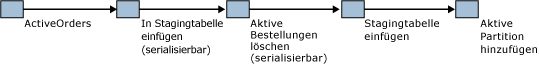

# <a name="application-pattern-for-partitioning-memory-optimized-tables"></a>Anwendungsmuster zur Partitionierung von speicheroptimierten Tabellen
[!INCLUDE[appliesto-ss-asdb-xxxx-xxx-md](../../includes/appliesto-ss-asdb-xxxx-xxx-md.md)]

  [!INCLUDE[hek_2](../../includes/hek-2-md.md)] unterstützt ein Muster, bei dem eine begrenzte Menge aktiver Daten in einer speicheroptimierten Tabelle gespeichert wird, während Daten, auf die seltener zugegriffen wird, auf dem Datenträger verarbeitet werden. In einem typischen Szenario würden Daten auf Grundlage eines **datetime** -Schlüssels gespeichert.  
  
 Sie können partitionierte Tabellen mit speicheroptimierten Tabellen emulieren, indem Sie eine partitionierte Tabelle und eine speicheroptimierte Tabelle mit einem gemeinsamen Schema verwalten. Aktuelle Daten würden in die speicheroptimierte Tabelle eingefügt und aktualisiert, während Daten, auf die weniger häufig zugegriffen wird, in der herkömmlichen partitionierten Tabelle verwaltet würden.  
  
 Eine Anwendung, die weiß, dass sich die aktiven Daten in einer speicheroptimierten Tabelle befinden, kann systemintern kompilierte gespeicherte Prozeduren verwenden, um auf die Daten zuzugreifen. Vorgänge, die auf alle Daten zugreifen müssen oder die nicht wissen, welche Tabelle relevante Daten enthält, verwenden interpretiertes [!INCLUDE[tsql](../../includes/tsql-md.md)] , um die speicheroptimierte Tabelle mit der partitionierten Tabelle zu verknüpfen.  
  
 Dieser Partitionswechsel wird folgendermaßen beschrieben:  
  
-   Fügen Sie Daten aus der In-Memory OLTP-Tabelle in eine Stagingtabelle ein, möglicherweise mit einem Umstellungsdatum.  
  
-   Löschen Sie diese Daten aus der speicheroptimierten Tabelle.  
  
-   Übertragen Sie die Stagingtabelle.  
  
-   Fügen Sie die aktive Partition hinzu.  
  
   
Pflege aktiver Daten  
  
 Die Aktionen ab dem Löschen von "ActiveOrders" müssen während eines Wartungsfensters durchgeführt werden, damit Abfragen im Zeitraum zwischen der Datenlöschung und Übertragung in die Stagingtabelle immer auf alle Daten zugreifen können.  
  
 Ein Beispiel dazu finden Sie unter [Partitionierung auf Anwendungsebene](../../relational-databases/in-memory-oltp/application-level-partitioning.md).  
  
## <a name="code-sample"></a>Codebeispiel  
 Im folgenden Beispiel wird gezeigt, wie eine speicheroptimierte Tabelle mit einer partitionierten datenträgerbasierten Tabelle verwendet wird. Häufig verwendete Daten werden im Arbeitsspeicher gespeichert. Um die Daten auf dem Datenträger zu speichern, erstellen Sie eine neue Partition, und kopieren Sie die Daten in die partitionierte Tabelle.  
  
 Im ersten Teil dieses Beispiels werden die Datenbank und die erforderlichen Objekte erstellt. Im zweiten Teil des Beispiels wird gezeigt, wie Daten aus einer speicheroptimierten Tabelle in eine partitionierte Tabelle verschoben werden.  
  
```tsql  
CREATE DATABASE partitionsample;  
GO  
  
-- enable for In-Memory OLTP - change file path as needed  
ALTER DATABASE partitionsample ADD FILEGROUP partitionsample_mod CONTAINS MEMORY_OPTIMIZED_DATA  
ALTER DATABASE partitionsample ADD FILE( NAME = 'partitionsample_mod' , FILENAME = 'c:\data\partitionsample_mod') TO FILEGROUP partitionsample_mod;  
GO  
  
USE partitionsample;  
GO  
  
-- frequently used portion of the SalesOrders - memory-optimized  
  
CREATE TABLE dbo.SalesOrders_hot (  
   so_id INT IDENTITY PRIMARY KEY NONCLUSTERED,  
   cust_id INT NOT NULL,  
   so_date DATETIME2 NOT NULL INDEX ix_date NONCLUSTERED,  
   so_total MONEY NOT NULL,  
   INDEX ix_date_total NONCLUSTERED (so_date desc, so_total desc)  
) WITH (MEMORY_OPTIMIZED=ON)  
GO  
  
-- cold portion of the SalesOrders - partitioned disk-based table  
CREATE PARTITION FUNCTION [ByDatePF](datetime2) AS RANGE RIGHT   
   FOR VALUES();  
GO  
  
CREATE PARTITION SCHEME [ByDateRange]   
   AS PARTITION [ByDatePF]   
   ALL TO ([PRIMARY]);  
GO  
  
CREATE TABLE dbo.SalesOrders_cold (  
   so_id INT NOT NULL,  
   cust_id INT NOT NULL,  
   so_date DATETIME2 NOT NULL,  
   so_total MONEY NOT NULL,  
   CONSTRAINT PK_SalesOrders_cold PRIMARY KEY (so_id, so_date),  
   INDEX ix_date_total NONCLUSTERED (so_date desc, so_total desc)  
) ON [ByDateRange](so_date)  
GO  
  
-- table for temporary partitions  
CREATE TABLE dbo.SalesOrders_cold_staging (  
   so_id INT NOT NULL,  
   cust_id INT NOT NULL,  
   so_date datetime2 NOT NULL,  
   so_total MONEY NOT NULL,  
   CONSTRAINT PK_SalesOrders_cold_staging PRIMARY KEY (so_id, so_date),  
   INDEX ix_date_total NONCLUSTERED (so_date desc, so_total desc),  
   CONSTRAINT CHK_SalesOrders_cold_staging CHECK (so_date >= '1900-01-01')  
)  
GO  
  
-- aggregate view of the hot and cold data  
CREATE VIEW dbo.SalesOrders  
AS SELECT so_id,  
   cust_id,  
   so_date,  
   so_total,  
   1 AS 'is_hot'  
   FROM dbo.SalesOrders_hot  
   UNION ALL  
   SELECT so_id,  
          cust_id,  
          so_date,  
          so_total,  
          0 AS 'is_hot'  
          FROM dbo.SalesOrders_cold;  
GO  
  
-- move all sales orders up to the split date to cold storage  
CREATE PROCEDURE dbo.usp_SalesOrdersOffloadToCold @splitdate datetime2  
   AS  
   BEGIN  
      BEGIN TRANSACTION;  
      -- create new heap based on the hot data to be moved to cold storage  
      INSERT INTO dbo.SalesOrders_cold_staging WITH( TABLOCKX)  
      SELECT so_id , cust_id , so_date , so_total  
         FROM dbo.SalesOrders_hot WITH ( serializable)  
         WHERE so_date <= @splitdate;  
  
      -- remove moved data  
      DELETE FROM dbo.SalesOrders_hot WITH( SERIALIZABLE)  
         WHERE so_date <= @splitdate;  
  
      -- update partition function, and switch in new partition  
      ALTER PARTITION SCHEME [ByDateRange] NEXT USED [PRIMARY];  
  
      DECLARE @p INT = ( SELECT MAX( partition_number) FROM sys.partitions WHERE object_id = OBJECT_ID( 'dbo.SalesOrders_cold'));  
      EXEC sp_executesql N'alter table dbo.SalesOrders_cold_staging  
         SWITCH TO dbo.SalesOrders_cold partition @i' , N'@i int' , @i = @p;  
  
      ALTER PARTITION FUNCTION [ByDatePF]()  
      SPLIT RANGE( @splitdate);  
  
      -- modify constraint on staging table to align with new partition  
      ALTER TABLE dbo.SalesOrders_cold_staging DROP CONSTRAINT CHK_SalesOrders_cold_staging;  
  
      DECLARE @s nvarchar( 100) = CONVERT( nvarchar( 100) , @splitdate , 121);  
      DECLARE @sql nvarchar( 1000) = N'alter table dbo.SalesOrders_cold_staging   
         add constraint CHK_SalesOrders_cold_staging check (so_date > ''' + @s + ''')';  
      PRINT @sql;  
      EXEC sp_executesql @sql;  
  
      COMMIT;  
END;  
GO  
  
-- insert sample values in the hot table  
INSERT INTO dbo.SalesOrders_hot VALUES(1,SYSDATETIME(), 1);   
GO  
  
INSERT INTO dbo.SalesOrders_hot VALUES(1, SYSDATETIME(), 1);  
GO  
  
INSERT INTO dbo.SalesOrders_hot VALUES(1, SYSDATETIME(), 1);  
GO  
  
-- verify contents of the table  
SELECT *  FROM dbo.SalesOrders;  
GO  
  
-- offload all sales orders to date to cold storage  
DECLARE  @t datetime2 = SYSDATETIME();  
EXEC dbo.usp_SalesOrdersOffloadToCold @t;  
  
-- verify contents of the tables  
SELECT * FROM dbo.SalesOrders;  
GO  
  
-- verify partitions  
SELECT OBJECT_NAME( object_id) , * FROM sys.dm_db_partition_stats ps  
   WHERE object_id = OBJECT_ID( 'dbo.SalesOrders_cold');  
  
-- insert more rows in the hot table  
INSERT INTO dbo.SalesOrders_hot VALUES(2, SYSDATETIME(), 1);  
GO  
  
INSERT INTO dbo.SalesOrders_hot VALUES(2, SYSDATETIME(), 1);  
GO  
  
INSERT INTO dbo.SalesOrders_hot VALUES(2, SYSDATETIME(), 1);  
GO  
  
-- verify contents of the tables  
SELECT * FROM dbo.SalesOrders;  
GO  
  
-- offload all sales orders to date to cold storage  
DECLARE @t datetime2 = SYSDATETIME();  
EXEC dbo.usp_SalesOrdersOffloadToCold @t;  
  
-- verify contents of the tables  
SELECT * FROM dbo.SalesOrders;  
GO  
  
-- verify partitions  
SELECT OBJECT_NAME( object_id) , partition_number , row_count  FROM sys.dm_db_partition_stats ps  
  WHERE object_id = OBJECT_ID( 'dbo.SalesOrders_cold') AND index_id = 1;  
```  
  
## <a name="see-also"></a>Siehe auch  
 [Speicheroptimierte Tabellen](../../relational-databases/in-memory-oltp/memory-optimized-tables.md)  
  
  

