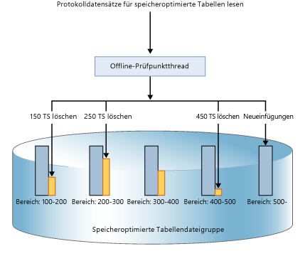
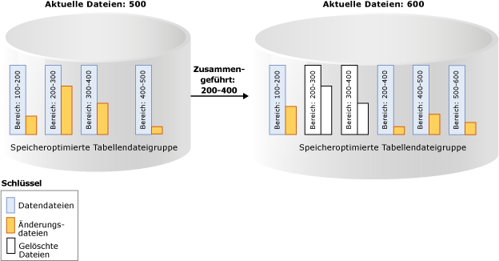

# Dauerhaftigkeit für speicheroptimierte Tabellen
[!INCLUDE[appliesto-ss-xxxx-xxxx-xxx-md](../../includes/appliesto-ss-xxxx-xxxx-xxx-md.md)]

  [!INCLUDE[hek_2](../../includes/hek-2-md.md)] bietet vollständige Dauerhaftigkeit für speicheroptimierte Tabellen. Wenn für eine Transaktion, durch die eine speicheroptimierte Tabelle geändert wurde, ein Commit ausgeführt wird, gewährleistet [!INCLUDE[ssNoVersion](../../includes/ssnoversion-md.md)] (genauso wie bei datenträgerbasierten Tabellen), dass die Änderungen dauerhaft sind (bei einem Neustart der Datenbank erhalten bleiben), vorausgesetzt der zugrunde liegende Speicher ist verfügbar. Die Dauerhaftigkeit basiert auf zwei Hauptmechanismen: der Transaktionsprotokollierung und der dauerhaften Speicherung von Datenänderungen auf einem Datenträger.  
  
 Details zu den Größenbeschränkungen für dauerhafte Tabellen finden Sie unter [Schätzen der Arbeitsspeicheranforderungen speicheroptimierter Tabellen](../../relational-databases/in-memory-oltp/estimate-memory-requirements-for-memory-optimized-tables.md). 
  
## Transaktionsprotokoll  
 Alle Änderungen, die an datenträgerbasierten oder dauerhaften speicheroptimierten Tabellen vorgenommen werden, werden in einem oder mehreren Transaktionsprotokoll-Datensätzen erfasst. Wenn für eine Transaktion ein Commit ausgeführt wird, werden die mit der Transaktion verknüpften Protokolldatensätze von [!INCLUDE[ssNoVersion](../../includes/ssnoversion-md.md)] auf den Datenträger geschrieben, bevor der Anwendung oder Benutzersitzung mitgeteilt wird, dass der Commit für die Transaktion abgeschlossen wurde. So wird sichergestellt, dass die von der Transaktion vorgenommenen Änderungen dauerhaft sind. Das Transaktionsprotokoll für speicheroptimierte Tabellen ist vollständig in den Protokolldatenstrom integriert, der auch von datenträgerbasierten Tabellen verwendet wird. Durch diese Integration sind vorhandene, für das Transaktionsprotokoll ausgeführte Sicherungs- und Wiederherstellungsvorgänge ohne zusätzliche Schritte weiterhin funktionsfähig. Da [!INCLUDE[hek_2](../../includes/hek-2-md.md)] jedoch den Transaktionsdurchsatz für Ihre Arbeitsauslastung deutlich erhöhen kann, wird die Protokoll-E/A unter Umständen zu einem Leistungsengpass. Um den erhöhten Durchsatz nachhaltig bewältigen zu können, müssen Sie sicherstellen, dass das Protokoll-E/A-Subsystem die höhere Last verarbeiten kann.  
  
## Daten- und Änderungsdateien  
 Die Daten in speicheroptimierten Tabellen werden als Freiform-Datenzeilen in einer In-Memory-Heap-Datenstruktur gespeichert, die durch mindestens einen Index im Arbeitsspeicher verknüpft sind. Datenzeilen weisen im Gegensatz zu datenträgerbasierten Tabellen keine Seitenstrukturen auf. Um eine langfristige Dauerhaftigkeit und ein Abschneiden des Transaktionsprotokolls zu ermöglichen, werden die für speicheroptimierte Tabellen ausgeführten Vorgänge in einer Reihe von Daten- und Änderungsdateien persistent gespeichert. Diese Dateien werden mithilfe eines asynchronen Hintergrundprozesses auf Basis des Transaktionsprotokolls generiert. Die Daten- und Änderungsdateien sind in einem oder mehreren Containern enthalten (und nutzen denselben Mechanismus wie für FILESTREAM-Daten). Diese Container sind Teil einer speicheroptimierten Dateigruppe.  
  
 Daten werden in diese Dateien streng sequenziell geschrieben. Dadurch wird die Datenträgerlatenz für herkömmliche Medien minimiert. Sie können mehrere Container auf verschiedenen Datenträgern verwenden, um die E/A-Aktivität zu verteilen. Daten- und Änderungsdateien in mehreren Containern auf verschiedenen Datenträgern verbessern die Datenbank-Wiederherstellungsleistung, wenn Daten aus den Daten- und Änderungsdateien auf dem Datenträger in den Arbeitsspeicher gelesen werden.  
  
 Benutzertransaktionen greifen nicht direkt auf Daten- und Änderungsdateien zu. Alle Datenlese- und -schreibvorgänge verwenden speicherinterne bzw. In-Memory-Datenstrukturen.  
  
### Die Datendatei  
 Eine Datendatei enthält Zeilen aus einer oder mehreren speicheroptimierten Tabellen, die von mehreren Transaktionen im Rahmen eines INSERT- oder UPDATE-Vorgangs eingefügt wurden. Beispielsweise können eine Zeile aus der speicheroptimierten Tabelle T1 und die nächste Zeile aus der speicheroptimierten Tabelle T2 stammen. Die Zeilen werden an die Datendatei in der Transaktionsreihenfolge im Transaktionsprotokoll angefügt, sodass sequenzieller Datenzugriff gewährleistet wird. Dies ermöglicht im Vergleich zu zufälliger E/A einen erheblich besseren E/A-Durchsatz.  
  
 Sobald die Datendatei voll ist, werden die Zeilen, die durch neue Transaktionen eingefügt werden, in einer weiteren Datendatei gespeichert. Im Laufe der Zeit werden die Zeilen aus dauerhaften speicheroptimierten Tabellen in einer oder mehreren Datendateien gespeichert, die Zeilen aus einem disjunkten, aber zusammenhängenden Bereich von Transaktionen enthalten. Beispielsweise enthält eine Datendatei, deren Zeitstempel für den Transaktionscommit im Bereich (100, 200) liegt, alle Zeilen, die von Transaktionen mit einem Commitzeitstempel größer als 100 und kleiner oder gleich 200 eingefügt wurden. Beim Commitzeitstempel handelt es sich um eine monoton ansteigende Zahl, die einer Transaktion zugewiesen wird, sobald sie für den Commit bereit ist. Jede Transaktion besitzt einen eindeutigen Commitzeitstempel.  
  
 Wenn eine Zeile gelöscht oder aktualisiert wird, wird die Zeile in der Datendatei nicht entfernt oder direkt geändert. Stattdessen werden die gelöschten Zeilen in einem anderen Typ von Datei, der Änderungsdatei, nachverfolgt. Updatevorgänge werden für jede einzelne Zeile als Tupel von Lösch- und Einfügevorgängen verarbeitet. Dadurch werden zufällige E/A-Vorgänge für die Datendatei verhindert.  
 
   Größe: Auf Computern mit einer Arbeitsspeicherkapazität über 16 GB beträgt die Größe jeder Datendatei ungefähr 128 MB, und auf Computern mit einer Arbeitsspeicherkapazität bis 16 GB beträgt die Größe 16 MB. In [!INCLUDE[ssSQL15](../../includes/sssql15-md.md)] kann der Modus für große Prüfpunkte verwendet werden, wenn SQL Server das Speichersubsystem für ausreichend schnell hält. Im Modus für große Prüfpunkte haben die Datendateien eine Größe von 1 GB. So wird für Arbeitsauslastungen mit hohem Durchsatz eine höhere Effizienz im Speichersubsystem möglich.  
   
### Die Änderungsdatei  
 Jeder Datendatei ist eine entsprechende Änderungsdatei zugeordnet, die den gleichen Transaktionsbereich besitzt und die gelöschten Zeilen nachverfolgt, die von Transaktionen im Transaktionsbereich eingefügt wurden. Die Daten- und Änderungsdatei wird als Prüfpunktdateipaar (CFP, Checkpoint File Pair) bezeichnet. Sie stellt die Zuordnungs- und die Zuordnungsaufhebungseinheit sowie die Einheit für Zusammenführungsvorgänge dar. Beispielsweise werden in einer Änderungsdatei, die dem Transaktionsbereich (100, 200) entspricht, gelöschte Zeilen gespeichert, die von Transaktionen im Bereich (100, 200) eingefügt wurden. Genau wie bei Datendateien wird auf Änderungsdateien sequenziell zugegriffen.  
  
 Wenn eine Zeile gelöscht wird, wird die Zeile nicht aus der Datendatei entfernt, sondern es wird ein Verweis auf die Zeile an die Änderungsdatei angefügt, die dem Transaktionsbereich zugeordnet ist, in dem diese Zeile eingefügt wurde. Da die zu löschende Zeile bereits in der Datendatei vorhanden ist, werden in der Änderungsdatei nur die Verweisinformationen `{inserting_tx_id, row_id, deleting_tx_id }` gespeichert, und sie folgt dabei der Reihenfolge der ursprünglichen DELETE- oder UPDATE-Vorgänge im Transaktionsprotokoll.  
  

 Größe: Auf Computern mit einer Arbeitsspeicherkapazität über 16 GB beträgt die Größe jeder Änderungsdatei ungefähr 16 MB, und auf Computern mit einer Arbeitsspeicherkapazität bis 16 GB beträgt die Größe 1 MB. Ab [!INCLUDE[ssSQL15](../../includes/sssql15-md.md)] kann der Modus für große Prüfpunkte verwendet werden, wenn SQL Server das Speichersubsystem für ausreichend schnell hält. Im Modus für große Prüfpunkte haben die Änderungsdateien eine Größe von 128 MB.  
 
## Auffüllen von Daten- und Änderungsdateien  
 Die Daten- und Änderungsdateien werden anhand der Datensätze des Transaktionsprotokolls aufgefüllt, die beim Commit von Transaktionen für speicheroptimierte Tabellen generiert wurden. Die Informationen über die eingefügten und gelöschten Zeilen werden an die entsprechenden Daten- und Änderungsdateien angehängt. Im Gegensatz zu datenträgerbasierte Tabellen, bei denen Daten-/Indexseiten in zufälligen E/A-Vorgängen nach einem Prüfpunkt geleert werden, wird die Persistenz von speicheroptimierten Tabellen in einem kontinuierlichen Hintergrundvorgang erreicht. Es wird auf mehrere Änderungsdateien zugegriffen, da alle Zeilen, die durch beliebige vorherige Transaktionen eingefügt wurden, durch eine Transaktion gelöscht oder aktualisiert werden können. Löschinformationen werden immer am Ende der Änderungsdatei angefügt. Eine Transaktion mit einem Commitzeitstempel von 600 fügt eine neue Zeile ein und löscht Zeilen, die durch Transaktionen mit einem Commitzeitstempel von 150, 250 und 450 eingefügt wurden, wie in der Abbildung unten dargestellt. Alle vier Datei-E/A-Vorgänge (drei für gelöschte Zeilen und einer für neu eingefügte Zeilen) sind reine Anfügungen an die entsprechenden Änderungs- und Datendateien.  
  
   
  
## Zugreifen auf Daten- und Änderungsdateien  
 Auf Daten-/Änderungsdateipaare wird in den folgenden Fällen zugegriffen:  
  
 Offline-Prüfpunkt-Arbeitsthread(s)  
 Durch diesen Thread werden Einfügungen und Löschungen in speicheroptimierte Datenzeilen an die entsprechenden Daten-/Änderungsdateipaare angefügt. In [!INCLUDE[ssSQL14](../../includes/sssql14-md.md)] gibt es einen Offline-Prüfpunkt-Arbeitsthread; ab [!INCLUDE[ssSQL15](../../includes/sssql15-md.md)] gibt es mehrere Prüfpunkt-Arbeitsthreads.  
  
 Zusammenführungsvorgang  
 Der Vorgang führt eines oder mehrere Daten-/Änderungsdateipaare zusammen und erstellt ein neues Daten-/Änderungsdateipaar.  
  
 Während der Wiederherstellung nach einem Systemabsturz  
 Wenn [!INCLUDE[ssNoVersion](../../includes/ssnoversion-md.md)] neu gestartet wird oder die Datenbank wieder online geschaltet wird, werden die speicheroptimierten Daten unter Verwendung der Daten-/Änderungsdateipaare aufgefüllt. Die Änderungsdatei dient beim Lesen der Zeilen aus der entsprechenden Datendatei als Filter für die gelöschten Zeilen. Da alle Daten-/Änderungsdateipaare unabhängig sind, werden diese Dateien parallel geladen, um die Zeit zum Laden der Daten in den Arbeitsspeicher zu verkürzen. Sobald die Daten in den Arbeitsspeicher geladen wurden, wendet das In-Memory OLTP-Modul die aktiven, von den Prüfpunktdateien noch nicht verarbeiteten Transaktionsprotokolldatensätze an, um die speicheroptimierten Daten zu vervollständigen.  
  
 Während des Wiederherstellungsvorgangs  
 Die In-Memory OLTP-Prüfpunktdateien werden aus der Datenbanksicherung erstellt. Anschließend wird mindestens eine Transaktionsprotokollsicherung angewendet. Wie bei der Wiederherstellung nach einem Systemabsturz lädt das In-Memory OLTP-Modul Daten parallel in den Arbeitsspeicher, um die Auswirkungen auf die Wiederherstellungszeit zu minimieren.  
  
## Zusammenführen von Daten- und Änderungsdateien  
 Die Daten für speicheroptimierte Tabellen werden in mindestens einem Daten-/Änderungsdateipaar gespeichert (auch als Prüfpunktdateipaar oder CFP (Checkpoint File Pair) bezeichnet). Eingefügte Zeilen werden in Datendateien gespeichert, und in Änderungsdateien werden Verweise auf gelöschte Zeilen gespeichert. Während der Ausführung einer OLTP-Arbeitsauslastung werden beim Aktualisieren, Einfügen und Löschen von Zeilen durch DML-Vorgänge neue CFPs erstellt, um die neuen Zeilen persistent zu speichern, und der Verweis auf die gelöschten Zeilen wird an die Änderungsdateien angefügt.  
  
 Im Laufe der Zeit nimmt mit den DML-Vorgängen auch die Anzahl der Daten- und Änderungsdateien zu. Dies führt zu einer höheren Speicherbelegung auf dem Datenträger und zu längeren Wiederherstellungszeiten.  
  
 Zur Vermeidung solcher Ineffizienzen werden ältere geschlossene Daten- und Änderungsdateien entsprechend der weiter unten beschriebenen Zusammenführungsrichtlinie zusammengeführt, sodass das Speicherarray komprimiert wird, um den gleichen Satz von Daten mit einer geringeren Anzahl von Dateien darzustellen.  
  
 Der Zusammenführungsvorgang akzeptiert als Eingabe eines oder mehrere angrenzende geschlossene Prüfpunktdateipaare (CFPs, Checkpoint File Pairs). Dies sind Paare aus Daten- und Änderungsdateien (die sogenannte Zusammenführungsquelle), die auf Grundlage einer intern definierten Zusammenführungsrichtlinie zu einem resultierenden CFP (dem sogenannten Zusammenführungsziel) zusammengeführt werden. Die Einträge in jeder Änderungsdatei der Quell-CFPs werden zum Filtern der Zeilen aus der entsprechenden Datendatei verwendet, um die nicht benötigten Datensätze zu entfernen. Die verbleibenden Zeilen in den Quell-CFPs werden zu einem Ziel-CFP zusammengefasst. Nach Abschluss des Zusammenführungsvorgangs werden die Quell-CFPs (Zusammenführungsquellen) durch das CFP des Zusammenführungsziels ersetzt. Die CFPs der Zusammenführungsquelle durchlaufen eine Übergangsphase, bevor sie aus dem Speicher entfernt werden.  
  
 Im Beispiel unten sind für die speicheroptimierte Tabellendateigruppe vier Daten-/Änderungsdateipaare mit Daten aus vorhergehenden Transaktionen bei Zeitstempel 500 vorhanden. Beispielsweise entsprechen die ersten Zeilen in der Datendatei Transaktionen mit einem Zeitstempel, der größer als 100 und kleiner oder gleich 200 ist, alternativ ausgedrückt als (100, 200). Die zweite und dritte Datendatei werden nach Berücksichtigung der als gelöscht gekennzeichneten Zeilen zu weniger als 50 % gefüllt angezeigt. Der Zusammenführungsvorgang kombiniert diese beiden CFPs und erstellt ein neues CFP mit Transaktionen, deren Zeitstempel größer als 200 und kleiner oder gleich 400 ist. Dies entspricht dem kombinierten Bereich dieser beiden CFPs. Es wird ein weiteres CFP mit dem Bereich (500, 600) angezeigt, und eine nicht leere Änderungsdatei für den Transaktionsbereich (200, 400) gibt an, dass der Zusammenführungsvorgang parallel zur Transaktionsaktivität erfolgen kann, einschließlich des Löschens mehrerer Zeilen aus den Quell-CFPs.  
  
   
  
 In einem Hintergrundthread werden alle geschlossenen CFPs mithilfe einer Zusammenführungsrichtlinie ausgewertet und dann eine oder mehrere Zusammenführungsanforderungen für die qualifizierenden CFPs initiiert. Diese Zusammenführungsanforderungen werden vom Offline-Prüfpunktthread verarbeitet. Die Auswertung der Zusammenführungsrichtlinie erfolgt in regelmäßigen Abständen sowie beim Schließen eines Prüfpunkts.  
  
### [!INCLUDE[ssNoVersion](../../includes/ssnoversion-md.md)] -Zusammenführungsrichtlinie  
 [!INCLUDE[ssNoVersion](../../includes/ssnoversion-md.md)] implementiert die folgende Zusammenführungsrichtlinie:  
  
-   Eine Zusammenführung wird geplant, wenn mindestens zwei aufeinanderfolgende CFPs konsolidiert werden können, nachdem gelöschte Zeilen berücksichtigt wurden, sodass die resultierenden Zeilen in einem CFP der Zielgröße Platz finden. Die Zielgröße der Daten- und Änderungsdateien entspricht den oben beschriebenen ursprünglichen Größenvorgaben.  
  
-   Ein einzelnes CFP kann mit sich selbst zusammengeführt werden, wenn die Datendatei das Doppelte der Zielgröße überschreitet und mehr als die Hälfte der Zeilen gelöscht sind. Eine Datendatei kann beispielsweise über die Zielgröße hinauswachsen, wenn durch eine einzelne oder mehrere gleichzeitige Transaktionen eine große Datenmenge eingefügt oder aktualisiert wird und die Vergrößerung der Datendatei über die Zielgröße hinaus erzwungen wird, weil eine Transaktion nicht auf mehrere CFPs verteilt werden kann.  
  
 Im Folgenden finden Sie einige Beispiele, die veranschaulichen, welche CFPs gemäß der Zusammenführungsrichtlinie zusammengeführt werden:  
  
|Angrenzende CFP-Quelldateien (% voll)|Zusammenführungsauswahl|  
|-------------------------------------------|---------------------|  
|CFP0 (30 %), CFP1 (50 %), CFP2 (50 %), CFP3 (90 %)|(CFP0, CFP1)   CFP2 wird nicht ausgewählt, da andernfalls die resultierende Datendatei größer als 100 % der idealen Größe wird.|  
|CFP0 (30 %), CFP1 (20 %), CFP2 (50 %), CFP3 (10 %)|(CFP0, CFP1, CFP2). Dateien werden von links nach rechts ausgewählt.   CTP3 wird nicht ausgewählt, da andernfalls die resultierende Datendatei größer als 100 % der idealen Größe wird.|  
|CFP0 (80 %), CFP1 (30 %), CFP2 (10 %), CFP3 (40 %)|(CFP1, CFP2, CFP3). Dateien werden von links nach rechts ausgewählt.   CFP0 wird übersprungen, da die resultierende Datendatei bei Kombination mit CFP1 größer als 100 % der idealen Größe wird.|  
  
 Nicht alle CFPs mit verfügbarem Speicherplatz kommen für die Zusammenführung infrage. Wenn beispielsweise zwei aufeinanderfolgende CFPs zu 60 % gefüllt sind, kommen sie für eine Zusammenführung nicht infrage, und jedes dieser CFPs weist 40 % nicht genutzten Speicherplatz auf. Im ungünstigsten Fall sind alle CFPs zu 50 % gefüllt, was einer Speicherauslastung von nur 50 % entspricht. Auch wenn die gelöschten Zeilen möglicherweise im Speicher vorhanden sind, da die CFPs für eine Zusammenführung nicht infrage kommen, wurden die gelöschten Zeilen möglicherweise bereits von der In-Memory-Garbage Collection aus dem Arbeitsspeicher entfernt. Die Verwaltung des Speichers und des Arbeitsspeichers erfolgt unabhängig von der Garbage Collection. Der Speicher, der von aktiven CFPs belegt wird (nicht alle CFPs werden aktualisiert), kann doppelt so groß wie bei dauerhaften Tabellen im Arbeitsspeicher ausfallen.  
  
### Lebenszyklus eines CFP  
 CFPs durchlaufen mehrere Zustände, bevor ihre Zuordnung aufgehoben werden kann. Als Folge der Datenbank-Prüfpunkte und Protokollsicherungen durchlaufen die Dateien die Phasen, und am Ende werden die nicht mehr benötigten Dateien bereinigt. Eine Beschreibung dieser Phasen finden Sie unter [sys.dm_db_xtp_checkpoint_files &#40;Transact-SQL&#41;](../../relational-databases/system-dynamic-management-views/sys-dm-db-xtp-checkpoint-files-transact-sql.md).  
  
 Sie können manuell erzwingen, dass ein Prüfpunkt mit anschließender Protokollsicherung die Garbage Collection beschleunigt. In Produktionsszenarien durchlaufen CFPs aufgrund der automatischen Prüfpunkte und Protokollsicherungen, die im Rahmen der Sicherungsstrategie ausgeführt werden, diese Phasen nahtlos, ohne dass ein manueller Eingriff erforderlich ist. Als Folge des Garbage Collection-Vorgangs weisen Datenbanken mit speicheroptimierten Tabellen gegenüber ihrer Größe im Arbeitsspeicher möglicherweise eine höhere Größe im Speicher auf. Wenn Prüfpunkte und Protokollsicherungen nicht ausgeführt werden, wächst der Speicherplatzbedarf für die Prüfpunktdateien auf dem Datenträger weiter an.  
  
## Weitere Informationen finden Sie unter  
 [Erstellen und Verwalten von Speicher für speicheroptimierte Objekte](../../relational-databases/in-memory-oltp/creating-and-managing-storage-for-memory-optimized-objects.md)  
  
  
