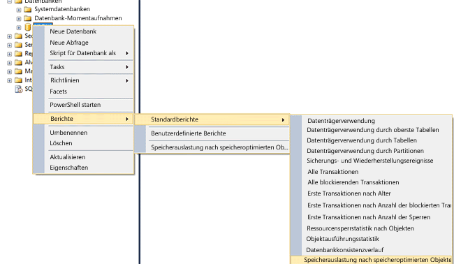

# <a name="monitor-and-troubleshoot-memory-usage"></a>Überwachung und Fehlerbehebung für die Arbeitsspeicherauslastung
[!INCLUDE[appliesto-ss-asdb-xxxx-xxx-md](../../includes/appliesto-ss-asdb-xxxx-xxx-md.md)] [!INCLUDE[hek_1](../../includes/hek-1-md.md)] nutzt Arbeitsspeicher auf andere Weise als datenträgerbasierte Tabellen. Sie können die Größe des von speicheroptimierten Tabellen und Indizes belegten und verwendeten Arbeitsspeichers in der Datenbank mit den DMVs oder Leistungsindikatoren überwachen, die für den Arbeitsspeicher und das Garbage Collection-Subsystem bereitgestellt werden.  Auf diese Weise behalten Sie den Überblick auf System- und Datenbankebene und können Probleme aufgrund einer zu hohen Arbeitsspeicherauslastung vermeiden.  
  
 In diesem Thema wird das Überwachen der [!INCLUDE[hek_2](../../includes/hek-2-md.md)] -Speicherauslastung behandelt.  
  
## <a name="sections-in-this-topic"></a>Abschnitte in diesem Thema  
  
-   [Erstellen einer Beispieldatenbank mit speicheroptimierten Tabellen](../../relational-databases/in-memory-oltp/monitor-and-troubleshoot-memory-usage.md#bkmk_CreateDB)  
  
-   [Überwachen der Arbeitsspeicherverwendung](../../relational-databases/in-memory-oltp/monitor-and-troubleshoot-memory-usage.md#bkmk_Monitoring)  
  
    -   [Verwendung von SQL Server Management Studio](../../relational-databases/in-memory-oltp/monitor-and-troubleshoot-memory-usage.md#bkmk_UsingSSMS)  
  
    -   [Verwenden von DMVs](../../relational-databases/in-memory-oltp/monitor-and-troubleshoot-memory-usage.md#bkmk_UsingDMVs)  
  
-   [Verwalten des von speicheroptimierten Objekten beanspruchten Arbeitsspeichers](../../relational-databases/in-memory-oltp/monitor-and-troubleshoot-memory-usage.md#bkmk_MemOptObjects)  
  
-   [Problembehandlung bei Arbeitsspeicherproblemen](../../relational-databases/in-memory-oltp/monitor-and-troubleshoot-memory-usage.md#bkmk_Troubleshooting)  
  
##  <a name="bkmk_CreateDB"></a> Erstellen einer Beispieldatenbank mit speicheroptimierten Tabellen  
 Sie können diesen Abschnitt überspringen, wenn Sie bereits über eine Datenbank mit speicheroptimierten Tabellen verfügen.  
  
 In den folgenden Schritten wird eine Datenbank mit drei speicheroptimierten Tabellen erstellt, die Sie im weiteren Verlauf dieses Themas verwenden können. Im Beispiel wurde die Datenbank einem Ressourcenpool zugeordnet, um zu steuern, wie viel Arbeitsspeicher von speicheroptimierten Tabellen eingenommen werden kann.  
  
1.  Starten Sie [!INCLUDE[ssManStudioFull](../../includes/ssmanstudiofull-md.md)].  
  
2.  Klicken Sie auf **Neue Abfrage**.  
  
3.  Fügen Sie den folgenden Code im Fenster für die neue Abfrage ein, und führen Sie die einzelnen Abschnitte aus.  
  
    ```  
    -- create a database to be used  
    CREATE DATABASE IMOLTP_DB  
    GO  
  
    ALTER DATABASE IMOLTP_DB ADD FILEGROUP IMOLTP_DB_xtp_fg CONTAINS MEMORY_OPTIMIZED_DATA  
    ALTER DATABASE IMOLTP_DB ADD FILE( NAME = 'IMOLTP_DB_xtp' , FILENAME = 'C:\Data\IMOLTP_DB_xtp') TO FILEGROUP IMOLTP_DB_xtp_fg;  
    GO  
  
    USE IMOLTP_DB  
    GO  
  
    -- create the resoure pool  
    CREATE RESOURCE POOL PoolIMOLTP WITH (MAX_MEMORY_PERCENT = 60);  
    ALTER RESOURCE GOVERNOR RECONFIGURE;  
    GO  
  
    -- bind the database to a resource pool  
    EXEC sp_xtp_bind_db_resource_pool 'IMOLTP_DB', 'PoolIMOLTP'  
  
    -- you can query the binding using the catalog view as described here  
    SELECT d.database_id  
         , d.name  
         , d.resource_pool_id  
    FROM sys.databases d  
    GO  
  
    -- take database offline/online to finalize the binding to the resource pool  
    USE master  
    GO  
  
    ALTER DATABASE IMOLTP_DB SET OFFLINE  
    GO  
    ALTER DATABASE IMOLTP_DB SET ONLINE  
    GO  
  
    -- create some tables  
    USE IMOLTP_DB  
    GO  
  
    -- create table t1  
    CREATE TABLE dbo.t1 (  
           c1 int NOT NULL CONSTRAINT [pk_t1_c1] PRIMARY KEY NONCLUSTERED  
         , c2 char(40) NOT NULL  
         , c3 char(8000) NOT NULL  
         ) WITH (MEMORY_OPTIMIZED = ON, DURABILITY = SCHEMA_AND_DATA)  
    GO  
  
    -- load t1 150K rows  
    DECLARE @i int = 0  
    BEGIN TRAN  
    WHILE (@i <= 150000)  
       BEGIN  
          INSERT t1 VALUES (@i, 'a', replicate ('b', 8000))  
          SET @i += 1;  
       END  
    Commit  
    GO  
  
    -- Create another table, t2  
    CREATE TABLE dbo.t2 (  
           c1 int NOT NULL CONSTRAINT [pk_t2_c1] PRIMARY KEY NONCLUSTERED  
         , c2 char(40) NOT NULL  
         , c3 char(8000) NOT NULL  
         ) WITH (MEMORY_OPTIMIZED = ON, DURABILITY = SCHEMA_AND_DATA)  
    GO  
  
    -- Create another table, t3   
    CREATE TABLE dbo.t3 (  
           c1 int NOT NULL CONSTRAINT [pk_t3_c1] PRIMARY KEY NONCLUSTERED HASH (c1) WITH (BUCKET_COUNT = 1000000)  
         , c2 char(40) NOT NULL  
         , c3 char(8000) NOT NULL  
         ) WITH (MEMORY_OPTIMIZED = ON, DURABILITY = SCHEMA_AND_DATA)  
    GO  
    ```  
  
##  <a name="bkmk_Monitoring"></a> Überwachen der Arbeitsspeicherverwendung  
  
###  <a name="bkmk_UsingSSMS"></a> Bei Verwendung von [!INCLUDE[ssManStudioFull](../../includes/ssmanstudiofull-md.md)]  
 [!INCLUDE[ssSQL14](../../includes/sssql14-md.md)] Im Lieferumfang sind integrierte Standardberichte enthalten, um den von Tabellen im Arbeitsspeicher beanspruchten Speicherplatz zu überwachen. Sie können auf diese Berichte mithilfe des Objekt-Explorers zugreifen, wie [hier](http://blogs.msdn.com/b/managingsql/archive/2006/05/16/ssms-reports-1.aspx)erläutert. Mit dem Objekt-Explorer können Sie auch den Arbeitsspeicher überwachen, der von einzelnen speicheroptimierten Tabellen beansprucht wird.  
  
#### <a name="consumption-at-the-database-level"></a>Verbrauch auf Datenbankebene  
 Sie können die Arbeitsspeicherauslastung auf Datenbankebene wie folgt überwachen.  
  
1.  Starten Sie [!INCLUDE[ssManStudioFull](../../includes/ssmanstudiofull-md.md)] , und stellen eine Verbindung mit einem Server her.  
  
2.  Klicken Sie im Objekt-Explorer mit der rechten Maustaste auf die Datenbank, für die Berichte abgerufen werden sollen.  
  
3.  Wählen Sie im Kontextmenü **Berichte** -> **Standard Berichte** -> **Speicherauslastung nach speicheroptimierten Objekten**aus.  
  
   
  
 Dieser Bericht zeigt die Arbeitsspeicherauslastung durch die oben erstellte Datenbank.  
  
   
  
###  <a name="bkmk_UsingDMVs"></a> Verwenden von DMVs  
 Es gibt mehrere DMVs zum Überwachen des durch speicheroptimierte Tabellen, Indizes, Systemobjekte und Laufzeitstrukturen verwendeten Arbeitsspeichers.  
  
#### <a name="memory-consumption-by-memory-optimized-tables-and-indexes"></a>Arbeitsspeichernutzung durch speicheroptimierte Tabellen und Indizes  
 Sie können die Arbeitsspeichernutzung für alle Benutzertabellen, Indizes und Systemobjekte ermitteln, indem Sie `sys.dm_db_xtp_table_memory_stats` wie hier dargestellt abfragen.  
  
```sql  
SELECT object_name(object_id) AS Name  
     , *  
   FROM sys.dm_db_xtp_table_memory_stats  
```  
  
 **Beispielausgabe**  
  
```  
Name       object_id   memory_allocated_for_table_kb memory_used_by_table_kb memory_allocated_for_indexes_kb memory_used_by_indexes_kb  
---------- ----------- ----------------------------- ----------------------- ------------------------------- -------------------------  
t3         629577281   0                             0                       128                             0  
t1         565577053   1372928                       1200008                 7872                            1942  
t2         597577167   0                             0                       128                             0  
NULL       -6          0                             0                       2                               2  
NULL       -5          0                             0                       24                              24  
NULL       -4          0                             0                       2                               2  
NULL       -3          0                             0                       2                               2  
NULL       -2          192                           25                      16                              16  
```  
  
 Weitere Informationen finden Sie unter [sys.dm_db_xtp_table_memory_stats](../../relational-databases/system-dynamic-management-views/sys-dm-db-xtp-table-memory-stats-transact-sql.md).  
  
#### <a name="memory-consumption-by-internal-system-structures"></a>Arbeitsspeichernutzung durch interne Systemstrukturen  
 Arbeitsspeicher wird auch durch Systemobjekte beansprucht, z. B. Transaktionsstrukturen, Puffer für Daten- und Änderungsdateien, Garbage Collection-Strukturen usw. Sie können den für diese Systemobjekte verwendeten Arbeitsspeicher abrufen, indem Sie `sys.dm_xtp_system_memory_consumers` wie hier dargestellt abfragen.  
  
```sql  
SELECT memory_consumer_desc  
     , allocated_bytes/1024 AS allocated_bytes_kb  
     , used_bytes/1024 AS used_bytes_kb  
     , allocation_count  
   FROM sys.dm_xtp_system_memory_consumers  
```  
  
 **Beispielausgabe**  
  
```  
memory_consumer_ desc allocated_bytes_kb   used_bytes_kb        allocation_count  
------------------------- -------------------- -------------------- ----------------  
VARHEAP                   0                    0                    0  
VARHEAP                   384                  0                    0  
DBG_GC_OUTSTANDING_T      64                   64                   910  
ACTIVE_TX_MAP_LOOKAS      0                    0                    0  
RECOVERY_TABLE_CACHE      0                    0                    0  
RECENTLY_USED_ROWS_L      192                  192                  261  
RANGE_CURSOR_LOOKSID      0                    0                    0  
HASH_CURSOR_LOOKASID      128                  128                  455  
SAVEPOINT_LOOKASIDE       0                    0                    0  
PARTIAL_INSERT_SET_L      192                  192                  351  
CONSTRAINT_SET_LOOKA      192                  192                  646  
SAVEPOINT_SET_LOOKAS      0                    0                    0  
WRITE_SET_LOOKASIDE       192                  192                  183  
SCAN_SET_LOOKASIDE        64                   64                   31  
READ_SET_LOOKASIDE        0                    0                    0  
TRANSACTION_LOOKASID      448                  448                  156  
PGPOOL:256K               768                  768                  3  
PGPOOL: 64K               0                    0                    0  
PGPOOL:  4K               0                    0                    0  
```  
  
 Weitere Informationen finden Sie unter [sys.dm_xtp_system_memory_consumers &#40;Transact-SQL&#41;](../../relational-databases/system-dynamic-management-views/sys-dm-xtp-system-memory-consumers-transact-sql.md).  
  
#### <a name="memory-consumption-at-run-time-when-accessing-memory-optimized-tables"></a>Arbeitsspeichernutzung zur Laufzeit beim Zugriff auf speicheroptimierte Tabellen  
 Mit der folgenden Abfrage können Sie den von Laufzeitstrukturen wie dem Prozedurcache beanspruchten Arbeitsspeicher bestimmen. Führen Sie diese Abfrage aus, um den von Laufzeitstrukturen wie dem Prozedurcache beanspruchten Arbeitsspeicher abzurufen. Alle Laufzeitstrukturen werden mit XTP markiert.  
  
```sql  
SELECT memory_object_address  
     , pages_in_bytes  
     , bytes_used  
     , type  
   FROM sys.dm_os_memory_objects WHERE type LIKE '%xtp%'  
```  
  
 **Beispielausgabe**  
  
```  
memory_object_address pages_ in_bytes bytes_used type  
--------------------- ------------------- ---------- ----  
0x00000001F1EA8040    507904              NULL       MEMOBJ_XTPDB  
0x00000001F1EAA040    68337664            NULL       MEMOBJ_XTPDB  
0x00000001FD67A040    16384               NULL       MEMOBJ_XTPPROCCACHE  
0x00000001FD68C040    16384               NULL       MEMOBJ_XTPPROCPARTITIONEDHEAP  
0x00000001FD284040    16384               NULL       MEMOBJ_XTPPROCPARTITIONEDHEAP  
0x00000001FD302040    16384               NULL       MEMOBJ_XTPPROCPARTITIONEDHEAP  
0x00000001FD382040    16384               NULL       MEMOBJ_XTPPROCPARTITIONEDHEAP  
0x00000001FD402040    16384               NULL       MEMOBJ_XTPPROCPARTITIONEDHEAP  
0x00000001FD482040    16384               NULL       MEMOBJ_XTPPROCPARTITIONEDHEAP  
0x00000001FD502040    16384               NULL       MEMOBJ_XTPPROCPARTITIONEDHEAP  
0x00000001FD67E040    16384               NULL       MEMOBJ_XTPPROCPARTITIONEDHEAP  
0x00000001F813C040    8192                NULL       MEMOBJ_XTPBLOCKALLOC  
0x00000001F813E040    16842752            NULL       MEMOBJ_XTPBLOCKALLOC  
```  
  
 Weitere Informationen finden Sie unter [sys.dm_os_memory_objects (Transact-SQL)](../../relational-databases/system-dynamic-management-views/sys-dm-os-memory-objects-transact-sql.md).  
  
#### <a name="memory-consumed-by-includehek2includeshek-2-mdmd-engine-across-the-instance"></a>Arbeitsspeichernutzung durch das [!INCLUDE[hek_2](../../includes/hek-2-md.md)] -Modul in der Instanz  
 Der vom [!INCLUDE[hek_2](../../includes/hek-2-md.md)] -Modul und den speicheroptimierten Objekten belegte Arbeitsspeicher wird auf dieselbe Weise wie jeder andere Arbeitsspeicherconsumer innerhalb einer [!INCLUDE[ssNoVersion](../../includes/ssnoversion-md.md)] -Instanz verwaltet. Der gesamte vom [!INCLUDE[hek_2](../../includes/hek-2-md.md)] -Modul belegte Arbeitsspeicher wird von Clerks des Typs MEMORYCLERK_XTP nachverfolgt. Rufen Sie mit der folgenden Abfrage den gesamten vom [!INCLUDE[hek_2](../../includes/hek-2-md.md)] -Modul verwendeten Arbeitsspeicher ab.  
  
```sql  
-- this DMV accounts for all memory used by the hek_2 engine  
SELECT type  
     , name  
     , memory_node_id  
     , pages_kb/1024 AS pages_MB   
   FROM sys.dm_os_memory_clerks WHERE type LIKE '%xtp%'  
```  
  
 Die Beispielausgabe zeigt, dass 18 MB des insgesamt zugeordneten Arbeitsspeichers auf die Arbeitsspeichernutzung auf Systemebene und 1.358 MB auf die Datenbank mit der ID 5 entfallen. Da diese Datenbank einem dedizierten Ressourcenpool zugeordnet ist, wird dieser Arbeitsspeicher auf diesen Ressourcenpool angerechnet.  
  
 **Beispielausgabe**  
  
```  
type                 name       memory_node_id pages_MB  
-------------------- ---------- -------------- --------------------  
MEMORYCLERK_XTP      Default    0              18  
MEMORYCLERK_XTP      DB_ID_5    0              1358  
MEMORYCLERK_XTP      Default    64             0  
```  
  
 Weitere Informationen finden Sie unter [sys.dm_os_memory_clerks (Transact-SQL)](../../relational-databases/system-dynamic-management-views/sys-dm-os-memory-clerks-transact-sql.md).  
  
##  <a name="bkmk_MemOptObjects"></a> Verwalten des von speicheroptimierten Objekten beanspruchten Arbeitsspeichers  
 Sie können den insgesamt von speicheroptimierten Tabellen beanspruchten Arbeitsspeicher steuern, indem Sie ihn an einen benannten Ressourcenpool binden, wie im Thema [Binden einer Datenbank mit speicheroptimierten Tabellen an einen Ressourcenpool](../../relational-databases/in-memory-oltp/bind-a-database-with-memory-optimized-tables-to-a-resource-pool.md)beschrieben.  
  
##  <a name="bkmk_Troubleshooting"></a> Problembehandlung bei Arbeitsspeicherproblemen  
 Die Problembehandlung für den Arbeitsspeicher besteht aus drei Schritten:  
  
1.  Identifizieren Sie, wie viel Arbeitsspeicher von den Objekten in der Datenbank oder Instanz beansprucht wird. Wie oben beschrieben, können Sie eine Vielzahl von Überwachungstools verwenden, die für speicheroptimierte Tabellen verfügbar sind.  Dies sind beispielsweise die DMVs `sys.dm_db_xtp_table_memory_stats` und `sys.dm_os_memory_clerks`.  
  
2.  Bestimmen Sie, wie die Arbeitsspeichernutzung zunimmt und wie viel Spielraum noch vorhanden ist. Durch die regelmäßige Überwachung der Arbeitsspeichernutzung können Sie beurteilen, in welchem Maße die Arbeitsspeicherauslastung zunimmt. Wenn Sie die Datenbank z. B. einem benannten Ressourcenpool zugeordnet haben, können Sie mit dem Leistungsindikator "Verwendeter Arbeitsspeicher (KB)" überwachen, wie die Speicherauslastung zunimmt.  
  
3.  Ergreifen Sie entsprechende Maßnahmen, um mögliche Probleme mit dem Arbeitsspeicher zu vermeiden. Weitere Informationen finden Sie unter [Beheben von OOM-Problemen (nicht genügend Arbeitsspeicher)](../../relational-databases/in-memory-oltp/resolve-out-of-memory-issues.md).  
  
## <a name="see-also"></a>Weitere Informationen finden Sie unter  
 [Binden einer Datenbank mit speicheroptimierten Tabellen an einen Ressourcenpool](../../relational-databases/in-memory-oltp/bind-a-database-with-memory-optimized-tables-to-a-resource-pool.md)   
 [Ändern von MIN_MEMORY_PERCENT und MAX_MEMORY_PERCENT für einen vorhandenen Pool](../../relational-databases/in-memory-oltp/bind-a-database-with-memory-optimized-tables-to-a-resource-pool.md#bkmk_ChangeAllocation)  
  
  
