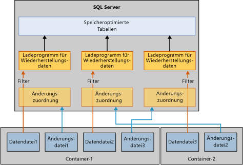

# Wiederherstellen von speicheroptimierten Tabellen
[!INCLUDE[appliesto-ss-xxxx-xxxx-xxx-md](../../includes/appliesto-ss-xxxx-xxxx-xxx-md.md)]

  Der grundlegende Mechanismus zum Wiederherstellen einer Datenbank mit speicheroptimierten Tabellen ist ähnlich wie bei Datenbanken, die nur datenträgerbasierte Tabellen enthalten. Anders als datenträgerbasierte Tabellen müssen speicheroptimierte Tabellen jedoch in den Arbeitsspeicher geladen werden, bevor die Benutzer auf die Datenbank zugreifen können. Hierdurch wird ein neuer Schritt bei der Datenbankwiederherstellung hinzugefügt.  
  
 Während der Wiederherstellung liest das In-Memory OLTP-Modul Daten- und Änderungsdateien zum Laden in den physischen Speicher. Die Ladezeit wird bestimmt durch:  
  
-   Die zu ladende Datenmenge.  
  
-   Sequenzielle E/A-Bandbreite.  
  
-   Grad der Parallelität, bestimmt anhand der Anzahl der Dateicontainer und Prozessorkerne.  
  
-   Die Anzahl von Protokolldatensätzen im aktiven Teil des Protokolls, die wiederholt werden müssen.  
  
 Beim Neustart von [!INCLUDE[ssNoVersion](../../includes/ssnoversion-md.md)] durchläuft jede Datenbank eine Wiederherstellungsphase, die aus den folgenden drei Phasen besteht:  
  
1.  Die Analysephase. Während dieser Phase werden die aktiven Transaktionsprotokolle durchsucht, um Transaktionen mit ausgeführtem Commit und Transaktionen ohne Commit zu erkennen. Das In-Memory OLTP-Modul identifiziert den zu ladenden Prüfpunkt und lädt die Protokolleinträge der Systemtabelle vorab. Außerdem werden einige Protokolldatensätze für die Dateizuordnung verarbeitet.  
  
2.  Die Rollforwardphase. Diese Phase wird für datenträgerbasierte und speicheroptimierte Tabellen gleichzeitig ausgeführt.  
  
     Bei datenträgerbasierten Tabellen wird die Datenbank auf den aktuellen Stand verschoben, und es werden Sperren abgerufen, die von Transaktionen ohne Commit aktiviert wurden.  
  
     Bei speicheroptimierten Tabellen werden Daten aus den Daten- und Änderungsdateipaaren in den Arbeitsspeicher geladen, und die Daten werden dann mit dem aktiven Transaktionsprotokoll auf Grundlage des letzten permanenten Prüfpunkts aktualisiert.  
  
     Wenn die oben genannten Vorgänge für datenträgerbasierte und speicheroptimierte Tabellen abgeschlossen wurden, kann auf die Datenbank zugegriffen werden.  
  
3.  Die Rollbackphase. In dieser Phase wird für die Transaktionen ohne Commit ein Rollback ausgeführt.  
  
 Das Laden von speicheroptimierten Tabellen in den Arbeitsspeicher kann die Leistung des Wiederherstellungszeitziels (Recovery Time Objective, RTO) beeinträchtigen. Um die Ladezeit von speicheroptimierten Daten aus Daten- und Änderungsdateien zu verbessern, lädt das In-Memory OLTP-Modul die Daten-/Änderungsdateien wie folgt parallel:  
  
-   Erstellen eines Änderungszuordnungsfilters. In Änderungsdateien werden Verweise auf die gelöschten Zeilen gespeichert. Ein Thread pro Container liest die Änderungsdateien und erstellt einen Änderungszuordnungsfilter. (Eine speicheroptimierte Datendateigruppe kann mehrere Container enthalten.)  
  
-   Streaming der Datendateien.  Sobald der Änderungszuordnungsfilter erstellt wurde, werden Datendateien mit so vielen Threads gelesen wie logische CPUs vorhanden sind. Jeder Thread, der die Datendatei liest, liest die Datenzeilen, überprüft die zugeordnete Änderungszuordnung und fügt die Zeile nur dann in der Tabelle ein, wenn diese Zeile nicht als gelöscht markiert wurde. Dieser Teil der Wiederherstellung kann in einigen Fällen CPU-gebunden sein, wie unten aufgeführt.  
  
   
  
 Speicheroptimierte Tabellen können generell mit der Geschwindigkeit des E/A-Vorgangs in den Arbeitsspeicher geladen werden, in einigen Situationen dauert das Laden von Datenzeilen in den Arbeitsspeicher jedoch länger. Dies ist insbesondere in folgenden Situationen der Fall:  
  
-   Eine niedrige Bucketanzahl für den Hashindex kann zu übermäßigen Konflikten führen, wodurch das Einfügen von Datenzeilen langsamer erfolgt. Dies führt normalerweise zu einer sehr hohen allgemeinen CPU-Auslastung, insbesondere gegen Ende der Wiederherstellung. Wenn Sie den Hashindex ordnungsgemäß konfiguriert haben, sollte die Wiederherstellungszeit nicht beeinträchtigt werden.  
  
-   Große speicheroptimierte Tabellen mit einem oder mehreren nicht gruppierten Indizes. Anders als bei einem Hashindex, bei dem die Bucketanzahl beim Erstellen festgelegt wird, wachsen nicht gruppierte Indizes dynamisch, was zu einer hohe CPU-Auslastung führt.  
  
## Siehe auch  
 [Sichern und Wiederherstellen speicheroptimierter Tabellen](http://msdn.microsoft.com/library/3f083347-0fbb-4b19-a6fb-1818d545e281)  
  
  
