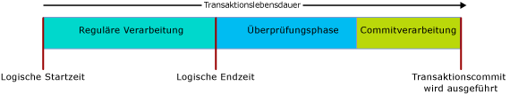

# <a name="transactions-with-memory-optimized-tables"></a>Transaktionen mit speicheroptimierten Tabellen
[!INCLUDE[appliesto-ss-asdb-xxxx-xxx-md](../../includes/appliesto-ss-asdb-xxxx-xxx-md.md)]

  
In diesem Artikel werden alle Aspekte von Transaktionen beschrieben, die für speicheroptimierte Tabellen und nativ kompilierte gespeicherte Prozeduren spezifisch sind.  
  
Die Transaktionsisolationsstufen in SQL Server werden auf speicheroptimierte Tabellen anders angewendet als auf datenträgerbasierte Tabellen, und zudem sind die zugrunde liegenden Mechanismen verschieden. Ein Überblick über die Unterschiede kann Programmierern dabei helfen, ein System mit hohem Durchsatz zu entwerfen. Das Ziel der Transaktionsintegrität wird in allen Fällen geteilt.  

Informationen zu Fehlerbedingungen, die für Transaktionen in speicheroptimierten Tabellen spezifisch sind, finden Sie im Abschnitt [Konflikterkennung und Wiederholungslogik](#confdetretry34ni).
  
Allgemeine Informationen finden Sie unter [SET TRANSACTION ISOLATION LEVEL (Transact-SQL)](../../t-sql/statements/set-transaction-isolation-level-transact-sql.md).  
  
  
<a name="pessvoptim22ni"/>  
  
## <a name="pessimistic-versus-optimistic"></a>Pessimistisch und optimistisch  
  
Die funktionalen Unterschiede ergeben sich aufgrund von pessimistischen und optimistischen Ansätzen hinsichtlich der Transaktionsintegrität. Speicheroptimierte Tabellen verwenden den optimistischen Ansatz:  
  
- Der pessimistische Ansatz verwendet Sperren, um mögliche Konflikte zu blockieren, bevor sie auftreten. Die Sperre tritt in Kraft, wenn die Anweisung ausgeführt wird, und wird aufgehoben, wenn der Transaktionscommit ausgeführt wird.  
  
- Der optimistische Ansatz erkennt Konflikte, während sie auftreten, und führt Validierungsüberprüfungen zur Commitzeit durch.  
  - Für eine speicheroptimierte Tabelle darf der Fehler 1205, ein Deadlock, nicht auftreten.  
  
Der optimistische Ansatz bedeutet weniger Aufwand und ist in der Regel effizienter, da Transaktionskonflikte in den meisten Anwendungen selten auftreten. Der wichtigste funktionale Unterschied zwischen dem pessimistischen und dem optimistischen Ansatz ist folgender: Wenn ein Konflikt auftritt, wird beim pessimistischen Ansatz einfach gewartet. Beim optimistischen Ansatz dagegen tritt bei einer der Transaktionen ein Fehler auf, und die Transaktion muss vom Client wiederholt werden. Die funktionalen Unterschiede sind größer, wenn die Isolationsstufe REPEATABLE READ aktiv ist, und sie sind für die Stufe SERIALIZABLE am größten.  
  
<a name="txninitmodes24ni"/>  
  
## <a name="transaction-initiation-modes"></a>Transaktionseinleitungsmodi  
  
SQL Server verfügt über die folgenden Modi für den Start einer Transaktion:  
  
- **Autocommit** : Das Starten einer einfachen Abfrage oder DML-Anweisung öffnet eine Transaktion implizit, und das Ende der Anweisung führt den Commit für die Transaktion implizit aus. **Autocommit** ist als Standardeinstellung ausgewählt.  
  - Im Autocommitmodus muss ein Tabellenhinweis zur Transaktionsisolationsstufe für die speicheroptimierte Tabelle in der FROM-Klausel in der Regel nicht codiert werden.  
  
- **Explizit** : Ihr Transact-SQL enthält den Code BEGIN TRANSACTION zusammen mit einem eventuellen COMMIT TRANSACTION. Mindestens zwei Anweisungen können in eine Transaktion integriert werden.  
  - Im expliziten Modus müssen Sie entweder die Datenbankoption MEMORY_OPTIMIZED_ELEVATE_TO_SNAPSHOT verwenden oder einen Tabellenhinweis zur Transaktionsisolationsstufe in der speicheroptimierten Tabelle in die FROM-Klausel schreiben.  
  
- **Implizit** : Wenn SET IMPLICIT_TRANSACTION ON aktiv ist. Ein besserer Name wäre wahrscheinlich IMPLICIT_BEGIN_TRANSACTION gewesen, da diese Option lediglich das Äquivalent einer expliziten BEGIN TRANSACTION vor jeder UPDATE-Anweisung implizit ausführt, wenn „ 0 = @@trancount“ gilt. Daher muss Ihr T-SQL-Code ggf. ein explizites COMMIT TRANSACTION ausgeben.   
  
- **ATOMIC BLOCK** (ATOMISCHER BLOCK): Sämtliche Anweisungen in den ATOMISCHEN Blöcken werden immer als Teil einer einzelnen Transaktion durchgeführt. Entweder werden für alle Aktionen eines atomischen Blocks erfolgreiche Commits ausgeführt, oder es wird, wenn ein Fehler auftritt, ein Rollback für alle Aktionen durchgeführt. Jede nativ kompilierte gespeicherte Prozedur erfordert einen ATOMISCHEN Block.  
  
<a name="codeexamexpmode25ni"/>  
  
### <a name="code-example-with-explicit-mode"></a>Codebeispiel im Explicit-Modus  
  
Das folgende interpretierte Transact-SQL-Skript verwendet Folgendes:  
  
- Eine explizite Transaktion.
- Eine speicheroptimierte Tabelle namens „dbo.Order_mo“.
- Den Kontext der Transaktionsisolationsstufe READ COMMITTED.  
  
Aus diesem Grund ist es erforderlich, einen Tabellenhinweis auf die speicheroptimierte Tabelle zu verwenden. Der Hinweis muss für SNAPSHOT oder eine stärker isolierende Stufe erfolgen. Für dieses Codebeispiel lautet der Hinweis WITH (SNAPSHOT). Wenn dieser Hinweis entfernt wird, würde für das Skript Fehler 41368 auftreten, für den eine automatische Wiederholung unangemessen wäre:  

#### <a name="error-41368"></a>Fehler 41368

Der Zugriff auf speicheroptimierte Tabellen mit der READ COMMITTED-Isolationsstufe wird nur für Autocommittransaktionen unterstützt. Er wird nicht für explizite oder implizite Transaktionen unterstützt. Geben Sie eine unterstützte Isolationsstufe für die speicheroptimierte Tabelle mithilfe eines Tabellenhinweis wie WITH (SNAPSHOT) an.

```sql
SET TRANSACTION ISOLATION LEVEL READ COMMITTED;  
GO  

BEGIN TRANSACTION;  -- Explicit transaction.  

-- Order_mo  is a memory-optimized table.  
SELECT * FROM  
           dbo.Order_mo  as o  WITH (SNAPSHOT)  -- Table hint.  
      JOIN dbo.Customer  as c  on c.CustomerId = o.CustomerId;  
     
COMMIT TRANSACTION;
```
  
Die Notwenigkeit des Hinweises `WITH (SNAPSHOT)` kann durch die Verwendung der Datenbankoption `MEMORY_OPTIMIZED_ELEVATE_TO_SNAPSHOT` umgangen werden. Wenn diese Option auf `ON`festgelegt ist, wird der Zugriff auf eine speicheroptimierte Tabelle einer niedrigeren Isolationsstufe automatisch auf die SNAPSHOT-Isolation hochgestuft.  

```sql
ALTER DATABASE CURRENT
    SET MEMORY_OPTIMIZED_ELEVATE_TO_SNAPSHOT = ON;
```

<a name="rowver28ni"/>  
  
## <a name="row-versioning"></a>Zeilenversionsverwaltung  
  
Speicheroptimierte Tabellen verwenden ein sehr komplexes System zur Zeilenversionsverwaltung, das den optimistischen Ansatz sogar auf der strengsten Isolationsstufe SERIALIZABLE effizient gestaltet. Weitere Informationen finden Sie unter [Einführung in speicheroptimierte Tabellen](../../relational-databases/in-memory-oltp/introduction-to-memory-optimized-tables.md).  
  
Datenträgerbasierte Tabellen weisen indirekt ein System zur Zeilenversionsverwaltung auf, wenn READ_COMMITTED_SNAPSHOT oder die SNAPSHOT-Isolationsstufe aktiviert ist. Dieses System basiert auf tempdb. Bei speicheroptimierten Datenstrukturen hingegen ist zum Erzielen einer maximalen Effizienz die Zeilenversionsverwaltung bereits integriert.  
  
<a name="confdegreeiso30ni"/>  
  
## <a name="isolation-levels"></a>Isolationsstufen 
  
Die folgende Tabelle enthält die möglichen Stufen der Transaktionsisolation, wobei mit der niedrigsten Isolationsstufe begonnen wird. Informationen zu möglichen Konflikten und der Wiederholungslogik zum Beheben dieser Konflikte finden Sie unter [Konflikterkennung und Wiederholungslogik](#confdetretry34ni). 
  
| Isolationsebene | Description |   
| :-- | :-- |   
| READ UNCOMMITTED | Nicht verfügbar: Auf der Isolationsstufe „Read Uncommitted“ kann nicht auf speicheroptimierte Tabellen zugegriffen werden. Der Zugriff auf speicheroptimierte Tabellen auf der Isolationsstufe SNAPSHOT ist weiterhin möglich, wenn TRANSACTION ISOLATION LEVEL auf Sitzungsebene auf READ UNCOMMITTED festgelegt ist. Verwenden Sie hierzu den Tabellenhinweis WITH (SNAPSHOT), oder legen Sie die Datenbankeinstellung MEMORY_OPTIMIZED_ELEVATE_TO_SNAPSHOT auf ON fest. | 
| READ COMMITTED | Nur für speicheroptimierte Tabellen unterstützt, wenn der Autocommitmodus aktiviert ist. Der Zugriff auf speicheroptimierte Tabellen auf der Isolationsstufe SNAPSHOT ist weiterhin möglich, wenn TRANSACTION ISOLATION LEVEL auf Sitzungsebene auf READ COMMITTED festgelegt ist. Verwenden Sie hierzu den Tabellenhinweis WITH (SNAPSHOT), oder legen Sie die Datenbankeinstellung MEMORY_OPTIMIZED_ELEVATE_TO_SNAPSHOT auf ON fest.<br/><br/>Wenn für die Datenbankoption READ_COMMITTED_SNAPSHOT „ON“ festgelegt ist, ist es nicht erlaubt, mit der gleichen Anweisung sowohl auf eine speicheroptimierte als auch auf eine datenträgerbasierte Tabelle auf der Isolationsstufe READ COMMITTED zuzugreifen. |  
| SNAPSHOT | Dies wird für speicheroptimierte Tabellen unterstützt. <br/><br/> Intern ist SNAPSHOT die Transaktionsisolationsstufe mit den geringsten Anforderungen für speicheroptimierte Tabellen. <br/><br/> SNAPSHOT verwendet weniger Systemressourcen als REPEATABLE READ oder SERIALIZABLE. |  
| REPEATABLE READ | Dies wird für speicheroptimierte Tabellen unterstützt. Die Isolationsstufe REPEATABLE READ garantiert, dass zum Zeitpunkt der Commitausführung keine gleichzeitige Transaktion eine der von dieser Transaktion gelesenen Zeilen aktualisiert hat. <br/><br/> Aufgrund des optimistischen Modells wird nicht verhindert, dass gleichzeitige Transaktionen Zeilen aktualisieren, die von dieser Transaktion gelesen werden. Stattdessen validiert diese Transaktion zum Zeitpunkt der Commitausführung, dass die REPEATABLE READ-Isolation nicht verletzt wurde. Wenn die Isolation verletzt wurde, wird ein Rollback für die Transaktion ausgeführt, und die Transaktion muss wiederholt werden. | 
| SERIALIZABLE | Dies wird für speicheroptimierte Tabellen unterstützt. <br/><br/> Die Bezeichnung *SERIALIZABLE* wird verwendet, da die Isolation so streng ist, dass es ein wenig dem aufeinanderfolgenden anstatt dem parallelen Ausführen von Transaktionen entspricht. | 


<a name="txnphaslife32ni"/>  
  
## <a name="transaction-phases-and-lifetime"></a>Transaktionsphasen und Lebensdauer  
  
Wenn eine speicheroptimierte Tabelle einbezogen wird, durchläuft die Lebensdauer einer Transaktion die in der folgenden Abbildung veranschaulichten Phasen:
  
  
  
Beschreibungen der Phasen folgen.  
  
#### <a name="regular-processing-phase-1-of-3"></a>Reguläre Verarbeitung: Phase 1 (von 3)  
  
- Diese Phase setzt sich aus der Ausführung aller Abfragen und den DML-Anweisungen in der Abfrage zusammen.  
- Während dieser Phase betrachten die Anweisungen die Version der speicheroptimierten Tabellen als die Version, die zur logischen Startzeit der Transaktion gültig war.  
  
#### <a name="validation-phase-2-of-3"></a>Überprüfung: Phase 2 (von 3)  
  
- Die Überprüfungsphase beginnt durch Zuweisen der Beendigungszeit, wodurch die Transaktion als logisch abgeschlossen markiert wird. Mit dem Abschluss werden alle Änderungen an dieser Transaktion für andere Transaktionen, die von ihr abhängig sind, sichtbar. Für abhängige Transaktionen darf kein Commit ausgeführt werden, solange kein Commit erfolgreich für diese Transaktion ausgeführt wurde. Darüber hinaus dürfen Transaktionen, für die solche Abhängigkeiten bestehen, keine Resultsets an den Client zurückgeben, damit dem Client nur Daten angezeigt werden, für die ein erfolgreicher Commit in die Datenbank ausgeführt wurde.  
- Diese Phase umfasst die REPEATABLE READ- und SERIALIZABLE-Überprüfung. Bei der REPEATABLE READ-Überprüfung wird geprüft, ob eine Zeile aktualisiert wurde, nachdem sie von der Transaktion gelesen wurde. Bei der SERIALIZABLE-Überprüfung wird geprüft, ob Zeilen in einen von dieser Transaktion gescannten Datenbereich eingefügt wurden. Gemäß der Tabelle im Abschnitt [Isolationsstufen und Konflikte](#confdegreeiso30ni) können sowohl die REPEATABLE READ- als auch die SERIALIZABLE-Überprüfung bei der SNAPSHOT-Isolation ausgewählt werden, um die Konsistenz von UNIQUE- und FOREIGN KEY-Einschränkungen zu überprüfen.  
  
#### <a name="commit-processing-phase-3-of-3"></a>Commitverarbeitung: Phase 3 (von 3)  
  
- Während der Commitphase werden die Änderungen an dauerhaften Tabellen in das Protokoll und das Protokoll auf die Datenträger geschrieben. Anschließend wird die Steuerung wieder an den Client übergeben.  
- Nach Abschluss der Commitverarbeitung werden alle abhängigen Transaktionen benachrichtigt, dass sie die Commits ausführen können.  
  
Wie immer sollten Sie Ihre Transaktionsarbeitseinheiten so minimal und kurz halten, wie es Ihre Datenanforderungen zulassen.  
  
<a name="confdetretry34ni"/>  
  
## <a name="conflict-detection-and-retry-logic"></a>Konflikterkennung und Wiederholungslogik 

Es gibt zwei Arten von transaktionsbezogenen Fehlerbedingungen, die einen Fehler und ein Rollback für eine Transaktion verursachen können. In den meisten Fällen muss die Transaktion nach dem Auftreten eines solchen Fehlers wiederholt werden – ähnlich wie bei einem Deadlock.
- Konflikte zwischen gleichzeitigen Transaktionen. Hierbei handelt es sich um Updatekonflikte und Überprüfungsfehler, die durch Verletzungen der Transaktionsisolationsstufe oder durch Einschränkungsverletzungen verursacht werden können.
- Abhängigkeitenfehler. Diese werden verursacht, wenn beim Commit einer Transaktion, von der andere Transaktionen abhängig sind, ein Fehler auftritt, oder wenn die Anzahl von Abhängigkeiten zu groß wird.

Im Folgenden finden Sie eine Auflistung der Fehlerbedingungen, die dazu führen können, dass Transaktionen nicht auf speicheroptimierte Tabellen zugreifen können.

| Fehlercode | Description | Ursache |
| :-- | :-- | :-- |
| **41302** | Es wurde versucht, eine Zeile zu aktualisieren, die seit dem Start der aktuellen Transaktion in einer anderen Transaktion aktualisiert wurde. | Diese Fehlerbedingung tritt auf, wenn zwei gleichzeitige Transaktionen versuchen, die gleiche Zeile zur gleichen Zeit zu aktualisieren oder zu löschen. Eine der beiden Transaktionen empfängt diese Fehlermeldung und muss wiederholt werden. <br/><br/>  | 
| **41305**| REPEATABLE READ-Überprüfungsfehler. Eine Zeile einer speicheroptimierten Tabelle, die von dieser Transaktion gelesen wird, wurde von einer anderen Transaktion aktualisiert, für die vor dem Commit dieser Transaktion ein Commit ausgeführt wurde. | Dieser Fehler kann bei Verwendung der REPEATABLE READ- oder SERIALIZABLE-Isolation auftreten. Er kann auch auftreten, wenn die Aktionen einer gleichzeitigen Transaktion eine FOREIGN KEY-Einschränkung verletzen. <br/><br/>Solche Verletzungen von FOREIGN KEY-Einschränkungen sind selten und weisen in der Regel auf ein Problem mit der Anwendungslogik oder der Dateneingabe hin. Dieser Fehler kann allerdings auch auftreten, wenn in den Spalten, die an der FOREIGN KEY-Einschränkung beteiligt sind, kein Index vorhanden ist. Es empfiehlt sich daher, in FOREIGN KEY-Spalten einer speicheroptimierten Tabelle immer einen Index zu erstellen. <br/><br/> Ausführlichere Überlegungen zu Überprüfungsfehlern, die durch FOREIGN KEY-Verletzungen verursacht werden, finden Sie in [diesem Blogbeitrag](https://blogs.msdn.microsoft.com/sqlcat/2016/03/24/considerations-around-validation-errors-41305-and-41325-on-memory-optimized-tables-with-foreign-keys/) des SQL Server-Kundenberatungsteams. |  
| **41325** | SERIALIZABLE-Überprüfungsfehler. Eine Zeile wurde in einen Bereich eingefügt, der zuvor von der aktuellen Transaktion gescannt wurde. Dies wird als Phantomzeile bezeichnet | Dieser Fehler kann bei Verwendung der SERIALIZABLE-Isolation auftreten. Er kann auch auftreten, wenn die Aktionen einer gleichzeitigen Transaktion eine PRIMARY KEY-, UNIQUE- oder FOREIGN KEY-Einschränkung verletzen. <br/><br/> Solche Einschränkungsverletzungen durch gleichzeitige Transaktionen sind selten und weisen in der Regel auf ein Problem mit der Anwendungslogik oder der Dateneingabe hin. Ähnlich wie bei REPEATABLE READ-Überprüfungsfehlern kann dieser Fehler auch auftreten, wenn für die an einer FOREIGN KEY-Einschränkung beteiligten Spalten kein Index vorhanden ist. |  
| **41301** | Abhängigkeitsfehler: Es besteht eine Abhängigkeit von einer anderen Transaktion, bei der später ein Commitfehler auftritt. | Für diese Transaktion (Tx1) entstand eine Abhängigkeit von einer anderen Transaktion (Tx2), während die Transaktion (Tx2) sich in der Überprüfungs- oder Commitverarbeitungsphase befand. Der Grund: Tx1 hat Daten gelesen, die von Tx2 geschrieben wurden. Bei Tx2 trat anschließend ein Fehler beim Commit auf. Die häufigsten Ursachen für Fehler beim Commit von Tx2 sind REPEATABLE READ-Überprüfungsfehler (41305) und SERIALIZABLE-Überprüfungsfehler (41325). Eine weniger häufige Ursache ist ein Protokoll-E/A-Fehler. |
| **41823** und **41840** | Das Kontingent für Benutzerdaten in speicheroptimierten Tabellen und Tabellenvariablen wurde erreicht. | Der Fehler 41823 bezieht sich auf SQL Server Express/Web/Standard Edition sowie eigenständige Datenbanken in [!INCLUDE[sssdsfull](../../includes/sssdsfull-md.md)]. Der Fehler 41840 bezieht sich auf Pools für elastische Datenbanken in [!INCLUDE[sssdsfull](../../includes/sssdsfull-md.md)]. <br/><br/> In den meisten Fällen geben diese Fehler an, dass die maximalen Kapazität für Benutzerdaten erreicht wurde. Der Fehler kann behoben werden, indem Daten aus den speicheroptimierten Tabellen gelöscht werden. Es gibt jedoch seltene Fälle, in denen dieser Fehler nur vorübergehend ist. Deshalb wird empfohlen, dass Sie es zunächst erneut versuchen, wenn dieser Fehler zum ersten Mal auftritt.<br/><br/> Wie andere Fehler in dieser Liste verursachen die Fehler 41823 und 41840 einen Abbruch der aktiven Transaktion. |
| **41839** | Die Transaktion hat die maximale Anzahl von Commitabhängigkeiten überschritten. |**Gilt für:** [!INCLUDE[ssSQL15](../../includes/sssql15-md.md)]. In höhere Versionen von [!INCLUDE[ssnoversion](../../includes/ssnoversion-md.md)] und [!INCLUDE[sssdsfull](../../includes/sssdsfull-md.md)] ist die Anzahl von Commitabhängigkeiten nicht eingeschränkt.<br/><br/> Eine bestimmte Transaktion (Tx1) kann nur von einer bestimmten Anzahl von Transaktionen abhängig sein. Diese Transaktionen werden als ausgehende Abhängigkeiten bezeichnet. Darüber hinaus kann nur eine bestimmte Anzahl von Transaktionen von einer bestimmten Transaktion (Tx1) abhängig sein. Diese Transaktionen werden als eingehende Abhängigkeiten bezeichnet. Der Grenzwert für beide Arten lautet 8. <br/><br/> Dieser Fehler tritt am häufigsten dann auf, wenn eine große Anzahl von Lesetransaktionen auf Daten zugreift, die von einer einzigen Schreibtransaktion geschrieben werden. Die Wahrscheinlichkeit, dass diese Bedingung eintritt, steigt, wenn die Lesetransaktionen umfangreiche Scans der gleichen Daten durchführen und die Überprüfung oder Commitverarbeitung der Schreibtransaktion lange dauert. Beispiele: Die Schreibtransaktion führt in der SERIALIZABLE-Isolation umfangreiche Scans durch (dies verlängert die Überprüfungsphase), oder das Transaktionsprotokoll ist auf einem langsamen Protokoll-E/A-Gerät platziert (dies verlängert die Commitverarbeitung). Wenn die Lesetransaktionen umfangreiche Scans durchführen und nur auf einige wenige Zeilen zugreifen, fehlt möglicherweise ein Index. Gleiches gilt, wenn die Schreibtransaktion die SERIALIZABLE-Isolation verwendet und umfangreiche Scans durchführt, aber nur auf einige wenige Zeilen zugreifen soll. Auch dies kann ein Hinweis auf einen fehlenden Index sein. <br/><br/> Die maximale Anzahl von Commitabhängigkeiten kann durch Verwendung des Ablaufverfolgungsflags **9926** erhöht werden. Verwenden Sie dieses Flag nur, wenn die Fehlerbedingung weiterhin auftritt, nachdem Sie sichergestellt haben, dass keine Indizes fehlen. Ansonsten könnte dieses Flag die Fehler in den oben genannten Fällen verbergen. Eine weitere wichtige Überlegung: Komplexe Abhängigkeitsdiagramme, in denen für jede Transaktion eine Vielzahl von eingehenden und ausgehenden Abhängigkeiten besteht und in denen einzelne Transaktionen Abhängigkeiten auf vielen Ebenen aufweisen, können zu Ineffizienzen im System führen.  |
 
  
### <a name="retry-logic"></a>Wiederholungslogik 

Wenn aufgrund einer der oben genannten Bedingungen bei einer Transaktion ein Fehler auftritt, sollte die Transaktion wiederholt werden.
  
Die Wiederholungslogik kann Client- oder Serverseite implementiert werden. Im Allgemeinen empfiehlt es sich, die Wiederholungslogik auf Clientseite zu implementieren, da dies effizienter ist und Ihnen ermöglicht, von der Transaktion zurückgegebene Resultsets zu verarbeiten, bevor der Fehler auftritt.  
  
<a name="retrytsqlcodeexam35ni"/>  
  
#### <a name="retry-t-sql-code-example"></a>Beispiel zum Wiederholen von T-SQL-Code  
  
Eine serverseitige Wiederholungslogik sollte bei der Verwendung von T-SQL nur für Transaktionen verwendet werden, die keine Resultsets an den Client zurückgeben. Ansonsten können durch Wiederholungen unter Umständen neben den Resultsets, die erwartungsgemäß an den Client zurückgegeben werden, zusätzliche Resultsets entstehen.  
  
Das folgende interpretierte T-SQL-Skript veranschaulicht, wie die Wiederholungslogik für die Fehler aussehen kann, die Transaktionskonflikten zugeordnet sind, die speicheroptimierte Tabellen einbeziehen.

```sql
-- Retry logic, in Transact-SQL.
DROP PROCEDURE If Exists usp_update_salesorder_dates;
GO

CREATE PROCEDURE usp_update_salesorder_dates
AS
BEGIN
    DECLARE @retry INT = 10;

    WHILE (@retry > 0)
    BEGIN
        BEGIN TRY
            BEGIN TRANSACTION;

            UPDATE dbo.SalesOrder_mo WITH (SNAPSHOT)
                set OrderDate = GetUtcDate()
                where CustomerId = 42;

            UPDATE dbo.SalesOrder_mo WITH (SNAPSHOT)
                set OrderDate = GetUtcDate()
                where CustomerId = 43;

            COMMIT TRANSACTION;

            SET @retry = 0;  -- //Stops the loop.
        END TRY

        BEGIN CATCH
            SET @retry -= 1;

            IF (@retry > 0 AND
                ERROR_NUMBER() in (41302, 41305, 41325, 41301, 41823, 41840, 41839, 1205)
                )
            BEGIN
                IF XACT_STATE() = -1
                    ROLLBACK TRANSACTION;

                WAITFOR DELAY '00:00:00.001';
            END
            ELSE
            BEGIN
                PRINT 'Suffered an error for which Retry is inappropriate.';
                THROW;
            END
        END CATCH

    END -- //While loop
END;
GO

--  EXECUTE usp_update_salesorder_dates;
```


<a name="crossconttxn38ni"/>  
  
## <a name="cross-container-transaction"></a>Containerübergreifende Transaktion  
  
  
Eine Transaktion wird als containerübergreifende Transaktion bezeichnet, wenn Folgendes auf sie zutrifft:  
  
- Sie greift über interpretiertes Transact-SQL auf eine speicheroptimierte Tabelle zu.  
- Sie führt eine native Prozedur aus, wenn eine Transaktion bereits geöffnet ist (XACT_STATE() = 1).  
  
Der Begriff „containerübergreifend“ bezieht sich auf die Tatsache, dass diese Transaktionen in den beiden Transaktionsverwaltungscontainern ausgeführt werden – einer für datenträgerbasierte Tabellen, einer für speicheroptimierte Tabellen.  
  
Bei einer einzelnen containerübergreifenden Transaktion können verschiedene Isolationsstufen verwendet werden, um auf die datenträgerbasierten und speicheroptimierten Tabellen zuzugreifen. Dieser Unterschied kann auf verschiedene Weise ausgedrückt werden: durch explizite Tabellenhinweise, z.B. WITH (SERIALIZABLE), oder durch die Datenbankoption MEMORY_OPTIMIZED_ELEVATE_TO_SNAPSHOT, die implizit die Isolationsstufe für die speicheroptimierte Tabelle erhöht, für die die Momentaufnahme erstellt werden soll, wenn TRANSACTION ISOLATION LEVEL als READ COMMITTED oder READ UNCOMMITTED konfiguriert ist.  
  
Folgendes gilt für das folgende Transact-SQL-Codebeispiel:  
  
- Auf die datenträgerbasierte Tabelle, Table_D1, wird auf der Isolationsstufe READ COMMITTED zugegriffen.  
- Der Zugriff auf die speicheroptimierte Tabelle Table_MO7 erfolgt auf der Isolationsstufe SERIALIZABLE. Mit Table_MO6 ist keine spezifische Isolationsstufe verknüpft, da Einfügungen immer konsistent sind und im Wesentlichen auf der Isolationsstufe SERIALIZABLE ausgeführt werden.  


```sql
-- Different isolation levels for
-- disk-based tables versus memory-optimized tables,
-- within one explicit transaction.

SET TRANSACTION ISOLATION LEVEL READ COMMITTED;
go

BEGIN TRANSACTION;

    -- Table_D1 is a traditional disk-based table, accessed using READ COMMITTED isolation.

    SELECT * FROM Table_D1;


    -- Table_MO6 and Table_MO7 are memory-optimized tables.
    -- Table_MO7 is accessed using SERIALIZABLE isolation,
    --   while Table_MO6 does not have a specific isolation level.

    INSERT Table_MO6
        SELECT * FROM Table_MO7 WITH (SERIALIZABLE);

COMMIT TRANSACTION;
go
```


<a name="limitations40ni"/>  
  
## <a name="limitations"></a>Einschränkungen  
  
  
- Datenbankübergreifende Transaktionen werden für speicheroptimierte Tabellen nicht unterstützt. Wenn eine Transaktion auf eine speicheroptimierte Tabelle zugreift, kann die Transaktion nicht auf eine andere Datenbank zugreifen. Ausnahme:  
  - tempdb-Datenbank.  
  - Von der Masterdatenbank schreibgeschützt.  
  
- Verteilte Transaktionen werden nicht unterstützt: Wenn BEGIN DISTRIBUTED TRANSACTION verwendet wird, kann die Transaktion nicht auf speicheroptimierte Tabellen zugreifen.  
  
  
<a name="natcompstorprocs42ni"/>  
  
## <a name="natively-compiled-stored-procedures"></a>Systemintern kompilierte gespeicherte Prozeduren  
  
- In einer systemeigenen Prozedur muss der ATOMISCHE BLOCK die Transaktionsisolationsstufe für den gesamten Block deklarieren. Beispiel:  
  - `... BEGIN ATOMIC WITH (TRANSACTION ISOLATION LEVEL = SNAPSHOT, ...) ...`  
  
- Es sind im Hauptteil einer systemeigenen Prozess keine expliziten Transaktionssteueranweisungen zulässig. BEGIN TRANSACTION, ROLLBACK TRANSACTION usw. sind nicht zulässig.  
  
- Nähere Informationen zur Transaktionssteuerung mit ATOMISCHEN Blöcken finden Sie unter [ATOMIC-Blöcke](atomic-blocks-in-native-procedures.md)  
  
<a name="othertxnlinks44ni"/>  
  
## <a name="other-transaction-links"></a>Andere Transaktionslinks  
  
- [SET IMPLICIT_TRANSACTIONS](../../t-sql/statements/set-implicit-transactions-transact-sql.md)  
  
- [sp_getapplock (Transact-SQL)](../../relational-databases/system-stored-procedures/sp-getapplock-transact-sql.md)  
  
- [Auf Zeilenversionsverwaltung basierende Isolationsstufen im Datenbankmodul](http://msdn.microsoft.com/library/ms177404.aspx)  
  
- [Steuern der Transaktionsdauerhaftigkeit](../../relational-databases/logs/control-transaction-durability.md)   
