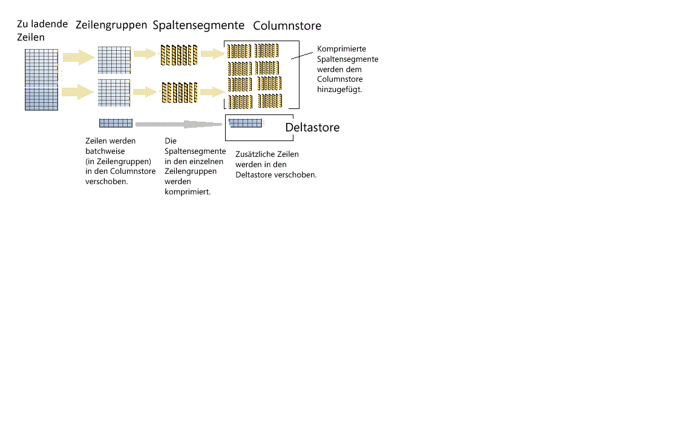

# <a name="columnstore-indexes---data-loading-guidance"></a>Columnstore-Indizes – Leitfaden zum Datenladevorgang
[!INCLUDE[tsql-appliesto-ss2012-all_md](../../includes/tsql-appliesto-ss2012-all-md.md)]

Optionen und Empfehlungen für das Laden von Daten mithilfe der Funktion zum SQL-Massenladen in einen Columnstore-Index und Einfügemethoden. Das Laden von Daten in einen Columnstore-Index ist ein wichtiger Teil des Warehousing-Prozesses, da Daten in den Index als Vorbereitung für die Analyse verschoben werden.
  
 Neu bei Columnstore-Indizes? Weitere Informationen finden Sie unter [Columnstore-Indizes - Übersicht](../../relational-databases/indexes/columnstore-indexes-overview.md) und [Columnstore-Indizes - Architektur](../../relational-databases/indexes/columnstore-indexes-architecture.md).
  

## <a name="what-is-bulk-loading"></a>Was ist Massenladen?
*Massenladen* bezieht sich auf die Möglichkeit, eine große Anzahl von Zeilen in einen Datenspeicher hinzuzufügen. Es ist der leistungsfähigste Weg, Daten in einen Columnstore-Index zu verschieben, da mit Zeilenbatches gearbeitet wird. Das Massenladen füllt Zeilengruppen bis zur Kapazitätsgrenze auf und komprimiert diese direkt in den Columnstore. Nur Zeilen am Ende eines Ladevorgangs, die nicht mindestens 102.400 Zeilen pro Zeilengruppe erfüllen, werden in den Deltastore verschoben.  
Um einen Massenladungsvorgang auszuführen, können Sie das [bcp-Hilfsprogramm](../../tools/bcp-utility.md) oder [Integration Services](../../integration-services/sql-server-integration-services.md) verwenden, oder Sie können Zeilen aus einer Stagingtabelle auswählen.

  
  
 Gemäß dem Diagramm gilt Folgendes für das Massenladen:  
  
* Die Daten werden nicht vorab sortiert. Daten werden in der Reihenfolge in Zeilengruppen eingefügt, in der sie empfangen werden.
* Wenn die Batchgröße >= 102.400 ist, werden die Zeilen direkt in die komprimierten Zeilengruppen eingefügt. Es wird empfohlen, dass Sie die Batchgröße >= 102.400 für einen effizienten Massenimport auswählen, da Sie das Verschieben von Datenzeilen in eine Delta-Zeilengruppen vermeiden können, bevor die Zeilen von einem Hintergrundthread (Tupelverschiebungsvorgang) schließlich in komprimierte Zeilengruppen verschoben werden.
* Wenn die Batchgröße < 102.400 oder die verbleibenden Zeilen < 102.400 sind, werden die Zeilen in Delta-Zeilengruppen geladen.

>![Note] Für eine Rowstore-Tabelle mit nicht gruppierten Columnstore-Indexdaten fügt [!INCLUDE[ssNoVersion](../../includes/ssnoversion-md.md)] die Daten immer in die Basistabelle ein. Die Daten werden nie direkt in den Columnstore-Index eingefügt.  

Das Massenladen verfügt über diese integrierten Leistungsoptimierungen:
 
-   Parallele Ladevorgänge. Sie können mehrere Massenladevorgänge (bcp oder Masseneinfügung) ausführen, die jeweils eine separate Datendatei laden. Im Gegensatz zu Rowstore-Massenladevorgänge in SQL müssen Sie TABLOCK nicht angeben, da jeder Massenimportthread Daten ausschließlich in separate Zeilengruppen lädt (komprimierte oder Delta-Zeilengruppen), die eine exklusive Sperre aufweisen. Die Verwendung von TABLOCK erzwingt eine exklusive Sperre für die Tabelle, und Sie sind dann nicht in der Lage, Daten parallel zu importieren.  
  
-   Minimale Protokollierung. Eine Massenladungsvorgang verwendet die minimale Protokollierung für Daten, die direkt zu komprimierten Zeilengruppen verschoben werden. Alle Daten, die in eine Delta-Zeilengruppe gehen, werden vollständig protokolliert. Dies schließt alle Batchgrößen ein, die weniger als 102.400 Zeilen sind. Allerdings ist für das Massenladen das Ziel für die meisten Daten, Delta-Zeilengruppen zu umgehen.  
  
-   Sperrenoptimierung.  Beim Laden in komprimierte Zeilengruppen wird die X-Sperre für Zeilengruppen abgerufen. Beim Massenladen in Delta-Zeilengruppen wird eine X-Sperre für die Zeilengruppe abgerufen, aber SQL Server sperrt die PAGE/EXTENT weiterhin, da die X-Zeilengruppensperre nicht Teil der Sperrhierarchie ist.  
  
Wenn Sie über einen nicht geclusterten btree-Index auf einem Columnstore-Index verfügen, erfolgt keine Sperren- oder Protokollierungsoptimierung für den Indext selbst, sondern die Optimierungen für den gruppierten Columnstore-Index, die oben beschrieben wurden, sind weiterhin vorhanden.  


  
## <a name="plan-bulk-load-sizes-to-minimize-delta-rowgroups"></a>Planen von Massenladungsgrößen zum Minimieren von Delta-Zeilengruppen
Columnstore-Indizes sind am leistungsfähigsten, wenn die meisten Zeilen in den Columnstore komprimiert werden und sich nicht in Delta-Zeilengruppen befinden. Es wird empfohlen, die Größe Ihrer Ladungen so anzupassen, dass Zeilen direkt in den Columnstore verschoben werden und den Deltastore so weit wie möglich umgehen.

Diese Szenarien beschreiben, in welchen Fällen geladene Zeilen direkt in den Columnstore und in welchen Fällen sie in den Deltastore aufgenommen werden. In diesem Beispiel kann jede Zeilengruppe 102.400 bis 1.048.576 Zeilen pro Zeilengruppe enthalten. In der Praxis kann die maximale Größe einer Zeilengruppe kleiner sein als 1.048.576 Zeilen, wenn nicht ausreichend Arbeitsspeicher vorhanden ist.  
  
|Zeilen für Massenladevorgang|Zur komprimierten Zeilengruppe hinzugefügte Zeilen|Zur Delta-Zeilengruppe hinzugefügte Zeilen|  
|-----------------------|-------------------------------------------|--------------------------------------|  
|102,000|0|102,000|  
|145,000|145,000<br /><br /> Zeilengruppengröße: 145.000.|0|  
|1,048,577|1,048,576<br /><br /> Zeilengruppengröße: 1.048.576.|1|  
|2,252,152|2,252,152<br /><br /> Zeilengruppengrößen: 1.048.576, 1.048.576, 155.000.|0|  
  
 Im folgenden Beispiel werden die Ergebnisse des Ladens von 1.048.577 Zeilen in eine Tabelle angezeigt. Aus den Ergebnissen wird ersichtlich, dass eine COMPRESSED-Zeilengruppe im Columnstore (in Form von komprimierten Spaltensegmenten) und eine Zeile im Deltastore vorhanden sind.  
  
```  
SELECT object_id, index_id, partition_number, row_group_id, delta_store_hobt_id, state state_desc, total_rows, deleted_rows, size_in_bytes   
FROM sys.dm_db_column_store_row_group_physical_stats  
```  
  
   
  
## <a name="use-a-staging-table-to-improve-performance"></a>Verwenden einer Stagingtabelle zum Verbessern der Leistung
Wenn Sie Daten nur laden, um sie vor der Ausführung von weiteren Transformationen bereitzustellen, wird der Ladevorgang der Tabelle auf die Heaptabelle schneller sein, als wenn Sie Daten in eine geclusterte Columnstore-Tabelle laden. Darüber hinaus wird das Laden von Daten in eine [temporäre Tabelle] [temporär] auch viel schneller sein als das Laden einer Tabelle für die permanente Speicherung.  

 Ein häufiges Muster für das Laden von Daten ist das Laden der Daten in eine Stagingtabelle. Dann werden einige Transformationen ausgeführt und die Daten anschließend mithilfe des folgenden Befehls in die Zieltabelle geladen:  
  
```  
INSERT INTO <columnstore index>  SELECT <list of columns> FROM <Staging Table>  
  
```  
  
 Dieser Befehl lädt die Daten auf ähnliche Weise wie BCP oder der Masseneinfügungsvorgang in den Columnstore-Index, jedoch in einem einzelnen Batch. Wenn die Anzahl der Zeilen in der Stagingtabelle kleiner als 102.400 ist, werden die Zeilen in eine Delta-Zeilengruppe geladen. Andernfalls werden die Zeilen direkt in eine komprimierte Zeilengruppe geladen.  Eine wichtige Einschränkung war, dass dieser Einfügungsvorgang einen einzelnen Thread umfasste. Zum parallelen Laden der Daten könnten Sie mehrere Stagingtabelle erstellen, oder INSERT/SELECT mit nicht überlappenden Bereiche von Zeilen aus der Stagingtabelle ausgeben.  Diese Einschränkung gilt ab SQL Server 2016 nicht mehr. Der nachfolgende Befehl lädt die Daten aus einer Stagingtabelle parallel, aber Sie müssen TABLOCK angegeben.  
  
```  
INSERT INTO <columnstore index>  WITH (TABLOCK)  SELECT <list of columns> FROM <Staging Table>  
```  
  
 Beim Laden in gruppierte Columnstore-Indizes aus Stagingtabellen sind die folgenden Optimierungen verfügbar.  
  
-   Protokolloptimierung: Minimale Protokollerung. Das gilt auch beim Laden der Daten in eine komprimierte Zeilengruppe. Es erfolgt keine minimale Protokollierung beim Laden von Daten in Delta-Zeilengruppen.  
  
-   Sperrenoptimierung: Beim Laden in komprimierte Zeilengruppen wird die X-Sperre für Zeilengruppen abgerufen. Bei der Delta-Zeilengruppe wird eine X-Sperre für die Zeilengruppe abgerufen, aber SQL Server sperrt die PAGE/EXTENT weiterhin, da die X-Zeilengruppensperre nicht Teil der Sperrhierarchie ist.  
  
 Wenn Sie über einen oder mehrere nicht gruppierte Indizes verfügen, erfolgt keine Sperren- oder Protokollierungsoptimierung für den Indext selbst, sondern die Optimierungen für den gruppierten Columnstore-Index, die oben beschrieben wurden, sind weiterhin vorhanden.  
  
## <a name="what-is-trickle-insert"></a>Was ist das Anwenden der Einfügung?

Das *Anwenden der Einfügung* bezieht sich auf die Methode, wie einzelne Zeilen in den Columnstore-Index verschoben werden. Das Anwenden der Einfügung verwendet die [INSERT INTO](../../t-sql/statements/insert-transact-sql.md)-Anweisung. Mit der Einfügungsanwendung werden alle Zeilen in den Deltastore verschoben. Dies ist nützlich für eine kleine Anzahl von Zeilen, aber für große Datenmengen nicht geeignet.
  
```  
INSERT INTO <table-name> VALUES (<set of values>)  
```  
  
 Beachten Sie, dass parallele Threads, die INSERT INTO zum Einfügen von Werten in einen gruppierten Columnstore-Index verwenden, Zeilen in dieselbe Delta-Zeilengruppe einfügen können.  
  
 Sobald die Zeilengruppe 1.048.576 Zeilen enthält, wird die Delta-Zeilengruppe als CLOSED markiert, ist aber weiterhin für Abfragen und Aktualisierungs-/Löschvorgänge verfügbar. Die neu eingefügten Zeilen gelangen jedoch in eine vorhandene oder neu erstellte Deltastore-Zeilengruppe. Es gibt einen Hintergrundthread, den *Tupelverschiebungsvorgang* , der die geschlossenen Deltazeilengruppen in regelmäßigen Abständen komprimiert, z.B. alle fünf Minuten. Sie können den folgenden Befehl explizit aufrufen, um die geschlossenen Delta-Zeilengruppen zu komprimieren.  
  
```  
ALTER INDEX <index-name> on <table-name> REORGANIZE  
```  
  
 Wenn Sie erzwingen möchten, dass eine Delta-Zeilengruppe geschlossen und komprimiert wird, können Sie den folgenden Befehl ausführen. Sie können diesen Befehl ausführen, wenn Sie das Laden der Zeilen abgeschlossen haben und keine weiteren neuen Zeilen erwarten. Durch explizites Schließen und Komprimieren der Delta-Zeilengruppe können Sie weiteren Speicherplatz sparen und die Abfrageleistung für Analysen verbessern. Eine bewährte Methode ist das Aufrufen dieses Befehls, wenn Sie nicht erwarten, dass weitere neue Zeilen eingefügt werden.  
  
```  
ALTER INDEX <index-name> on <table-name> REORGANIZE with (COMPRESS_ALL_ROW_GROUPS = ON)  
```  
  
## <a name="how-loading-into-a-partitioned-table-works"></a>So funktioniert das Laden in eine partitionierte Tabelle  
 Bei partitionierten Daten weist [!INCLUDE[ssNoVersion](../../includes/ssnoversion-md.md)] zuerst jede Zeile einer Partition zu und führt dann Columnstore-Vorgänge für die Daten innerhalb der Partition aus. Jede Partition verfügt über eigene Zeilengruppen und mindestens eine Delta-Zeilengruppe.  
  

 ## <a name="next-steps"></a>Nächste Schritte
 Weitere Informationen zum Laden finden Sie in diesem [Blogbeitrag](http://blogs.msdn.com/b/sqlcat/archive/2015/03/11/data-loading-performance-considerations-on-tables-with-clustered-columnstore-index.aspx).  

