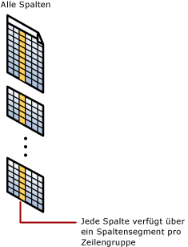
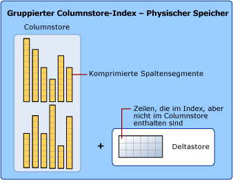

# Columnstore-Indizes: Übersicht
[!INCLUDE[appliesto-ss-asdb-asdw-pdw-md](../../includes/appliesto-ss-asdb-asdw-pdw-md.md)]

*Columnstore-Indizes* stellen den Standard für das Speichern und Abfragen großer Faktentabellen im Data Warehousing dar. Er verwendet spaltenbasierte Datenspeicherung und Abfrageverarbeitung, um bis zu **zehnfach höhere Abfrageleistung** im Data Warehouse im Vergleich mit herkömmlicher zeilenorientierter Speicherung und bis zu **zehnfache Datenkomprimierung** gemessen am unkomprimierten Datenvolumen zu erreichen. Ab [!INCLUDE[ssSQL15](../../includes/sssql15-md.md)]ermöglichen Columnstore-Indizes die operative Analyse und bieten damit die Möglichkeit, leistungsfähige Echtzeitanalysen einer Translationsarbeitsauslastung durchzuführen.  
  
 Zu den Szenarien wechseln:  
  
-   [Columnstore-Indizes für Data Warehousing](../../relational-databases/indexes/columnstore-indexes-data-warehouse.md)  
-   [Erste Schritte mit Columnstore für operative Echtzeitanalyse](../../relational-databases/indexes/get-started-with-columnstore-for-real-time-operational-analytics.md)  
  
## Was ist ein Columnstore-Index?  
 Ein *columnstore index* ist eine Technologie zum Speichern, Abrufen und Verwalten von Daten mithilfe eines spaltenbasierten Datenformats, das als Columnstore bezeichnet wird.  
  
### Hauptbegriffe und -Konzepte  
 Die folgenden Hauptbegriffe und -konzepte werden im Zusammenhang mit Columnstore-Indizes verwendet.  
  
 columnstore  
 Ein *Columnstore* enthält Daten, die logisch als Tabelle mit Zeilen und Spalten organisiert und physisch in einem Spaltendatenformat gespeichert sind.  
  
 Rowstore  
 Ein *Rowstore* enthält Daten, die logisch als Tabelle mit Zeilen und Spalten organisiert und anschließend physisch in einem Zeilendatenformat gespeichert sind. Dies war die traditionelle Vorgehensweise beim Speichern von Daten aus relationalen Tabellen. In [!INCLUDE[ssNoVersion](../../includes/ssnoversion-md.md)] bezieht Rowstore sich auf die Tabelle, deren zugrunde liegendes Datenspeicherformat ein Heap, ein gruppierter Index oder eine speicheroptimierte Tabelle ist.  
  
> [!NOTE]  
> In Diskussionen zu Columnstore-Indizes verwenden wir die Begriffe *Rowstore* und *Columnstore* , um das Format der Datenspeicherung zu bezeichnen.  
  
 Zeilengruppe  
 Eine *Zeilengruppe* ist eine Gruppe von Zeilen, die gleichzeitig in das Columnstore-Format komprimiert werden. Eine Zeilengruppe enthält normalerweise die maximale Anzahl von Zeilen pro Zeilengruppe, die 1.048.576 Zeilen beträgt.  
  
 Um eine hohe Leistung und hohe Komprimierungsraten zu erzielen, unterteilt der Columnstore-Index die Tabelle in Gruppen von Zeilen, die als Zeilengruppen bezeichnet werden, und komprimiert dann jede Zeilengruppe nach Spalten. Die Anzahl der Zeilen in der Zeilengruppe muss groß genug sein, um die Komprimierungsraten zu verbessern, und klein genug, um von In-Memory-Vorgängen profitieren zu können.  
 Spaltensegment  
 Ein *Spaltensegment* ist eine Spalte mit Daten aus der Zeilengruppe.  
  
-   Jede Zeilengruppe enthält ein Spaltensegment für jede Spalte in der Tabelle.  
-   Jedes Spaltensegment wird zusammenhängend komprimiert und auf physischen Medien gespeichert.  
  
   
  
 Gruppierter Columnstore-Index  
 Ein *gruppierter Columnstore-Index* ist der physische Speicher für die gesamte Tabelle.  
  
   
  
 Um die Fragmentierung der Spaltensegmente zu verringern und die Leistung zu verbessern, können einige Daten im Columnstore-Index vorübergehend in einem gruppierten Index, der als Deltastore bezeichnet wird, sowie in einer B-Struktur mit IDs der gelöschten Zeilen gespeichert werden. Die Deltastore-Vorgänge werden im Hintergrund verarbeitet. Damit die richtigen Abfrageergebnisse zurückgegeben werden, kombiniert der gruppierte Columnstore-Index Abfrageergebnisse aus dem Columnstore und dem Deltastore.  
  
 Deltastore  
 Ein *Deltastore* wird nur in Kombination mit gruppierten Columnstore-Indizes verwendet und stellt seinerseits einen gruppierten Index dar, der die Komprimierung und Leistung für Columnstore verbessert, indem er Zeilen speichert, bis die Anzahl der gespeicherten Zeilen einen Schwellenwert erreicht, bei dem die Zeilen dann in den Columnstore verschoben werden.  
  
 Während eines umfassenden Massenladevorgangs werden die meisten Zeilen ohne Umweg über den Deltastore direkt in den Columnstore verschoben. Einige Zeilen am Ende des Massenladevorgangs erreichen möglicherweise nicht die notwendige Anzahl für die minimale Größe einer Zeilengruppe von 102.400 Zeilen. Wenn dieser Fall auftritt, werden die letzten Zeilen in den Deltastore und nicht in den Columnstore aufgenommen. Bei kleinen Massenladevorgängen mit weniger als 102.400 Zeilen werden alle Zeilen direkt in den Deltastore verschoben.  
  
 Wenn der Deltastore die maximale Zeilenanzahl erreicht, wird er geschlossen. Ein Tupelverschiebungsvorgang überprüft auf geschlossene Zeilengruppen. Wenn die geschlossene Zeilengruppe gefunden wird, wird sie komprimiert und im Columnstore-Index gespeichert.  
  
 Nicht gruppierter Columnstore-Index  
 Ein *nicht gruppierter Columnstore-Index* und ein gruppierter Columnstore-Index sind funktional gleich. Der Unterschied besteht darin, dass ein nicht gruppierter Index ein sekundärer Index ist, der für eine Rowstore-Tabelle erstellt wird, während einer gruppierter Columnstore-Index den primären Speicher für die gesamte Tabelle darstellt.  
  
 Der nicht gruppierte Index enthält eine Kopie eines Teils oder aller Zeilen und Spalten der zugrundeliegenden Tabelle. Der Index ist als eine oder mehrere Spalte(n) der Tabelle definiert und weist eine optionale Bedingung auf, die zum Filtern der Zeilen dient.  
  
 Ein nicht gruppierter Columnstore-Index ermöglicht operative Echtzeitanalyse, bei der die OLTP-Arbeitsauslastung den zugrundeliegenden gruppierten Index verwendet, während die Analyse parallel auf dem Columnstore-Index ausgeführt wird. Weitere Informationen finden Sie unter [Erste Schritte mit Columnstore für operative Echtzeitanalyse](../../relational-databases/indexes/get-started-with-columnstore-for-real-time-operational-analytics.md).  
  
 Batchausführung  
 Die*Batchausführung* ist eine Methode zur Abfrageverarbeitung, bei der Abfragen mehrere Zeilen zugleich verarbeiten. Abfragen von Columnstore-Indizes verwenden die Batchmodusausführung, mit der sich die Abfrageleistung normalerweise um das Zwei- bis Vierfache steigern lässt. Die Batchausführung ist eng in das Columnstore-Speicherformat integriert und für dieses optimiert. Die Batchmodusausführung wird auch als vektorbasierte oder vektorisierte Ausführung bezeichnet.  
  
##   Warum sollte ich einen Columnstore-Index verwenden?  
 Ein Columnstore-Index kann eine sehr hohe Datenkomprimierung bieten, normalerweise etwa zehnfach, und reduziert so die Speicherkosten für ein Data Warehouse erheblich. In der Analyse ist die Leistung um eine Größenordnung besser als bei einem B-Strukturindex. Er stellt daher das bevorzugte Format der Datenspeicherung für Data Warehouse- und Analysearbeitsauslastungen dar. Ab [!INCLUDE[ssSQL15](../../includes/sssql15-md.md)]können Sie Columnstore-Indizes für Echtzeitanalysen Ihrer Betriebsarbeitsauslastung verwenden.  
  
 Gründe für die hohe Geschwindigkeit von Columnstore-Indizes:  
  
-   In Spalten werden Werte aus dem gleichen Bereich gespeichert, die oftmals ähnliche Werte aufweisen, wodurch sich hohe Komprimierungsraten ergeben. Dadurch wird der E/A-Engpass im System minimiert oder beseitigt, während zugleich der Arbeitsspeicherbedarf deutlich sinkt.  
  
-   Hohe Komprimierungsraten verbessern die Abfrageleistung, da der Arbeitsspeicherbedarf geringer ist. Auch die Abfrageleistung kann verbessert werden, da [!INCLUDE[ssNoVersion](../../includes/ssnoversion-md.md)] eine größere Zahl von speicherinternen Abfrage- und Datenvorgängen ausführen kann.  
  
-   Die Batchausführung verbessert die Abfrageleistung, normalerweise um das Zwei- bis Vierfache, indem mehrere Zeilen zusammen verarbeitet werden.  
  
-   Bei Abfragen werden häufig nur wenige Spalten aus einer Tabelle ausgewählt, wodurch das Gesamtaufkommen der E/A-Vorgänge für das physische Medium reduziert wird.  
  
## Wann sollte ein Columnstore-Index verwendet werden?  
 Empfohlene Einsatzgebiete:  
  
-   Verwenden Sie einen gruppierten Columnstore-Index zum Speichern von Faktentabellen und umfangreichen Dimensionstabellen für Data Warehouse-Arbeitsauslastungen. Dadurch lassen sich Abfrageleistung und Datenkomprimierung bis zum Zehnfachen steigern. Siehe [Columnstore-Indizes für Data Warehousing](~/relational-databases/indexes/columnstore-indexes-data-warehouse.md).  
  
-   Verwenden Sie einen nicht gruppierten Columnstore-Index, um Echtzeitanalysen für OLTP-Arbeitsauslastungen auszuführen. Siehe [Erste Schritte mit Columnstore für operative Echtzeitanalyse](../../relational-databases/indexes/get-started-with-columnstore-for-real-time-operational-analytics.md).  
  
### Wie treffe ich die Entscheidung zwischen einem Rowstore-Index und einem Columnstore-Index?  
 Rowstore-Indizes zeigen die beste Leistung bei Abfragen, die in den Daten suchen, nach einem bestimmten Wert suchen oder einen kleinen Bereich von Werten abfragen. Verwenden Sie Rowstore-Indizes für Transaktionsarbeitsauslastungen, da sie tendenziell eher Suchvorgänge in Tabellen als Scans gesamter Tabellen erfordern.  
  
 Columnstore-Indizes ermöglichen große Leistungsvorteile bei Analyseabfragen, die große Mengen von Daten durchsuchen, insbesondere bei umfangreichen Tabellen.  Verwenden Sie Columnstore-Indizes für Data Warehouse- und Analysearbeitsauslastungen, insbesondere für Faktentabellen, da für diese eher Scans der gesamten Tabellen als Suchvorgänge in Tabellen erforderlich sind.  
  
### Können Rowstore und Columnstore in der gleichen Tabelle kombiniert werden?  
 Ja. Ab [!INCLUDE[ssSQL15](../../includes/sssql15-md.md)]können Sie einen aktualisierbaren, nicht gruppierten Columnstore-Index für eine Rowstore-Tabelle erstellen. Der Columnstore-Index speichert eine Kopie der gewählten Spalten, daher ist hier zusätzlicher Speicherplatz erforderlich, diese Kopie wird jedoch im Schnitt um dem Faktor 10 komprimiert. Durch dieses Vorgehen können Sie Analysen mit dem Columnstore-Index und Transaktionen mit dem Rowstore-Index zur gleichen Zeit ausführen. Der Spaltenspeicher wird aktualisiert, wenn sich die Daten in der Rowstore-Tabelle ändern, daher arbeiten beide Indizes auf den gleichen Daten.  
  
 Seit [!INCLUDE[ssSQL15](../../includes/sssql15-md.md)]können nicht gruppierte Rowstore-Indizes für einen Columnstore-Index erstellt werden. Auf diese Weise können effiziente Tabellensuchvorgänge im zugrundeliegenden Columnstore ausgeführt werden. Auch weitere Optionen werden dadurch verfügbar. Beispielsweise können Sie eine Primärschlüsseleinschränkung durchsetzen, indem Sie eine UNIQUE-Bedingung auf die Rowstore-Tabelle anwenden. Da ein nicht eindeutiger Wert nicht in die Rowstore-Tabelle eingefügt werden kann, kann [!INCLUDE[ssNoVersion](../../includes/ssnoversion-md.md)] den Wert nicht in den Columnstore einfügen.  
  
## Metadaten  
 Alle Spalten in einem Columnstore-Index werden in den Metadaten als eingeschlossene Spalten gespeichert. Der Columnstore-Index weist keine Schlüsselspalten auf.  

|||
|-|-|  
|[sys.indexes &#40;Transact-SQL&#41;](../../relational-databases/system-catalog-views/sys-indexes-transact-sql.md)|[sys.index_columns &#40;Transact-SQL&#41;](../../relational-databases/system-catalog-views/sys-index-columns-transact-sql.md)|  
|[sys.partitions &#40;Transact-SQL&#41;](../../relational-databases/system-catalog-views/sys-partitions-transact-sql.md)|[sys.internal_partitions &#40;Transact-SQL&#41;](../../relational-databases/system-catalog-views/sys-internal-partitions-transact-sql.md)|  
|[sys.column_store_segments &#40;Transact-SQL&#41;](../../relational-databases/system-catalog-views/sys-column-store-segments-transact-sql.md)|[sys.column_store_dictionaries &#40;Transact-SQL&#41;](../../relational-databases/system-catalog-views/sys-column-store-dictionaries-transact-sql.md)|  
|[sys.column_store_row_groups &#40;Transact-SQL&#41;](../../relational-databases/system-catalog-views/sys-column-store-row-groups-transact-sql.md)|[sys.dm_db_column_store_row_group_operational_stats &#40;Transact-SQL&#41;](../../relational-databases/system-dynamic-management-views/sys-dm-db-column-store-row-group-operational-stats-transact-sql.md)|  
|[sys.dm_db_column_store_row_group_physical_stats &#40;Transact-SQL&#41;](../../relational-databases/system-dynamic-management-views/sys-dm-db-column-store-row-group-physical-stats-transact-sql.md)|[sys.dm_column_store_object_pool &#40;Transact-SQL&#41;](../../relational-databases/system-dynamic-management-views/sys-dm-column-store-object-pool-transact-sql.md)|  
|[sys.dm_db_column_store_row_group_operational_stats &#40;Transact-SQL&#41;](../../relational-databases/system-dynamic-management-views/sys-dm-db-column-store-row-group-operational-stats-transact-sql.md)|[sys.dm_db_index_operational_stats &#40;Transact-SQL&#41;](../../relational-databases/system-dynamic-management-views/sys-dm-db-index-operational-stats-transact-sql.md)|  
|[sys.dm_db_index_physical_stats &#40;Transact-SQL&#41;](../../relational-databases/system-dynamic-management-views/sys-dm-db-index-physical-stats-transact-sql.md)||  
  
## Related Tasks  
 Alle relationalen Tabellen, sofern Sie sie nicht als gruppierten Columnstore-Index festlegen, verwenden Rowstore als zugrundeliegendes Datenformat. `CREATE TABLE` erstellt eine Rowstore-Tabelle, es sei denn, Sie geben die Option `WITH CLUSTERED COLUMNSTORE INDEX` an.  
  
 Beim Erstellen einer Tabelle mit der `CREATE TABLE`-Anweisung können Sie die Tabelle als Columnstore erstellen, indem Sie die Option `WITH CLUSTERED COLUMNSTORE INDEX` angeben. Wenn Sie bereits über eine Rowstore-Tabelle verfügen, die Sie in einen Columnstore konvertieren möchten, können Sie die Anweisung `CREATE COLUMNSTORE INDEX` verwenden.  
  
|Task|Referenzthemen|Hinweise|  
|----------|----------------------|-----------|  
|Erstellen einer Tabelle als Columnstore.|[CREATE TABLE &#40;Transact-SQL&#41;](../../t-sql/statements/create-table-transact-sql.md)|Ab [!INCLUDE[ssSQL15](../../includes/sssql15-md.md)]können Sie die Tabelle als gruppierten Columnstore-Index erstellen. Sie brauchen nicht zuerst eine Rowstore-Tabelle zu erstellen, die Sie anschließend in Columnstore konvertieren.|  
|Erstellen Sie eine In-Memory-Tabelle mit einem Columnstore-Index.|[CREATE TABLE &#40;Transact-SQL&#41;](../../t-sql/statements/create-table-transact-sql.md)|Ab [!INCLUDE[ssSQL15](../../includes/sssql15-md.md)]können Sie eine speicheroptimierte Tabelle mit einem Columnstore-Index erstellen. Der Columnstore-Index kann auch nach dem Erstellen der Tabelle mit der ALTER TABLE ADD INDEX-Syntax hinzugefügt werden.|  
|Konvertieren einer Rowstore-Tabelle in eine Columnstore-Tabelle.|[CREATE COLUMNSTORE INDEX &#40;Transact-SQL&#41;](../../t-sql/statements/create-columnstore-index-transact-sql.md)|Konvertieren Sie einen vorhandenen Heap oder eine binäre Struktur in einen Columnstore. Aus den Beispielen können Sie ersehen, wie vorhandene Indizes und der Name des Index beim Durchführen der Konvertierung behandelt werden.|  
|Konvertieren einer Columnstore-Tabelle in einen Rowstore.|[CREATE COLUMNSTORE INDEX &#40;Transact-SQL&#41;](../../t-sql/statements/create-columnstore-index-transact-sql.md)|Normalerweise ist das nicht erforderlich, aber es kann vorkommen, dass Sie diese Konvertierung durchführen müssen. Aus den Beispielen ist zu ersehen, wie ein Columnstore in einen Heap oder einen gruppierten Index konvertiert werden kann.|  
|Erstellen eines Columnstore-Index für eine Rowstore-Tabelle.|[CREATE COLUMNSTORE INDEX &#40;Transact-SQL&#41;](../../t-sql/statements/create-columnstore-index-transact-sql.md)|Eine Rowstore-Tabelle kann über einen Columnstore-Index verfügen.  Ab [!INCLUDE[ssSQL15](../../includes/sssql15-md.md)]kann der Columnstore-Index eine Filterbedingung aufweisen. In den Beispielen wird die grundlegende Syntax verwendet.|  
|Erstellen leistungsfähiger Indizes für Betriebsanalysen.|[Erste Schritte mit Columnstore für operative Echtzeitanalyse](../../relational-databases/indexes/get-started-with-columnstore-for-real-time-operational-analytics.md)|Beschreibt, wie sich ergänzende Columnstore- und B-Strukturindizes erstellt werden, sodass OLTP-Abfragen die B-Strukturindizes und Analyseabfragen die Columnstore-Indizes verwenden.|  
|Erstellen leistungsfähiger Columnstore-Indizes für Data Warehousing|[Columnstore-Indizes für Data Warehousing](~/relational-databases/indexes/columnstore-indexes-data-warehouse.md)|Beschreibt, wie B-Strukturindizes für Columnstore-Tabellen verwendet werden können, um leistungsstarke Data Warehousing-Abfragen zu erstellen.|  
|Verwenden eines B-Strukturindex zum Durchsetzen einer Primärschlüsseleinschränkung für einen Columnstore-Index.|[Columnstore-Indizes für Data Warehousing](~/relational-databases/indexes/columnstore-indexes-data-warehouse.md)|Zeigt, wie B-Struktur- und Columnstore-Indizes kombiniert werden können, um Primärschlüsseleinschränkungen für den Columnstore-Indizes durchzusetzen.|  
|Löschen eines Columnstore-Index|[DROP INDEX &#40;Transact-SQL&#41;](../../t-sql/statements/drop-index-transact-sql.md)|Beim Löschen eines Columnstore-Index wird die standardmäßige DROP INDEX-Syntax verwendet, die auch für B-Strukturindizes verwendet wird. Beim Löschen eines gruppierten Columnstore-Index wird die Columnstore-Tabelle in einen Heap konvertiert.|  
|Löschen einer Zeile aus einem Columnstore-Index|[DELETE &#40;Transact-SQL&#41;](../../t-sql/statements/delete-transact-sql.md)|Verwenden Sie [DELETE &#40;Transact-SQL&#41;](../../t-sql/statements/delete-transact-sql.md) zum Löschen einer Zeile.   **columnstore** -Zeile: [!INCLUDE[ssNoVersion](../../includes/ssnoversion-md.md)] markiert die Zeile als logisch gelöscht, der physische Speicherplatz für die Zeile wird jedoch erst wieder freigegeben, wenn der Index neu erstellt wird.   **deltastore** -Zeile: [!INCLUDE[ssNoVersion](../../includes/ssnoversion-md.md)] löscht die Zeile logisch und physisch.|  
|Aktualisieren einer Zeile im columnstore-Index|[UPDATE &#40;Transact-SQL&#41;](../../t-sql/queries/update-transact-sql.md)|Verwenden Sie [UPDATE &#40;Transact-SQL&#41;](../../t-sql/queries/update-transact-sql.md) , um eine Zeile zu aktualisieren.   **columnstore** -Zeile:  [!INCLUDE[ssNoVersion](../../includes/ssnoversion-md.md)] markiert die Zeile als logisch gelöscht und fügt dann die aktualisierte Zeile in den Deltastore ein.   **deltastore** -Zeile: [!INCLUDE[ssNoVersion](../../includes/ssnoversion-md.md)] aktualisiert die Zeile im Deltastore.|  
|Laden von Daten in einen Columnstore-Index|[Laden von Daten für Columnstore-Indizes](~/relational-databases/indexes/columnstore-indexes-data-loading-guidance.md)||  
|Durchsetzen, dass alle Zeilen im Deltastore in den Columnstore wechseln.|[ALTER INDEX &#40;Transact-SQL&#41;](../../t-sql/statements/alter-index-transact-sql.md) ... REBUILD   [Columnstore-Index-Defragmentierung](~/relational-databases/indexes/columnstore-indexes-defragmentation.md)|ALTER INDEX mit der REBUILD-Option erzwingt die Übernahme aller Zeilen in den Columnstore.|  
|Defragmentieren eines Columnstore-Index|[ALTER INDEX &#40;Transact-SQL&#41;](../../t-sql/statements/alter-index-transact-sql.md)|ALTER INDEX … REORGANIZE defragmentiert-Columnstore-Indizes online.|  
|Zusammenführen von Tabellen mit Columnstore-Indizes.|[MERGE &#40;Transact-SQL&#41;](../../t-sql/statements/merge-transact-sql.md)||  
  
## Weitere Informationen finden Sie unter  
 [Laden von Daten für Columnstore-Indizes](~/relational-databases/indexes/columnstore-indexes-data-loading-guidance.md)   
 [Columnstore-Indizes, Zusammenfassung der Funktionen nach Version](~/relational-databases/indexes/columnstore-indexes-what-s-new.md)   
 [Abfrageleistung für Columnstore-Indizes](~/relational-databases/indexes/columnstore-indexes-query-performance.md)   
 [Erste Schritte mit Columnstore für operative Echtzeitanalyse](../../relational-databases/indexes/get-started-with-columnstore-for-real-time-operational-analytics.md)   
 [Columnstore-Indizes für Data Warehousing](~/relational-databases/indexes/columnstore-indexes-data-warehouse.md)   
 [Columnstore Indexes Defragmentation (Defragmentierung von Columnstore-Indizes)](~/relational-databases/indexes/columnstore-indexes-defragmentation.md)   
 [Handbuch zum SQL Server Indexentwurf](../../relational-databases/sql-server-index-design-guide.md)   
 [Columnstore Index Architecture (Columnstore-Indizes: Architektur)](../../relational-databases/sql-server-index-design-guide.md#columnstore_index)   
  
  

