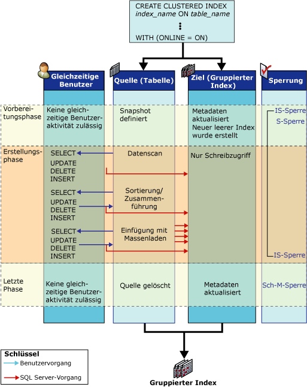

# Funktionsweise von Onlineindexvorgängen
[!INCLUDE[tsql-appliesto-ss2016-asdb-xxxx-xxx_md](../../includes/tsql-appliesto-ss2016-asdb-xxxx-xxx-md.md)]

  In diesem Thema werden die während eines Onlineindexvorgangs vorhandenen Strukturen definiert und die mit diesen Strukturen verbundenen Aktivitäten aufgezeigt.  
  
## Onlineindexstrukturen  
 Um gleichzeitige Benutzeraktivitäten während eines Index-DLL-Vorgangs (Data Definition Language, Datendefinitionssprache) zu ermöglichen, werden folgende Strukturen im Rahmen des Onlineindexvorgangs verwendet: Quellindizes und bereits vorhandene Indizes, Zielindizes sowie ein temporärer Zuordnungsindex zum Neuerstellen eines Heaps oder Löschen eines gruppierten Indexes im Onlinemodus.  
  
-   **Quellindizes und bereits vorhandene Indizes**  
  
     Als Quelle werden die Daten der ursprünglichen Tabelle oder des gruppierten Indexes bezeichnet. Bereits vorhandene Indizes sind sämtliche nicht gruppierten Indizes, die der Quellstruktur zugeordnet sind. Wenn der Onlineindexvorgang beispielsweise einen gruppierten Index neu erstellt, dem vier nicht gruppierte Indizes zugeordnet sind, stellen die vorhandenen gruppierten Indizes die Quelle dar, und die bereits vorhandenen Indizes sind die nicht gruppierten Indizes.  
  
     Die bereits vorhandenen Indizes stehen den gleichzeitigen Benutzern für Auswahl-, Einfüge-, Update- und Löschvorgänge zur Verfügung. Hierzu zählen auch Masseneinfügungen (wir unterstützt aber nicht empfohlen) und implizite Updates durch Trigger und Einschränkungen der referenziellen Integrität. Alle bereits vorhandenen Indizes sind für Abfragen und Suchvorgänge verfügbar. Dies bedeutet, dass sie vom Abfrageoptimierer ausgewählt und gegebenenfalls in Indexhinweisen angegeben werden können.  
  
-   **Target**  
  
     Das Ziel bzw. die Ziele stellen den neuen Index (Heap) oder eine Gruppe neuer Indizes dar, die erstellt oder neu erstellt wird. Einfüge-, Update- und Löschvorgänge durch den Benutzer an der Quelle werden von [!INCLUDE[ssDEnoversion](../../includes/ssdenoversion-md.md)] während des Indexvorgangs auf das Ziel angewendet. Wenn der Onlineindexvorgang beispielsweise einen gruppierten Index neu erstellt, ist der neu erstellte gruppierte Index das Ziel, [!INCLUDE[ssDE](../../includes/ssde-md.md)] erstellt nicht gruppierte Indizes nicht neu, wenn ein gruppierter Index neu erstellt wird.  
  
     Der Zielindex wird während der Verarbeitung von SELECT-Anweisungen erst durchsucht, nachdem ein Commit für den Vorgang ausgeführt wurde. Intern wird der Index als schreibgeschützt markiert.  
  
-   **Temporärer Zuordnungsindex**  
  
     Onlineindexvorgänge, die einen gruppierten Index erstellen, löschen oder neu erstellen, benötigen auch einen temporären Zuordnungsindex. Dieser temporäre Index wird von gleichzeitigen Transaktionen verwendet, um zu bestimmen, welche Datensätze in den neuen Indizes gelöscht werden sollen, die erstellt werden, wenn Zeilen in der zugrunde liegenden Tabelle aktualisiert oder gelöscht werden. Dieser nicht gruppierte Index wird im gleichen Schritt erstellt wie der neue gruppierte Index (oder Heap) und erfordert keinen separaten Sortiervorgang. Gleichzeitige Transaktionen behalten zudem den temporären Zuordnungsindex in all ihren Einfüge-, Update- und Löschvorgängen bei.  
  
## Onlineindexaktivitäten  
 Während eines einfachen Onlineindexvorgangs, wie beispielsweise der Erstellung eines gruppierten Indexes für eine nicht gruppierte Tabelle (Heap), durchlaufen die Quelle und das Ziel drei Phasen: Vorbereitung, Erstellung und Endphase.  
  
 Die folgende Abbildung zeigt den Prozess der Onlineerstellung eines anfänglichen gruppierten Indexes. Das Quellobjekt (der Heap) weist keine anderen Indizes auf. Die Aktivitäten der Quell- und Zielstrukturen werden für die einzelnen Phasen dargestellt. Außerdem werden gleichzeitige Auswahl-, Einfüge-, Update- und Löschvorgänge von Benutzern angezeigt. Die Vorbereitungs-, Erstellungs- und Endphase werden zusammen mit dem in der jeweiligen Phase verwendeten Sperrmodus angezeigt.  
  
   
  
## Quellstrukturaktivitäten  
 Die folgende Tabelle enthält die Aktivitäten in Bezug auf die Quellstrukturen während der einzelnen Phasen des Indexvorgangs und die entsprechende Sperrstrategie.  
  
|Phase|Quellaktivität|Quellsperren|  
|-----------|---------------------|------------------|  
|Vorbereitung   Sehr kurze Phase|Vorbereitung der Systemmetadaten auf die Erstellung der neuen leeren Indexstruktur.   Es wird eine Momentaufnahme der Tabelle definiert. Das heißt, dass mithilfe der Zeilenversionsverwaltung eine Lesekonsistenz auf Transaktionsebene ermöglicht wird.   Schreibvorgänge durch gleichzeitige Benutzer an der Quelle werden für einen sehr kurzen Zeitraum gesperrt.   Es werden mit Ausnahme der Erstellung mehrerer nicht gruppierter Indizes keine gleichzeitigen DDL-Vorgänge zugelassen.|S (Shared) für Tabelle*   Beabsichtigte freigegebene Sperre (Intent Shared, IS)   INDEX_BUILD_INTERNAL_RESOURCE\*\*|  
|Erstellen   Hauptphase|Die Daten werden gescannt, sortiert, zusammengeführt und in Massenladevorgängen in das Ziel eingefügt.   Auswahl-, Einfüge-, Update- und Löschvorgänge durch gleichzeitige Benutzer werden sowohl auf die bereits vorhandenen Indizes als auch auf sämtliche neu erstellten Indizes angewendet.|IS   INDEX_BUILD_INTERNAL_RESOURCE**|  
|Endphase   Sehr kurze Phase|Alle Transaktionen ohne Commit müssen abgeschlossen werden, bevor diese Phase gestartet wird. Je nach der eingerichteten Sperre werden alle Lese- und Schreibtransaktionen für einen sehr kurzen Zeitraum gesperrt, bis diese Phase abgeschlossen ist.   Sie Systemmetadaten werden aktualisiert; d. h., die Quelle wurde durch das Ziel ersetzt.   Die Quelle wird gelöscht, falls dies erforderlich ist. Beispielsweise nach dem erneuten Erstellen oder dem Löschen eines gruppierten Indexes.|INDEX_BUILD_INTERNAL_RESOURCE**   S für die Tabelle, sofern ein nicht gruppierter Index erstellt wird.\*   Schemaänderungssperre (SCH-M, Schema Modification), sofern eine Quellstruktur (Index oder Tabelle) gelöscht wird.\*|  
  
 \* Der Indexvorgang wartet, bis Updatetransaktionen ohne Commit abgeschlossen sind, bevor er die S- oder SCH-M-Sperre für die Tabelle einrichtet.  
  
 ** Die Ressourcensperre INDEX_BUILD_INTERNAL_RESOURCE verhindert die Ausführung gleichzeitiger DDL-Vorgänge (Datendefinitionssprache) für die Quelle und bereits vorhandene Strukturen, während der Indexvorgang ausgeführt wird. Diese Sperre verhindert beispielsweise die gleichzeitige Neuerstellung zweier Indizes für dieselbe Tabelle. Obwohl diese Ressourcensperre der Sch-M-Sperre zugeordnet ist, verhindert sie keine Datenbearbeitungsanweisungen.  
  
 Die vorherige Tabelle zeigt eine einzelne freigegebene Sperre (Shared, S) an, die während der Erstellungsphase eines Onlineindexvorgangs, der einen einzelnen Index einschließt, eingerichtet wurde. Wenn gruppierte und nicht gruppierte Indizes erstellt oder neu erstellt werden, werden bei einem einzelnen Onlineindexvorgang (z. B. während der anfänglichen Erstellung eines gruppierten Indexes für eine Tabelle, die einen oder mehrere nicht gruppierte Indizes enthält) zwei kurzfristige S-Sperren gefolgt von langfristigen beabsichtigten gemeinsamen Sperren (IS-Sperren) während der Erstellungsphase eingerichtet. Eine S-Sperre wird zunächst für die Erstellung des gruppierten Indexes eingerichtet, und wenn die Erstellung des gruppierten Indexes abgeschlossen ist, wird eine zweite kurzfristige S-Sperre für die Erstellung der nicht gruppierten Indizes eingerichtet. Nachdem die nicht gruppierten Indizes erstellt wurden, wird die S-Sperre bis zur Endphase des Onlineindexvorgangs auf eine IS-Sperre herabgestuft.  
  
### Zielstrukturaktivitäten  
 Die folgende Tabelle enthält die Aktivitäten in Bezug auf die Zielstrukturen während der einzelnen Phasen des Indexvorgangs und die entsprechende Sperrstrategie.  
  
|Phase|Zielaktivität|Zielsperren|  
|-----------|---------------------|------------------|  
|Vorbereitung|Neuer Index wird erstellt und auf schreibgeschützt festgelegt.|IS|  
|Erstellen|Daten werden aus der Quelle eingefügt.   Änderungen durch den Benutzer (Einfügungen, Updates, Löschungen), die auf die Quelle angewendet werden, werden angewendet.   Diese Aktivität ist für den Benutzer sichtbar.|IS|  
|Endphase|Indexmetadaten werden aktualisiert.   Lese-/Schreibstatus wird für Index festgelegt.|S   oder   SCH-M|  
  
 Der Zugriff auf das Ziel durch SELECT-Anweisungen, die vom Benutzer ausgegeben werden, ist erst nach Abschluss des Vorgangs möglich.  
  
 Nach Abschluss der Vorbereitungs- und Endphase werden die im Prozedurcache gespeicherten Abfrage- und Updatepläne für ungültig erklärt. Folgeabfragen verwenden den neuen Index.  
  
 Die Lebensdauer eines Cursors, der für eine Tabelle deklariert wurde, die an einem Onlineindexvorgang beteiligt ist, wird durch die Onlineindexphasen begrenzt. Updatecursor werden in den einzelnen Phasen für ungültig erklärt. Schreibgeschützte Cursor werden nur nach der Endphase für ungültig erklärt.  
  
## Verwandte Inhalte  
 [Ausführen von Onlineindexvorgängen](../../relational-databases/indexes/perform-index-operations-online.md)  
  
 [Richtlinien für Onlineindexvorgänge](../../relational-databases/indexes/guidelines-for-online-index-operations.md)  
  
  

