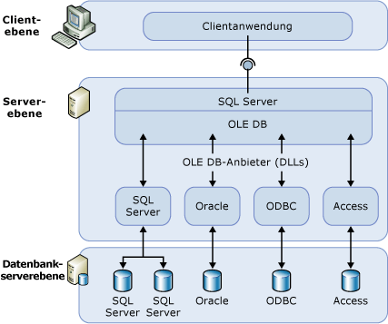

# Verbindungsserver (Datenbankmodul)
[!INCLUDE[appliesto-ss-xxxx-xxxx-xxx-md](../../includes/appliesto-ss-xxxx-xxxx-xxx-md.md)]
  Konfigurieren Sie einen Verbindungsserver, um [!INCLUDE[ssDEnoversion](../../includes/ssdenoversion-md.md)] für die Ausführung von Befehlen für OLE DB-Datenquellen außerhalb der Instanz von [!INCLUDE[ssNoVersion](../../includes/ssnoversion-md.md)]zu aktivieren. In der Regel werden Verbindungsserver so konfiguriert, um [!INCLUDE[ssDE](../../includes/ssde-md.md)] für die Ausführung einer [!INCLUDE[tsql](../../includes/tsql-md.md)] -Anweisung, die Tabellen in einer anderen Instanz von [!INCLUDE[ssNoVersion](../../includes/ssnoversion-md.md)]enthält, oder ein anderes Datenbankprodukt z. B. Oracle zu aktivieren. Viele Typen von OLE DB-Datenquellen können als Verbindungsserver konfiguriert werden, einschließlich [!INCLUDE[msCoName](../../includes/msconame-md.md)] Access und Excel. Verbindungsserver bieten die folgenden Vorteile:  
  
-   Die Fähigkeit, auf Daten von außerhalb von [!INCLUDE[ssNoVersion](../../includes/ssnoversion-md.md)]zuzugreifen.  
  
-   Die Fähigkeit, verteilte Abfragen, Updates, Befehle und Transaktionen auf heterogenen Datenquellen im gesamten Unternehmen auszugeben.  
  
-   Die Möglichkeit, verschiedene Datenquellen ähnlich zu adressieren.  
  
 Ein Verbindungsserver kann mit [!INCLUDE[ssManStudioFull](../../includes/ssmanstudiofull-md.md)] oder mithilfe der Anweisung [sp_addlinkedserver &#40;Transact-SQL&#41;](../../relational-databases/system-stored-procedures/sp-addlinkedserver-transact-sql.md) konfiguriert werden. OLE DB-Anbieter variieren stark in Hinblick auf Typ und Anzahl der erforderlichen Parameter. Bei manchen Anbietern müssen Sie beispielsweise mit [sp_addlinkedsrvlogin &#40;Transact-SQL&#41;](../../relational-databases/system-stored-procedures/sp-addlinkedsrvlogin-transact-sql.md)zu aktivieren. Einige OLE DB-Anbieter ermöglichen es [!INCLUDE[ssNoVersion](../../includes/ssnoversion-md.md)] , Daten in der OLE DB-Quelle zu aktualisieren. Andere Anbieter stellen nur schreibgeschützten Datenzugriff bereit. Informationen zu den einzelnen OLE DB-Anbietern finden Sie in der jeweiligen Dokumentation des OLE DB-Anbieters.  
  
## Verbindungsserverkomponenten  
 Eine Verbindungsserverdefinition gibt die folgenden Objekte an:  
  
-   Einen OLE DB-Anbieter.  
  
-   Eine OLE DB-Datenquelle.  
  
 Ein *OLE DB-Anbieter* ist eine DLL (Dynamic Link Library), die mit einer bestimmten Datenquelle interagiert und sie verwaltet. Eine *OLE DB-Datenquelle* identifiziert die spezielle Datenbank, auf die über OLE DB zugegriffen werden kann. Obwohl es sich bei Datenquellen, die über Verbindungsserverdefinitionen abgefragt werden, normalerweise um Datenbanken handelt, sind OLE DB-Anbieter für eine Vielzahl von Dateien und Dateiformaten verfügbar. Dazu gehören Textdateien, Kalkulationstabellendaten und die Ergebnisse aus Volltextsuchläufen.  
  
 Der OLE DB-Anbieter für [!INCLUDE[msCoName](../../includes/msconame-md.md)][!INCLUDE[ssNoVersion](../../includes/ssnoversion-md.md)] Native Client (PROGID: SQLNCLI11) ist der offizielle OLE DB-Anbieter für [!INCLUDE[ssNoVersion](../../includes/ssnoversion-md.md)].  
  
> [!NOTE]  
>  [!INCLUDE[ssNoVersion](../../includes/ssnoversion-md.md)] sind jedoch so entworfen, dass sie mit jedem OLE DB-Anbieter zusammenarbeiten, der die erforderlichen OLE DB-Schnittstellen implementiert. [!INCLUDE[ssNoVersion](../../includes/ssnoversion-md.md)] wurde jedoch nur für den OLE DB-Anbieter für [!INCLUDE[ssNoVersion](../../includes/ssnoversion-md.md)] Native Client und bestimmte andere Anbieter getestet.  
  
## Einzelheiten zu Verbindungsservern  
 Die folgende Abbildung zeigt die Grundlagen einer Verbindungsserverkonfiguration.  
  
   
  
 Verbindungsserver werden in der Regel für die Verarbeitung verteilter Abfragen verwendet. Führt eine Clientanwendung eine verteilte Abfrage über einen Verbindungsserver aus, analysiert [!INCLUDE[ssNoVersion](../../includes/ssnoversion-md.md)] den Befehl und sendet Anforderungen an OLE DB. Für eine Rowsetanforderung kann eine Abfrage für den Anbieter ausgeführt oder eine Basistabelle vom Anbieter geöffnet werden.  
  
 Damit eine Datenquelle Daten über einen Verbindungsserver zurückgibt, muss der OLE DB-Anbieter (DLL) für diese Datenquelle auf demselben Server wie die Instanz von [!INCLUDE[ssNoVersion](../../includes/ssnoversion-md.md)]vorhanden sein.  
  
 Wenn ein OLE DB-Anbieter eines Drittanbieters verwendet wird, müssen dem Konto, unter dem der [!INCLUDE[ssNoVersion](../../includes/ssnoversion-md.md)] -Dienst ausgeführt wird, Lese- und Ausführungsberechtigungen für das Verzeichnis (und alle Unterverzeichnisse) erteilt worden sein, in dem der Anbieter installiert ist.  
  
## Verwalten von Anbietern  
 Eine Gruppe von Optionen steuert, wie [!INCLUDE[ssNoVersion](../../includes/ssnoversion-md.md)] OLE DB-Anbieter lädt und verwendet, die in der Registrierung angegeben werden.  
  
## Verwalten von Verbindungsserverdefinitionen  
 Beim Einrichten eines Verbindungsservers sollten die Verbindungsinformationen und Datenquelleninformationen in [!INCLUDE[ssNoVersion](../../includes/ssnoversion-md.md)]registriert werden. Nach der Registrierung kann über einen einzelnen logischen Namen auf diese Datenquelle verwiesen werden.  
  
 Sie können gespeicherte Prozeduren und Katalogsichten zum Verwalten von Verbindungsserverdefinitionen verwenden:  
  
-   Erstellen Sie eine Verbindungsserverdefinition, indem Sie **sp_addlinkedserver**ausführen.  
  
-   Zeigen Sie Informationen zu den in einer bestimmten Instanz von [!INCLUDE[ssNoVersion](../../includes/ssnoversion-md.md)] definierten Verbindungsservern an, indem Sie eine Abfrage der **sys.servers** -Systemkatalogsichten ausführen.  
  
-   Löschen Sie eine Verbindungsserverdefinition, indem Sie **sp_dropserver**ausführen. Sie können mit dieser gespeicherten Prozedur auch einen Remoteserver entfernen.  
  
 Sie können Verbindungsserver auch mithilfe von [!INCLUDE[ssManStudioFull](../../includes/ssmanstudiofull-md.md)]definieren. Klicken Sie im Objekt-Explorer mit der rechten Maustaste auf **Serverobjekte**, klicken Sie auf **Neu**, und klicken Sie dann auf **Verbindungsserver**. Sie können eine Verbindungsserverdefinition löschen, indem Sie mit der rechten Maustaste auf den Namen des Verbindungsservers und dann auf **Löschen**klicken.  
  
 Wenn Sie eine verteilte Abfrage auf einem Verbindungsserver ausführen, sollten Sie einen vollqualifizierten vierteiligen Tabellennamen für jede Datenquelle einschließen, die abgefragt werden soll. Dieser vierteilige Name muss in der Form *linked_server_name.catalog***.***schema***.***object_name* vorliegen.  
  
> [!NOTE]  
>  Verbindungsserver können so definiert werden, dass sie zurück auf den Server zeigen, auf dem sie definiert sind (zurücklaufen = loop back). Loopbackserver sind sehr nützlich, um eine Anwendung, von der verteilte Abfragen verwendet werden, in einem Netzwerk mit einem einzelnen Server zu testen. Loopbackverbindungsserver sind für Tests bestimmt und werden für viele Vorgänge, z. B. verteilte Transaktionen, nicht unterstützt.  
  
## Related Tasks  
 [Erstellen von Verbindungsservern &#40;SQL Server-Datenbankmodul&#41;](../../relational-databases/linked-servers/create-linked-servers-sql-server-database-engine.md)  
  
 [sp_addlinkedserver &#40;Transact-SQL&#41;](../../relational-databases/system-stored-procedures/sp-addlinkedserver-transact-sql.md)  
  
 [sp_addlinkedsrvlogin &#40;Transact-SQL&#41;](../../relational-databases/system-stored-procedures/sp-addlinkedsrvlogin-transact-sql.md)  
  
 [sp_dropserver &#40;Transact-SQL&#41;](../../relational-databases/system-stored-procedures/sp-dropserver-transact-sql.md)  
  
## Verwandte Inhalte  
 [sys.servers &#40;Transact-SQL&#41;](../../relational-databases/system-catalog-views/sys-servers-transact-sql.md)  
  
 [sp_linkedservers &#40;Transact-SQL&#41;](../../relational-databases/system-stored-procedures/sp-linkedservers-transact-sql.md)  
  
  
