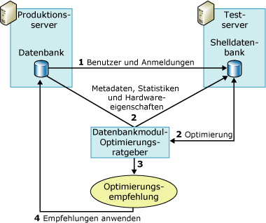

# <a name="reduce-the-production-server-tuning-load"></a>Reduzieren der Optimierungsauslastung des Produktionsservers
[!INCLUDE[appliesto-ss-asdb-xxxx-xxx-md](../../includes/appliesto-ss-asdb-xxxx-xxx-md.md)] Der [!INCLUDE[ssDE](../../includes/ssde-md.md)]-Optimierungsratgeber nutzt den Abfrageoptimierer, um die Arbeitsauslastung zu analysieren und Optimierungsempfehlungen zu geben. Wenn diese Analyse auf dem Produktionsserver ausgeführt wird, erhöht sich die Serverlast. Dies kann zu Einbußen bei der Serverleistung während der Optimierungssitzung führen. Sie reduzieren die Serverlast während einer Optimierungssitzung, indem Sie zusätzlich zum Produktionsserver einen Testserver verwenden.  
  
## <a name="how-database-engine-tuning-advisor-uses-a-test-server"></a>Verwendung eines Testservers durch den Datenbankoptimierungsratgeber  
 Die traditionelle Verwendungsweise eines Testservers besteht im Kopieren aller Daten vom Produktionsserver auf den Testserver, Optimieren des Testservers und anschließenden Implementieren der Empfehlung auf dem Produktionsserver. Dadurch wird zwar die Leistungsbeeinträchtigung auf dem Produktionsserver beseitigt, aber dies entspricht nicht der optimalen Lösung. Beispielsweise kann das Kopieren großer Datenbankmengen vom Produktionsserver auf den Testserver viel Zeit und viele Ressourcen beanspruchen. Darüber hinaus ist die Testserverhardware selten so leistungsfähig wie die Hardware, die für Produktionsserver bereitgestellt wird. Der Optimierungsprozess basiert auf dem Abfrageoptimierer, und die von diesem generierten Empfehlungen hängen teilweise von der zugrunde liegenden Hardware ab. Falls die Test- und die Produktionsserverhardware nicht identisch sind, wird dadurch die Qualität der Empfehlungen des [!INCLUDE[ssDE](../../includes/ssde-md.md)] -Optimierungsratgebers reduziert.  
  
 Um diese Probleme zu vermeiden, optimiert der [!INCLUDE[ssDE](../../includes/ssde-md.md)] -Optimierungsratgeber eine Datenbank auf einem Produktionsserver durch Auslagern des größten Teils der Optimierungslast auf einen Testserver. Dies geschieht durch Verwenden der Hardwarekonfigurationsinformationen des Produktionsservers und ohne die Daten tatsächlich vom Produktionsserver auf den Testserver zu kopieren. [!INCLUDE[ssDE](../../includes/ssde-md.md)] -Optimierungsratgeber kopiert keine tatsächlichen Daten vom Produktionsserver auf den Testserver. Er kopiert nur die Metadaten und notwendigen Statistiken.  
  
 Die folgenden Schritte beschreiben den Prozess zum Optimieren einer Produktionsdatenbank auf einem Testserver:  
  
1.  Stellen Sie sicher, dass der Benutzer, der den Testserver verwenden möchte, auf beiden Servern vorhanden ist.  
  
     Bevor Sie beginnen, sollten Sie sicherstellen, dass der Benutzer, der den Testserver zum Optimieren einer Datenbank auf dem Produktionsserver verwenden möchte, auf beiden Servern vorhanden ist. Dazu müssen Sie den Benutzer und den zugehörigen Anmeldenamen auf dem Testserver erstellen. Falls Sie ein Mitglied der festen Serverrolle **sysadmin** auf beiden Computern sind, ist dieser Schritt nicht erforderlich.  
  
2.  Optimieren Sie die Arbeitsauslastung auf dem Testserver.  
  
     Zum Optimieren einer Arbeitsauslastung auf einem Testserver müssen Sie eine XML-Eingabedatei zusammen mit dem Befehlszeilen-Hilfsprogramm **dta** verwenden. Geben Sie in der XML-Eingabedatei den Namen des Testservers mit dem untergeordneten Element **TestServer** sowie die Werte für die anderen untergeordneten Elemente im übergeordneten Element **TuningOptions** an.  
  
     Während des Optimierungsprozesses erstellt der Datenbankoptimierungsratgeber eine Shelldatenbank auf dem Testserver. Um diese Shelldatenbank zu erstellen und zu optimieren, führt der Datenbankoptimierungsratgeber folgende Aufrufe beim Produktionsserver aus:  
  
    1.  [!INCLUDE[ssDE](../../includes/ssde-md.md)] -Optimierungsratgeber importiert Metadaten aus der Produktionsdatenbank in die Testserver-Shelldatenbank. Zu diesen Metadaten zählen leere Tabellen, Indizes, Sichten, gespeicherte Prozeduren, Trigger usw. Auf diese Weise können die Arbeitsauslastungsabfragen für die Testserver-Shelldatenbank ausgeführt werden.  
  
    2.  [!INCLUDE[ssDE](../../includes/ssde-md.md)] -Optimierungsratgeber importiert Statistiken vom Produktionsserver, damit der Abfrageoptimierer Abfragen auf dem Testserver präzise optimieren kann.  
  
    3.  [!INCLUDE[ssDE](../../includes/ssde-md.md)] -Optimierungsratgeber importiert Hardwareparameter, die die Anzahl von Prozessoren und den verfügbaren Arbeitsspeicher angeben, vom Produktionsserver, um dem Abfrageoptimierer die erforderlichen Informationen zum Generieren eines Abfrageplans bereitzustellen.  
  
3.  Nachdem der [!INCLUDE[ssDE](../../includes/ssde-md.md)] -Optimierungsratgeber die Testserver-Shelldatenbank optimiert hat, wird eine Optimierungsempfehlung generiert.  
  
4.  Wenden Sie die beim Optimieren des Testservers erhaltene Empfehlung auf den Produktionsserver an.  
  
 Die folgende Abbildung veranschaulicht das Szenario mit dem Testserver und dem Produktionsserver:  
  
   
  
> [!NOTE]  
>  Die Funktion der Optimierung mit einem Testserver wird auf der grafischen Benutzeroberfläche (Graphical User Interface, GUI) des [!INCLUDE[ssDE](../../includes/ssde-md.md)] -Optimierungsratgebers nicht unterstützt.  
  
## <a name="example"></a>Beispiel  
 Stellen Sie zunächst sicher, dass der Benutzer, der die Optimierung ausführen möchte, auf dem Testserver und dem Produktionsserver vorhanden ist.  
  
 Nachdem die Benutzerinformationen auf den Testserver kopiert wurden, können Sie Ihre Testserver-Optimierungssitzung in der XML-Eingabedatei des [!INCLUDE[ssDE](../../includes/ssde-md.md)] -Optimierungsratgebers definieren. Die folgende XML-Beispieleingabedatei veranschaulicht, wie Sie einen Testserver zum Optimieren einer Datenbank mit dem [!INCLUDE[ssDE](../../includes/ssde-md.md)] -Optimierungsratgeber angeben.  
  
 In diesem Beispiel wird die `MyDatabaseName` -Datenbank auf `MyServerName`optimiert. Das [!INCLUDE[tsql](../../includes/tsql-md.md)] -Skript `MyWorkloadScript.sql`wird als Arbeitsauslastung verwendet. Diese Arbeitsauslastung enthält Ereignisse, die für `MyDatabaseName`ausgeführt werden. Die meisten Aufrufe des Abfrageoptimierers bei dieser Datenbank im Rahmen des Optimierungsprozesses werden von der Shelldatenbank ausgeführt, die auf `MyTestServerName`gespeichert ist. Die Shelldatenbank setzt sich aus Metadaten und Statistiken zusammen. Dieser Prozess führt dazu, dass der Optimierungsaufwand auf den Testserver ausgelagert wird. Wenn der [!INCLUDE[ssDE](../../includes/ssde-md.md)] -Optimierungsratgeber die Optimierungsempfehlung mithilfe dieser XML-Eingabedatei generiert, sollten nur Indizes berücksichtigt werden (`<FeatureSet>IDX</FeatureSet>`), keine Partitionierung. Die vorhandenen physischen Entwurfsstrukturen in `MyDatabaseName`müssen nicht beibehalten werden.  
  
```  
<?xml version="1.0" encoding="utf-16" ?>  
<DTAXML xmlns:xsi="http://www.w3.org/2001/XMLSchema-instance" xmlns="http://schemas.microsoft.com/sqlserver/2004/07/dta">  
  <DTAInput>  
    <Server>  
      <Name>MyServerName</Name>  
      <Database>  
        <Name>MyDatabaseName</Name>  
      </Database>  
    </Server>  
    <Workload>  
      <File>MyWorkloadScript.sql</File>  
    </Workload>  
    <TuningOptions>  
      <TestServer>MyTestServerName</TestServer>  
      <FeatureSet>IDX</FeatureSet>  
      <Partitioning>NONE</Partitioning>  
      <KeepExisting>NONE</KeepExisting>  
    </TuningOptions>  
  </DTAInput>  
</DTAXML>  
```  
  
## <a name="see-also"></a>Weitere Informationen finden Sie unter  
 [Gesichtspunkte bei der Verwendung von Testservern](../../relational-databases/performance/considerations-for-using-test-servers.md)   
 [XML-Eingabedateireferenz &#40;Datenbankoptimierungsratgeber&#41;](../../tools/dta/xml-input-file-reference-database-engine-tuning-advisor.md)  
  
  
