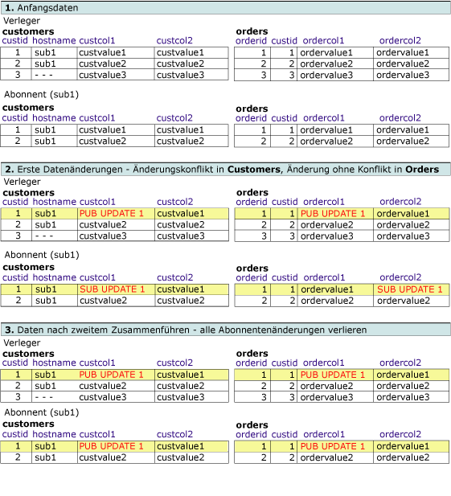
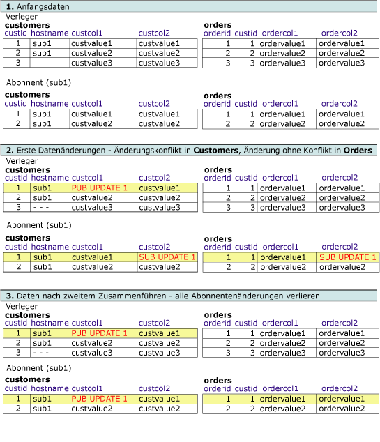
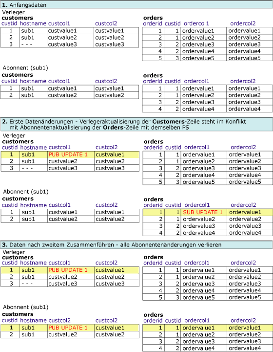

# Erweiterte Konflikte in Mergereplikationen – Lösen von Konflikten in logischen Datensätzen
[!INCLUDE[appliesto-ss-xxxx-xxxx-xxx-md](../../../includes/appliesto-ss-xxxx-xxxx-xxx-md.md)]
  In diesem Thema werden die verschiedenen Kombinationsmöglichkeiten aus Konflikterkennung und Konfliktlösung bei der Verwendung logischer Datensätze behandelt. Konflikte treten bei der Mergereplikation auf, wenn ein und dieselben Daten von mehreren Knoten geändert werden oder wenn die Mergereplikation auf bestimmte Arten von Fehlern stößt, wie z. B. Einschränkungsverletzungen beim Replizieren von Änderungen. Weitere Informationen zur Konflikterkennung und -lösung finden Sie unter [Advanced Merge Replication Conflict Detection and Resolution](../../../relational-databases/replication/merge/advanced-merge-replication-conflict-detection-and-resolution.md).  
  
 Informationen zum Eingeben der Konfliktnachverfolgungs- und -lösungsebene für einen Artikel finden Sie unter [Specify the Conflict Tracking and Resolution Level for Merge Articles](../../../relational-databases/replication/publish/specify-the-conflict-tracking-and-resolution-level-for-merge-articles.md).  
  
## Konflikterkennung  
 Wie Konflikte bei logischen Datensätzen ermittelt werden, hängt von den folgenden beiden Artikeleigenschaften ab: **column_tracking** und **logical_record_level_conflict_detection**. [!INCLUDE[ssVersion2005](../../../includes/ssversion2005-md.md)] und höhere Versionen unterstützen ebenfalls die Erkennung auf der logischen Datensatzebene.  
  
 Für die **logical_record_level_conflict_detection** -Artikeleigenschaft kann TRUE oder FALSE festgelegt werden. Der Wert sollte nur für den übergeordneten Artikel auf der obersten Ebene festgelegt werden. Von den untergeordneten Artikeln wird er ignoriert. Wenn FALSE festgelegt wurde, erfolgt die Konflikterkennung durch die Mergereplikation wie in den früheren Versionen von [!INCLUDE[ssNoVersion](../../../includes/ssnoversion-md.md)], d. h. ausschließlich auf der Basis des Werts der **column_tracking** -Eigenschaft für den Artikel. Wurde TRUE festgelegt, ignoriert die Mergereplikation die **column_tracking** -Eigenschaft für den Artikel und ermittelt einen Konflikt, wenn Änderungen im logischen Datensatz vorgenommen werden. Stellen Sie sich z. B. das folgende Szenario vor:  
  
   
  
 Ein Konflikt wird erkannt, wenn zwei Benutzer Werte für den logischen Customer2-Datensatz in den **Customers**-, **Orders**- bzw. **OrderItems** -Tabellen ändern. Bei diesem Beispiel kommt es zu Änderungen durch eine UPDATE-Anweisung, der Konflikt würde aber auch erkannt werden, wenn die Änderungen durch eine INSERT- oder DELETE-Anweisung zustande gekommen wären.  
  
## Konfliktlösung  
 Standardmäßig verwendet die Mergereplikation zum Lösen von Konflikten eine prioritätsbasierte Logik. Wenn eine Änderung, die zu einem Konflikt führt, in zwei Abonnentendatenbanken vorgenommen wird, hat die Änderung für den Abonnenten mit der höheren Abonnementpriorität Vorrang. Ist die Priorität bei beiden Abonnements identisch, erhält die Änderung den Vorzug, die den Verleger zuerst erreicht. Bei der Erkennung auf Zeilen- und Spaltenebene wird die unterlegene Zeile immer durch die gesamte Gewinnerzeile überschrieben.  
  
 Für die **logical_record_level_conflict_resolution** -Artikeleigenschaft kann TRUE oder FALSE festgelegt werden. Der Wert sollte nur für den übergeordneten Artikel auf der obersten Ebene festgelegt werden. Von den untergeordneten Artikeln wird er ignoriert. Wenn für den Wert TRUE festgelegt wird, wird der unterlegene logische Datensatz durch den gesamten gewinnenden logischen Datensatz überschrieben. Wenn für den Wert FALSE festgelegt wird, können die einzelnen Gewinnerzeilen von unterschiedlichen Abonnenten oder Verlegern stammen. So könnte z. B. Abonnent A einen Konflikt in einer Zeile aus der **Orders** -Tabelle und Abonnent B einen Konflikt in einer zugehörigen Zeile aus der **OrderItems** -Tabelle gewinnen. Im Ergebnis entsteht ein logischer Datensatz mit der **Orders** -Zeile von Abonnent A und der **OrderItems** -Zeile von Abonnent B.  
  
## Wechselwirkung zwischen den Einstellungen für die Konfliktlösung und denen für die Konflikterkennung  
 Zu welchem Ergebnis Konflikte führen, hängt von der Wechselwirkung zwischen den Konflikterkennungs- und den Konfliktlösungseinstellungen ab. In den Beispielen unten wird davon ausgegangen, dass eine prioritätsbasierte Konfliktlösung zur Anwendung kommt. Bei der Verwendung logischer Datensätze gibt es folgende Möglichkeiten:  
  
-   Erkennung auf Zeilen- oder Spaltenebene, Lösung auf Zeilenebene  
  
-   Erkennung auf Spaltenebene, Lösung auf der Ebene des logischen Datensatzes  
  
-   Erkennung auf Zeilenebene, Lösung auf der Ebene des logischen Datensatzes  
  
-   Erkennung auf der Ebene des logischen Datensatzes, Lösung auf der Ebene des logischen Datensatzes  
  
### Erkennung auf Zeilen- oder Spaltenebene, Lösung auf Zeilenebene  
 In diesem Beispiel ist die Veröffentlichung wie folgt konfiguriert:  
  
-   Für**column_tracking** ist TRUE oder FALSE festgelegt.  
  
-   Für**logical_record_level_conflict_detection** ist FALSE festgelegt.  
  
-   Für**logical_record_level_conflict_resolution** ist FALSE festgelegt.  
  
 In diesem Fall erfolgt die Erkennung auf der Zeilen- oder Spaltenebene, und die Lösung erfolgt auf der Zeilenebene. Diese Einstellungen werden verwendet, um davon zu profitieren, dass alle Änderungen eines logischen Datensatzes als Einheit repliziert werden, ohne dass dazu eine Konflikterkennung oder -lösung auf der Ebene des logischen Datensatzes erfolgt.  
  
### Erkennung auf Spaltenebene, Lösung auf der Ebene des logischen Datensatzes  
 In diesem Beispiel ist die Veröffentlichung wie folgt konfiguriert:  
  
-   Für**column_tracking** ist TRUE festgelegt.  
  
-   Für**logical_record_level_conflict_detection** ist FALSE festgelegt.  
  
-   Für**logical_record_level_conflict_resolution** ist TRUE festgelegt.  
  
 Ein Verleger und ein Abonnent beginnen mit demselben Datensatz, und zwischen den **orders** - und **customers** -Tabellen ist ein logischer Datensatz definiert. Der Verleger ändert die **custcol1** -Spalte in der **customers** -Tabelle und die **ordercol1** -Spalte in der **orders** -Tabelle. Der Abonnent ändert die **custcol1** -Spalte in derselben Zeile der **customers** -Tabelle und die **ordercol2** -Spalte in derselben Zeile der **orders** -Tabelle. Die Änderungen an derselben Spalte in der **customer** -Tabelle führen zu einem Konflikt, aus den Änderungen an der **orders** -Tabelle ergibt sich jedoch kein Konflikt.  
  
 Da die Konflikte auf der Ebene des logischen Datensatzes gelöst werden, ersetzen während der Replikationsverarbeitung die Gewinneränderungen, die auf dem Verleger vorgenommen wurden, die Änderungen, die an den Tabellen auf dem Abonnenten erfolgt sind.  
  
   
  
### Erkennung auf Zeilenebene, Lösung auf der Ebene des logischen Datensatzes  
 In diesem Beispiel ist die Veröffentlichung wie folgt konfiguriert:  
  
-   Für**column_tracking** ist FALSE festgelegt.  
  
-   Für**logical_record_level_conflict_detection** ist FALSE festgelegt.  
  
-   Für**logical_record_level_conflict_resolution** ist TRUE festgelegt.  
  
 Ein Verleger und ein Abonnent beginnen mit demselben Datensatz. Der Verleger ändert die **custcol1** -Spalte in der **customers** -Tabelle. Der Abonnent ändert die **custcol2** -Spalte in der **customers** -Tabelle und die **ordercol2** -Spalte in der **orders** -Tabelle. Die Änderungen an derselben Spalte in der **customers** -Tabelle führen zu einem Konflikt, während sich aus den Änderungen des Abonnenten an der **orders** -Tabelle kein Konflikt ergibt.  
  
 Da die Konflikte auf der Ebene des logischen Datensatzes gelöst werden, ersetzen während der Synchronisierung die Gewinneränderungen, die auf dem Verleger vorgenommen wurden, die Änderungen, die an den Tabellen auf dem Abonnenten erfolgt sind.  
  
   
  
### Erkennung auf der Ebene des logischen Datensatzes, Lösung auf der Ebene des logischen Datensatzes  
 In diesem Beispiel ist die Veröffentlichung wie folgt konfiguriert:  
  
-   Für**logical_record_level_conflict_detection** ist TRUE festgelegt.  
  
-   Für**logical_record_level_conflict_resolution** ist TRUE festgelegt.  
  
 Ein Verleger und ein Abonnent beginnen mit demselben Datensatz. Der Verleger ändert die **custcol1** -Spalte in der **customers** -Tabelle. Der Abonnent ändert die **ordercol1** -Spalte in der **orders** -Tabelle. Es sind keine Änderungen an identischen Zeilen oder Spalten vorgenommen worden, da aber die Änderungen für **custid**=1 im selben logischen Datensatz erfolgt sind, werden die Änderungen auf der Ebene des logischen Datensatzes als Konflikt erkannt.  
  
 Da die Konflikte auch auf der Ebene des logischen Datensatzes gelöst werden, ersetzt während der Synchronisierung die Gewinneränderung, die auf dem Verleger vorgenommen wurde, die Änderung, die an den Tabellen auf dem Abonnenten erfolgt ist.  
  
   
  
## Weitere Informationen finden Sie unter  
 [Gruppieren von Änderungen an verknüpften Zeilen mithilfe von logischen Datensätzen](../../../relational-databases/replication/merge/group-changes-to-related-rows-with-logical-records.md)  
  
  
