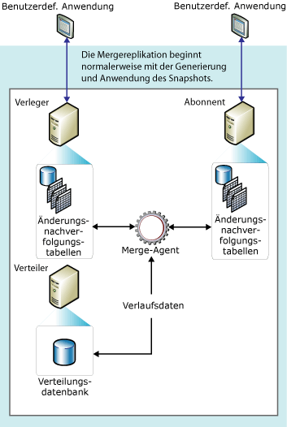

# Mergereplikation
[!INCLUDE[appliesto-ss-xxxx-xxxx-xxx-md](../../../includes/appliesto-ss-xxxx-xxxx-xxx-md.md)]
  Die Mergereplikation beginnt in der Regel, wie die Transaktionsreplikation auch, mit einer Momentaufnahme der Veröffentlichungsdatenbankobjekte und -daten. Spätere Daten- und Schemaänderungen, die auf dem Verleger und den Abonnenten vorgenommen werden, werden mit Triggern nachverfolgt. Ist eine Verbindung mit dem Netzwerk vorhanden, nimmt der Abonnent eine Synchronisierung mit dem Verleger vor und tauscht alle Zeilen aus, die sich seit der letzten Synchronisierung auf dem Verleger und dem Abonnenten geändert haben.  
  
 Die Mergereplikation wird typischerweise in Server-und-Client-Umgebungen verwendet. Ihre Verwendung empfiehlt sich in den folgenden Situationen:  
  
-   Mehrere Abonnenten aktualisieren dieselben Daten zu verschiedenen Zeitpunkten und geben diese Änderungen an den Verleger und an andere Abonnenten weiter.  
  
-   Abonnenten müssen Daten empfangen, Änderungen offline vornehmen und Änderungen später mit dem Verleger und anderen Abonnenten synchronisieren.  
  
-   Jeder Abonnent benötigt eine andere Datenpartition.  
  
-   Es kann zu Konflikten kommen, und Sie müssen in der Lage sein, die Konflikte zu erkennen und zu lösen.  
  
-   Die Anwendung muss nicht auf die einzelnen Zwischenstufen von Datenänderungen, sondern nur auf das endgültige Ergebnis der Datenänderung zugreifen können. Wenn sich eine Zeile auf dem Abonnenten z. B. fünfmal ändert, bevor sie mit einem Verleger synchronisiert wird, ändert sich die Zeile auf dem Verleger lediglich einmal und übernimmt so nur die endgültige Änderung (in diesem Fall also den fünften Wert).  
  
 Die Mergereplikation ermöglicht es verschiedenen Standorten, autonom zu arbeiten und die Updates zu einem späteren Zeitpunkt zu einem einzelnen, einheitlichen Ergebnis zusammenzuführen. Da Updates auf mehr als einem Knoten ausgeführt werden, sind dieselben Daten möglicherweise vom Verleger und von mindestens einem Abonnenten aktualisiert worden. Daher kann es beim Zusammenführen von Updates zu Konflikten kommen, für deren Lösung die Mergereplikation aber eine Reihe von Möglichkeiten bietet.  
  
 Die Mergereplikation wird vom [!INCLUDE[ssNoVersion](../../../includes/ssnoversion-md.md)] -Momentaufnahme-Agent und dem Merge-Agent implementiert. Wenn die Veröffentlichung ungefiltert ist oder statische Filter verwendet, erstellt der Momentaufnahme-Agent eine einzelne Momentaufnahme. Wenn die Veröffentlichung parametrisierte Filter verwendet, erstellt der Momentaufnahme-Agent eine Momentaufnahme für jede Datenpartition. Der Merge-Agent weist die Anfangsmomentaufnahmen den Abonnenten zu. Er führt außerdem inkrementelle Datenänderungen zusammen, die beim Verleger oder bei den Abonnenten ausgeführt wurden, nachdem die Anfangsmomentaufnahme erstellt wurde, und erkennt und löst Konflikte entsprechend den von Ihnen konfigurierten Regeln.  
  
 Damit Änderungen nachverfolgt werden können, müssen Mergereplikationen (und Transaktionsreplikationen) mit Abonnements mit verzögertem Update jede Zeile in jeder veröffentlichten Tabelle eindeutig identifizieren können. Bei der Mergereplikation wird jeder Tabelle die **rowguid** -Spalte hinzugefügt, es sei denn, die Tabelle verfügt bereits über eine Spalte vom Datentyp **uniqueidentifier** mit festgelegter **ROWGUIDCOL** -Eigenschaft (in dem Fall wird diese Spalte verwendet). Beim Löschen der Tabelle aus der Veröffentlichung wird auch die **rowguid** -Spalte entfernt. Wurde eine vorhandene Spalte zur Nachverfolgung verwendet, wird die Spalte nicht entfernt. Ein Filter muss die von der Replikation verwendete **rowguidcol** nicht einschließen, um Zeilen zu identifizieren. Die **newid()** -Funktion wird als der Standard für die Spalte **rowguid** bereitgestellt, Kunden können jedoch für jede Zeile nach Bedarf einen guid-Wert verwenden. Verwenden Sie jedoch nicht den Wert 00000000-0000-0000-0000-000000000000.  
  
 Im folgenden Diagramm werden die in der Mergereplikation verwendeten Komponenten dargestellt.  
  
   
  
  
