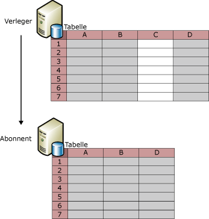
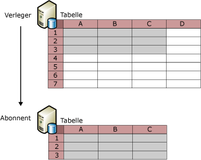

# Filtern von veröffentlichten Daten
  Das Filtern von Tabellenartikeln ermöglicht es Ihnen, Datenpartitionen zu erstellen, die veröffentlicht werden können. Das Filtern von veröffentlichten Daten bietet folgende Möglichkeiten:  
  
-   Minimieren der über das Netzwerk gesendeten Datenmenge.  
  
-   Reduzieren des erforderlichen Speicherplatzes beim Abonnenten.  
  
-   Anpassen von Veröffentlichungen und Anwendungen an die individuellen Anforderungen des Abonnenten.  
  
-   Vermeiden oder Reduzieren von Konflikten beim Aktualisieren von Daten durch Abonnenten, da unterschiedliche Datenpartitionen an verschiedene Abonnenten gesendet werden können (es ist nicht möglich, dass mehrere Abonnenten dieselben Datenwerte aktualisieren).  
  
-   Vermeiden der Übertragung vertraulicher Daten. Mithilfe von Zeilenfiltern und Spaltenfiltern kann der Datenzugriff für Abonnenten eingeschränkt werden. Im Fall von Mergereplikationen gelten besondere Sicherheitsüberlegungen, wenn Sie einen parametrisierten Filter verwenden, der HOST_NAME() einschließt. Weitere Informationen finden Sie im Abschnitt über das Filtern mit HOST_NAME() unter [Parameterized Row Filters](../../../relational-databases/replication/merge/parameterized-filters-parameterized-row-filters.md).  
  
 Die Replikation bietet vier Filtertypen:  
  
-   Statische Zeilenfilter, die bei allen Replikationstypen verfügbar sind.  
  
     Wenn Sie statische Zeilenfilter verwenden, können Sie eine Teilmenge von Zeilen auswählen, die veröffentlicht werden. Alle Abonnenten einer gefilterten Veröffentlichung erhalten die gleiche Teilmenge von Zeilen für die gefilterte Tabelle. Weitere Informationen finden Sie im Abschnitt zu statischen Zeilenfiltern in diesem Thema.  
  
-   Spaltenfilter, die bei allen Replikationstypen verfügbar sind.  
  
     Wenn Sie Spaltenfilter verwenden, können Sie eine Teilmenge von Spalten auswählen, die veröffentlicht werden. Weitere Informationen finden Sie in diesem Thema im Abschnitt zu Spaltenfiltern.  
  
-   Parametrisierte Zeilenfilter, die nur bei der Mergereplikation verfügbar sind.  
  
     Wenn Sie parametrisierte Zeilenfilter verwenden, können Sie eine Teilmenge von Zeilen auswählen, die veröffentlicht werden. Im Unterschied zu statischen Filtern, bei denen dieselbe Teilmenge von Zeilen an jeden Abonnenten gesendet wird, verwenden parametrisierte Zeilenfilter einen vom Abonnenten bereitgestellten Datenwert, um den Abonnenten unterschiedliche Teilmengen von Zeilen zu senden. Weitere Informationen finden Sie unter [Parameterized Row Filters](../../../relational-databases/replication/merge/parameterized-filters-parameterized-row-filters.md).  
  
-   Joinfilter, die nur bei der Mergereplikation verfügbar sind.  
  
     Mithilfe von Joinfiltern können Sie einen Zeilenfilter von einer veröffentlichten Tabelle auf eine andere erweitern. Weitere Informationen finden Sie unter [Join Filters](../../../relational-databases/replication/merge/join-filters.md).  
  
## Statische Zeilenfilter  
 Die folgende Abbildung zeigt eine veröffentlichte Tabelle, die so gefiltert wird, dass nur die Zeilen 2, 3 und 6 in die Veröffentlichung aufgenommen werden.  
  
   
  
 Bei einem statischen Zeilenfilter werden die zu veröffentlichenden Daten mit einer WHERE-Klausel ausgewählt. Dabei geben Sie den letzten Teil der WHERE-Klausel an. Sehen Sie sich die **Product** -Tabelle in der AdventureWorks-Beispieldatenbank an, in der die **ProductLine**-Spalte enthalten ist. Wenn Sie nur die Zeilen mit den Daten zu Produkten veröffentlichen möchten, die sich auf Mountainbikes beziehen, geben Sie `ProductLine = 'M'`an.  
  
 Ein statischer Zeilenfilter gibt für jede Veröffentlichung eine einzelne Datengruppe zurück. Im vorherigen Beispiel würden alle Abonnenten nur die Zeilen empfangen, die Daten zu Produkten enthalten, die sich auf Mountainbikes beziehen. Wenn ein anderer Abonnent nur Zeilen mit Daten zu Produkten benötigt, die sich auf Straßenräder beziehen, müssen Sie folgendermaßen vorgehen:  
  
-   Mit der Momentaufnahmereplikation oder Transaktionsreplikation können Sie eine weitere Veröffentlichung erstellen und die Tabelle in beide Veröffentlichungen aufnehmen (geben Sie `ProductLine = 'R')`in der Filterklausel für den Artikel in dieser Veröffentlichung an).  
  
    > [!NOTE]  
    >  Zeilenfilter in Transaktionsveröffentlichungen können den Verwaltungsaufwand erheblich vergrößern, da die Klausel zur Artikelfilterung für jede Protokollzeile ausgewertet wird, die für eine veröffentlichte Tabelle geschrieben wurde, um zu bestimmen, ob die Zeile repliziert werden soll. Vermeiden Sie Zeilenfilter in Transaktionsveröffentlichungen, wenn die einzelnen Replikationsknoten alle Daten vollständig laden können und die gesamte Datengruppe nicht allzu groß ist.  
  
-   Erstellen Sie bei der Mergereplikation nicht mehrere Veröffentlichungen mit statischen Zeilenfiltern, sondern verwenden Sie vielmehr parametrisierte Zeilenfilter. Weitere Informationen finden Sie unter [Parameterized Row Filters](../../../relational-databases/replication/merge/parameterized-filters-parameterized-row-filters.md).  
  
 Informationen zum Definieren oder Ändern eines statischen Zeilenfilters finden Sie unter [Define and Modify a Static Row Filter](../../../relational-databases/replication/publish/define-and-modify-a-static-row-filter.md).  
  
## Spaltenfilter  
 Die folgende Abbildung zeigt eine Veröffentlichung, bei der die C-Spalte herausgefiltert wird.  
  
   
  
 Sie können auch Zeilen- und Spaltenfilter zusammen verwenden, wie hier dargestellt.  
  
   
  
 Nach dem Erstellen einer Veröffentlichung können Sie eine Spalte mithilfe der Spaltenfilterung aus einer vorhandenen Veröffentlichung löschen, die Spalte jedoch in der Tabelle auf dem Verleger belassen. Außerdem können Sie eine vorhandene Spalte in die Veröffentlichung aufnehmen. Verwenden Sie für weitere Änderungen die Schemaänderungsreplikation, z. B. für das Hinzufügen einer neuen Spalten zu einer Tabelle und das anschließende Hinzufügen zum veröffentlichten Artikel. Weitere Informationen finden Sie in den Abschnitten „Hinzufügen von Spalten“ und „Löschen von Spalten“ im Thema [Durchführen von Schemaänderungen in Veröffentlichungsdatenbanken](../../../relational-databases/replication/publish/make-schema-changes-on-publication-databases.md).  
  
 Die in der folgenden Tabelle aufgeführten Spaltentypen können aus bestimmten Veröffentlichungstypen nicht herausgefiltert werden.  
  
|Spaltentyp|Veröffentlichungstyp und Optionen|  
|-----------------|-------------------------------------|  
|Primärschlüsselspalte|Primärschlüsselspalten sind in Transaktionsveröffentlichungen für alle Tabellen erforderlich. Für Tabellen in Mergeveröffentlichungen sind keine Primärschlüssel erforderlich. Wenn jedoch eine Primärschlüsselspalte vorhanden ist, kann sie nicht gefiltert werden.|  
|Fremdschlüsselspalte|Alle Veröffentlichungen, die mit dem Assistenten für neue Veröffentlichung erstellt wurden. Sie können Fremdschlüsselspalten mithilfe gespeicherter Transact-SQL-Prozeduren filtern. Weitere Informationen finden Sie unter [Define and Modify a Column Filter](../../../relational-databases/replication/publish/define-and-modify-a-column-filter.md).|  
|Die **rowguid** -Spalte|Mergeveröffentlichungen*|  
|Die **msrepl_tran_version** -Spalte|Momentaufnahme- oder Transaktionsveröffentlichungen, die aktualisierbare Abonnements zulassen|  
|Spalten, die NULL nicht zulassen und keine Standardwerte aufweisen oder für die die IDENTITY-Eigenschaft nicht festgelegt ist.|Momentaufnahme- oder Transaktionsveröffentlichungen, die aktualisierbare Abonnements zulassen|  
|Spalten mit UNIQUE-Einschränkungen oder -Indizes|Momentaufnahme- oder Transaktionsveröffentlichungen, die aktualisierbare Abonnements zulassen|  
|Alle Spalten in einer Mergeveröffentlichung von SQL Server 7.0|Spalten können in Mergeveröffentlichungen von SQL Server 7.0 nicht gefiltert werden.|  
|Timestamp|Momentaufnahme- oder Transaktionsveröffentlichungen von SQL Server 7.0, die aktualisierbare Abonnements zulassen|  
  
 \*Wenn Sie eine Tabelle in einer Mergeveröffentlichung veröffentlichen und diese Tabelle bereits eine Spalte vom **uniqueidentifier**-Datentyp enthält und die **ROWGUIDCOL**-Eigenschaft festgelegt ist, kann für die Replikation diese Spalte verwendet werden, ohne dass eine weitere Spalte namens **rowguid** erstellt wird. In diesem Fall muss die vorhandene Spalte veröffentlicht werden.  
  
 Informationen zum Definieren oder Ändern eines Spaltenfilters finden Sie unter [Define and Modify a Column Filter](../../../relational-databases/replication/publish/define-and-modify-a-column-filter.md).  
  
## Filteraspekte  
 Beachten Sie beim Filtern von Daten Folgendes:  
  
-   Alle Spalten, auf die in Zeilenfiltern verwiesen wird, müssen in die Veröffentlichung aufgenommen werden. Mit anderen Worten: Sie können keinen Spaltenfilter verwenden, um eine Spalte auszuschließen, die in einem Zeilenfilter verwendet wird.  
  
-   Wenn ein Filter nach dem Initialisieren von Abonnements hinzugefügt oder geändert wird, müssen die Abonnements erneut initialisiert werden.  
  
-   Die maximale Anzahl Bytes, die für eine in einem Filter verwendete Spalte zulässig ist, beträgt bei einem Artikel in einer Mergeveröffentlichung 1024 und bei einem Artikel in einer Transaktionsveröffentlichung 8000.  
  
-   Auf Spalten der folgenden Datentypen kann in Zeilenfiltern oder Joinfiltern nicht verwiesen werden:  
  
    -   **varchar(max) und nvarchar (max)**  
  
    -   **varbinary(max)**  
  
    -   **text und ntext**  
  
    -   **image**  
  
    -   **XML**  
  
    -   **UDT**  
  
-   Bei der Transaktionsreplikation können Sie eine indizierte Sicht als Sicht oder als Tabelle replizieren. Wenn Sie die Sicht als Tabelle replizieren, können Sie keine Spalten aus der Tabelle filtern.  
  
 Zeilenfilter sind nicht für den datenbankübergreifenden Einsatz konzipiert. [!INCLUDE[ssNoVersion](../../../includes/ssnoversion-md.md)] beschränkt die Ausführung von **sp_replcmds** (für Filter) mit Absicht auf den Datenbankbesitzer (**dbo**). Der **dbo** besitzt keine datenbankübergreifenden Berechtigungen. Aufgrund der CDC (Change Data Capture)-Erweiterung in [!INCLUDE[ssKatmai](../../../includes/sskatmai-md.md)] the **sp_replcmds** -Logik die Änderungsnachverfolgungtabellen mit Informationen auf, auf die der Benutzer zu Abfragezwecken zurückgreifen kann. Aus Sicherheitsgründen schränkt [!INCLUDE[ssNoVersion](../../../includes/ssnoversion-md.md)] die Ausführung dieser Logik ein, damit dieser Ausführungspfad nicht von einem böswilligen **dbo** missbräuchlich verwendet werden kann. Beispielsweise könnte ein böswilliger **dbo** Trigger für CDC-Tabellen einschleusen, die dann ausgeführt werden, wenn der Benutzer **sp_replcmds**aufruft (in diesem Fall der logreader-Agent).  Wenn das Konto, unter dem der Agent ausgeführt wird, über höhere Berechtigungen verfügt, könnte der böswillige **dbo** seine Berechtigungen ausweiten.  
  
## Siehe auch  
 [Veröffentlichen von Daten und Datenbankobjekten](../../../relational-databases/replication/publish/publish-data-and-database-objects.md)  
  
  
