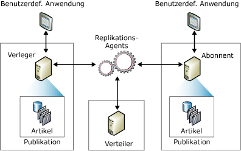

# Das Replikationsveröffentlichungsmodell (Übersicht)
[!INCLUDE[appliesto-ss-xxxx-xxxx-xxx-md](../../../includes/appliesto-ss-xxxx-xxxx-xxx-md.md)] Bei der Replikation wird zur Darstellung der Komponenten in einer Replikationstopologie – Verleger, Verteiler, Abonnenten, Veröffentlichungen, Artikel und Abonnements – ein Modell verwendet, das an Bereiche aus dem Verlagswesen angelehnt ist. Die [!INCLUDE[msCoName](../../../includes/msconame-md.md)] [!INCLUDE[ssNoVersion](../../../includes/ssnoversion-md.md)] -Replikation funktioniert dabei so ähnlich wie ein Zeitschriftenabonnement:  
  
-   Ein Zeitschriftenverlag (Verleger) stellt eine oder mehrere Zeitschrift(en) (Veröffentlichungen) her.  
  
-   Jede Veröffentlichung enthält verschiedene Artikel.  
  
-   Der Verlag verteilt die Veröffentlichung direkt oder über eine Vertriebsorganisation (Verteiler).  
  
-   Abonnenten erhalten genau die Veröffentlichungen, die sie abonniert haben.  
  
 Auch wenn der Vergleich mit einem Zeitschriftenabonnement für das Verständnis der Replikation hilfreich ist, sei darauf hingewiesen, dass die [!INCLUDE[ssNoVersion](../../../includes/ssnoversion-md.md)] -Replikation über zusätzliche Funktionen verfügt, die sich durch dieses Modell nicht darstellen lassen. Dies betrifft vor allem die Möglichkeit für den Abonnenten, Updates vorzunehmen, und für den Verleger, den Abonnenten inkrementelle Änderungen der Artikel in einer Veröffentlichung zukommen zu lassen.  
  
 Die *Replikationstopologie* definiert die Beziehung zwischen Servern und die Kopien von Daten sowie die Logik, die den Datenfluss zwischen den Servern festlegt. Für das Kopieren und Verschieben von Daten zwischen dem Verleger und den Abonnenten sind eine Reihe von Replikationsprozessen (so genannte *Agents*) verantwortlich. Die folgende Abbildung gibt eine Übersicht über die Komponenten und Prozesse, die bei der Replikation beteiligt sind.  
  
   
  
## Verleger  
 Der Verleger ist eine Datenbankinstanz, die anderen Speicherorten per Replikation Daten zur Verfügung stellt. Der Verleger kann eine oder mehrere Veröffentlichungen besitzen, die jeweils einen logisch zusammengehörigen Satz von Objekten und Daten enthalten, der repliziert werden kann.  
  
## Verteiler  
 Der Verteiler ist eine Datenbankinstanz, die als Speicher für replikationsspezifische Daten dient, die mit einem oder mehreren Verlegern verknüpft sind. Jedem Verleger ist beim Verteiler eine einzelne Datenbank (die Verteilungsdatenbank) zugeordnet. Die Verteilungsdatenbank speichert Replikationsstatusdaten und Metadaten zur Veröffentlichung und fungiert in einigen Fällen als Warteschlange für Daten, die vom Verleger an Abonnenten verschoben werden. In vielen Fällen übernimmt ein und dieselbe Datenbankserverinstanz sowohl die Rolle des Verlegers als auch die des Verteilers. Solche Datenbankserverinstanzen werden auch *lokale Verteiler*genannt. Wenn sich der Verleger und der Verteiler auf unterschiedlichen Datenbankserverinstanzen befinden, wird der Verteiler als *Remoteverteiler*bezeichnet.  
  
## Abonnenten  
 Ein Abonnent ist eine Datenbankinstanz, die replizierte Daten empfängt. Abonnenten können Daten von mehreren Verlegern und Veröffentlichungen empfangen. Je nach ausgewähltem Replikationstyp kann der Abonnent auch Datenänderungen an den Verleger zurücksenden oder die Daten erneut auf anderen Abonnenten veröffentlichen.  
  
## Artikel  
 Artikel ist die Bezeichnung für die Datenbankobjekte in einer Veröffentlichung. Eine Veröffentlichung kann unterschiedliche Arten von Artikeln enthalten – von Tabellen über Sichten bis hin zu gespeicherten Prozeduren und anderen Objekten. Wenn Tabellen als Artikel veröffentlicht werden, kann mithilfe von Filtern festgelegt werden, welche Spalten und Zeilen der Tabelle an die Abonnenten gesendet werden.  
  
## Veröffentlichung  
 Eine Veröffentlichung ist eine Auflistung einer oder mehrerer Artikel aus einer Datenbank. Die Gruppierung mehrerer Artikel zu einer Veröffentlichung erleichtert die Angabe eines logisch zusammengehörigen Satzes von Datenbankobjekten und Daten, die als Einheit repliziert werden.  
  
## Abonnement  
 Unter einem Abonnement wird die Anforderung eines Exemplars einer Veröffentlichung durch einen Abonnenten verstanden. Das Abonnement definiert, welche Veröffentlichung wo und wann empfangen werden soll. Es gibt zwei Arten von Abonnements: Push und Pull. Weitere Informationen zu Push- und Pullabonnements finden Sie unter [Abonnieren von Veröffentlichungen](../../../relational-databases/replication/subscribe-to-publications.md).  
  
## Weitere Informationen finden Sie unter  
 [Übersicht über Replikations-Agents](../../../relational-databases/replication/agents/replication-agents-overview.md)   
 [Types of Replication](../../../relational-databases/replication/types-of-replication.md)   
 [Konfigurieren der Replikation für Always On-Verfügbarkeitsgruppen (SQL Server)](../../../database-engine/availability-groups/windows/configure-replication-for-always-on-availability-groups-sql-server.md)   
 [Warten einer Always On-Veröffentlichungsdatenbank (SQL Server)](../../../database-engine/availability-groups/windows/maintaining-an-always-on-publication-database-sql-server.md)  
  
  
