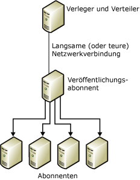
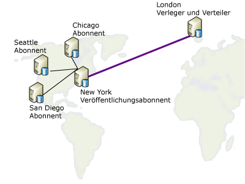

# Erneutes Veröffentlichen von Daten
  In einem Wiederveröffentlichungsmodell sendet der Verleger Daten an einen Abonnenten, der diese wiederum für eine beliebige Anzahl von Abonnenten erneut veröffentlicht. Dies ist hilfreich, wenn ein Verleger Daten an Abonnenten über eine langsame oder teure Kommunikationsverbindung senden muss. Falls es eine Reihe von Abonnenten am äußersten Ende dieser Verbindung gibt, kann das Verwenden eines Neuverlegers einen Großteil der Verteilungslast auf diese Seite der Verbindung auslagern.  
  
 Das Wiederveröffentlichen von Daten umfasst die folgenden Schritte:  
  
1.  Erstellen einer Veröffentlichung auf dem Verleger.  
  
2.  Erstellen eines Abonnements für die Veröffentlichung für den Wiederveröffentlichungsabonnenten.  
  
3.  Initialisieren Sie das Abonnement. Das Abonnement muss initialisiert werden, bevor die Veröffentlichung auf dem Wiederveröffentlichungsabonnenten erstellt wird, sonst schlägt die Replikation fehl.  
  
4.  Erstellen einer Veröffentlichung in der Abonnementdatenbank auf dem Wiederveröffentlichungsabonnenten.  
  
5.  Erstellen von Abonnements für die Veröffentlichung auf dem Wiederveröffentlichungsabonnenten für die andern Abonnenten.  
  
6.  Initialisieren der Abonnements.  
  
> [!NOTE]  
>  Wenn Sie die Mergereplikation in einer Wiederveröffentlichungstopologie verwenden, müssen alle Wiederveröffentlichungsabonnenten Serverabonnements verwenden. Weitere Informationen zu Abonnementtypen finden Sie unter [Abonnieren von Veröffentlichungen](../../relational-databases/replication/subscribe-to-publications.md).  
  
 In der folgenden Abbildung fungieren sowohl der Verleger als auch der Neuverleger als ihre eigenen lokalen Verteiler. Falls beide zum Verwenden eines Remoteverteilers eingerichtet würden, müssten sich alle Verteiler auf derselben Seite der langsamen oder teuren Kommunikationsverbindung wie ihr Verleger befinden. Verleger müssen mit Remoteverteilern über zuverlässige, sehr schnelle Kommunikationsverbindungen verbunden sein.  
  
   
  
 Jeder Server kann als Verleger und als Abonnent fungieren. Nehmen Sie das folgende Diagramm als Beispiel. Es enthält die Veröffentlichung einer Tabelle in London, die an vier verschiedene Städte in den USA verteilt werden muss: Chicago, New York, San Diego und Seattle. Der Server in New York wird ausgewählt, die aus London stammende veröffentlichte Tabelle zu abonnieren, da der Standort in New York die folgenden Bedingungen erfüllt:  
  
-   Die Netzwerkverbindung zurück nach London ist relativ zuverlässig.  
  
-   Die Kosten für die Kommunikation zwischen London und New York sind annehmbar.  
  
-   Es gibt gute Netzwerk-Kommunikationsverbindungen von New York zu allen anderen Abonnentenstandorten in den USA.  
  
       
  
 Die Replikation unterstützt die in der folgenden Tabelle aufgeführten Wiederveröffentlichungsszenarios.  
  
|Verleger|Veröffentlichungsabonnent|Abonnent|  
|---------------|---------------------------|----------------|  
|Transaktionsveröffentlichung|Transaktionsabonnement/Transaktionsveröffentlichung|Transaktionsabonnement|  
|Transaktionsveröffentlichung|Transaktionsabonnement/Mergeveröffentlichung*|Mergeabonnement|  
|Mergeveröffentlichung|Mergeabonnement/Mergeveröffentlichung|Mergeabonnement|  
|Mergeveröffentlichung|Mergeabonnement/Transaktionsveröffentlichung|Transaktionsabonnement|  
  
 \*Sie sollten die **@published_in_tran_pub**-Eigenschaft für die Mergeveröffentlichung festlegen. Standardmäßig wird bei der Transaktionsreplikation erwartet, dass Tabellen auf dem Abonnenten als schreibgeschützt behandelt werden. Wenn bei der Mergereplikation Datenänderungen an einer Tabelle in einem Transaktionsabonnement vorgenommen werden, kann eine Nichtkonvergenz von Daten auftreten. Es empfiehlt sich, solche Tabellen in der Mergeveröffentlichung nur als herunterladbar anzugeben, um dieses Risiko zu vermeiden. Dadurch wird verhindert, dass ein Mergeabonnent Datenänderungen in die Tabelle hochlädt. Weitere Informationen finden Sie unter [Optimieren der Leistung der Mergereplikation durch nur herunterladbare Artikel](../../relational-databases/replication/merge/optimize-merge-replication-performance-with-download-only-articles.md).  
  
## Siehe auch  
 [Verteilung konfigurieren](../../relational-databases/replication/configure-distribution.md)   
 [Veröffentlichen von Daten und Datenbankobjekten](../../relational-databases/replication/publish/publish-data-and-database-objects.md)   
 [Subscribe to Publications](../../relational-databases/replication/subscribe-to-publications.md)   
 [Initialisieren eines Abonnements](../../relational-databases/replication/initialize-a-subscription.md)   
 [Synchronisieren von Daten](../../relational-databases/replication/synchronize-data.md)  
  
  
