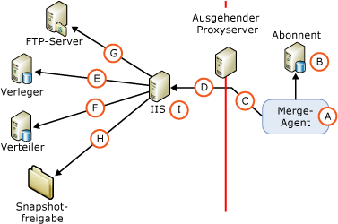

# Sicherheitsarchitektur für die Websynchronisierung
  [!INCLUDE[msCoName](../../../includes/msconame-md.md)] [!INCLUDE[ssNoVersion](../../../includes/ssnoversion-md.md)] enables fine-grained control over the configuration of Web synchronization security. In diesem Thema wird eine umfassende Liste aller Komponenten bereitgestellt, die in eine Websynchronisierungskonfiguration einbezogen werden können, und Informationen zu den zwischen den Komponenten hergestellten Verbindungen. [!INCLUDE[ssNoteWinAuthentication](../../../includes/ssnotewinauthentication-md.md)]  
  
 Die folgende Abbildung zeigt alle möglichen Verbindungen, manche Verbindungen sind jedoch in einer bestimmten Topologie möglicherweise nicht erforderlich. Beispielsweise ist eine Verbindung zu einem FTP-Server nur erforderlich, wenn die Momentaufnahme mithilfe von FTP übermittelt wird.  
  
   
  
 In den folgenden Tabellen werden die in der Abbildung dargestellten Komponenten und Verbindungen beschrieben.  
  
## A. Windows-Benutzer, unter dem der Merge-Agent ausgeführt wird  
 Bei der Synchronisierung wird der Merge-Agent (A) beim Abonnenten gestartet. Der Merge-Agent kann von einem Auftragsschritt des [!INCLUDE[ssNoVersion](../../../includes/ssnoversion-md.md)] -Agents oder von einer eigenständigen benutzerdefinierten Anwendung gestartet werden. Wenn der Merge-Agent von einem Auftragsschritt des [!INCLUDE[ssNoVersion](../../../includes/ssnoversion-md.md)] -Agents gestartet wird, wird der Merge-Agent im Kontext eines von Ihnen angegebenen Windows-Benutzers ausgeführt. Wenn Sie keinen Windows-Benutzer angeben, wird der Merge-Agent im Kontext des Windows-Dienstkontos für den [!INCLUDE[ssNoVersion](../../../includes/ssnoversion-md.md)] -Agent ausgeführt.  
  
|Kontotyp|Stelle, an der das Konto angegeben wird|  
|---------------------|------------------------------------|  
|Windows-Benutzer|[!INCLUDE[tsql](../../../includes/tsql-md.md)]: die Parameter **@job_login** und **@job_password** von [sp_addmergepullsubscription_agent](../../../relational-databases/system-stored-procedures/sp-addmergepullsubscription-agent-transact-sql.md).   Replikationsverwaltungsobjekte (Replication Management Objects oder RMO): die Eigenschaften <xref:Microsoft.SqlServer.Replication.IProcessSecurityContext.Login%2A> und <xref:Microsoft.SqlServer.Replication.IProcessSecurityContext.Password%2A> für <xref:Microsoft.SqlServer.Replication.PullSubscription.SynchronizationAgentProcessSecurity%2A>.|  
|Windows-Dienstkonto für den [!INCLUDE[ssNoVersion](../../../includes/ssnoversion-md.md)] -Agent|[!INCLUDE[ssNoVersion](../../../includes/ssnoversion-md.md)] -Konfigurations-Manager|  
|Eigenständige Anwendung|Der Merge-Agent wird im Kontext des Windows-Benutzers ausgeführt, von dem die Anwendung ausgeführt wird.|  
  
## B. Verbindung mit dem Abonnenten  
 Der Merge-Agent stellt die Verbindung zum Abonnenten mithilfe der Windows-Authentifizierung oder der [!INCLUDE[ssNoVersion](../../../includes/ssnoversion-md.md)] -Authentifizierung her. Der Windows-Benutzer oder die [!INCLUDE[ssNoVersion](../../../includes/ssnoversion-md.md)] -Anmeldung, den bzw. die Sie angeben, muss einem Datenbankbenutzer zugeordnet werden, der Mitglied der festen Datenbankrolle **dbowner** in der Abonnementdatenbank ist.  
  
> [!NOTE]  
>  Die Windows-Authentifizierung wird immer dann verwendet, wenn der Merge-Agent von einem [!INCLUDE[ssNoVersion](../../../includes/ssnoversion-md.md)] -Agentauftrag aus gestartet wird. Die Windows-Authentifizierung wird auch beim programmgesteuerten Starten des Merge-Agents verwendet, es sei denn die [!INCLUDE[ssNoVersion](../../../includes/ssnoversion-md.md)] -Authentifizierung ist explizit angegeben.  
  
|Authentifizierungstyp|Stelle, an der die Authentifizierung angegeben wird|  
|----------------------------|-------------------------------------------|  
|-   Windows-Authentifizierung|Der Merge-Agent stellt Verbindungen im Kontext des Windows-Benutzers her, der für den Merge-Agent (A) angegeben ist.|  
|Die[!INCLUDE[ssNoVersion](../../../includes/ssnoversion-md.md)] -Authentifizierung wird nur verwendet, wenn Folgendes angegeben wird:   – RMO: der Wert <xref:Microsoft.SqlServer.Replication.SecurityMode.Standard> für <xref:Microsoft.SqlServer.Replication.MergeSynchronizationAgent.SubscriberSecurityMode%2A>. -   Merge-Agent-Befehlszeile: der Wert **0** für **SubscriberSecurityMode**.|RMO: <xref:Microsoft.SqlServer.Replication.MergeSynchronizationAgent.SubscriberLogin%2A> und <xref:Microsoft.SqlServer.Replication.MergeSynchronizationAgent.SubscriberPassword%2A>.   Merge-Agentbefehlszeile: **-SubscriberLogin** und **-SubscriberLogin**.|  
  
## C. Verbindung zu einem ausgehenden Proxyserver  
 Geben Sie nur dann einen Windows-Benutzer für diese Verbindung an, wenn ein ausgehender Proxyserver den Zugriff auf das interne Netzwerk des Abonnenten einschränkt.  
  
|Authentifizierungstyp|Stelle, an der die Authentifizierung angegeben wird|  
|----------------------------|-------------------------------------------|  
|Windows-Authentifizierung|RMO: <xref:Microsoft.SqlServer.Replication.MergeSynchronizationAgent.InternetProxyLogin%2A> und <xref:Microsoft.SqlServer.Replication.MergeSynchronizationAgent.InternetProxyPassword%2A> mit <xref:Microsoft.SqlServer.Replication.MergeSynchronizationAgent.InternetProxyServer%2A>.   Merge-Agentbefehlszeile: **-InternetProxyLogin** und **-InternetProxyPassword** mit **-InternetProxyServer**.|  
  
## D. Verbindung zu IIS  
 Nach Herstellen der Verbindung zum Abonnenten und Extrahieren von Änderungen aus der Abonnementdatenbank führt der Merge-Agent eine HTTPS-Anforderung an [!INCLUDE[msCoName](../../../includes/msconame-md.md)] Internetinformationsdienste (Internet Information Services, IIS) aus und lädt Datenänderungen als XML-Nachricht herunter. Der Merge-Agent muss über eine Anmeldeberechtigung für IIS verfügen.  
  
|Authentifizierungstyp|Stelle, an der die Authentifizierung angegeben wird|  
|----------------------------|-------------------------------------------|  
|Die Standardauthentifizierung wird verwendet, wenn Folgendes angegeben wird:   -   [!INCLUDE[tsql](../../../includes/tsql-md.md)]: der Wert **0** für den Parameter **@internet_security_mode** von [sp_addmergepullsubscription_agent](../../../relational-databases/system-stored-procedures/sp-addmergepullsubscription-agent-transact-sql.md). -   RMO: der Wert <xref:Microsoft.SqlServer.Replication.SecurityMode.Standard> für <xref:Microsoft.SqlServer.Replication.MergeSynchronizationAgent.InternetSecurityMode%2A>. -   Merge-Agent-Befehlszeile: der Wert **0** für **-InternetSecurityMode**.|[!INCLUDE[tsql](../../../includes/tsql-md.md)]: die Parameter **@internet_login** und **@internet_password** von [sp_addmergepullsubscription_agent](../../../relational-databases/system-stored-procedures/sp-addmergepullsubscription-agent-transact-sql.md).   RMO: <xref:Microsoft.SqlServer.Replication.MergeSynchronizationAgent.InternetLogin%2A> und <xref:Microsoft.SqlServer.Replication.MergeSynchronizationAgent.InternetPassword%2A>.   Merge-Agentbefehlszeile: **-InternetLogin** und **-InternetPassword**.|  
|Der Wert1 für die integrierte Authentifizierung wird verwendet, wenn Folgendes angegeben wird:   -   [!INCLUDE[tsql](../../../includes/tsql-md.md)]: der Wert **1** für den Parameter **@internet_security_mode** von [sp_addmergepullsubscription_agent](../../../relational-databases/system-stored-procedures/sp-addmergepullsubscription-agent-transact-sql.md). -   RMO: der Wert <xref:Microsoft.SqlServer.Replication.SecurityMode.Integrated> für <xref:Microsoft.SqlServer.Replication.MergeSynchronizationAgent.InternetSecurityMode%2A>. -   Merge-Agent-Befehlszeile: der Wert **1** für **-InternetSecurityMode**.|Der Merge-Agent stellt Verbindungen im Kontext des Windows-Benutzers her, der für den Merge-Agent (A) angegeben ist.|  
  
 1 Die integrierte Authentifizierung kann nur verwendet werden, wenn alle Computer derselben Domäne oder aber mehreren Domänen angehören, zwischen denen Vertrauensstellungen bestehen.  
  
> [!NOTE]  
>  Die Delegierung ist erforderlich, wenn Sie die integrierte Authentifizierung verwenden. Es wird empfohlen, die Standardauthentifizierung und SSL für Verbindungen zwischen Abonnenten und IIS zu verwenden.  
  
## E. Verbindung mit dem Verleger  
 Die Komponenten [!INCLUDE[ssNoVersion](../../../includes/ssnoversion-md.md)] -Replikationsüberwachung und -Mergereplikationssynchronisierung werden auf dem Computer gehostet, auf dem IIS ausgeführt wird. Diese Komponenten führen die folgenden Aktionen aus:  
  
-   Entgegennehmen der HTTPS-Anforderung, die im Abschnitt "D. Verbindung zu IIS" beschrieben wird.  
  
-   Herstellen einer SQL-Verbindung zur Veröffentlichungsdatenbank und Anwenden der hochgeladenen Änderungen auf die Veröffentlichungsdatenbank.  
  
-   Extrahieren der heruntergeladenen Änderungen und Zurücksenden einer HTTPS-Antwort an den Merge-Agent.  
  
 Die Mergereplikationssynchronisierung stellt die Verbindung zum Verleger entweder mithilfe der Windows-Authentifizierung oder der [!INCLUDE[ssNoVersion](../../../includes/ssnoversion-md.md)] -Authentifizierung her. Die Windows-Benutzer- oder [!INCLUDE[ssNoVersion](../../../includes/ssnoversion-md.md)] -Anmeldung, die Sie angeben, muss folgende Kriterien erfüllen:  
  
-   Sie muss in der Veröffentlichungszugriffsliste (Publication Access List oder PAL) enthalten sein. Weitere Informationen finden Sie unter [Schützen des Verlegers](../../../relational-databases/replication/security/secure-the-publisher.md).  
  
-   Sie muss mit einem Benutzer in der Veröffentlichungsdatenbank verknüpft sein.  
  
|Authentifizierungstyp|Stelle, an der die Authentifizierung angegeben wird|  
|----------------------------|-------------------------------------------|  
|Die Windows-Authentifizierung wird verwendet, wenn Folgendes angegeben wird:   -   [!INCLUDE[tsql](../../../includes/tsql-md.md)]: der Wert **1** für den Parameter **@publisher_security_mode** von [sp_addmergepullsubscription_agent](../../../relational-databases/system-stored-procedures/sp-addmergepullsubscription-agent-transact-sql.md). -   RMO: der Wert <xref:Microsoft.SqlServer.Replication.SecurityMode.Integrated> für <xref:Microsoft.SqlServer.Replication.MergeSynchronizationAgent.PublisherSecurityMode%2A>. -   Merge-Agent-Befehlszeile: der Wert **1** für **-PublisherSecurityMode**.|Der Merge-Agent stellt Verbindungen zum Verleger im Kontext des Windows-Benutzers her, der für die Verbindung zu IIS (D) angegeben ist. Wenn sich der Verleger und IIS auf verschiedenen Computern befinden und die integrierte Authentifizierung für die Verbindung (D) verwendet wird, müssen Sie die Kerberos-Delegierung auf dem Computer aktivieren, auf dem IIS ausgeführt wird. Weitere Informationen finden Sie in der Windows-Dokumentation.|  
|Die[!INCLUDE[ssNoVersion](../../../includes/ssnoversion-md.md)] -Authentifizierung wird verwendet, wenn Folgendes angegeben wird:   -   [!INCLUDE[tsql](../../../includes/tsql-md.md)]: der Wert **0** für den Parameter **@publisher_security_mode** von [sp_addmergepullsubscription_agent](../../../relational-databases/system-stored-procedures/sp-addmergepullsubscription-agent-transact-sql.md). -   RMO: der Wert <xref:Microsoft.SqlServer.Replication.SecurityMode.Standard> für <xref:Microsoft.SqlServer.Replication.MergeSynchronizationAgent.PublisherSecurityMode%2A>. -   Merge-Agent-Befehlszeile: der Wert **0** für **-PublisherSecurityMode**.|[!INCLUDE[tsql](../../../includes/tsql-md.md)]: die Parameter **@publisher_login** und **@publisher_password** von [sp_addmergepullsubscription_agent](../../../relational-databases/system-stored-procedures/sp-addmergepullsubscription-agent-transact-sql.md).   RMO: <xref:Microsoft.SqlServer.Replication.MergeSynchronizationAgent.PublisherLogin%2A> und <xref:Microsoft.SqlServer.Replication.MergeSynchronizationAgent.PublisherPassword%2A>.   Merge-Agentbefehlszeile: **-PublisherLogin** und **-PublisherPassword**.|  
  
## F. Verbindung zum Verteiler  
 Die Mergereplikationssynchronisierung, die auf dem Computer mit IIS gehostet wird, stellt auch Verbindungen zum Verteiler her. Die Mergereplikationssynchronisierung stellt die Verbindung zum Verteiler entweder mithilfe der Windows-Authentifizierung oder der [!INCLUDE[ssNoVersion](../../../includes/ssnoversion-md.md)] -Authentifizierung her. Die Windows-Benutzer- oder [!INCLUDE[ssNoVersion](../../../includes/ssnoversion-md.md)] -Anmeldung, die Sie angeben, muss folgende Kriterien erfüllen:  
  
-   Sie muss in der Veröffentlichungszugriffsliste (Publication Access List oder PAL) enthalten sein. Weitere Informationen finden Sie unter [Schützen des Verlegers](../../../relational-databases/replication/security/secure-the-publisher.md).  
  
-   Sie muss mit einem Datenbankbenutzer in der Verteilungsdatenbank verknüpft sein. Der Benutzer kann der **Guest** -Benutzer sein.  
  
 Die Momentaufnahmefreigabe befindet sich normalerweise auf dem Verteiler. Weitere Informationen zu Momentaufnahmefreigaben finden Sie im Abschnitt "H. Zugriff auf die Momentaufnahmefreigabe" weiter unten in diesem Thema.  
  
|-   Authentifizierungstyp|Stelle, an der die Authentifizierung angegeben wird|  
|-------------------------------|-------------------------------------------|  
|Die Windows-Authentifizierung wird verwendet, wenn Folgendes angegeben wird:   -   [!INCLUDE[tsql](../../../includes/tsql-md.md)]: der Wert **1** für den Parameter **@distributor_security_mode** von [sp_addmergepullsubscription_agent](../../../relational-databases/system-stored-procedures/sp-addmergepullsubscription-agent-transact-sql.md). -   RMO: der Wert <xref:Microsoft.SqlServer.Replication.SecurityMode.Integrated> für <xref:Microsoft.SqlServer.Replication.MergeSynchronizationAgent.DistributorSecurityMode%2A>. -   Merge-Agent-Befehlszeile: der Wert **1** für **-DistributorSecurityMode**.|Der Merge-Agent stellt Verbindungen zum Verteiler im Kontext des Windows-Benutzers her, der für die Verbindung zu IIS (D) angegeben ist. Wenn sich der Verteiler und IIS auf verschiedenen Computern befinden und die integrierte Authentifizierung für die Verbindung (D) verwendet wird, müssen Sie die Kerberos-Delegierung auf dem Computer aktivieren, auf dem IIS ausgeführt wird. Weitere Informationen finden Sie in der Windows-Dokumentation.|  
|Die[!INCLUDE[ssNoVersion](../../../includes/ssnoversion-md.md)] -Authentifizierung wird verwendet, wenn Folgendes angegeben wird:   -   [!INCLUDE[tsql](../../../includes/tsql-md.md)]: der Wert **0** für den Parameter **@distributor_security_mode** von [sp_addmergepullsubscription_agent](../../../relational-databases/system-stored-procedures/sp-addmergepullsubscription-agent-transact-sql.md). -   RMO: der Wert <xref:Microsoft.SqlServer.Replication.SecurityMode.Standard> für <xref:Microsoft.SqlServer.Replication.MergeSynchronizationAgent.DistributorSecurityMode%2A>. -   Merge-Agent-Befehlszeile: der Wert **0** für **-DistributorSecurityMode**.|[!INCLUDE[tsql](../../../includes/tsql-md.md)]: die Parameter **@distributor_login** und **@distributor_password** von [sp_addmergepullsubscription_agent](../../../relational-databases/system-stored-procedures/sp-addmergepullsubscription-agent-transact-sql.md).   RMO: <xref:Microsoft.SqlServer.Replication.MergeSynchronizationAgent.DistributorLogin%2A> und <xref:Microsoft.SqlServer.Replication.MergeSynchronizationAgent.DistributorPassword%2A>   Merge-Agentbefehlszeile: **-DistributorLogin** und **-DistributorPassword**.|  
  
## G. Verbindung zu einem FTP-Server  
 Geben Sie nur dann einen Windows-Benutzer für diese Verbindung an, wenn Sie Momentaufnahmedateien von einem FTP-Server statt von einem UNC-Speicherort auf den Computer herunterladen, auf dem IIS ausgeführt wird, bevor Sie die Momentaufnahme auf den Abonnenten anwenden. Weitere Informationen finden Sie unter [Übertragen von Momentaufnahmen über FTP](../../../relational-databases/replication/transfer-snapshots-through-ftp.md).  
  
|Authentifizierungstyp|Stelle, an der die Authentifizierung angegeben wird|  
|----------------------------|-------------------------------------------|  
|Windows-Authentifizierung|[!INCLUDE[tsql](../../../includes/tsql-md.md)]: die Parameter **@ftp_login** und **@ftp_password** von [sp_addmergepullsubscription_agent](../../../relational-databases/system-stored-procedures/sp-addmergepublication-transact-sql.md).   RMO: <xref:Microsoft.SqlServer.Replication.Publication.FtpLogin%2A> und <xref:Microsoft.SqlServer.Replication.Publication.FtpPassword%2A>.|  
  
## H. Zugriff auf die Momentaufnahmefreigabe  
 Auf die Momentaufnahmefreigabe wird von der Mergereplikationssynchronisierung zugegriffen, die auf dem Computer mit IIS gehostet wird.  
  
|Authentifizierungstyp|Stelle, an der die Authentifizierung angegeben wird|  
|----------------------------|-------------------------------------------|  
|Windows-Authentifizierung|Der Merge-Agent greift im Kontext des Windows-Benutzers, der für die Verbindung zu IIS (D) angegeben ist, auf die Momentaufnahmefreigabe zu. Wenn sich die Momentaufnahmefreigabe und IIS auf verschiedenen Computern befinden und die integrierte Authentifizierung für die Verbindung (D) verwendet wird, müssen Sie die Kerberos-Delegierung auf dem Computer aktivieren, auf dem IIS ausgeführt wird. Weitere Informationen finden Sie in der Windows-Dokumentation.|  
  
## I. Anwendungspoolkonto für IIS  
 Dieses Konto wird verwendet, um den W3wp.exe-Prozess auf dem Computer zu starten, auf dem IIS für [!INCLUDE[winxpsvr](../../../includes/winxpsvr-md.md)] ausgeführt wird, oder aber den Dllhost.exe-Prozess unter [!INCLUDE[win2kfamily](../../../includes/win2kfamily-md.md)]. Diese Prozesse hosten Anwendungen auf dem Computer, auf dem IIS ausgeführt wird, etwa die [!INCLUDE[ssNoVersion](../../../includes/ssnoversion-md.md)] -Replikationsüberwachung und -Mergereplikationssynchronisierung. Dieses Konto muss über Lese- und Ausführungsberechtigungen für die folgenden Replikation-DLLs auf dem Computer verfügen, auf dem IIS ausgeführt wird:  
  
-   Replisapi  
  
-   Replrec  
  
-   Replprov  
  
-   Msgprox  
  
-   Xmlsub  
  
 Das Konto muss auch Bestandteil der IIS_WPG-Gruppe sein. Weitere Informationen finden Sie im Abschnitt "Festlegen von Berechtigungen für die [!INCLUDE[ssNoVersion](../../../includes/ssnoversion-md.md)]-Replikationsüberwachung" unter [Konfigurieren von IIS für die Websynchronisierung](../../../relational-databases/replication/configure-iis-for-web-synchronization.md).  
  
|Kontotyp|Stelle, an der das Konto angegeben wird|  
|---------------------|------------------------------------|  
|Beliebiger Windows-Benutzer, der über die erforderlichen Berechtigungen verfügt.|Internetinformationsdienste-Manager (IIS). |  
  
## Siehe auch  
 [Konfigurieren der Websynchronisierung](../../../relational-databases/replication/configure-web-synchronization.md)   
 [Replication Merge Agent](../../../relational-databases/replication/agents/replication-merge-agent.md)  
  
  
