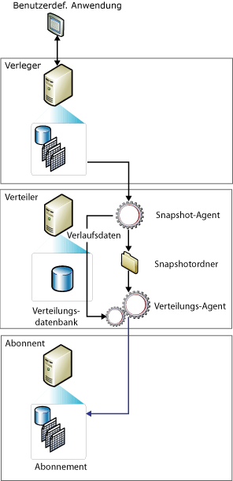

# Momentaufnahmereplikation
  Die Momentaufnahmereplikation verteilt Daten exakt wie angezeigt zu einem bestimmten Zeitpunkt, ohne Aktualisierungen an den Daten zu überwachen. Bei der Synchronisierung wird die gesamte Momentaufnahmen generiert und an Abonnenten gesendet.  
  
> [!NOTE]  
>  Die Momentaufnahmereplikation wird üblicherweise verwendet, um den Ausgangsdatensatz und die Ausgangsdatenobjekte für Transaktions- und Mergeveröffentlichungen bereitzustellen, da der Momentaufnahmeprozess eine Kopie aller von einer Veröffentlichung angegebenen Objekte und Daten erstellt. Die Momentaufnahmereplikation kann aber auch als eigenständiger Replikationstyp verwendet werden.  
  
 Die ausschließliche Verwendung der Momentaufnahmereplikation empfiehlt sich vor allem dann, wenn eine oder mehrere der folgenden Bedingungen erfüllt sind:  
  
-   Es kommt nur selten zu Datenänderungen.  
  
-   Es ist zulässig, dass Kopien der Daten bezüglich des Verlegers für eine bestimmte Zeit nicht aktuell sind.  
  
-   Es werden kleine Datenmengen repliziert.  
  
-   Große Mengen von Daten werden innerhalb einer kurzen Zeit geändert.  
  
 Die Momentaufnahmereplikation ist zu bevorzugen, wenn Datenänderungen zwar umfangreich sind, jedoch selten vorkommen. Wenn z. B. eine Vertriebsorganisation eine Produktpreisliste hat, in der alle Preise gleichzeitig ein- oder zweimal jährlich aktualisiert werden, wird das Replizieren der gesamten Momentaufnahme der Daten nach der Änderung empfohlen. Bei bestimmten Datentypen können auch häufigere Momentaufnahmen geeignet sein. Wenn z. B. eine relativ kleine Tabelle tagsüber auf dem Verleger aktualisiert wird und Latenzzeiten akzeptabel sind, können die Änderungen über Nacht als Momentaufnahme übermittelt werden.  
  
 Die Momentaufnahmereplikation erfordert einen weniger konstanten Prozessoroverhead auf dem Verleger als die Transaktionsreplikation, da inkrementelle Änderungen nicht nachverfolgt werden. Wenn das zu replizierende Dataset sehr groß ist, können erhebliche Ressourcen zum Generieren und Anwenden der Momentaufnahme erforderlich werden. Erwägen Sie die Größe des gesamten Datasets sowie die Häufigkeit der Änderungen, bevor Sie sich für oder gegen die Momentaufnahmereplikation entscheiden.  
  
 **In diesem Thema**  
  
 [Funktionsweise der Momentaufnahmereplikation](#HowWorks)  
  
 [Momentaufnahme-Agent](#SnapshotAgent)  
  
 [Verteilungs-Agent und Merge-Agent](#DistAgent)  
  
##   Funktionsweise der Momentaufnahmereplikation  
 Standardmäßig verwenden alle drei Replikationstypen eine Momentaufnahme zum Initialisieren von Abonnenten. Die Momentaufnahmedateien werden stets vom [!INCLUDE[ssNoVersion](../../includes/ssnoversion-md.md)] -Momentaufnahme-Agent generiert. Welcher Agent die Dateien jedoch übermittelt, hängt vom verwendeten Replikationstyp ab. Bei der Momentaufnahme- und der Transaktionsreplikation werden die Dateien vom Verteilungs-Agent übermittelt, wohingegen die Dateien bei der Mergereplikation vom [!INCLUDE[ssNoVersion](../../includes/ssnoversion-md.md)] -Merge-Agent übermittelt werden. Der Momentaufnahme-Agent wird auf dem Verteiler ausgeführt. Der Verteilungs-Agent oder der Merge-Agent werden auf dem Verteiler für Pushabonnements oder auf dem Abonnenten für Pullabonnements ausgeführt.  
  
 Momentaufnahmen können entweder sofort nach dem Erstellen des Abonnements generiert und angewendet werden oder nach einem Zeitplan, der zum Zeitpunkt der Erstellung der Veröffentlichung festgelegt wurde. Der Momentaufnahme-Agent bereitet Momentaufnahmedateien vor, die das Schema und die Daten von veröffentlichten Tabellen und Datenbankobjekten enthalten, speichert die Dateien im Momentaufnahmeordner und zeichnet Nachverfolgungsinformationen in der Verteilungsdatenbank auf dem Verteiler auf. Beim Konfigurieren eines Verteilers geben Sie einen StandardMomentaufnahmeordner an, Sie können jedoch stattdessen oder zusätzlich einen alternativen Speicherort für eine Veröffentlichung angeben.  
  
 Neben dem Standardprozess für Momentaufnahmen, der in diesem Thema beschrieben wird, wird ein zweiteiliger Momentaufnahmeprozess für Mergeveröffentlichungen mit parametrisierten Filtern verwendet.  
  
 Die folgende Abbildung zeigt die wichtigsten Komponenten der Momentaufnahmereplikation.  
  
   
  
##   Momentaufnahme-Agent  
 Bei der Mergereplikation wird jedes Mal eine Momentaufnahme generiert, wenn der Momentaufnahme-Agent ausgeführt wird. Für die Transaktionsreplikation, momentaufnahmegenerierung hängt von der Einstellung der Eigenschaft der Veröffentlichung **Immediate_sync**. Ist die Eigenschaft auf TRUE festgelegt (die Standardeinstellung bei der Verwendung des Assistenten für neue Veröffentlichung), wird bei jedem Ausführen des Momentaufnahme-Agents eine Momentaufnahme generiert, der jederzeit auf einen Abonnenten angewendet werden kann. Wenn die Eigenschaft auf FALSE festgelegt ist (die Standardeinstellung bei Verwendung **Sp_addpublication**), die Momentaufnahme wird nur generiert, wenn ein neues Abonnement hinzugefügt wurde, seit der letzten Snapshot-Agent ausgeführt wird. Abonnenten müssen warten, für den Snapshot-Agent durchführen, bevor sie synchronisiert werden können.  
  
 Der Momentaufnahme-Agent führt die folgenden Schritte aus:  
  
1.  Herstellen einer Verbindung vom Verteiler zum Verleger und gegebenenfalls Einrichten von Sperren für veröffentlichte Tabellen:  
  
    -   Bei Mergeveröffentlichungen richtet der Momentaufnahme-Agent keine Sperren ein.  
  
    -   Bei Transaktionsveröffentlichungen richtet der Momentaufnahme-Agent standardmäßig Sperren nur während der Anfangsphase der Momentaufnahmegenerierung ein.  
  
    -   Bei der Momentaufnahmeveröffentlichungen werden die Sperren während der gesamten Momentaufnahmegenerierung aufrechterhalten.  
  
2.  Schreiben einer Kopie des Tabellenschemas für jeden Artikel in eine SCH-Datei. Wenn andere Datenbankobjekte veröffentlicht werden, wie z. B. Indizes, Einschränkungen, gespeicherte Prozeduren, Sichten, benutzerdefinierte Funktionen usw., werden weitere Skriptdateien generiert.  
  
3.  Kopieren der Daten in der veröffentlichten Tabelle auf dem Verleger und Schreiben der Daten in den Momentaufnahmeordner. Die Momentaufnahme wird als ein Satz BCP-Dateien (Bulk Copy Program, Massenkopierprogramm) generiert.  
  
4.  Für Momentaufnahme- und transaktionsveröffentlichungen fügt der Snapshot-Agent Zeilen, die die **MSrepl_commands** und **MSrepl_transactions** Tabellen in der Verteilungsdatenbank. Die Einträge in der **MSrepl_commands** -Tabelle sind Befehle, die den Speicherort der SCH- und BCP-Dateien, sonstige momentaufnahmedateien sowie Verweise zu Skripts vor und nach-Momentaufnahme. Die Einträge in der **MSrepl_transactions** -Tabelle sind Befehle, die für die Synchronisierung des Abonnenten relevant.  
  
     Bei Mergeveröffentlichungen führt der Momentaufnahme-Agent zusätzliche Schritte aus.  
  
5.  Aufheben der Sperren auf veröffentlichten Tabellen.  
  
 Während der Momentaufnahmegenerierung können Sie keine Schemaänderungen an den veröffentlichten Tabellen vornehmen. Nach dem Generieren der Momentaufnahmedateien können Sie sie mithilfe von Windows-Explorer im Momentaufnahmeordner anzeigen.  
  
##   Verteilungs-Agent und Merge-Agent  
 Bei Momentaufnahmeveröffentlichungen wird jedes Mal, wenn der Verteilungs-Agent für die Veröffentlichung ausgeführt wird, eine neue Momentaufnahmen auf jeden Abonnenten verschoben, der noch nicht synchronisiert wurde, der für eine erneute Initialisierung markiert ist oder der neue Artikel enthält.  
  
 Bei der Momentaufnahme- und der Transaktionsreplikation führt der Verteilungs-Agent die folgenden Schritte aus:  
  
1.  Herstellen einer Verbindung mit dem Verteiler.  
  
2.  Überprüft die **MSrepl_commands** und **MSrepl_transactions** Tabellen in der Verteilungsdatenbank auf dem Verteiler. Der Agent liest den Speicherort der Momentaufnahme-Dateien aus der ersten Tabelle und die Synchronisierungsbefehle des Abonnenten aus beiden Tabellen.  
  
3.  Anwenden des Schemas und der Befehle auf die Abonnementdatenbank.  
  
 Bei einer ungefilterten Mergereplikationsveröffentlichung führt der Merge-Agent die folgenden Schritte aus:  
  
1.  Herstellen einer Verbindung mit dem Verteiler.  
  
2.  Überprüfen der **sysmergeschemachange** -Tabelle auf dem Verleger und Ermitteln, ob eine neue Momentaufnahme vorhanden ist, die auf dem Abonnenten angewendet werden sollte.  
  
3.  Wenn eine neue Momentaufnahme verfügbar ist, wendet der Merge-Agent die Momentaufnahmedateien aus dem in **sysmergeschemachange**angegebenen Speicherort auf die Abonnementdatenbank an.  
  
  