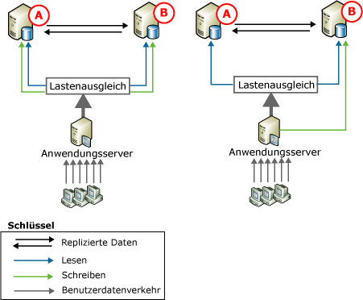
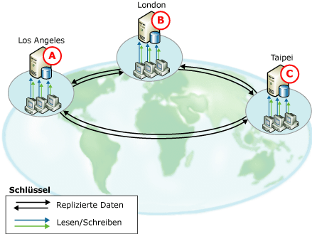
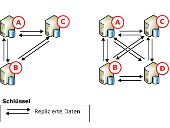

# Peer-zu-Peer - Transaktionsreplikation
[!INCLUDE[appliesto-ss-xxxx-xxxx-xxx-md](../../../includes/appliesto-ss-xxxx-xxxx-xxx-md.md)]

  Peer-zu-Peer-Replikation bietet eine skalierbare Lösung mit hoher Verfügbarkeit, da Kopien der Daten auf mehreren Serverinstanzen verwaltet werden, die auch als *Knoten*bezeichnet werden. Auf der Grundlage der Transaktionsreplikation aufbauend, gibt die Peer-zu-Peer-Replikation transaktionskonsistente Änderungen fast in Echtzeit weiter. Dies macht Anwendungen möglich, die skalierbare Lesevorgänge voraussetzen, weil die Leseanforderungen von Clients über mehrere Knoten verteilt werden können. Da die Knoten die Daten fast in Echtzeit übernehmen, bietet die Peer-zu-Peer-Replikation Datenredundanz, die die Verfügbarkeit der Daten erhöht.  
  
 Betrachten Sie eine Webanwendung. Sie kann von Peer-zu-Peer-Replikation auf folgende Weise profitieren:  
  
-   Katalogabfragen und andere Lesevorgänge werden über mehrere Knoten verteilt. Dadurch bleibt die Leistung auch dann konsistent, wenn sich die Anzahl der Lesevorgänge erhöht.  
  
-   Wenn einer der Knoten des Systems ausfällt, können auf der Anwendungsebene die Schreibvorgänge für diesen Konten an einen anderen Knoten umgeleitet werden. Dadurch wird die Verfügbarkeit gewährleistet.  
  
-   Muss ein Knoten gewartet oder das gesamte System aktualisiert werden, kann jeder Knoten einzeln offline geschaltet und wieder in das System eingefügt werden, ohne dass die Verfügbarkeit der Anwendung darunter leidet.  
  
 Zwar ermöglicht die Peer-zu-Peer-Replikation die Skalierung von Lesevorgängen, doch bleibt die Schreibgeschwindigkeit in der Topologie ähnlich der für einen einzelnen Knoten. Dies kommt daher, weil letztlich alle Einfügungen, Updates und Löschungen an alle Knoten weitergegeben werden. Die Replikation erkennt, wenn eine Änderung auf einen bestimmten Knoten angewendet wurde, und verhindert, dass Änderungen die Knoten mehrmals durchlaufen. Wir raten aus den folgenden Gründen dringend, Schreibvorgänge für eine Zeile nur an einem Knoten auszuführen:  
  
-   Wird eine Zeile an mehr als einem Knoten geändert, kann es zu einem Konflikt kommen, oder das Update kann sogar verloren gehen, wenn die Zeile an andere Knoten übermittelt wird.  
  
-   Bei der Replizierung von Änderungen verstreicht immer eine gewisse Latenzzeit. Bei Anwendungen, die sofort die neuesten Änderungen erkennen müssen, kann der dynamische Lastenausgleich über mehrere Knoten problematisch werden.  
  
 Die Peer-zu-Peer-Replikation schließt die Option ein, die Konflikterkennung für eine gesamte Peer-zu-Peer-Topologie zu aktivieren. Diese Option hilft, den Problemen vorzubeugen, die sich aus nicht erkannten Konflikten, einschließlich inkonsistentem Verhalten von Anwendungen und verlorenen Updates ergeben. Standardmäßig wird, wenn diese Option aktiviert ist, eine konfliktverursachende Änderung als ein schwerwiegender Fehler betrachtet, der zu einem Fehler des Verteilungs-Agents führt. Bei einem Konflikt verbleibt die Topologie so lange in einem inkonsistenten Zustand, bis der Konflikt manuell gelöst und die Datenkonsistenz in der Topologie wiederhergestellt wurde. Weitere Informationen finden Sie unter [Conflict Detection in Peer-to-Peer Replication](../../../relational-databases/replication/transactional/peer-to-peer-conflict-detection-in-peer-to-peer-replication.md).  
  
> [!NOTE]  
>  Stellen Sie, um inkonsistente Daten zu vermeiden, in einer Peer-zu-Peer-Topologie sicher, dass keine Konflikte auftreten, auch wenn die Konflikterkennung aktiviert ist. Damit sichergestellt ist, dass Schreibvorgänge für eine bestimmte Zeile nur an einem Knoten durchgeführt werden, müssen Anwendungen, die auf Daten zugreifen und diese ändern, Einfügungen, Updates und Löschungen partitionieren. Diese Partitionierung gewährleistet, dass Änderungen an einer bestimmten Zeile, die von einem Knoten stammen, mit allen anderen Knoten in der Topologie synchronisiert werden, bevor die Zeile von einem anderen Knoten geändert wird. Wenn eine Anwendung ausgereifte Fähigkeiten zur Konflikterkennung und -lösung erfordert, verwenden Sie die Mergereplikation. Weitere Informationen finden Sie unter [Mergereplikation](../../../relational-databases/replication/merge/merge-replication.md) und [Erkennen und Beseitigen von Konflikten bei der Mergereplikation](../../../relational-databases/replication/merge/advanced-merge-replication-resolve-merge-replication-conflicts.md).  
  
## Peer-zu-Peer-Topologien  
 In folgenden Szenarien werden die typischen Verwendungsarten der Peer-zu-Peer-Replikation erläutert.  
  
### Topologie mit zwei teilnehmenden Datenbanken  
   
  
 Die beiden oben stehenden Abbildungen zeigen jeweils zwei teilnehmende Datenbanken, bei denen der Benutzerverkehr über einen Anwendungsserver an die Datenbanken geleitet wird. Diese Konfiguration kann für eine Vielzahl von Anwendungen, von Websites bis zu Arbeitsgruppenanwendungen, verwendet werden, und bietet folgende Vorteile:  
  
-   Verbesserte Leseleistung, da Lesevorgänge über zwei Server verteilt werden.  
  
-   Höhere Verfügbarkeit bei Wartungserfordernissen oder bei Ausfällen an einem Knoten.  
  
 In beiden Abbildungen wird für die Leseaktivität ein Lastenausgleich zwischen den teilnehmenden Datenbanken ausgeführt, die Updates werden jedoch anders verarbeitet.  
  
-   Links werden Updates zwischen den zwei Servern partitioniert. Falls die Datenbank einen Produktkatalog enthält, können Sie beispielsweise veranlassen, dass eine benutzerdefinierte Anwendung Updates für Produktnamen, die mit den Buchstaben A bis M beginnen, an Knoten **A** und Updates für Produktnamen, die mit den Buchstaben N bis Z beginnen, an Knoten **B** leitet. Updates werden dann auf dem jeweils anderen Knoten repliziert.  
  
-   Auf der rechten Seite werden alle Updates an Knoten **B** geleitet. Von dort aus werden Updates auf Knoten **A** repliziert. Wenn **B** offline ist (z.B. aus Wartungsgründen), kann der Anwendungsserver sämtliche Aktivitäten an **B** leiten. Ist **B** wieder online, können Updates auf ihn geleitet werden, und der Anwendungsserver kann alle Updates zurück an **B** oder weiterhin an **A** leiten.  
  
 Die Peer-zu-Peer-Replikation unterstützt beide Vorgehensweisen, aber das Beispiel für das zentrale Update auf der rechten Seite wird oft auch bei der standardmäßigen Transaktionsreplikation verwendet.  
  
### Topologien mit drei oder mehr teilnehmenden Datenbanken  
   
  
 Die oben stehende Abbildung zeigt drei teilnehmende Datenbanken, die Daten für einen weltweiten Software-Support-Anbieter mit Niederlassungen in Los Angeles, London und Taipeh bereitstellen. Die Supportmitarbeiter in den jeweiligen Niederlassungen nehmen Kundenanrufe entgegen und geben Informationen zu sämtlichen Kundenanrufen ein und aktualisieren diese. Der Zeitunterschied zwischen den Zeitzonen, in denen sich die drei Niederlassungen befinden, beträgt jeweils acht Stunden, sodass sich die Arbeitszeiten nicht überschneiden. Wenn die Niederlassung in Taipeh schließt, beginnt der Arbeitstag in der Londoner Niederlassung. Wenn ein Anruf noch bearbeitet wird, wenn eine Niederlassung schließt, wird der Anruf an einen Mitarbeiter in der Niederlassung übertragen, die als nächste öffnet.  
  
 Jeder Standort verfügt über eine Datenbank und einen Anwendungsserver, mit deren Hilfe die Supportmitarbeiter Informationen zu den Kundenanrufen eingeben und aktualisieren können. Die Topologie wird anhand der Uhrzeit partitioniert. Updates finden nur auf dem Knoten statt, der zum gegebenen Zeitpunkt für die Geschäftstätigkeit geöffnet ist. Die Updates werden dann an die anderen teilnehmenden Datenbanken geleitet. Diese Topologie bietet folgende Vorteile:  
  
-   Unabhängigkeit ohne Isolation: Jede Niederlassung kann Daten unabhängig von den anderen Niederlassungen einfügen, aktualisieren oder löschen. Jedoch können alle Niederlassungen die Daten nutzen, da sie auf allen anderen teilnehmenden Datenbanken repliziert werden.  
  
-   Höhere Verfügbarkeit bei Ausfällen oder Wartungserfordernissen an einer oder mehreren der teilnehmenden Datenbanken.  
  
       
  
 Die oben stehende Abbildung zeigt, wie der drei Knoten umfassenden Topologie ein Knoten hinzugefügt wird. Ein Knoten könnte in diesem Szenario aus folgenden Gründen hinzugefügt werden:  
  
-   Da eine andere Niederlassung geöffnet ist.  
  
-   Um eine höhere Verfügbarkeit für Wartungszwecke oder eine höhere Fehlertoleranz beim Ausfall eines Datenträgers oder anderer schwerwiegender Fehler zu bieten.  
  
 Beachten Sie, dass sowohl in der drei Knoten umfassenden als auch in der vier Knoten umfassenden Topologie sämtliche Datenbanken an alle anderen Datenbanken veröffentlichen und von diesen abonnieren. Dadurch wird eine maximale Verfügbarkeit im Fall von Wartungserfordernissen oder beim Ausfall eines oder mehrerer Knoten erreicht. Da Knoten hinzugefügt werden, müssen Sie die Verfügbarkeits- und Skalierbarkeitserfordernisse gegenüber der Leistung und der Komplexität der Bereitstellung und der Verwaltung abgleichen.  
  
## Konfigurieren der Peer-zu-Peer-Replikation  
 Die Konfiguration der Peer-zu-Peer-Replikationstopologie ist der Konfiguration einer Reihe von standardmäßigen Transaktionsveröffentlichungen und -abonnements sehr ähnlich. Die im folgenden Thema beschriebenen Schritte stellen die Konfiguration eines drei Knoten umfassenden Systems dar, das der auf der linken Seite in der oben stehenden Abbildung dargestellten Peer-zu-Peer-Topologie ähnelt.  
  
## Überlegungen für die Verwendung der Peer-zu-Peer-Replikation  
 Dieser Abschnitt enthält Informationen und Richtlinien, die Sie beachten sollten, wenn Sie Peer-zu-Peer-Replikation verwenden.  
  
### Allgemeine Überlegungen  
  
-   Die Peer-zu-Peer-Replikation ist nur in Enterprise-Versionen von [!INCLUDE[ssNoVersion](../../../includes/ssnoversion-md.md)]verfügbar.  
  
-   Alle an der Peer-zu-Peer-Replikation teilnehmenden Datenbanken sollten identische Schemas und Daten enthalten:  
  
    -   Objektnamen, das Objektschema und Veröffentlichungsnamen sollten identisch sein.  
  
    -   Bei Veröffentlichungen müssen Schemaänderungen repliziert werden dürfen. (Dies entspricht der Einstellung **1** für die Veröffentlichungseigenschaft **replicate_ddl**, also der Standardeinstellung.) Weitere Informationen finden Sie unter [Vornehmen von Schemaänderungen in Veröffentlichungsdatenbanken](../../../relational-databases/replication/publish/make-schema-changes-on-publication-databases.md).  
  
    -   Zeilen- und Spaltenfilterung werden nicht unterstützt.  
  
-   Es wird empfohlen, dass jeder Knoten seine eigene Verteilungsdatenbank verwendet. Hierdurch wird das Ausfallsrisiko auf mehrere Knoten verteilt.  
  
-   Tabellen und andere Objekte können nicht in mehreren Peer-zu-Peer-Veröffentlichungen innerhalb einer Veröffentlichungsdatenbank eingeschlossen sein.  
  
-   Eine Veröffentlichung muss für die Peer-zu-Peer-Replikation aktiviert werden, bevor Abonnements erstellt werden können.  
  
-   Abonnements müssen mithilfe einer Sicherung oder mit der Option **'replication support only'** initialisiert werden. Weitere Informationen finden Sie unter [Initialize a Transactional Subscription Without a Snapshot](../../../relational-databases/replication/initialize-a-transactional-subscription-without-a-snapshot.md)initialisiert wird.  
  
-   Die Verwendung von Identitätsspalten wird nicht empfohlen. Bei der Verwendung von Identitäten müssen Sie die den Tabellen zugewiesenen Bereiche in jeder teilnehmenden Datenbank manuell verwalten. Weitere Informationen finden Sie im Abschnitt „Zuweisen von Bereichen für die manuelle Identitätsbereichsverwaltung“ im Thema [Replizieren von Identitätsspalten](../../../relational-databases/replication/publish/replicate-identity-columns.md).  
  
### Funktionsbezogene Einschränkungen  
 Peer-zu-Peer-Replikation unterstützt die zentralen Funktionen der Transaktionsreplikation, unterstützt jedoch nicht die folgenden Optionen:  
  
-   Initialisierung und erneute Initialisierung mit einer Momentaufnahme.  
  
-   Zeilen- und Spaltenfilter.  
  
-   Timestamp-Spalten.  
  
-   Nicht-[!INCLUDE[ssNoVersion](../../../includes/ssnoversion-md.md)] -Verleger und -Abonnenten.  
  
-   Abonnements mit sofortigem Update und mit verzögertem Update über eine Warteschlange.  
  
-   Anonyme Abonnements.  
  
-   Teilabonnements  
  
-   Anfügbare Abonnements und transformierbare Abonnements. (Beide Optionen wurden mit [!INCLUDE[ssVersion2005](../../../includes/ssversion2005-md.md)]als veraltet markiert.)  
  
-   Freigegebene Verteilungs-Agents.  
  
-   Der Verteilungs-Agent-Parameter **-SubscriptionStreams** und der Protokolllese-Agent-Parameter **-MaxCmdsInTran**.  
  
-   Die Artikeleigenschaften **@destination_owner** und **@destination_table**bezeichnet werden.

-   Die Peer-zu-Peer-Transaktionsreplikation unterstützt keine Erstellung von unidirektionalen Transaktionsabonnements an eine Peer-zu-Peer-Veröffentlichung.   
  
 Für folgende Eigenschaften gelten spezielle Bedingungen:  
  
-   Für die Veröffentlichungseigenschaft **@allow_initialize_from_backup** ist der Wert **true**bezeichnet werden.  
  
-   Für die Artikeleigenschaft **@replicate_ddl** ist der Wert **true**erforderlich; für **@identityrangemanagementoption** ist der Wert **manual**erforderlich; und für **@status** muss der Wert auf **24** festgelegt werden.  
  
-   Der Wert für die Artikeleigenschaften **@ins_cmd**, **@del_cmd**und **@upd_cmd** darf nicht auf **SQL**bezeichnet werden.  
  
-   Für die Abonnementeigenschaft **@sync_type** ist der Wert **none** oder **automatic**bezeichnet werden.  
  
### Überlegungen in Bezug auf die Wartung  
 Für einige Aktionen muss das System in den inaktiven Status versetzt werden. Dazu müssen alle Aktivitäten an veröffentlichten Tabellen in allen Knoten beendet werden, und es muss sichergestellt werden, dass jeder Knoten alle Änderungen von allen anderen Knoten erhalten hat.  
  
||Nur SQL Server 2005-Peers oder eine Kombination aus SQL Server 2005- und SQL Server 2008-Peers und höher|Nur SQL Server 2005-Peers oder eine Kombination aus SQL Server 2005- und SQL Server 2008-Peers und höher|SQL Server 2008-Peers und höher|SQL Server 2008-Peers und höher|  
|-|------------------------------------------------------------------------------------------------------|------------------------------------------------------------------------------------------------------|------------------------------|------------------------------|  
|Hinzufügen eines Knotens zur Topologie|2 Knoten in vollständiger Topologie: Kein Versetzen in inaktiven Status erforderlich. Verwenden Sie `sync_type = 'initialize with backup'`.|Mehr als 2 Knoten: Versetzen in inaktiven Status erforderlich.|`sync_type = 'replication support only'`: Versetzen in inaktiven Status erforderlich.|`sync_type = 'initialize with backup'` und `'initialize from lsn'`: Kein Versetzen in inaktiven Status erforderlich.|  
  
 Für Änderungen am Topologieschema (Hinzufügen oder Löschen von Artikeln) ist ein Versetzen in den inaktiven Status erforderlich. Weitere Informationen finden Sie unter [Verwalten einer Peer-zu-Peer-Topologie &#40;Replikationsprogrammierung mit Transact-SQL&#41;](../../../relational-databases/replication/administration/administer-a-peer-to-peer-topology-replication-transact-sql-programming.md).  
  
 Zum Entfernen eines Knotens aus der Topologie ist kein Versetzen in den inaktiven Status erforderlich.  
  
 Zum Ändern der Artikeleigenschaften mit  [sp_changearticle](../../../relational-databases/system-stored-procedures/sp-changearticle-transact-sql.md) ist kein Versetzen in den inaktiven Status erforderlich. Die folgenden Eigenschaften dürfen geändert werden (für P2P): `description`, `ins_cmd`, `upd_cmd`und `del_cmd` .  
  
 Für Änderungen am Artikelschema (Hinzufügen oder Löschen von Spalten) ist kein Versetzen in den inaktiven Status erforderlich.  
  
-   Artikel hinzufügen: Zum Hinzufügen eines Artikels zu einer vorhandenen Konfiguration muss das System in den inaktiven Status versetzt werden. Danach wird die CREATE TABLE-Anweisung ausgeführt, die Ausgangsdaten werden auf jeden Knoten der Topologie geladen und der neue Artikel wird jedem Knoten der Topologie hinzugefügt.  
  
-   Artikel löschen: Zur Aufrechterhaltung eines konsistenten Status auf allen Knoten muss die Topologie in den inaktiven Status versetzt werden.  
  
 Weitere Informationen finden Sie unter [Versetzen einer Replikationstopologie in einen inaktiven Status &#40;Replikationsprogrammierung mit Transact-SQL&#41;](../../../relational-databases/replication/administration/quiesce-a-replication-topology-replication-transact-sql-programming.md) und [Verwalten einer Peer-zu-Peer-Topologie &#40;Replikationsprogrammierung mit Transact-SQL&#41;](../../../relational-databases/replication/administration/administer-a-peer-to-peer-topology-replication-transact-sql-programming.md).  
  
-   Wenn Sie einer Peer-zu-Peer-Topologie einen neuen Knoten hinzufügen, sollte nur aus Sicherungen wiederhergestellt werden, die vor dem Hinzufügen des neuen Knoten erstellt wurden.  
  
-   In einer Peer-zu-Peer-Topologie können Abonnements nicht erneut initialisiert werden. Wenn Sie sicherstellen müssen, dass ein Knoten eine neue Kopie der Daten besitzt, stellen Sie an diesem Knoten eine Sicherung wieder her.  
  
## Weitere Informationen finden Sie unter  
 [Verwalten einer Peer-zu-Peer-Topologie &#40;Replikationsprogrammierung mit Transact-SQL&#41;](../../../relational-databases/replication/administration/administer-a-peer-to-peer-topology-replication-transact-sql-programming.md)   
 [Strategien zum Sichern und Wiederherstellen einer Momentaufnahme- und Transaktionsreplikation](../../../relational-databases/replication/administration/strategies-for-backing-up-and-restoring-snapshot-and-transactional-replication.md)   
 [Veröffentlichungstypen der Transaktionsreplikation](../../../relational-databases/replication/transactional/publication-types-for-transactional-replication.md)  
  
  
