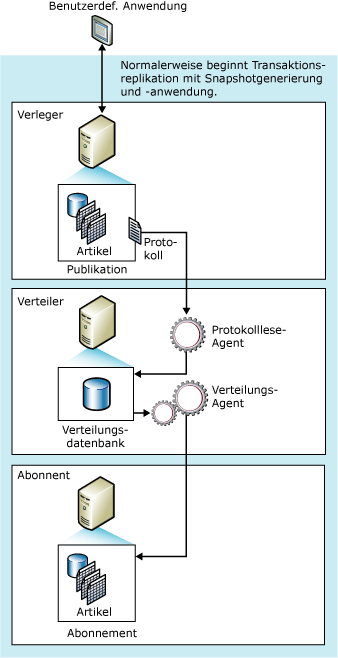

# Transaktionsreplikation
  Eine Transaktionsreplikation beginnt in der Regel mit einer Momentaufnahme des Veröffentlichungsdatenbankobjekts und der entsprechenden Daten. Nach der Erstellung der Anfangsmomentaufnahme werden spätere auf dem Verleger vorgenommene Daten- und Schemaänderungen an den Abonnenten übermittelt, wenn sie auftreten (fast in Echtzeit). Die Datenänderungen werden auf dem Abonnenten in derselben Reihenfolge und mit denselben Transaktionsgrenzen angewendet, in der sie auf dem Verleger stattgefunden haben. Auf diese Weise wird die Transaktionskonsistenz innerhalb einer Veröffentlichung sichergestellt.  
  
 Die Transaktionsreplikation wird typischerweise in reinen Serverumgebungen verwendet und ist für die folgenden Fälle geeignet:  
  
-   Inkrementelle Änderungen sollen an Abonnenten weitergegeben werden, wenn sie auftreten.  
  
-   Die Anwendung benötigt eine niedrige Latenzzeit zwischen dem Zeitpunkt, zu dem Änderungen auf dem Verleger vorgenommen werden, und dem Zeitpunkt, zu dem die Änderungen auf dem Abonnenten eintreffen.  
  
-   Die Anwendung benötigt Zugriff auf Zwischenstufen von Datenänderungen. Wenn eine Zeile sich z. B. fünfmal ändert, kann die Anwendung bei Verwendung der Transaktionsreplikation auf jede Änderung reagieren (indem sie z. B. einen Trigger auslöst) und nicht nur auf das endgültige Ergebnis aller Zeilenänderungen.  
  
-   Auf dem Verleger kommt es sehr häufig zu Einfüge-, Update- und Löschaktivitäten.  
  
-   Der Verleger bzw. Abonnent ist keine[!INCLUDE[ssNoVersion](../../../includes/ssnoversion-md.md)] -Datenbank, sondern z. B. eine Oracle-Datenbank.  
  
 Standardmäßig sollten Abonnenten von Transaktionsreplikationen schreibgeschützt sein, da Änderungen nicht an den Verleger zurückgegeben werden. Die Transaktionsreplikation bietet aber auch Optionen, die Updates auf dem Abonnenten ermöglichen.  
  
 **In diesem Thema**  
  
 [Funktionsweise der Transaktionsreplikation](#HowWorks)  
  
 [Anfangsdataset](#Dataset)  
  
 [Momentaufnahme-Agent](#SnapshotAgent)  
  
 [Protokolllese-Agent](#LogReaderAgent)  
  
 [Verteilungs-Agent](#DistributionAgent)  
  
##   Funktionsweise der Transaktionsreplikation  
 Die Transaktionsreplikation wird vom Momentaufnahme-Agent, dem Protokolllese-Agent und dem Verteilungs-Agent von [!INCLUDE[ssNoVersion](../../../includes/ssnoversion-md.md)] implementiert. Der Momentaufnahme-Agent bereitet Momentaufnahmen vor, die das Schema und die Daten von veröffentlichten Tabellen und Datenbankobjekten enthalten, speichert die Dateien im Momentaufnahmeordner und zeichnet Synchronisierungsaufträge in der Verteilungsdatenbank auf dem Verteiler auf.  
  
 Der Protokolllese-Agent überwacht das Transaktionsprotokoll jeder für die Transaktionsreplikation konfigurierten Datenbank und kopiert die für die Replikation markierten Transaktionen aus dem Transaktionsprotokoll in die Verteilungsdatenbank, die als zuverlässige Warteschlange zum Speichern und Weiterleiten fungiert. Der Verteilungs-Agent kopiert die Anfangsmomentaufnahmedateien aus dem Momentaufnahmeordner und die in den Tabellen der Verteilungsdatenbank gespeicherten Transaktionen auf Abonnenten.  
  
 Auf dem Verleger vorgenommene inkrementelle Änderungen laufen gemäß dem Zeitplan des Verteilungs-Agents ab, der fortlaufend (minimale Latenzzeit) oder in geplanten Intervallen ausgeführt werden kann. Da die Änderungen an den Daten auf dem Verleger vorgenommen werden müssen (wenn die Transaktionsreplikation ohne sofortiges Update oder verzögertes Update über eine Warteschlange verwendet wird), werden Updatekonflikte vermieden. Letztlich erreichen alle Abonnenten dieselben Werte wie der Verleger. Wird das sofortige Update oder verzögerte Update über eine Warteschlange mit der Transaktionsreplikation verwendet, können Updates auf dem Abonnenten vorgenommen werden; beim verzögerten Update über eine Warteschlange können Konflikte auftreten.  
  
 Die folgende Abbildung zeigt die wichtigsten Komponenten der Transaktionsreplikation.  
  
   
  
##   Anfangsdataset  
 Bevor ein neuer Abonnent einer Transaktionsreplikation inkrementelle Änderungen von einem Verleger erhalten kann, muss der Abonnent Tabellen mit demselben Schema und denselben Daten wie die Tabellen auf dem Verleger enthalten. Das Anfangsdataset ist in der Regel eine Momentaufnahme, die vom Momentaufnahme-Agent erstellt und vom Verteilungs-Agent verteilt und angewendet wird. Das Anfangsdataset kann auch über eine Sicherung oder andere Methoden, wie [!INCLUDE[ssNoVersion](../../../includes/ssnoversion-md.md)] Integration Services, bereitgestellt werden.  
  
 Wenn Momentaufnahmen an Abonnenten verteilt und auf Abonnenten angewendet werden, sind nur die Abonnenten betroffen, die auf eine Anfangsmomentaufnahme warten. Andere Abonnenten für diese Veröffentlichung (diejenigen, die bereits initialisiert wurden) sind nicht betroffen.  
  
## Gleichzeitige Momentaufnahmeverarbeitung  
 Bei der Momentaufnahmegenerierung werden für die Dauer der Momentaufnahmegenerierung freigegebene Sperren auf allen Tabellen platziert, die als Teil der Replikation veröffentlicht werden. So kann verhindert werden, dass Updates in den veröffentlichten Tabellen ausgeführt werden. Bei der gleichzeitigen Momentaufnahmeverarbeitung, die Standardeinstellung für die Transaktionsreplikation, werden die freigegebenen Sperren nicht während der gesamten Momentaufnahmegenerierung beibehalten. Deshalb können Benutzer ohne Unterbrechung weiter arbeiten, während Anfangsmomentaufnahmedateien durch die Replikation erstellt werden.  
  
##   Momentaufnahme-Agent  
 Die Prozeduren, mit denen der Momentaufnahme-Agent die Anfangsmomentaufnahme in der Transaktionsreplikation implementiert, sind identisch mit den bei der Momentaufnahmereplikation verwendeten Prozeduren (ausgenommen der für die gleichzeitige Momentaufnahmeverarbeitung weiter oben beschriebenen Prozeduren).  
  
 Nach dem Generieren der Momentaufnahmedateien können Sie sie mithilfe von [!INCLUDE[msCoName](../../../includes/msconame-md.md)] Windows-Explorer im Momentaufnahmeordner anzeigen.  
  
##   Ändern von Daten und der Protokolllese-Agent  
 Der Protokolllese-Agent wird auf dem Verteiler ausgeführt. In der Regel wird er fortlaufend ausgeführt, Sie können jedoch auch einen Zeitplan für die Ausführung festlegen. Beim Ausführen liest der Protokolllese-Agent zunächst das Transaktionsprotokoll der Veröffentlichung (dasselbe Datenbankprotokoll, das auch für die Transaktionsprotokollierung und -wiederherstellung während regulärer Vorgänge des [!INCLUDE[ssNoVersion](../../../includes/ssnoversion-md.md)] -Datenbankmoduls verwendet wird) und identifiziert alle INSERT-, UPDATE- und DELETE-Anweisungen und andere Änderungen, die an den für die Replikation markierten Daten vorgenommen wurden. Danach kopiert der Agent diese Transaktionen als Batch in die Verteilungsdatenbank auf dem Verteiler. Der Protokolllese-Agent verwendet die intern gespeicherte Prozedur **sp_replcmds** zum Abrufen des nächsten Satzes von Befehlen aus dem Protokoll, die für die Replikation markiert wurden. Die Verteilungsdatenbank wird dann zur Warteschlange zum Speichern und Weiterleiten, von der aus Änderungen an die Abonnenten gesendet werden. Nur Transaktionen, für die ein Commit ausgeführt wurde, werden an die Verteilungsdatenbank gesendet.  
  
 Nachdem der gesamte Transaktionsbatch erfolgreich in die Verteilungsdatenbank geschrieben wurde, wird ein Commit ausgeführt. Nach der Ausführung eines Commits für jeden Batch von Befehlen auf dem Verteiler ruft der Protokolllese-Agent **sp_repldone** auf, um zu markieren, wo die Replikation zuletzt abgeschlossen wurde. Schließlich markiert der Agent die Zeilen im Transaktionsprotokoll, die gelöscht werden können. Zeilen, die noch auf ihre Replikation warten, werden nicht gelöscht.  
  
 Transaktionsbefehle werden in der Verteilungsdatenbank gespeichert, bis sie an alle Abonnenten weitergegeben werden oder bis die maximale Beibehaltungsdauer für die Verteilung überschritten wird. Abonnenten erhalten Transaktionen in der gleichen Reihenfolge, in der sie auf den Verleger angewendet wurden.  
  
##   Verteilungs-Agent  
 Der Verteilungs-Agent wird für Pushabonnements auf dem Verteiler und für Pullabonnements auf dem Abonnenten ausgeführt. Der Agent verschiebt Transaktionen aus der Verteilungsdatenbank auf den Abonnenten. Wenn ein Abonnement für die Überprüfung markiert ist, überprüft der Verteilungs-Agent auch, ob die Daten auf dem Verleger und dem Abonnenten übereinstimmen.  
  
  
