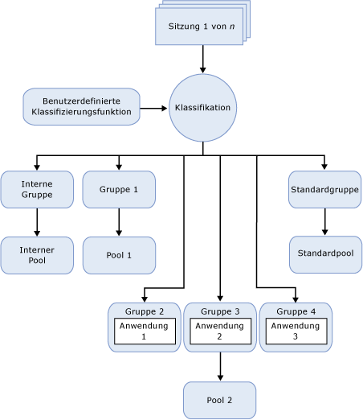

# Ressourcenkontrolle
  [!INCLUDE[ssNoVersion](../../includes/ssnoversion-md.md)] -Funktion, mit der Sie die [!INCLUDE[ssNoVersion](../../includes/ssnoversion-md.md)] -Arbeitsauslastung und den Verbrauch von Systemressourcen verwalten können. Über die Ressourcenkontrolle legen Sie Grenzwerte für die CPU, physische E/A sowie den Arbeitsspeicher fest, die für eingehende Anwendungsanforderungen zur Verfügung stehen.  
  
## Vorteile der Ressourcenkontrolle  
 Mit der Ressourcenkontrolle können Sie die [!INCLUDE[ssNoVersion](../../includes/ssnoversion-md.md)] -Arbeitsauslastungen und -Ressourcen verwalten, indem Sie durch eingehende Anforderungen Grenzen für den Ressourcenverbrauch festlegen. Im Kontext der Ressourcenkontrolle bezeichnet Arbeitsauslastung eine Reihe von ähnlich dimensionierten Abfragen oder Anforderungen, die als einzelne Entität behandelt werden kann und sollte. Dies ist zwar keine Voraussetzung, je einheitlicher das Ressourcenverwendungsmuster einer Arbeitsauslastung jedoch ist, desto größer der Nutzen der Ressourcenkontrolle. Ressourcengrenzen können in Echtzeit mit minimaler Wirkung auf Arbeitsauslastungen, die ausgeführt werden, neu konfiguriert werden.  
  
 In einer Umgebung, in der mehrere verschiedene Arbeitsauslastungen auf dem gleichen Server vorhanden sind, ermöglicht Ihnen die Ressourcenkontrolle, diese Arbeitsauslastungen zu unterscheiden und freigegebene Ressourcen bei deren Anforderung auf Grundlage der von Ihnen angegebenen Grenzwerte zuzuweisen. Die Ressourcen umfassen CPU, physische E/A und Arbeitsspeicher.  
  
 Die Ressourcenkontrolle bietet folgende Möglichkeiten:  
  
-   Bereitstellen der Mehrinstanzenfähigkeit und Ressourcenisolation für einzelne SQL Server-Instanzen, die mehrere Clientarbeitsauslastungen verarbeiten. Das heißt, Sie können die verfügbaren Serverressourcen auf die Arbeitsauslastungen verteilen und dadurch Ressourcenkonflikte zwischen ihnen minimieren.  
  
-   Bereitstellen vorhersagbarer Leistung und SLA-Unterstützung für Arbeitsauslastungsmandanten in einer Umgebung mit mehreren Arbeitsauslastungen und mehreren Benutzern.  
  
-   Isolieren und Eingrenzen von Endlosabfragen oder Einschränken von E/A-Ressourcen z. B. für DBCC CHECKDB-Vorgänge, die das E/A-Subsystem stark beanspruchen und negative Auswirkungen auf andere Arbeitsauslastungen haben können.  
  
-   Hinzufügen einer differenzierten Ressourcennachverfolgung für Rückbuchungen, um den Verbrauchern von Serverressourcen ein zuverlässiges Abrechnungsmodell zu bieten.  
  
## Einschränkungen der Ressourcenkontrolle  
 Diese Version der Ressourcenkontrolle hat die folgenden Einschränkungen:  
  
-   Die Ressourcenverwaltung wird auf [!INCLUDE[ssDEnoversion](../../includes/ssdenoversion-md.md)]beschränkt. Die Ressourcenkontrolle kann nicht für [!INCLUDE[ssASnoversion](../../includes/ssasnoversion-md.md)], [!INCLUDE[ssISnoversion](../../includes/ssisnoversion-md.md)]und [!INCLUDE[ssRSnoversion](../../includes/ssrsnoversion-md.md)]verwendet werden.  
  
-   Es gibt keine Arbeitsauslastungsüberwachung oder Arbeitsauslastungsverwaltung zwischen SQL Server-Instanzen.  
  
-   Die Ressourcenkontrolle kann OLTP-Arbeitsauslastungen zwar verwalten, allerdings befindet sich diese Art von Abfragen, die normalerweise nur sehr kurz sind, mitunter nicht lange genug auf der CPU, um Bandbreitenkontrollen anzuwenden. Dies verzerrt möglicherweise die Statistik, die für die CPU-Verwendung zurückgegeben wird.  
  
-   Die Steuerung der physischen E/A bezieht sich nur auf Benutzervorgänge und nicht auf Systemtasks. Zu den Systemtasks gehören Schreibvorgänge im Transaktionsprotokoll und Lazy Writer-EA-Vorgänge. Die Ressourcenkontrolle betrifft hauptsächlich Benutzerlesevorgänge, da die meisten Schreibvorgänge üblicherweise von Systemtasks durchgeführt werden.  
  
-   Für den internen Ressourcenpool können keine E/A-Schwellenwerte festgelegt werden.  
  
## Ressourcenkonzepte  
 Sie sollten mit den folgenden drei Konzepten vertraut sein, um die Ressourcenkontrolle effizient verwenden zu können:  
  
-   **Ressourcenpools:** Ein Ressourcenpool stellt die physischen Ressourcen des Servers dar. Stellen Sie sich einen Pool als virtuelle [!INCLUDE[ssNoVersion](../../includes/ssnoversion-md.md)]-Instanz innerhalb einer [!INCLUDE[ssNoVersion](../../includes/ssnoversion-md.md)]-Instanz vor. Bei der Installation von [!INCLUDE[ssNoVersion](../../includes/ssnoversion-md.md)] werden ein interner Ressourcenpool (internal) und ein Standardressourcenpool (default) erstellt. Die Ressourcenkontrolle unterstützt auch benutzerdefinierte Ressourcenpools. Weitere Informationen finden Sie unter [Resource Governor Resource Pool](../../relational-databases/resource-governor/resource-governor-resource-pool.md).  
  
-   **Arbeitsauslastungsgruppen:** Eine Arbeitsauslastungsgruppe dient als Container für Sitzungsanforderungen mit ähnlichen Klassifizierungskriterien. Arbeitsauslastungen ermöglichen die gemeinsame Überwachung der Sitzungen und definieren Richtlinien für die Sitzungen. Jede Arbeitsauslastungsgruppe befindet sich in einem eigenen Ressourcenpool. Bei der Installation von [!INCLUDE[ssNoVersion](../../includes/ssnoversion-md.md)] werden zwei Arbeitsauslastungsgruppen (internal und default) den betreffenden Ressourcenpools zugeordnet. Die Ressourcenkontrolle unterstützt auch benutzerdefinierte Arbeitsauslastungsgruppen. Weitere Informationen finden Sie unter [Resource Governor Workload Group](../../relational-databases/resource-governor/resource-governor-workload-group.md).  
  
-   **Klassifizierung:** Beim Klassifizierungsprozess werden eingehende Sitzungen auf Grundlage der Sitzungseigenschaften einer Arbeitsauslastungsgruppe zugewiesen. Sie können die Klassifizierungslogik anpassen, indem Sie eine benutzerdefinierte Funktion schreiben, die als Klassifizierungsfunktion bezeichnet wird. Die Ressourcenkontrolle unterstützt auch eine benutzerdefinierte Klassifizierungsfunktion für die Implementierung von Klassifizierungsregeln. Weitere Informationen finden Sie unter [Resource Governor Classifier Function](../../relational-databases/resource-governor/resource-governor-classifier-function.md).  
  
> [!NOTE]  
>  Dedizierte Administratorverbindungen (DACs) werden nicht über die Ressourcenkontrolle gesteuert. DAC-Abfragen, die in der internen Arbeitsauslastungsgruppe und im internen Ressourcenpool ausgeführt werden, müssen nicht klassifiziert werden.  
  
 Im Zusammenhang mit der Ressourcenkontrolle können Sie die obigen Konzepte als Komponenten betrachten. In der folgenden Abbildung sehen Sie diese Komponenten und ihre Beziehung zueinander in der Datenbankmodulumgebung. Von der Verarbeitungsperspektive aus stellt sich der vereinfachte Ablauf wie folgt dar:  
  
-   Es gibt eine eingehende Verbindung für eine Sitzung (Sitzung 1 von *n*).  
  
-   Die Sitzung wird klassifiziert (Klassifikation).  
  
-   Die Arbeitsauslastung der Sitzung wird an eine Arbeitsauslastungsgruppe, z. B. Gruppe 4, geleitet.  
  
-   Die Arbeitsauslastungsgruppe verwendet den ihr zugeordneten Ressourcenpool, zum Beispiel Pool 2.  
  
-   Durch den Ressourcenpool werden die von der Anwendung (zum Beispiel Anwendung 3) benötigten Ressourcen bereitgestellt und begrenzt.  
  
   
  
## Tasks der Ressourcenkontrolle  
  
|Taskbeschreibung|Thema|  
|----------------------|-----------|  
|Beschreibt, wie die Ressourcenkontrolle aktiviert wird.|[Aktivieren der Ressourcenkontrolle](../../relational-databases/resource-governor/enable-resource-governor.md)|  
|Beschreibt, wie die Ressourcenkontrolle deaktiviert wird.|[Deaktivieren der Ressourcenkontrolle](../../relational-databases/resource-governor/disable-resource-governor.md)|  
|Beschreibt, wie ein Ressourcenpool erstellt, geändert und gelöscht wird.|[Ressourcenpool für die Ressourcenkontrolle](../../relational-databases/resource-governor/resource-governor-resource-pool.md)|  
|Beschreibt, wie eine Arbeitsauslastungsgruppe erstellt, geändert, verschoben und gelöscht wird.|[Arbeitsauslastungsgruppe der Ressourcenkontrolle](../../relational-databases/resource-governor/resource-governor-workload-group.md)|  
|Beschreibt, wie benutzerdefinierte Klassifizierungsfunktionen erstellt und getestet werden.|[Klassifizierungsfunktion der Ressourcenkontrolle](../../relational-databases/resource-governor/resource-governor-classifier-function.md)|  
|Beschreibt, wie die Ressourcenkontrolle mithilfe einer Vorlage konfiguriert wird.|[Konfigurieren der Ressourcenkontrolle mit einer Vorlage](../../relational-databases/resource-governor/configure-resource-governor-using-a-template.md)|  
|Beschreibt, wie Eigenschaften der Ressourcenkontrolle angezeigt werden.|[Anzeigen der Eigenschaften der Ressourcenkontrolle](../../relational-databases/resource-governor/view-resource-governor-properties.md)|  
  
## Siehe auch  
 [Datenbankmodulinstanzen &#40;SQL Server&#41;](../../database-engine/configure-windows/database-engine-instances-sql-server.md)  
  
  