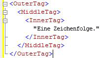
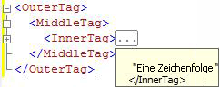

# Codegliederung
  Sie können die Gliederungsfunktion in den [!INCLUDE[ssManStudioFull](../../includes/ssmanstudiofull-md.md)] -Abfrage-Editoren verwenden, um ausgewählten Code auszublenden, wenn Sie Abfragen bearbeiten. Auf diese Weise können Sie insbesondere in großen Abfragedateien den bearbeiteten Code besser anzeigen.  
  
## Übersicht über Gliederungen  
 Standardmäßig wird der gesamte Code angezeigt, wenn Sie ein Abfrage-Editorfenster öffnen. Es ist möglich, Codebereiche zu reduzieren, sodass der Code ausgeblendet wird. Eine vertikale Linie auf der linken Seite des Editorfensters gibt anhand eines Quadrats mit einem Minuszeichen (-) den Beginn eines reduzierbaren Codebereichs an. Wenn Sie auf ein Minuszeichen klicken, wird der Text des Codebereichs durch ein Feld mit drei Punkten (…) ersetzt, und das Minuszeichen wird in ein Pluszeichen (+) geändert. Wenn Sie auf ein Pluszeichen klicken, wird der reduzierte Code angezeigt, und das Pluszeichen wird in ein Minuszeichen (-) geändert. Wenn Sie den Mauszeiger über ein Feld mit drei Punkten bewegen, wird eine QuickInfo mit dem Code im reduzierten Abschnitt angezeigt.  
  
## Gliederungsbereiche des Systems  
 Jeder [!INCLUDE[ssManStudioFull](../../includes/ssmanstudiofull-md.md)]-Editor generiert einen Satz vorgegebener systemdefinierter Gliederungsbereiche.  
  
 Der MDX- und der DMX-Code-Editor erstellen Gliederungsbereiche für alle mehrzeiligen Anweisungen. Dies ist die einzige von diesen Editoren unterstützte Gliederungsebene.  
  
### Gliederungsbereiche des XMLA-Abfrage-Editors von Analysis Services  
 Der XMLA-Abfrage-Editor von [!INCLUDE[ssASnoversion](../../includes/ssasnoversion-md.md)] generiert einen Gliederungsbereich für alle mehrzeiligen XML-Attribute. Der Editor schachtelt die Gliederungsbereiche für geschachtelte Tags. So erstellt der XMLA-Editor z. B. drei Gliederungsbereiche für das folgende Dokument.  
  
   
  
 Wenn Sie auf das Minuszeichen in der \<InnerTag>-Zeile klicken, wird nur „InnerTag“ reduziert, wie in der folgenden Abbildung dargestellt:  
  
   
  
 Wenn Sie den Mauszeiger über das Feld mit den drei Punkten (…) bewegen, wird der Code im reduzierten Bereich in einer QuickInfo angezeigt, wie in der folgenden Abbildung gezeigt.  
  
   
  
 Wenn Sie auf das Minuszeichen in der \<MiddleTag>-Zeile klicken, werden „MiddleTag“ und „InnerTag“ reduziert, wie in der folgenden Abbildung dargestellt:  
  
   
  
 Wenn Sie auf das Minuszeichen in der \<OuterTag>-Zeile klicken, werden alle drei Zeilen reduziert, wie in der folgenden Abbildung dargestellt:  
  
   
  
### Gliederungsbereiche des Datenbankmodul-Abfrage-Editors  
 Der [!INCLUDE[ssDE](../../includes/ssde-md.md)] -Abfrage-Editor generiert Gliederungsbereiche für jedes Element in der folgenden Hierarchie:  
  
1.  Batches. Der erste Batch ist der Code vom Anfang der Datei bis zum ersten GO-Befehl oder bis zum Ende der Datei, wenn keine GO-Befehle vorhanden sind. Nach dem ersten GO-Befehl gibt es einen Batch von jedem GO-Befehl bis zum nächsten GO-Befehl oder bis zum Ende der Datei.  
  
2.  Blöcke, die durch die folgenden Schlüsselwörter begrenzt sind:  
  
    -   BEGIN - END  
  
    -   BEGIN TRY - END TRY  
  
    -   BEGIN CATCH - END CATCH  
  
3.  Mehrzeilige Anweisungen.  
  
 Der [!INCLUDE[ssDE](../../includes/ssde-md.md)] -Abfrage-Editor erstellt z. B. drei Gliederungsbereiche für die folgende Abfrage:  
  
```  
CREATE PROCEDURE Sales.SampleProc --Outline region 1  
AS  
BEGIN --Outline region 2   
  SELECT GETDATE() AS TimeOfQuery;  
  SELECT * --Outline region 3  
  FROM sys.transmission_queue;  
  SELECT @@VERSION;  
END;  
GO  
```  
  
 Sie können auf das Minuszeichen in der `SELECT *` -Zeile klicken, um nur diese `SELECT` -Anweisung zu reduzieren. Um den gesamten `BEGIN - END` -Block zu reduzieren, klicken Sie auf das Minuszeichen in der `BEGIN` -Zeile. Um den gesamten Batch bis zum `GO` -Befehl zu reduzieren, klicken Sie auf das Minuszeichen in der `CREATE PROCEDURE` -Zeile. Es ist nicht möglich, die `SELECT GETDATE()` -Zeile oder die `SELECT @@VERSION` -Zeile einzeln zu reduzieren, da es sich um einzeilige Anweisungen handelt, die keine Gliederungsbereiche erhalten.  
  
  