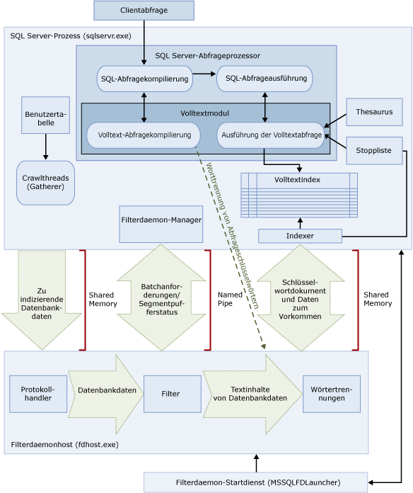

# <a name="full-text-search"></a>Volltextsuche
  Mit der Volltextsuche in [!INCLUDE[ssNoVersion](../../includes/ssnoversion-md.md)] und [!INCLUDE[ssSDSFull](../../includes/sssdsfull-md.md)] können Benutzer und Anwendungen Volltextabfragen für zeichenbasierte Daten in [!INCLUDE[ssNoVersion](../../includes/ssnoversion-md.md)] -Tabellen ausführen.
  
## <a name="basic-tasks"></a>Grundlegende Aufgaben
Dieses Thema bietet einen Überblick über die Volltextsuche und beschreibt deren Komponenten und Architektur. Wenn Sie sofort beginnen möchten, finden Sie hier die grundlegenden Aufgaben.
-   [Erste Schritte mit der Volltextsuche](../../relational-databases/search/get-started-with-full-text-search.md)
-   [Erstellen und Verwalten von Volltextkatalogen](../../relational-databases/search/create-and-manage-full-text-catalogs.md)
-   [Erstellen und Verwalten von Volltextindizes](../../relational-databases/search/create-and-manage-full-text-indexes.md)
-   [Auffüllen von Volltextindizes](../../relational-databases/search/populate-full-text-indexes.md)
-   [Abfragen mit Volltextsuche](../../relational-databases/search/query-with-full-text-search.md)

> [!NOTE]
> Full-Text Search is an optional component of the [!INCLUDE[ssNoVersion](../../includes/ssnoversion-md.md)] -Datenbankmoduls. Wenn Sie bei der Installation von SQL Server nicht die Volltextsuche ausgewählt haben, führen Sie SQL Server-Setup erneut aus, um sie hinzuzufügen.

## <a name="overview"></a>Übersicht
Ein Volltextindex umfasst eine oder mehrere zeichenbasierte Spalten in einer Tabelle. Diese Spalten können jeden der folgenden Datentypen aufweisen: **char**, **varchar**, **nchar**, **nvarchar**, **text**, **ntext**, **image**, **xml** oder **varbinary(max)** und **FILESTREAM**. Jeder Volltextindex indiziert mindestens eine Spalte aus der Basistabelle. Für jede Spalte kann hierbei eine eigene Sprache verwendet werden.  
  
 Volltextabfragen führen linguistische Suchvorgänge für Textdaten in Volltextindizes durch. Dabei werden Wörter und Ausdrücke anhand der Regeln einer bestimmten Sprache (z.B. Englisch oder Japanisch) verarbeitet. Volltextabfragen können einfache Wörter und Ausdrücke oder mehrere Formen eines Worts bzw. Ausdrucks enthalten. Eine Volltextabfrage gibt alle Dokumente zurück, die mindestens eine Übereinstimmung (auch als *Treffer*bezeichnet) enthalten. Eine Übereinstimmung wird gefunden, wenn ein Zieldokument alle in der Volltextabfrage angegebenen Begriffe enthält und alle sonstigen Suchbedingungen erfüllt sind, z. B. der Abstand zwischen den übereinstimmenden Begriffen.    
  
##  <a name="queries"></a> Volltextsuchabfragen  
 Nachdem einem Volltextindex Spalten hinzugefügt wurden, können Benutzer und Anwendungen Volltextabfragen zum Text in diesen Spalten ausführen. Bei diesen Abfragen kann nach Folgendem gesucht werden:  
  
-   Mindestens ein Wort oder Ausdruck (*einfacher Begriff*)  
  
-   Ein Wort oder Ausdruck, bei dem die Wörter mit dem angegebenen Text beginnen (*Präfixbegriff*)  
  
-   Flexionsformen eines bestimmten Worts (*Generierungsbegriff*)  
  
-   Ein Wort oder Ausdruck in der Nähe eines anderen Worts oder Ausdrucks (*Näherungsbegriff*)  
  
-   Synonyme Formen eines bestimmten Worts (*Thesaurus*)  
  
-   Wörter oder Ausdrücke mit gewichteten Werten (*gewichteter Begriff*)  
  
 Bei Volltextabfragen wird die Groß- und Kleinschreibung nicht beachtet. Wenn Sie beispielsweise nach "Aluminium" oder "aluminium" suchen, werden dieselben Ergebnisse zurückgegeben.  
  
 Volltextabfragen verwenden eine geringe Anzahl von [!INCLUDE[tsql](../../includes/tsql-md.md)] -Prädikaten (CONTAINS und FREETEXT) und -Funktionen (CONTAINSTABLE und FREETEXTTABLE). Die Suchziele des jeweiligen Geschäftsszenarios beeinflussen jedoch die Struktur von Volltextabfragen. Beispiel:  
  
-   e-Business – Suchen nach einem Produkt auf einer Website:  
  
    ```  
    SELECT product_id   
    FROM products   
    WHERE CONTAINS(product_description, ”Snap Happy 100EZ” OR FORMSOF(THESAURUS,’Snap Happy’) OR ‘100EZ’)   
    AND product_cost < 200 ;  
    ```  
  
-   Einstellungsszenario – Suchen nach Jobkandidaten, die bereits mit [!INCLUDE[ssNoVersion](../../includes/ssnoversion-md.md)]gearbeitet haben:  
  
    ```  
    SELECT candidate_name,SSN   
    FROM candidates   
    WHERE CONTAINS(candidate_resume,”SQL Server”) AND candidate_division =DBA;  
    ```  
  
 Weitere Informationen finden Sie unter [Abfragen mit Volltextsuche](../../relational-databases/search/query-with-full-text-search.md).  
  
##  <a name="like"></a> Vergleich der Volltextsuchabfragen mit dem LIKE-Prädikat
 Im Gegensatz zur Volltextsuche verarbeitet das [LIKE](../../t-sql/language-elements/like-transact-sql.md) [!INCLUDE[tsql](../../includes/tsql-md.md)] -Prädikat ausschließlich Zeichenmuster. Darüber hinaus können Sie mit dem LIKE-Prädikat keine formatierten Binärdaten abfragen. Eine LIKE-Abfrage in umfangreichen unstrukturierten Textdaten ist sehr viel langsamer als eine entsprechende Volltextabfrage in denselben Daten. Eine LIKE-Abfrage für Millionen von Zeilen von Textdaten kann Minuten in Anspruch nehmen; eine Volltextabfrage kann dagegen in Sekunden oder weniger für dieselben Daten ein Ergebnis liefern, je nach Anzahl der zurückgegebenen Zeilen.  
  
##  <a name="architecture"></a> Architektur der Volltextsuche
 Die Architektur der Volltextsuche besteht aus den folgenden Prozessen:  
  
-   Dem [!INCLUDE[ssNoVersion](../../includes/ssnoversion-md.md)] -Prozess (sqlservr.exe)  
  
-   Dem Filterdaemon-Hostprozess (fdhost.exe)  
  
     Aus Sicherheitsgründen werden Filter von separaten Prozessen geladen, die als Filterdaemonhosts bezeichnet werden. Die fdhost.exe-Prozesse werden von einem FDHOST-Startprogrammdienst (MSSQLFDLauncher) erstellt und unter den Sicherheitsanmeldeinformationen des FDHOST-Startprogrammdiensts ausgeführt. Daher muss der FDHOST-Startprogrammdienst ausgeführt werden, damit die Volltextindizierung und Volltextabfragen funktionieren. Informationen zum Festlegen des Dienstkontos für diesen Dienst finden Sie unter [Festlegen des Dienstkontos für das Startprogramm des Volltextfilterdaemons](../../relational-databases/search/set-the-service-account-for-the-full-text-filter-daemon-launcher.md).  
  
 Diese beiden Prozesse enthalten die Komponenten, aus denen die Architektur der Volltextsuche besteht. Die Komponenten und ihre Beziehungen sind in der folgenden Abbildung zusammengefasst. Auf die Abbildung folgt eine Beschreibung der Komponenten.  
  
   

###  <a name="sqlprocess"></a> SQL Server-Prozess  
 Für den [!INCLUDE[ssNoVersion](../../includes/ssnoversion-md.md)] -Prozess werden die folgenden Komponenten für die Volltextsuche verwendet:  
  
-   **Benutzertabellen** Diese Tabellen enthalten die Daten, für die ein Volltextindex erstellt werden soll.  
  
-   **Volltext-Gatherer** Der Volltext-Gatherer verwendet die Volltextdurchforstungsthreads. Er ist für das Planen und Antreiben der Auffüllung von Volltextindizes sowie für das Überwachen von Volltextkatalogen verantwortlich.  
  
-   **Thesaurusdateien** Diese Dateien enthalten Synonyme von Suchbegriffen. Weitere Informationen finden Sie unter [Konfigurieren und Verwalten von Thesaurusdateien für die Volltextsuche](../../relational-databases/search/configure-and-manage-thesaurus-files-for-full-text-search.md).  
  
-   **Stopplistenobjekte** Stopplistenobjekte enthalten eine Liste häufig auftretender Wörter, die nicht nützlich für die Suche sind. Weitere Informationen finden sie unter [Konfigurieren und Verwalten von Stoppwörtern und Stopplisten für Volltextsuche](../../relational-databases/search/configure-and-manage-stopwords-and-stoplists-for-full-text-search.md).  
  
-   **[!INCLUDE[ssNoVersion](../../includes/ssnoversion-md.md)] Abfrageprozessor** Der Abfrageprozessor kompiliert SQL-Abfragen und führt diese aus. Wenn eine SQL-Abfrage eine Volltextsuchabfrage enthält, wird die Abfrage sowohl während der Kompilierung als auch während der Ausführung an das Volltextsuchmodul gesendet. Das Abfrageergebnis wird mit dem Volltextindex verglichen.  
  
-   **Volltextmodul** Das Volltextsuchmodul in [!INCLUDE[ssNoVersion](../../includes/ssnoversion-md.md)] ist vollständig in den Abfrageprozessor integriert. Das Volltextsuchmodul kompiliert Volltextabfragen und führt diese aus. Im Rahmen der Abfrageausführung empfängt das Volltextsuchmodul möglicherweise Eingaben vom Thesaurus und von der Stoppliste.  

    >[!NOTE]  
    >  In [!INCLUDE[ssKatmai](../../includes/sskatmai-md.md)] und höheren Versionen befindet sich das Volltextmodul im [!INCLUDE[ssNoVersion](../../includes/ssnoversion-md.md)] -Prozess, anstatt in einem separaten Dienst. Durch die Integration des Volltextmoduls in das Datenbankmodul konnte die Verwaltbarkeit verbessert und die Leistung bei gemischten Abfragen sowie die Leistung insgesamt optimiert werden.  
 
-   **Indexschreiber (Indexer)** Der Indexschreiber erstellt die Struktur, die zum Speichern der indizierten Token verwendet wird.  
  
-   **Filterdaemon-Manager** Der Filterdaemon-Manager ist für die Überwachung des Status des Filterdaemonhosts des Volltextsuchmoduls verantwortlich.  
  
###  <a name="fdhostprocess"></a> Filter Daemon Host process  
 Der Filterdaemonhost ist ein Prozess, der vom Volltextsuchmodul gestartet wird. Er führt die folgenden Komponenten der Volltextsuche aus, die für den Zugriff auf, die Filterung von und die Wörtertrennung für Daten aus Tabellen sowie für die Wörtertrennung und Wortstammerkennung für Abfrageeingaben verantwortlich sind.  
  
 Der Filterdaemonhost umfasst die folgenden Komponenten:  
  
-   **Protokollhandler** Diese Komponente ruft die Daten aus dem Arbeitsspeicher zur weiteren Verarbeitung ab und greift auf Daten aus einer Benutzertabelle in einer angegebenen Datenbank zu. Zu ihren Aufgaben gehört das Erfassen von Daten aus den volltextindizierten Spalten sowie deren Übergabe an den Filterdaemonhost, der bei Bedarf die Filterung und die Wörtertrennung anwendet.  
  
-   **Filter.** Bei einigen Datentypen ist eine Filterung erforderlich, bevor die Daten in einem Dokument volltextindiziert werden können. Dazu zählen Daten in **varbinary**-, **varbinary(max)**-, **image**- oder **xml** -Spalten. Welcher Filter für ein bestimmtes Dokument verwendet wird, ist vom Dokumenttyp abhängig. Beispielsweise werden für Microsoft Word-Dokumente (DOC), Microsoft Excel-Dokumente (XLS) und XML-Dokumente unterschiedliche Filter verwendet. Anschließend extrahiert der Filter Textabschnitte aus dem Dokument. Dabei werden eingebettete Formatierungen entfernt, der Text und ggf. Informationen über seine Position werden beibehalten. Das Ergebnis ist ein Datenstrom von Textinformationen. Weitere Informationen finden Sie unter [Konfigurieren und Verwalten von Filtern für die Suche](../../relational-databases/search/configure-and-manage-filters-for-search.md).  
  
-   **Wörtertrennung und Wortstammerkennung** Die Wörtertrennung ist eine sprachspezifische Komponente, die anhand von lexikalischen Regeln einer bestimmten Sprache Wortgrenzen erkennt (*Wörtertrennung*). Jede Wörtertrennung ist einer sprachspezifischen Wortstammerkennungskomponente zugeordnet, die Verben konjugiert und flektierende Erweiterungen vornimmt. Bei der Indizierung verwendet der Filterdaemonhost die Wörtertrennung und die Wortstammerkennung, um eine linguistische Analyse der Textdaten aus einer angegebenen Tabellenspalte durchzuführen. Die Sprache, die einer Tabellenspalte im Volltextindex zugeordnet ist, bestimmt, welche Wörtertrennung und Wortstammerkennung zum Indizieren der Spalte verwendet wird. Weitere Informationen finden Sie unter [Konfigurieren und Verwalten von Wörtertrennungen und Wortstammerkennungen für die Suche](../../relational-databases/search/configure-and-manage-word-breakers-and-stemmers-for-search.md).  
  
##  <a name="processing"></a> Verarbeitung der Volltextsuche  
 Die Volltextsuche beruht auf dem Volltextmodul. Das Volltextmodul erfüllt zwei Funktionen: Unterstützung der Indizierung und Unterstützung von Abfragen.  
  
###  <a name="indexing"></a> Der Vorgang der Volltextindizierung  
 Wenn eine Volltextauffüllung (auch als "Durchforstung" bezeichnet) initiiert wird, werden vom Volltextmodul große Batches von Daten in den Arbeitsspeicher geladen, und der Filterdaemonhost wird benachrichtigt. Der Host führt Filterung und Wörtertrennung aus und konvertiert die Daten in invertierte Wortlisten. Die konvertierten Daten werden dann von der Volltextsuche aus den Wortlisten abgerufen, Stoppwörter werden entfernt, und die Wortlisten werden für einen Batch in einem oder mehreren invertierten Indizes gespeichert.  
  
 Sind die Indizierungsdaten in einer **varbinary(max)** - oder **image** -Spalte gespeichert, extrahiert der Filter, der die **IFilter** -Schnittstelle implementiert, Text basierend auf dem angegebenen Dateiformat für diese Daten (z.B. [!INCLUDE[msCoName](../../includes/msconame-md.md)] Word). In manchen Fällen erfordern die Filterkomponenten, dass die **varbinary(max)**- oder **image** -Daten statt in den Arbeitsspeicher in den Filterdatenordner geschrieben werden.  
  
 Im Rahmen der Verarbeitung durchlaufen die gesammelten Textdaten eine Wörtertrennung, die den Text in einzelne Token oder Schlüsselwörter zerlegt. Die Sprache für die Zerlegung in Token wird auf Spaltenebene angegeben oder kann in **varbinary(max)**-, **image**- oder **xml** -Daten durch die Filterkomponente identifiziert werden.  
  
 Unter Umständen werden weitere Verarbeitungsschritte ausgeführt, um Stoppwörter zu entfernen und Token zu normalisieren, bevor sie im Volltextindex oder einem Indexfragment gespeichert werden.  
  
 Nach dem Ende einer Auffüllung wird ein abschließender Mergeprozess ausgelöst, der die Indexfragmente zu einem Mastervolltextindex zusammenführt. Dies ermöglicht eine verbesserte Abfrageleistung, da statt mehrerer Indexfragmente nur der Masterindex abgefragt werden muss. Zudem können bessere Bewertungsstatistiken zum Erstellen der Relevanzrangfolge verwendet werden.  
  
###  <a name="querying"></a> Der Vorgang der Volltextabfrage  
 Der Abfrageprozessor übergibt die Volltextteile einer Abfrage zur Verarbeitung an das Volltextmodul. Das Volltextmodul führt Worttrennungen sowie optional Thesauruserweiterungen, Wortstammerkennung und Stoppwort-/Füllwortverarbeitung durch. Die Volltextteile der Abfrage werden dann in Form von SQL-Operatoren dargestellt, vorrangig als Streaming-Tabellenwertfunktionen. Während der Abfrageausführung greifen diese Streaming-Tabellenwertfunktionen auf den invertierten Index zu, um die richtigen Ergebnisse abzurufen. Die Ergebnisse werden entweder zu diesem Zeitpunkt an den Client zurückgegeben oder vor der Rückgabe an den Client weiter verarbeitet.  

## <a name="full-text-index-architecture"></a>Architektur von Volltextindizes
  Die Informationen in Volltextindizes werden vom Volltextmodul verwendet, um Volltextabfragen zu kompilieren, die eine Tabelle schnell nach bestimmten Wörtern oder Wortkombination durchsuchen können. In einem Volltextindex werden Informationen zu signifikanten Wörtern und ihre Position innerhalb einer oder mehreren Spalte einer Datenbanktabelle gespeichert. Ein Volltextindex ist besonderer Typ eines tokenbasierten funktionellen Index, der durch das Volltextmodul für [!INCLUDE[ssNoVersion](../../includes/ssnoversion-md.md)]erstellt und verwaltet wird. Der Vorgang der Erstellung eines Volltextindexes unterscheidet sich vom Erstellen anderer Indextypen. Statt eine B-Struktur basierend auf einem Wert in einer bestimmten Zeile aufzubauen, erstellt das Volltextsuchmodul eine invertierte, gestapelte, komprimierte Indexstruktur basierend auf einzelnen Token aus dem zu indizierenden Text.  Die Größe des Volltextindexes wird nur durch den verfügbaren Speicherplatz des Computers eingeschränkt, auf dem die Instanz von [!INCLUDE[ssNoVersion](../../includes/ssnoversion-md.md)] ausgeführt wird.  
  
 Beginnend mit [!INCLUDE[ssKatmai](../../includes/sskatmai-md.md)]sind Volltextindizes in das Datenbankmodul integriert und befinden sich nicht mehr im Dateisystem, wie dies in früheren Versionen von [!INCLUDE[ssNoVersion](../../includes/ssnoversion-md.md)]der Fall war. Bei einer neuen Datenbank ist ein Volltextkatalog jetzt ein virtuelles Objekt, das keiner Dateigruppe angehört. Es ist lediglich ein logisches Konzept, das für eine Gruppe von Volltextindizes steht. Beachten Sie jedoch, dass während des Upgrades einer [!INCLUDE[ssVersion2005](../../includes/ssversion2005-md.md)] -Datenbank für alle Volltextkataloge, die Datendateien enthalten, eine neue Dateigruppe erstellt wird. Weitere Information finden Sie unter [Upgrade der Volltextsuche](../../relational-databases/search/upgrade-full-text-search.md).  
  
Nur ein Volltextindex pro Tabelle ist zulässig. Damit ein Volltextindex für eine Tabelle erstellt werden kann, muss die Tabelle eine einzelne eindeutige Spalte aufweisen, die keine NULL-Werte enthält. Sie können einen Volltextindex für die Volltextsuche für alle Spalten vom Typ **char**, **varchar**, **nchar**, **nvarchar**, **text**, **ntext**, **image**, **xml**, **varbinary**und **varbinary(max)** erstellen. Beim Erstellen eines Volltextindex für eine Spalte, dessen Datentyp  **varbinary**, **varbinary(max)**, **image**oder **xml** lautet, müssen Sie eine Typspalte angeben. Eine *Typspalte* ist eine Tabellenspalte, in der die Dateierweiterung (DOC, PDF, XLS usw.) für das Dokument in der betreffenden Zeile gespeichert wird.  

###  <a name="structure"></a> Struktur der Volltextindizes  
 Die Kenntnis der Struktur eines Volltextindex hilft Ihnen dabei, die Funktionsweise des Volltextsuchmoduls zu verstehen. In diesem Thema wird der folgende Auszug der Tabelle **Dokument** in [!INCLUDE[ssSampleDBCoShort](../../includes/sssampledbcoshort-md.md)] als Beispieltabelle verwendet. Der Auszug enthält nur zwei Spalten, **DocumentID** und **Title** , und drei Zeilen der Tabelle.  
  
 Für dieses Beispiel wird davon ausgegangen, dass ein Volltextindex für die **Title** -Spalte erstellt wurde.  
  
|DocumentID|Title|  
|----------------|-----------|  
|1|Crank Arm and Tire Maintenance|  
|2|Front Reflector Bracket and Reflector Assembly 3|  
|3|Front Reflector Bracket Installation|  
  
 Die folgende Tabelle, in der Fragment 1 enthalten ist, zeigt den Inhalt des Volltextindex, der für die **Title** -Spalte der **Document** -Tabelle erstellt wurde. Volltextindizes enthalten mehr Informationen als die in dieser Tabelle dargestellten. Die Tabelle ist eine logische Darstellung eines Volltextindex und wird nur zu Demonstrationszwecken bereitgestellt. Die Zeilen werden in einem komprimierten Format gespeichert, um die Datenträgernutzung zu optimieren.  
  
 Beachten Sie, dass die Daten gegenüber den Originaldokumenten umgekehrt wurden. Die Umkehrung tritt auf, da die Schlüsselwörter den Dokument-IDs zugeordnet sind. Aus diesem Grund wird ein Volltextindex häufig als invertierter Index bezeichnet.  
  
 Beachten Sie auch, dass das Schlüsselwort "and" aus dem Volltextindex entfernt wurde. Dies ist der Fall, weil "and" ein Stoppwort ist und das Entfernen von Stoppwörtern aus einem Volltextindex zu beträchtlichen Einsparungen beim Datenträgerspeicher führen kann, wodurch die Abfrageleistung verbessert wird. Weitere Informationen finden sie unter [Konfigurieren und Verwalten von Stoppwörtern und Stopplisten für Volltextsuche](../../relational-databases/search/configure-and-manage-stopwords-and-stoplists-for-full-text-search.md).  
  
 **Fragment 1**  
  
|Schlüsselwort|ColId|DocId|Vorkommen|  
|-------------|-----------|-----------|----------------|  
|Crank|1|1|1|  
|Arm|1|1|2|  
|Tire|1|1|4|  
|Verwaltung|1|1|5|  
|Front|1|2|1|  
|Front|1|3|1|  
|Reflector|1|2|2|  
|Reflector|1|2|5|  
|Reflector|1|3|2|  
|Bracket|1|2|3|  
|Bracket|1|3|3|  
|Assembly|1|2|6|  
|3|1|2|7|  
|Installation|1|3|4|  
  
 Die **Keyword** -Spalte enthält eine Darstellung eines einzelnen Tokens, das zum Zeitpunkt der Indizierung extrahiert wurde. Woraus ein Token besteht, wird durch die Wörtertrennung bestimmt.  
  
 Die **ColId** -Spalte enthält einen Wert, der einer bestimmten volltextindizierten Spalte entspricht.  
  
 Die **DocId** -Spalte enthält Werte für eine aus acht Bytes bestehende ganze Zahl, die einem bestimmten Volltextschlüsselwert in einer volltextindizierten Tabelle zugeordnet ist. Diese Zuordnung ist notwendig, wenn der Volltextschlüssel kein ganzzahliger Datentyp ist. In diesen Fällen werden Zuordnungen zwischen Volltextschlüsselwerten und **DocId** -Werten in einer separaten Tabelle mit der Bezeichnung DocId-Zuordnungstabelle verwaltet. Um diese Zuordnungen abzufragen, verwenden Sie die gespeicherte Systemprozedur [sp_fulltext_keymappings](../../relational-databases/system-stored-procedures/sp-fulltext-keymappings-transact-sql.md) . Um eine Suchbedingung zu erfüllen, müssen DocId-Werte aus der obigen Tabelle mit der DocId-Zuordnungstabelle verknüpft werden, um Zeilen aus der abgefragten Basistabelle abzurufen. Wenn der Volltextschlüsselwert der Basistabelle ein ganzzahliger Typ ist, wird der Wert direkt als DocID verwendet, und es ist keine Zuordnung erforderlich. Die Verwendung von ganzzahligen Volltextschlüsselwerten kann also zur Optimierung von Volltextabfragen beitragen.  
  
 Die Spalte **Vorkommen** enthält einen ganzzahligen Wert. Für jeden DocId-Wert ist eine Liste von Vorkommenwerten vorhanden, die den relativen Wortoffsets des betreffenden Schlüsselworts innerhalb dieser DocId entsprechen. Die Vorkommenwerte sind zum Ermitteln von Ausdrucks- oder NEAR-Übereinstimmungen hilfreich, da z. B. Ausdrücke numerisch aufeinander folgende Vorkommenwerte besitzen. Zum Berechnen von Relevanzbewertungen erfüllen sie ebenfalls eine hilfreiche Funktion. So kann z. B. die Anzahl der Vorkommen eines Schlüsselworts in einer DocId zur Rangfolgenberechnung verwendet werden.   
  
###  <a name="fragments"></a> Volltextindexfragmente  
 Der logische Volltextindex wird normalerweise auf mehrere interne Tabellen aufgeteilt. Jede interne Tabelle wird als Volltextindexfragment bezeichnet. Einige dieser Fragmente enthalten ggf. aktuellere Daten als andere. Wenn Benutzer z. B. die folgende Zeile aktualisieren, deren DocId den Wert 3 hat, und für die Tabelle die automatische Änderungsnachverfolgung verwendet wird, wird ein neues Fragment erstellt.  
  
|DocumentID|Title|  
|----------------|-----------|  
|3|Rear Reflector|  
  
 Im folgenden Beispiel, das Fragment 2 zeigt, enthält das Fragment im Vergleich zu Fragment 1 für DocId 3 aktuellere Daten. Wenn Benutzer eine Abfrage für "Rear Reflector" ausführen, werden daher für DocId 3 die Daten aus Fragment 2 verwendet. Jedes Fragment ist mit einem Erstellungszeitstempel gekennzeichnet, der abgefragt werden kann, indem die Katalogsicht [sys.fulltext_index_fragments](../../relational-databases/system-catalog-views/sys-fulltext-index-fragments-transact-sql.md) verwendet wird.  
  
 **Fragment 2**  
  
|Schlüsselwort|ColId|DocId|Occ|  
|-------------|-----------|-----------|---------|  
|Rear|1|3|1|  
|Reflector|1|3|2|  
  
 Wie Sie in Fragment 2 sehen, müssen Volltextabfragen jedes Fragment intern abfragen und ältere Einträge verwerfen. Daher können zu viele Volltextindexfragmente im Volltextindex zu einer beträchtlichen Verringerung der Abfrageleistung führen. Um die Anzahl der Fragmente zu reduzieren, organisieren Sie den Volltextkatalog neu, indem Sie die REORGANIZE-Option der [ALTER FULLTEXT CATALOG](../../t-sql/statements/alter-fulltext-catalog-transact-sql.md)[!INCLUDE[tsql](../../includes/tsql-md.md)] -Anweisung verwenden. Diese Anweisung führt eine *Hauptzusammenführung*aus, sodass die Fragmente zu einem einzigen größeren Fragment zusammengeführt werden, und entfernt alle veralteten Einträge aus dem Volltextindex.  
  
 Nach dem erneuten Organisieren würde der Beispielindex die folgenden Zeilen enthalten:  
  
|Schlüsselwort|ColId|DocId|Occ|  
|-------------|-----------|-----------|---------|  
|Crank|1|1|1|  
|Arm|1|1|2|  
|Tire|1|1|4|  
|Verwaltung|1|1|5|  
|Front|1|2|1|  
|Rear|1|3|1|  
|Reflector|1|2|2|  
|Reflector|1|2|5|  
|Reflector|1|3|2|  
|Bracket|1|2|3|  
|Assembly|1|2|6|  
|3|1|2|7|  

### <a name="differences-between-full-text-indexes-and-regular-sql-server-indexes"></a>Unterschiede zwischen Volltextindizes und regulären SQL Server-Indizes:.  
  
|Volltextindizes|Reguläre SQL Server-Indizes|  
|------------------------|--------------------------------|  
|Nur ein Volltextindex pro Tabelle zulässig.|Mehrere reguläre Indizes pro Tabelle zulässig.|  
|Das Hinzufügen von Daten zu Volltextindizes, *Auffüllen* genannt, muss angefordert werden. Dies erfolgt entweder mithilfe eines Zeitplans bzw. mithilfe einer speziellen Anforderung oder automatisch beim Hinzufügen neuer Daten.|Automatisches Update, wenn die Daten, auf denen der Index basiert, eingefügt, aktualisiert oder gelöscht werden.|  
|Gruppiert innerhalb derselben Datenbank zu einem oder mehreren Volltextkatalogen.|Nicht gruppiert.|  

##  <a name="components"></a> Linguistische Komponenten und Sprachunterstützung in Volltextsuche
 Die Volltextsuche unterstützt fast 50 verschiedene Sprachen, z. B. Englisch, Spanisch, Chinesisch, Japanisch, Arabisch, Bangla und Hindi. Eine vollständige Liste der unterstützten Volltextsprachen finden Sie unter [sys.fulltext_languages &#40;Transact-SQL&#41;](../../relational-databases/system-catalog-views/sys-fulltext-languages-transact-sql.md). Jeder Spalte, die im Volltextindex enthalten ist, ist ein Microsoft Windows-Gebietsschemabezeichner (LCID) zugeordnet, der einer von der Volltextsuche unterstützten Sprache entspricht. Der LCID 1033 entspricht beispielsweise US-Englisch, und der LCID 2057 steht für britisches Englisch. Für jede unterstützte Volltextsprache bietet [!INCLUDE[ssNoVersion](../../includes/ssnoversion-md.md)] linguistische Komponenten, die die Indizierung und Abfrage von in dieser Sprache gespeicherten Volltextdaten unterstützen.  
  
 Sprachspezifische Komponenten umfassen Folgendes:  
  
-   **Wörtertrennung und Wortstammerkennung** Die Wörtertrennung erkennt Wortgrenzen anhand der lexikalischen Regeln einer bestimmten Sprache (*Wörtertrennung*). Jeder Wörtertrennung ist eine Wortstammerkennung zugeordnet, die Verben für diese Sprache konjugiert. Weitere Informationen finden Sie unter [Konfigurieren und Verwalten von Wörtertrennungen und Wortstammerkennungen für die Suche](../../relational-databases/search/configure-and-manage-word-breakers-and-stemmers-for-search.md).  
  
-   **Stopplisten** Eine Systemstoppliste enthält eine Reihe grundlegender Stoppwörter (Füllwörter). Ein *Stoppwort* ist ein Wort, das nicht zur Suche beiträgt und in Volltextabfragen ignoriert wird. Im deutschen Gebietsschema werden beispielsweise Wörter wie "ein", "und", "ist" und "der/die/das" als Stoppwörter betrachtet. In der Regel müssen Sie eine oder mehrere Thesaurusdateien und Stopplisten konfigurieren. Weitere Informationen finden sie unter [Konfigurieren und Verwalten von Stoppwörtern und Stopplisten für Volltextsuche](../../relational-databases/search/configure-and-manage-stopwords-and-stoplists-for-full-text-search.md).  
  
-   **Thesaurusdateien** [!INCLUDE[ssNoVersion](../../includes/ssnoversion-md.md)] installiert außerdem eine Thesaurusdatei für jede Volltextsprache sowie eine globale Thesaurusdatei. Die installierten Thesaurusdateien sind im Wesentlichen leer, Sie können sie jedoch so bearbeiten, dass sie Synonyme für eine bestimmte Sprache oder Geschäftsszenarien definieren. Indem Sie einen Thesaurus entwickeln, der genau auf Ihre Volltextdaten abgestimmt ist, können Sie den Bereich der Volltextabfragen für diese Daten effektiv erweitern. Weitere Informationen finden Sie unter [Konfigurieren und Verwalten von Thesaurusdateien für die Volltextsuche](../../relational-databases/search/configure-and-manage-thesaurus-files-for-full-text-search.md).  
  
-   **Filter (iFilters)**  Die Indizierung eines Dokuments in einer Spalte mit dem Datentyp **varbinary(max)**, **image**oder **xml** erfordert einen Filter für die Ausführung zusätzlicher Verarbeitungsschritte. Der Filter muss für den Dokumenttyp spezifisch sein (DOC, PDF, XLS, XML und so weiter). Weitere Informationen finden Sie unter [Konfigurieren und Verwalten von Filtern für die Suche](../../relational-databases/search/configure-and-manage-filters-for-search.md).  
  
 Wörtertrennung (und Wortstammerkennung) sowie Filter werden im Filterdaemon-Hostprozess (fdhost.exe) ausgeführt.  

[!INCLUDE[tsql-appliesto-ss2008-asdb-xxxx-xxx_md](../../includes/tsql-appliesto-ss2008-asdb-xxxx-xxx-md.md)]


