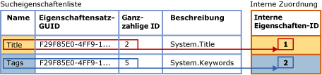
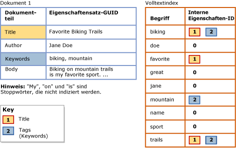

# <a name="search-document-properties-with-search-property-lists"></a>Suchen von Dokumenteigenschaften mithilfe von Sucheigenschaftenlisten
[!INCLUDE[appliesto-ss-asdb-xxxx-xxx-md](../../includes/appliesto-ss-asdb-xxxx-xxx-md.md)]
  Der Inhalt von Dokumenteigenschaften konnte zuvor nicht vom Inhalt des Dokumenttexts unterschieden werden. Dadurch waren Volltextabfragen auf generische Suchvorgänge für ganze Dokumente beschränkt. Jetzt können Sie jedoch einen Volltextindex zur Unterstützung von Suchvorgängen mit Eigenschaftenbereich für bestimmte Eigenschaften wie „Author“ und „Title“ für unterstützte Dokumenttypen in einer **varbinary**-, **varbinary(max)** -Binärdatenspalte (einschließlich **FILESTREAM**) oder **image** -Binärdatenspalte konfigurieren. Diese Form der Suche wird als *Eigenschaftensuche*bezeichnet.  
  
 Der zugeordnete [Filter](../../relational-databases/search/configure-and-manage-filters-for-search.md) (IFilter) bestimmt, ob die Eigenschaftensuche für einen bestimmten Dokumenttyp möglich ist. Bei einigen Dokumenttypen extrahiert der zugeordnete IFilter einige oder alle für diesen Dokumenttyp definierten Eigenschaften und den Inhalt des Dokumenttextes. Sie können einen Volltextindex konfigurieren, um Eigenschaftensuchen nur für Eigenschaften zu unterstützen, die während der Volltextindizierung von einem IFilter extrahiert werden. Zu den IFilters, die Dokumenteigenschaften extrahieren, zählen die IFilters für Microsoft Office-Dokumenttypen (z. B. DOCX, XLSX und PPTX). Der XML-IFilter gibt dagegen keine Eigenschaften aus.  
  
##  <a name="How_FTS_Works_with_search_properties"></a> Verwenden von Sucheigenschaften bei der Volltextsuche  
  
### <a name="internal-property-ids"></a>Interne Eigenschaften-IDs  
 Das Volltextmodul weist jeder registrierten Eigenschaft nach dem Zufallsprinzip eine interne Eigenschaften-ID zu, die die Eigenschaft in der betreffenden Suchliste eindeutig identifiziert und die für diese Sucheigenschaftenliste spezifisch ist. Wenn also eine Eigenschaft mehreren Sucheigenschaftenlisten hinzugefügt wird, weist sie für die einzelnen Listen wahrscheinlich unterschiedliche interne Eigenschaften-IDs auf.  
  
 Wenn eine Eigenschaft für eine Suchliste registriert wird, weist das Volltextmodul der Eigenschaft nach dem Zufallsprinzip eine *interne Eigenschaften-ID* zu. Die interne Eigenschaften-ID ist eine ganze Zahl, die die Eigenschaft in dieser Sucheigenschaftenliste eindeutig identifiziert.  
  
 Die folgende Abbildung zeigt eine logische Sicht einer Sucheigenschaftenliste, in der zwei Eigenschaften (Title und Keywords) angegeben werden. Der Eigenschaftenlistenname für Keywords ist „Tags“. Diese Eigenschaften gehören zum selben Eigenschaftensatz, dessen GUID F29F85E0-4FF9-1068-AB91-08002B27B3D9 lautet. Die ganzzahligen Eigenschaftsbezeichner sind 2 für Title und 5 für Tags (Keywords). Das Volltextmodul ordnet jede Eigenschaft nach dem Zufallsprinzip einer internen Eigenschaften-ID zu, die für die Sucheigenschaftenliste eindeutig ist. Die interne Eigenschaften-ID für die Title-Eigenschaft ist 1, und die interne Eigenschaften-ID für die Tags-Eigenschaft ist 2.  
  
   
  
 Die interne Eigenschaften-ID unterscheidet sich wahrscheinlich vom ganzzahligen Eigenschaftsbezeichner der Eigenschaft. Wenn eine bestimmte Eigenschaft für mehrere Sucheigenschaftenlisten registriert wird, kann für jede Sucheigenschaftenliste eine andere interne Eigenschaften-ID zugewiesen werden. Die interne Eigenschaften-ID kann z. B. in einer Sucheigenschaftenliste 4 sein, in einer anderen 1, in der nächsten 3 usw. Im Gegensatz dazu ist der ganzzahlige Eigenschaftsbezeichner für die Eigenschaft intern, und er bleibt unverändert, egal, an welcher Stelle die Eigenschaft verwendet wird.  
  
### <a name="indexing-of-registered-properties"></a>Indizieren von registrierten Eigenschaften  
 Nachdem ein Volltextindex einer Sucheigenschaftenliste zugeordnet wurde, muss der Index neu aufgefüllt werden, damit eigenschaftenspezifische Suchbegriffe indiziert werden können. Während der Volltextindizierung wird der Inhalt aller Eigenschaften zusammen mit anderem Inhalt im Volltextindex gespeichert. Wenn jedoch ein Suchbegriff aus einer registrierten Eigenschaft indiziert wird, speichert die Volltextindizierung zusammen mit dem Begriff auch die entsprechende interne Eigenschaften-ID. Wenn jedoch eine Eigenschaft nicht registriert ist, wird sie hingegen im Volltextindex gespeichert, als wäre sie ein Teil des Dokumenttexts, und für die interne Eigenschaften-ID wird der Wert 0 (null) festgelegt.  
  
 Die folgende Abbildung veranschaulicht eine logische Sicht der Suchbegriffe in einem Volltextindex, der der in der vorherigen Abbildung enthaltenen Sucheigenschaftenliste zugeordnet ist. Das Beispieldokument Document 1 enthält drei Eigenschaften (Title, Author und Keywords) sowie den Dokumenttext. Für die Title-Eigenschaft und die Keywords-Eigenschaft, die in der Sucheigenschaftenliste angegeben werden, sind Suchbegriffe ihren entsprechenden internen Eigenschaften-IDs im Volltextindex zugeordnet. Im Gegensatz dazu wird der Inhalt der Author-Eigenschaft wie ein Teil des Dokumenttexts indiziert. Dies bedeutet, dass die Größe des Volltextindex beim Registrieren einer Eigenschaft etwas zunimmt, entsprechend der Menge des in der Eigenschaft gespeicherten Inhalts.  
  
   
  
 Suchbegriffe in der Title-Eigenschaft ("Favorite", "Biking" und "Trails") werden der internen Eigenschaften-ID 1 zugeordnet, die Title für diesen Index zugewiesen ist. Suchbegriffe in der Keywords-Eigenschaft ("biking" und "mountain") werden der internen Eigenschaften-ID 2 zugeordnet, die Tags für diesen Index zugewiesen ist. Für Suchbegriffe in der Author-Eigenschaft ("Jane" und "Doe") und Suchbegriffe im Dokumenttext ist die interne Eigenschaften-ID gleich 0 (null). Der Begriff „biking“ kommt in der Title-Eigenschaft, in der Keywords-Eigenschaft (Tags) und im Dokumenttext vor. Bei einer Eigenschaftensuche nach "biking" in der Title-Eigenschaft oder der Keywords-Eigenschaft (Tags) würde dieses Dokument in den Ergebnissen zurückgegeben werden. Eine generische Volltextabfrage nach „biking“ würde dieses Dokument ebenfalls zurückgeben, so als ob der Index nicht für die Eigenschaftensuche konfiguriert wäre. Eine Eigenschaftensuche nach "biking" in der Author-Eigenschaft würde dieses Dokument nicht zurückgeben.  
  
 Eine Eigenschaftenbereich-Volltextabfrage verwendet die internen Eigenschaften-IDs, die für die aktuelle Sucheigenschaftenliste des Volltextindex registriert sind.  
  
##  <a name="impact"></a> Auswirkungen der Aktivierung der Eigenschaftensuche  
 Das Konfigurieren einen Volltextindex für die Unterstützung der Suche nach einer oder mehreren Eigenschaften führt zu einem leichten Größenzuwachs des Index, entsprechend der in der Sucheigenschaftenliste angegebenen Anzahl von Eigenschaften und dem Inhalt der einzelnen Eigenschaften.  
  
 Beim Testen typischer Korpus von Microsoft Word-, Excel- und PowerPoint-Dokumenten wurde von uns ein Volltextindex konfiguriert, mit dem typische Sucheigenschaften indiziert werden können. Durch das Indizieren dieser Eigenschaften wuchs die Größe des Volltextindex um ca. 5 Prozent. Wir erwarten, dass dieser annähernde Größenzuwachs für die meisten Dokumentkorpus typisch sein wird. Der Größenzuwachs hängt letztlich jedoch von der Menge der Eigenschaftendaten im jeweiligen Dokumentkorpus in Bezug auf die Gesamtmenge der Daten ab.  
  
##  <a name="creating"></a> Erstellen einer Sucheigenschaftenliste und Aktivieren der Eigenschaftensuche  
  
###  <a name="creating_sub"></a> Erstellen von Sucheigenschaftenlisten  
 **So erstellen Sie eine Sucheigenschaftenliste mit Transact-SQL**  
  
 Verwenden Sie die Anweisung [CREATE SEARCH PROPERTY LIST &#40;Transact-SQL&#41;](../../t-sql/statements/create-search-property-list-transact-sql.md), und geben Sie mindestens einen Namen für die Liste an.  
  
##### <a name="to-create-a-search-property-list-in-management-studio"></a>So erstellen Sie eine Sucheigenschaftenliste in Management Studio  
  
1.  Erweitern Sie im Objekt-Explorer den Server.  
  
2.  Erweitern Sie **Datenbanken**, und erweitern Sie dann die Datenbank, in der die Sucheigenschaftenliste erstellt werden soll.  
  
3.  Erweitern Sie **Speicher**, und klicken Sie dann mit der rechten Maustaste auf **Sucheigenschaftenlisten**.  
  
4.  Wählen Sie **Neue Sucheigenschaftenliste**aus.  
  
5.  Geben Sie den Namen der Eigenschaftenliste an.  
  
6.  Optional können Sie eine andere Person als Besitzer der Eigenschaftenliste angeben.  
  
7.  Wählen Sie eine der folgenden Optionen aus:  
  
    -   **Erstellen einer leeren Sucheigenschaftenliste**  
  
    -   **Von einer vorhandenen Sucheigenschaftenliste erstellen**  
  
     Weitere Informationen finden Sie unter [New Search Property List](http://msdn.microsoft.com/library/ffca78e9-8608-4b15-bd38-b2d78da4247a).  
  
8.  [!INCLUDE[clickOK](../../includes/clickok-md.md)]  
  
###  <a name="adding"></a> Hinzufügen von Eigenschaften zu einer Sucheigenschaftenliste  
 Für die Eigenschaftensuche muss eine *Sucheigenschaftenliste* erstellt werden. Zudem muss mindestens eine Eigenschaft angegeben werden, die als durchsuchbar festgelegt werden soll. Wenn Sie einer Sucheigenschaftenliste eine Eigenschaft hinzufügen, wird die Eigenschaft für die betreffende Liste registriert. Wenn Sie einer Sucheigenschaftenliste eine Eigenschaft hinzufügen möchten, benötigen Sie die folgenden Werte:  
  
-   Eigenschaftensatz-GUID  
  
     Jede Sucheigenschaft gehört zu einzigen Eigenschaftensatz, der eine Gruppe verwandter Eigenschaften enthält. Jeder Eigenschaftensatz wird von einem Globally Unique Identifier (GUID) identifiziert.  
  
-   Ganzzahliger Eigenschaftsbezeichner  
  
     Jede Sucheigenschaft besitzt einen Bezeichner, der innerhalb des Eigenschaftensatzes eindeutig ist. Der Bezeichner für eine bestimmte Eigenschaft kann entweder eine ganze Zahl oder eine Zeichenfolge sein. Die Volltextsuche unterstützt jedoch nur ganzzahlige Bezeichner.  
  
-   Eigenschaftenname  
  
     Dies ist der Name, den Benutzer in Volltextabfragen angeben, um nach der Eigenschaft zu suchen. Eigenschaftsnamen können interne Leerzeichen enthalten. Die maximale Länge beträgt 256 Zeichen.  
  
     Bei dem Eigenschaftsnamen kann es sich um Folgendes handeln:  
  
    -   Der kanonische Windows-Name der Eigenschaft, z. B. **System.Author** oder **System.Contact.HomeAddress**.  
  
    -   Ein benutzerfreundlicher Name, den sich Benutzer leicht einprägen können. Einige Eigenschaften sind einem bekannten benutzerfreundlichen Namen zugeordnet (z. B. "Autor" oder "Privatadresse"), Sie können jedoch einen beliebigen Namen angeben, der für die Benutzer am besten geeignet ist.  
  
    > [!NOTE]  
    >  Eine bestimmte Kombination von Eigenschaftensatz-GUID und Eigenschaftsbezeichner muss in einer Sucheigenschaftenliste eindeutig sein. Dies bedeutet, dass es nicht möglich ist, die gleiche Eigenschaft mehrmals mit unterschiedlichen Namen oder Beschreibungen hinzuzufügen.  
  
-   Eigenschaftenbeschreibung (optional)  
  
     Wenn Sie einer Sucheigenschaftenliste eine Sucheigenschaft hinzufügen, können Sie eine optionale Beschreibung angeben. Sie können z. B. Informationen zu einer Eigenschaft angeben, die aus ihrem Namen nicht abgeleitet werden können, oder Sie können den Eigenschaftensatz der Eigenschaft beschreiben.  
  
 **So rufen Sie Werte für eine Sucheigenschaftenliste ab**  
  
 Siehe [Find Property Set GUIDs and Property Integer IDs for Search Properties](../../relational-databases/search/find-property-set-guids-and-property-integer-ids-for-search-properties.md).  
  
 **So fügen Sie einer Sucheigenschaftenliste mit Transact-SQL eine Eigenschaft hinzu**  
  
 Verwenden Sie die Anweisung [ALTER SEARCH PROPERTY LIST &#40;Transact-SQL&#41;](../../t-sql/statements/alter-search-property-list-transact-sql.md) mit den Werten, die Sie mithilfe eines der im Artikel [Suchen von Eigenschaftensatz-GUIDs und ganzzahligen Eigenschaft-IDs für Sucheigenschaften](../../relational-databases/search/find-property-set-guids-and-property-integer-ids-for-search-properties.md) beschriebenen Verfahren abgerufen haben.  
  
 Das folgende Beispiel veranschaulicht die Verwendung dieser Werte beim Hinzufügen einer Eigenschaft zu einer Sucheigenschaftenliste:  
  
```  
ALTER SEARCH PROPERTY LIST DocumentTablePropertyList  
   ADD 'Title'  
   WITH ( PROPERTY_SET_GUID = 'F29F85E0-4FF9-1068-AB91-08002B27B3D9', PROPERTY_INT_ID = 2,   
      PROPERTY_DESCRIPTION = 'System.Title - Title of the item.' );  
```  
  
 **So fügen Sie einer Sucheigenschaftenliste in Management Studio eine Eigenschaft hinzu**  
  
 Verwenden Sie das Dialogfeld **Eigenschaften der Sucheigenschaftenliste** , um Sucheigenschaften hinzuzufügen und zu entfernen. Die **Sucheigenschaftenlisten** befinden sich im Objekt-Explorer unter dem Knoten **Speicher** der zugehörigen Datenbank.  
  
###  <a name="associating"></a> Zuordnen einer Sucheigenschaftenliste zu einem Volltextindex  
 Damit ein Volltextindex die Eigenschaftensuche für die in einer Sucheigenschaftenliste registrierten Eigenschaften unterstützt, müssen Sie dem Index die Sucheigenschaftenliste zuordnen und den Index neu auffüllen. Durch das erneute Auffüllen des Volltextindexes werden eigenschaftenspezifische Indexeinträge für Suchbegriffe in den einzelnen registrierten Eigenschaften erstellt.  
  
 Solange der Volltextindex dieser Sucheigenschaftenliste zugeordnet ist, kann in Volltextabfragen mit der PROPERTY-Option des CONTAINS-Prädikats nach Eigenschaften gesucht werden, die für diese Sucheigenschaftenliste registriert sind.  
  
 Wenn Sie die zugeordnete Sucheigenschaftenliste eines Volltextindexes ändern, muss der Index neu erstellt werden, um die Konsistenz herzustellen. Bis eine vollständige Auffüllung ausgeführt wird, wird der Index sofort abgeschnitten, und er ist leer. Weitere Informationen zu den Fällen, in denen Änderungen der Sucheigenschaftenliste eine Neuerstellung des Indexes bewirken, finden Sie unter „Hinweise“ in [ALTER FULLTEXT INDEX &#40;Transact-SQL&#41;](../../t-sql/statements/alter-fulltext-index-transact-sql.md).  
  
 **So ordnen Sie eine Sucheigenschaftenliste mit Transact-SQL einem Volltextindex zu**  
  
 Verwenden Sie die Anweisung [ALTER FULLTEXT INDEX &#40;Transact-SQL&#41;](../../t-sql/statements/alter-fulltext-index-transact-sql.md) mit der `SET SEARCH PROPERTY LIST = <property_list_name>`-Klausel.  
  
 **So ordnen Sie eine Sucheigenschaftenliste mit Management Studio einem Volltextindex zu**  
  
 Geben Sie auf der Seite **Allgemein** des Dialogfelds **Volltextindex-Eigenschaften** einen Wert für **Sucheigenschaftenliste** an.  
  
##  <a name="Ov_CONTAINS_using_PROPERTY"></a> Abfragen von Sucheigenschaften mit CONTAINS  
 Die [CONTAINS](../../t-sql/queries/contains-transact-sql.md) -Basissyntax für eine Volltextabfrage mit Eigenschaftenbereich lautet wie folgt:  
  
```sql  
SELECT column_name FROM table_name  
  WHERE CONTAINS ( PROPERTY ( column_name, 'property_name' ), '<contains_search_condition>' )  
```  
  
 Die folgende Abfrage sucht z. B. nach einer indizierten Eigenschaft `Title`in der `Document` -Spalte der `Production.Document` -Tabelle der `AdventureWorks` -Datenbank. Die Abfrage gibt nur Dokumente zurück, deren `Title` -Eigenschaft die Zeichenfolge `Maintenance` oder `Repair`  
  
```  
USE AdventureWorks  
GO  
SELECT Document FROM Production.Document  
  WHERE CONTAINS ( PROPERTY ( Document, 'Title' ), 'Maintenance OR Repair')  
GO  
```  
  
 Dieses Beispiel setzt voraus, dass der IFilter für das Dokument die Title-Eigenschaft extrahiert, die Title-Eigenschaft der Sucheigenschaftenliste hinzugefügt wurde und die Sucheigenschaftenliste dem Volltextindex zugeordnet ist.  
  
##  <a name="managing"></a> Verwalten von Sucheigenschaftenlisten  
  
###  <a name="viewing"></a> Anzeigen und Ändern von Sucheigenschaftenlisten  
 **So ändern Sie eine Sucheigenschaftenliste mit Transact-SQL**  
  
 Verwenden Sie die Anweisung [ALTER SEARCH PROPERTY LIST &#40;Transact-SQL&#41;](../../t-sql/statements/alter-search-property-list-transact-sql.md) zum Hinzufügen oder Entfernen von Sucheigenschaften.  
  
##### <a name="to-view-and-change-a-search-property-list-in-management-studio"></a>So zeigen Sie eine Sucheigenschaftenlisten in Management Studio an  
  
1.  Erweitern Sie im Objekt-Explorer den Server.  
  
2.  Erweitern Sie **Datenbanken**und dann die Datenbank.  
  
3.  Erweitern Sie **Speicher**.  
  
4.  Erweitern Sie **Sucheigenschaftenlisten** , um die Sucheigenschaftenlisten anzuzeigen.  
  
5.  Klicken Sie mit der rechten Maustaste auf die Eigenschaftenliste, und wählen Sie **Eigenschaften**aus.  
  
6.  Im Dialogfeld **Sucheigenschaftenlisten-Editor** können Sie über das Raster Eigenschaften Sucheigenschaften hinzufügen und entfernen:  
  
    1.  Klicken Sie zum Entfernen einer Dokumenteigenschaft auf den Zeilenkopf links von der Eigenschaft, und drücken Sie ENTF.  
  
    2.  Klicken Sie zum Hinzufügen einer Dokumenteigenschaft auf die leere Zeile am unteren Rand der Liste (rechts vom **\***), und geben Sie die Werte für die neue Eigenschaft ein.  
  
         Weitere Informationen zu diesen Werten finden Sie unter [Sucheigenschaftenlisten-Editor](http://msdn.microsoft.com/library/0f3ced6e-0dfd-49fc-b175-82378c3d668e). Wie Sie diese Werte für die von Microsoft definierte Eigenschaften erhalten, erfahren Sie unter [Suchen von Eigenschaftensatz-GUIDs und ganzzahligen Eigenschaft-IDs für Sucheigenschaften](../../relational-databases/search/find-property-set-guids-and-property-integer-ids-for-search-properties.md). Weitere Informationen zu Eigenschaften, die von einem unabhängigen Softwareanbieter (ISV) definiert wurden, finden Sie in der Dokumentation des betreffenden Anbieters.  
  
7.  [!INCLUDE[clickOK](../../includes/clickok-md.md)]  
  
###  <a name="deleting"></a> Löschen von Sucheigenschaftenlisten  
 Eine Eigenschaftenliste kann nicht aus einer Datenbank gelöscht werden, solange sie einem Volltextindex zugeordnet ist.  
  
 **So löschen Sie eine Sucheigenschaftenliste mit Transact-SQL**  
  
 Verwenden Sie die Anweisung [DROP SEARCH PROPERTY LIST &#40;Transact-SQL&#41;](../../t-sql/statements/drop-search-property-list-transact-sql.md).  
  
##### <a name="to-delete-a-search-property-list-in-management-studio"></a>So löschen Sie eine Sucheigenschaftenliste in Management Studio  
  
1.  Erweitern Sie im Objekt-Explorer den Server.  
  
2.  Erweitern Sie **Datenbanken**und dann die Datenbank.  
  
3.  Erweitern Sie **Speicher**, und erweitern Sie dann den Knoten **Sucheigenschaftenlisten** .  
  
4.  Klicken Sie mit der rechten Maustaste auf die Eigenschaftenliste, die Sie löschen möchten, und klicken Sie auf **Löschen**.  
  
5.  [!INCLUDE[clickOK](../../includes/clickok-md.md)]  
  
## <a name="see-also"></a>Weitere Informationen finden Sie unter  
 [Find Property Set GUIDs and Property Integer IDs for Search Properties](../../relational-databases/search/find-property-set-guids-and-property-integer-ids-for-search-properties.md)   
 [Konfigurieren und Verwalten von Filtern für die Suche](../../relational-databases/search/configure-and-manage-filters-for-search.md)  
  
  
