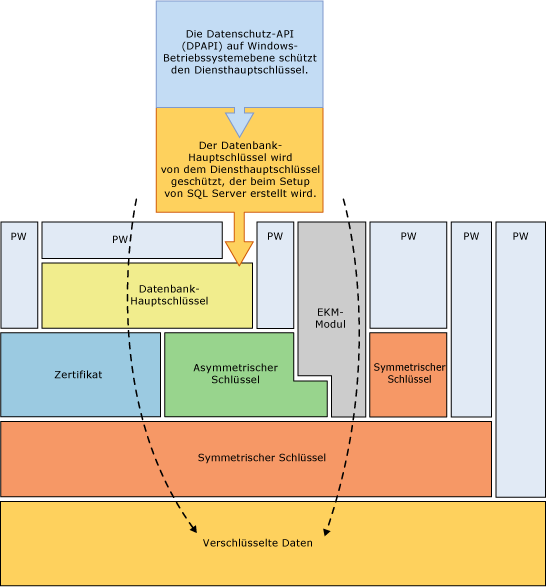
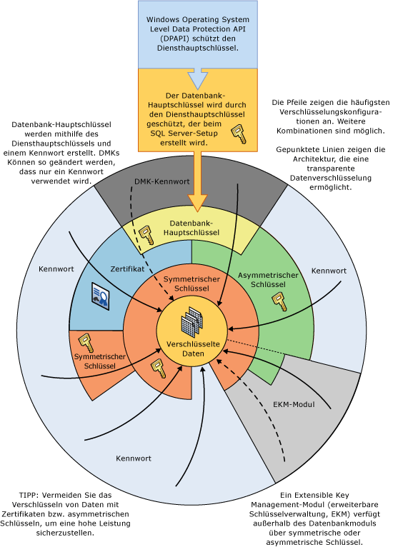

# Verschlüsselungshierarchie
  [!INCLUDE[ssNoVersion](../../../includes/ssnoversion-md.md)] werden Daten anhand einer hierarchischen Verschlüsselungs- und Schlüsselverwaltungsinfrastruktur verschlüsselt. Jede Ebene verschlüsselt die Ebene darunter, indem eine Kombination aus Zertifikaten, asymmetrischen und symmetrischen Schlüsseln verwendet wird. Asymmetrische Schlüssel und symmetrische Schlüssel können außerhalb von [!INCLUDE[ssNoVersion](../../../includes/ssnoversion-md.md)] in einem EKM-Modul (erweiterbare Schlüsselverwaltung) gespeichert werden.  
  
 In der folgenden Abbildung wird dargestellt, wie jede Ebene der Verschlüsselungshierarchie die Ebene darunter verschlüsselt und die häufigsten Verschlüsselungskonfigurationen anzeigt. Der Zugriff auf den Anfang der Hierarchie wird normalerweise durch ein Kennwort geschützt.  
  
   
  
 Denken Sie an Folgendes:  
  
-   Verschlüsseln Sie Daten mit symmetrischen Schlüsseln anstatt mit Zertifikaten oder asymmetrischen Schlüsseln, um eine optimale Leistung zu erzielen.  
  
-   Datenbank-Hauptschlüssel werden mit dem Diensthauptschlüssel geschützt. Der Diensthauptschlüssel wird vom [!INCLUDE[ssNoVersion](../../../includes/ssnoversion-md.md)] -Setup erstellt und mithilfe der Windows-Datenschutz-API (Data Protection API, DPAPI) verschlüsselt.  
  
-   Andere Verschlüsselungshierarchien mit zusätzlichen Ebenen sind möglich.  
  
-   Ein EKM-Modul (Extensible Key Management, erweiterbare Schlüsselverwaltung) verfügt außerhalb von SQL Server über symmetrische oder asymmetrische Schlüssel.  
  
-   Die transparente Datenverschlüsselung (Transparent Data Encryption, TDE) muss einen symmetrischen Schlüssel verwenden, der als Verschlüsselungsschlüssel für die Datenbank bezeichnet wird. Dieser Schlüssel wird entweder mit dem Datenbank-Hauptschlüssel der Masterdatenbank oder mit einem asymmetrischen Schlüssel geschützt, der in einem EKM gespeichert ist.  
  
-   Der Diensthauptschlüssel und die Datenbank-Hauptschlüssel sind symmetrische Schlüssel.  
  
 Die folgende Abbildung zeigt die gleichen Informationen auf eine andere Weise.  
  
   
  
 Dieses Diagramm veranschaulicht die folgenden zusätzlichen Konzepte:  
  
-   In dieser Abbildung geben Pfeile allgemeine Verschlüsselungshierarchien an.  
  
-   Symmetrische und asymmetrische Schlüssel im EKM können den Zugriff auf die symmetrischen und asymmetrischen Schlüssel schützen, die in [!INCLUDE[ssNoVersion](../../../includes/ssnoversion-md.md)]gespeichert sind. Die gepunktete Linie, die dem EKM zugeordnet ist, gibt an, dass Schlüssel im EKM die symmetrischen und asymmetrischen Schlüssel ersetzen könnten, die in [!INCLUDE[ssNoVersion](../../../includes/ssnoversion-md.md)]gespeichert sind.  
  
## Verschlüsselungsmechanismen  
 [!INCLUDE[ssNoVersion](../../../includes/ssnoversion-md.md)] bietet die folgenden Verschlüsselungsmechanismen:  
  
-   [!INCLUDE[tsql](../../../includes/tsql-md.md)] -Funktionen  
  
-   Asymmetrische Schlüssel  
  
-   Symmetrische Schlüssel  
  
-   Zertifikate  
  
-   Transparente Datenverschlüsselung  
  
### Transact-SQL-Funktionen  
 Einzelne Elemente können beim Einfügen oder Aktualisieren mithilfe von [!INCLUDE[tsql](../../../includes/tsql-md.md)] -Funktionen verschlüsselt werden. Weitere Informationen finden Sie unter [ENCRYPTBYPASSPHRASE &#40;Transact-SQL&#41;](../../../t-sql/functions/encryptbypassphrase-transact-sql.md) und [DECRYPTBYPASSPHRASE &#40;Transact-SQL&#41;](../../../t-sql/functions/decryptbypassphrase-transact-sql.md).  
  
### Zertifikate  
 Ein öffentliches Schlüsselzertifikat, in der Regel einfach als Zertifikat bezeichnet, ist eine digital signierte Anweisung, die den Wert eines öffentlichen Schlüssels an die Identität der Person, des Geräts oder des Diensts bindet, der den entsprechenden privaten Schlüssel besitzt. Zertifikate werden von einer Zertifizierungsstelle ausgegeben und signiert. Die Entität, die ein Zertifikat von einer Zertifizierungsstelle erhält, ist der Antragsteller dieses Zertifikats. In der Regel enthalten die Zertifikate die folgenden Informationen.  
  
-   Den öffentlichen Schlüssel des Antragstellers.  
  
-   Die Bezeichnerinformationen des Antragstellers, z. B. Name und E-Mail-Adresse.  
  
-   Den Gültigkeitszeitraum. Dies ist der Zeitraum, in dem das Zertifikat als gültig betrachtet wird.  
  
     Ein Zertifikat ist lediglich für den angegebenen Zeitraum gültig; jedes Zertifikat enthält die Datumsangaben **Gültig von** und **Gültig bis** . Diese Datumsangaben legen den Gültigkeitszeitraum fest. Wenn der Gültigkeitszeitraum für ein Zertifikat abgelaufen ist, muss vom Antragsteller des gerade abgelaufenen Zertifikats ein neues Zertifikat angefordert werden.  
  
-   Aussteller der Bezeichnerinformationen.  
  
-   Die digitale Signatur des Ausstellers.  
  
     Diese Signatur bestätigt die Gültigkeit der Bindung zwischen dem öffentlichen Schlüssel und den Bezeichnerinformationen des Antragstellers. (Zum Vorgang der digitalen Signierung von Informationen gehört die Umwandlung der Informationen sowie einiger geheimer Informationen des Absenders in ein Tag, die so genannten Signatur.)  
  
 Ein wichtiger Vorteil von Zertifikaten besteht darin, dass die Hosts keine Kennwörter für einzelne Antragsteller mehr verwalten müssen. Der Host stellt stattdessen lediglich die Vertrauenswürdigkeit eines Zertifikatausstellers her, der dann eine unbegrenzte Anzahl von Zertifikaten signieren kann.  
  
 Wenn ein Host, z. B. ein sicherer Webserver, einen Aussteller als vertrauenswürdige Stammzertifizierungsstelle bezeichnet, vertraut der Host implizit den Richtlinien, die der Aussteller zum Herstellen der Bindungen der ausgestellten Zertifikate verwendet hat. Der Host vertraut sogar darauf, dass der Aussteller die Identität des Zertifikatantragstellers geprüft hat. Ein Host bezeichnet einen Aussteller als vertrauenswürdige Stammzertifizierungsstelle, indem er das selbstsignierte Zertifikat des Ausstellers, das den öffentlichen Schlüssel des Ausstellers enthält, im Zertifikatsspeicher der vertrauenswürdigen Stammzertifizierungsstelle des Hostcomputers ablegt. Den Zwischenzertifizierungsstellen und den untergeordneten Zertifizierungsstellen wird nur vertraut, wenn sie einen gültigen Zertifizierungspfad von einer vertrauenswürdigen Stammzertifizierungsstelle aufweisen.  
  
 Der Aussteller kann ein Zertifikat aufheben, bevor es abläuft. Eine Aufhebung unterbricht die Bindung eines öffentlichen Schlüssels mit der im Zertifikat angegebenen Identität. Jeder Aussteller verfügt über eine Zertifikataufhebungsliste, die von Programmen beim Prüfen der Gültigkeit eines bestimmten Zertifikats verwendet werden kann.  
  
 Die von [!INCLUDE[ssNoVersion](../../../includes/ssnoversion-md.md)] erstellten, selbstsignierten Zertifikate unterliegen dem X.509-Standard und unterstützen die X.509 v1-Felder.  
  
### Asymmetrische Schlüssel  
 Ein asymmetrischer Schlüssel besteht aus einem privaten Schlüssel und dem entsprechenden öffentlichen Schlüssel. Jeder Schlüssel kann die jeweils vom anderen verschlüsselten Daten entschlüsseln. Die asymmetrische Verschlüsselung und Entschlüsselung sind relativ ressourcenintensiv, sie bieten jedoch eine höhere Sicherheit als die symmetrische Verschlüsselung. Ein asymmetrischer Schlüssel kann für die Verschlüsselung eines symmetrischen Schlüssels zum Speichern in einer Datenbank verwendet werden.  
  
### Symmetrische Schlüssel  
 Ein symmetrischer Schlüssel ist ein Schlüssel, der sowohl für die Verschlüsselung als auch die Entschlüsselung verwendet wird. Die Verschlüsselung und Entschlüsselung mithilfe eines symmetrischen Schlüssels ist schnell und für einen routinemäßigen Einsatz mit sensiblen Daten in der Datenbank geeignet.  
  
### Transparente Datenverschlüsselung  
 Transparente Datenverschlüsselung (Transparent Data Encryption, TDE) ist ein spezieller Fall der Verschlüsselung mithilfe eines symmetrischen Schlüssels. TDE verschlüsselt eine ganze Datenbank mithilfe dieses symmetrischen Schlüssels, der als Verschlüsselungsschlüssel für die Datenbank bezeichnet wird. Der Verschlüsselungsschlüssel für die Datenbank wird mit anderen Schlüsseln oder Zertifikaten geschützt, die entweder mit dem Datenbankhauptschlüssel oder mit einem asymmetrischen, in einem EKM-Modul gespeicherten Schlüssel geschützt werden. Weitere Informationen finden Sie unter [Transparente Datenverschlüsselung &#40;TDE&#41;](../../../relational-databases/security/encryption/transparent-data-encryption.md).  
  
## Verwandte Inhalte  
 [Sichern von SQL Server](../../../relational-databases/security/securing-sql-server.md)  
  
 [Sicherheitsfunktionen &#40;Transact-SQL&#41;](../../../t-sql/functions/security-functions-transact-sql.md)  
  
## Siehe auch  
 [Berechtigungshierarchie &#40;Datenbankmodul &#41;](../../../relational-databases/security/permissions-hierarchy-database-engine.md)   
 [Sicherungsfähige Elemente](../../../relational-databases/security/securables.md)  
  
  

