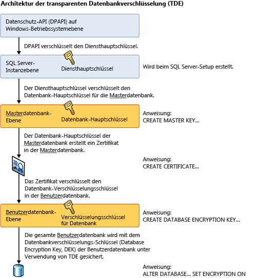

# <a name="transparent-data-encryption-tde"></a>Transparente Datenverschlüsselung (TDE)
[!INCLUDE[tsql-appliesto-ss2008-all_md](../../../includes/tsql-appliesto-ss2008-all-md.md)]

 > Inhalt im Zusammenhang mit früheren Versionen von SQL Server, finden Sie unter [transparente datenverschlüsselung (TDE)](https://msdn.microsoft.com/en-US/library/bb934049(SQL.120).aspx).

  *Transparente Datenverschlüsselung* (Transparent Data Encryption, TDE) verschlüsselt [!INCLUDE[ssNoVersion](../../../includes/ssnoversion-md.md)]-, [!INCLUDE[ssSDSFull](../../../includes/sssdsfull-md.md)]- und [!INCLUDE[ssSDWfull](../../../includes/sssdwfull-md.md)]-Datendateien, bekannt als „Verschlüsselung ruhender Daten“. Sie können verschiedene Vorsichtsmaßnahmen treffen, um eine Datenbank abzusichern, beispielsweise ein sicheres System entwerfen, vertrauliche Datenbestände verschlüsseln oder eine Firewall für die Datenbankserver einrichten. Wenn jedoch physische Medien (etwa Laufwerke oder Sicherungsbänder) gestohlen werden, muss ein böswilliger Benutzer die Datenbank einfach nur wieder herstellen und kann dann die Daten durchsuchen. Eine Lösung dieses Problems besteht darin, die sensiblen Daten in der Datenbank zu verschlüsseln, und den für die Verschlüsselung der Daten verwendeten Schlüssel mit einem Zertifikat zu schützen. Dadurch kann niemand die Daten verwenden, der nicht im Besitz der Schlüssel ist. Diese Art des Schutzes muss jedoch im Voraus geplant werden.  
  
 Die TDE führt die E/A-Verschlüsselung und -Entschlüsselung der Daten und der Protokolldateien in Echtzeit durch. Die Verschlüsselung verwendet einen Verschlüsselungsschlüssel für die Datenbank (Database Encryption Key, DEK), der in der Datenbankstartseite gespeichert wird, damit er während der Wiederherstellung verfügbar ist. Der DEK ist ein symmetrischer Schlüssel, der durch ein in der Masterdatenbank des Servers gespeichertes Zertifikat gesichert wird, oder ein asymmetrischer Schlüssel, der von einem EKM-Modul geschützt wird. TDE schützt die "ruhenden" Daten, also die Daten- und die Protokolldateien. Sie entspricht den in vielen Branchen etablierten Gesetzen, Bestimmungen und Richtlinien. Dadurch können Softwareentwickler Daten mithilfe der AES- und 3DES-Verschlüsselungsalgorithmen verschlüsseln, ohne vorhandene Anwendungen ändern zu müssen.  
  
> [!IMPORTANT]  
>  TDE stellt keine Verschlüsselung über Kommunikationskanäle bereit. Weitere Informationen zum Verschlüsseln von Daten über Kommunikationskanäle finden Sie unter [Aktivieren von verschlüsselten Verbindungen für das Datenbankmodul &#40;SQL Server-Konfigurations-Manager&#41;](../../../database-engine/configure-windows/enable-encrypted-connections-to-the-database-engine.md).  
>   
>  **Verwandte Themen:**  
>   
>  -   [Transparente Datenverschlüsselung in Azure SQL-Datenbank](../../../relational-databases/security/encryption/transparent-data-encryption-with-azure-sql-database.md)  
> -   [Erste Schritte mit transparenter Datenverschlüsselung (TDE) in SQL Data Warehouse](https://azure.microsoft.com/documentation/articles/sql-data-warehouse-encryption-tde-tsql/)  
> -   [Verschieben einer TDE-geschützten Datenbank auf einen anderen SQL-Server](../../../relational-databases/security/encryption/move-a-tde-protected-database-to-another-sql-server.md)  
> -   [Aktivieren von TDE in SQL Server mithilfe von EKM](../../../relational-databases/security/encryption/enable-tde-on-sql-server-using-ekm.md)   
> -   [Verwenden von SQL Server-Connector mit SQL-Verschlüsselungsfunktionen](../../../relational-databases/security/encryption/use-sql-server-connector-with-sql-encryption-features.md)
> - [SQL Server Security Blog on TDE with FAQ (SQL Server Blog zu Sicherheitsthemen über TDE mit FAQ)](https://blogs.msdn.microsoft.com/sqlsecurity/2016/10/05/feature-spotlight-transparent-data-encryption-tde/)
 
  
## <a name="about-tde"></a>Informationen zu TDE  
 Die Verschlüsselung der Datenbankdatei wird auf Seitenebene ausgeführt. In einer verschlüsselten Datenbank werden die Seiten verschlüsselt, bevor Sie auf den Datenträger geschrieben werden, und entschlüsselt, wenn sie in den Arbeitsspeicher gelesen werden. TDE erhöht nicht die Größe einer verschlüsselten Datenbank.  
  
 **Informationen zu [!INCLUDE[ssSDS](../../../includes/sssds-md.md)]**  
  
 Bei der Verwendung von TDE mit [!INCLUDE[sqldbesa](../../../includes/sqldbesa-md.md)] V12 wird das auf Serverebene in der „master“-Datenbank gespeicherte Zertifikat automatisch von [!INCLUDE[ssSDS](../../../includes/sssds-md.md)] erstellt. Zum Verschieben einer TDE-Datenbank auf [!INCLUDE[ssSDS](../../../includes/sssds-md.md)] müssen Sie die Datenbank entschlüsseln, verschieben und auf der Ziel- [!INCLUDE[ssSDS](../../../includes/sssds-md.md)]erneut aktivieren. Schrittweise Anweisungen für TDE auf [!INCLUDE[ssSDS](../../../includes/sssds-md.md)]finden Sie unter [Transparent Data Encryption with Azure SQL Database](../../../relational-databases/security/encryption/transparent-data-encryption-with-azure-sql-database.md).  
  
 **Informationen zu [!INCLUDE[ssNoVersion](../../../includes/ssnoversion-md.md)]**  
  
 Nachdem sie gesichert wurde, kann die Datenbank mit dem richtigen Zertifikat wiederhergestellt werden. Weitere Informationen zu Zertifikaten finden Sie unter [SQL Server Certificates and Asymmetric Keys](../../../relational-databases/security/sql-server-certificates-and-asymmetric-keys.md).  
  
 Wenn Sie TDE aktivieren, sollten Sie das Zertifikat und den privaten Schlüssel, der dem Zertifikat zugeordnet ist, unmittelbar danach sichern. Sollte das Zertifikat einmal nicht mehr verfügbar sein, oder sollten Sie die Datenbank auf einem anderen Server wiederherstellen oder anfügen müssen, müssen Sie über Sicherungen sowohl des Zertifikats als auch des privaten Schlüssels verfügen, da Sie andernfalls die Datenbank nicht öffnen können. Das zum Verschlüsseln verwendete Zertifikat sollte beibehalten werden, selbst wenn TDE für die Datenbank nicht mehr aktiviert ist. Selbst wenn die Datenbank nicht verschlüsselt ist, können Teile des Transaktionsprotokolls nach wie vor geschützt sein. Für bestimmte Vorgänge wird das Zertifikat ggf. weiterhin benötigt, bis eine vollständige Sicherung der Datenbank ausgeführt wurde. Ein abgelaufenes Zertifikat kann immer noch verwendet werden, um Daten mit TDE zu verschlüsseln und zu entschlüsseln.  
  
 **Verschlüsselungshierarchie**  
  
 Die folgende Abbildung zeigt die Architektur der TDE-Verschlüsselung. Nur die Datenbankebenenelemente (der Datenbankverschlüsselungsschlüssel und die ALTER DATABASE-Teile können vom Benutzer bei der Verwendung von TDE in [!INCLUDE[ssSDS](../../../includes/sssds-md.md)]konfiguriert werden.  
  
   
  
## <a name="using-transparent-data-encryption"></a>Verwenden der transparenten Datenverschlüsselung  
 Führen Sie folgende Schritte aus, um TDE zu verwenden:  
  
||  
|-|  
|**Gilt für**: [!INCLUDE[ssNoVersion](../../../includes/ssnoversion-md.md)].|  
  
-   Erstellen Sie einen Hauptschlüssel  
  
-   Erstellen oder beziehen Sie ein vom Hauptschlüssel geschütztes Zertifikat  
  
-   Erstellen Sie einen Verschlüsselungsschlüssel für die Datenbank, und schützen Sie ihn durch das Zertifikat  
  
-   Legen Sie fest, dass für die Datenbank Verschlüsselung verwendet wird  
  
 Im folgenden Beispiel wird die Verschlüsselung und Entschlüsselung der `AdventureWorks2012` -Datenbank gezeigt, wobei ein auf dem Server `MyServerCert`installiertes Zertifikat verwendet wird.  
  
```  
USE master;  
GO  
CREATE MASTER KEY ENCRYPTION BY PASSWORD = '<UseStrongPasswordHere>';  
go  
CREATE CERTIFICATE MyServerCert WITH SUBJECT = 'My DEK Certificate';  
go  
USE AdventureWorks2012;  
GO  
CREATE DATABASE ENCRYPTION KEY  
WITH ALGORITHM = AES_128  
ENCRYPTION BY SERVER CERTIFICATE MyServerCert;  
GO  
ALTER DATABASE AdventureWorks2012  
SET ENCRYPTION ON;  
GO  
```  
  
 Die Verschlüsselungs- und Entschlüsselungsvorgänge werden in von [!INCLUDE[ssNoVersion](../../../includes/ssnoversion-md.md)]geplanten Hintergrundthreads ausgeführt. Sie können den Status dieser Vorgänge mithilfe der in der Liste weiter unten in diesem Thema genannten Katalogsichten und dynamischen Verwaltungssichten anzeigen.  
  
> [!CAUTION]  
>  Sicherungsdateien von Datenbanken, für die TDE aktiviert wurde, werden ebenfalls mithilfe des Verschlüsselungsschlüssels für die Datenbank verschlüsselt. Darum muss bei der Wiederherstellung dieser Sicherungen das Zertifikat, das zum Verschlüsseln des Verschlüsselungsschlüssels für die Datenbank verwendet wurde, verfügbar sein. Dies bedeutet, dass Sie zusätzlich zur Sicherung der Datenbank auch Sicherungskopien der Serverzertifikate aufbewahren müssen, um einem Datenverlust vorzubeugen. Ist das Zertifikat nicht mehr verfügbar, kann es zu einem Datenverlust kommen. Weitere Informationen finden Sie unter [SQL Server Certificates and Asymmetric Keys](../../../relational-databases/security/sql-server-certificates-and-asymmetric-keys.md).  
  
## <a name="commands-and-functions"></a>Befehle und Funktionen  
 Die für TDE verwendeten Zertifikate müssen mithilfe des Datenbank-Hauptschlüssels verschlüsselt sein, damit sie von den folgenden Anweisungen akzeptiert werden. Eine Verschlüsselung nur durch ein Kennwort lehnen die Anweisungen ab.  
  
> [!IMPORTANT]  
>  Wenn die Zertifikate nach der Verwendung durch TDE mit einem Kennwortschutz versehen werden, kann auf die Datenbank nach einem Neustart nicht mehr zugegriffen werden.  
  
 Die folgende Tabelle bietet Links und Erläuterungen zu den Befehlen und Funktionen von TDE.  
  
|Befehl oder Funktion|Zweck|  
|-------------------------|-------------|  
|[CREATE DATABASE ENCRYPTION KEY &#40;Transact-SQL&#41;](../../../t-sql/statements/create-database-encryption-key-transact-sql.md)|Erstellt einen Schlüssel, der verwendet wird, um eine Datenbank zu verschlüsseln.|  
|[ALTER DATABASE ENCRYPTION KEY &#40;Transact-SQL&#41;](../../../t-sql/statements/alter-database-encryption-key-transact-sql.md)|Ändert den Schlüssel, der verwendet wird, um eine Datenbank zu verschlüsseln.|  
|[DROP DATABASE ENCRYPTION KEY &#40;Transact-SQL&#41;](../../../t-sql/statements/drop-database-encryption-key-transact-sql.md)|Entfernt den Schlüssel, der verwendet wurde, um eine Datenbank zu verschlüsseln.|  
|[ALTER DATABASE SET-Optionen &#40;Transact-SQL&#41;](../../../t-sql/statements/alter-database-transact-sql-set-options.md)|Erklärt die **ALTER DATABASE** -Option, mit der TDE aktiviert wird.|  
  
## <a name="catalog-views-and-dynamic-management-views"></a>Katalogsichten und dynamische Verwaltungssichten  
 In der folgenden Tabelle werden die Katalogsichten und die dynamischen Verwaltungssichten von TDE erläutert.  
  
|Katalogsicht oder dynamische Verwaltungssicht|Zweck|  
|---------------------------------------------|-------------|  
|[sys.databases &#40;Transact-SQL&#41;](../../../relational-databases/system-catalog-views/sys-databases-transact-sql.md)|Katalogsicht, die Datenbankinformationen anzeigt.|  
|[sys.certificates &#40;Transact-SQL&#41;](../../../relational-databases/system-catalog-views/sys-certificates-transact-sql.md)|Katalogsicht, die die Zertifikate in einer Datenbank anzeigt.|  
|[sys.dm_database_encryption_keys &#40;Transact-SQL&#41;](../../../relational-databases/system-dynamic-management-views/sys-dm-database-encryption-keys-transact-sql.md)|Dynamische Verwaltungssicht, die Informationen zu den in einer Datenbank verwendeten Verschlüsselungsschlüsseln und dem aktuellen Status der Verschlüsselung einer Datenbank bereitstellt.|  
  
## <a name="permissions"></a>Berechtigungen  
 Jede Funktion und jeder Befehl von TDE erfordert bestimmte Berechtigungen, die in den zuvor gezeigten Tabellen beschrieben wurden.  
  
 Um die in Beziehung zu TDE stehenden Metadaten anzuzeigen, ist die VIEW DEFINITION-Berechtigung für das Zertifikat erforderlich.  
  
## <a name="considerations"></a>Weitere Überlegungen  
 Während eine erneute Verschlüsselungsprüfung für einen Datenbankverschlüsselungsvorgang ausgeführt wird, sind Wartungsvorgänge für die Datenbank deaktiviert. Sie können den Einzelbenutzermodus für die Datenbank verwenden, um einen Wartungsvorgang durchzuführen. Weitere Informationen finden Sie unter [So legen Sie den Einzelbenutzermodus für eine Datenbank fest](../../../relational-databases/databases/set-a-database-to-single-user-mode.md).  
  
 Der Verschlüsselungsstatus der Datenbank wird mit der dynamischen Verwaltungssicht sys.dm_database_encryption_keys angezeigt. Weitere Informationen finden Sie im Abschnitt „Katalogsichten und dynamische Verwaltungssichten“ weiter oben in diesem Thema.  
  
 Bei TDE werden alle Dateien und Dateigruppen in der Datenbank verschlüsselt. Wenn Dateigruppen in einer Datenbank als READ ONLY markiert sind, schlägt der Datenbankverschlüsselungsvorgang fehl.  
  
 Wenn eine Datenbank bei Datenbankspiegelung oder Protokollversand verwendet wird, werden beide Datenbanken verschlüsselt. Die Protokolltransaktionen werden für die Übertragung zwischen den Datenbanken verschlüsselt.  
  
> [!IMPORTANT]  
>  Volltextindizes werden verschlüsselt, wenn für eine Datenbank die Verschlüsselung festgelegt ist. Vor SQL Server 2008 erstellte Volltextindizes werden während des Upgrades auf SQL Server 2008 oder höher in die Datenbank importiert, und sie werden durch TDE verschlüsselt.  

> [!TIP]  
>  Verwenden Sie SQL Server Audit oder SQL-Datenbanküberwachung, um die Veränderungen im TDE-Status einer Datenbank zu überwachen. Bei SQL Server wird TDE unter der Überwachungsaktionsgruppe DATABASE_CHANGE_GROUP nachverfolgt, die in [SQL Server Audit-Aktionsgruppen und -Aktionen](../../../relational-databases/security/auditing/sql-server-audit-action-groups-and-actions.md) enthalten ist.
  
### <a name="restrictions"></a>Einschränkungen  
 Die folgende Vorgänge sind während der ersten Datenbankverschlüsselung, einer Schlüsseländerung oder der Datenbankentschlüsselung nicht erlaubt:  
  
-   Löschen einer Datei aus einer Dateigruppe in der Datenbank  
  
-   Löschen der Datenbank  
  
-   Offlineschalten der Datenbank  
  
-   Trennen einer Datenbank  
  
-   Versetzen einer Datenbank oder einer Dateigruppe in den READ ONLY-Zustand  
  
 Die folgenden Vorgänge sind während der Ausführung der Anweisungen CREATE DATABASE ENCRYPTION KEY, ALTER DATABASE ENCRYPTION KEY, DROP DATABASE ENCRYPTION KEY oder ALTER DATABASE...SET ENCRYPTION nicht erlaubt:  
  
-   Löschen einer Datei aus einer Dateigruppe in der Datenbank.  
  
-   Löschen der Datenbank.  
  
-   Offlineschalten der Datenbank.  
  
-   Trennen einer Datenbank.  
  
-   Versetzen einer Datenbank oder einer Dateigruppe in den READ ONLY-Zustand.  
  
-   Verwenden eines ALTER DATABASE-Befehls.  
  
-   Starten einer Datenbank- oder Datenbankdateisicherung.  
  
-   Starten einer Datenbank- oder Datenbankdateiwiederherstellung.  
  
-   Erstellen einer Momentaufnahme.  
  
 Die folgenden Vorgänge oder Bedingungen verhindern die Anweisungen CREATE DATABASE ENCRYPTION KEY, ALTER DATABASE ENCRYPTION KEY, DROP DATABASE ENCRYPTION KEY oder ALTER DATABASE...SET ENCRYPTION.  
  
-   Die Datenbank ist schreibgeschützt oder hat schreibgeschützte Dateigruppen.  
  
-   Ein ALTER DATABASE-Befehl wird ausgeführt.  
  
-   Eine Datensicherung wird ausgeführt.  
  
-   Die Datenbank ist offline geschaltet oder wird wiederhergestellt.  
  
-   Eine Momentaufnahme wird ausgeführt.  
  
-   Datenbankwartungstasks  
  
 Beim Erstellen von Datenbankdateien ist die sofortige Dateiinitialisierung nicht verfügbar, wenn TDE aktiviert ist.  
  
 Um den Verschlüsselungsschlüssel für die Datenbank mit einem asymmetrischen Schlüssel zu verschlüsseln, muss sich der asymmetrische Schlüssel auf einem erweiterbaren Schlüsselverwaltungsanbieter befinden.  
  
### <a name="transparent-data-encryption-and-transaction-logs"></a>Transparente Datenverschlüsselung und Transaktionsprotokolle  
 Die Aktivierung einer Datenbank für die Verwendung von TDE führt dazu, dass der verbleibende Teil des virtuellen Transaktionsprotokolls auf 0 festgelegt wird. Dadurch wird ein neues virtuelles Transaktionsprotokoll erzwungen. Dies gewährleistet, dass in den Transaktionsprotokollen kein Klartext verbleibt, nachdem die Datenbank für die Verschlüsselung eingerichtet wurde. Sie können den Status der Protokolldateiverschlüsselung erkennen, wenn Sie die `encryption_state`-Spalte in der `sys.dm_database_encryption_keys`-Sicht anzeigen, wie in diesem Beispiel:  
  
```  
USE AdventureWorks2012;  
GO  
/* The value 3 represents an encrypted state   
   on the database and transaction logs. */  
SELECT *  
FROM sys.dm_database_encryption_keys  
WHERE encryption_state = 3;  
GO  
```  
  
 Weitere Informationen zur [!INCLUDE[ssNoVersion](../../../includes/ssnoversion-md.md)]-Protokolldateiarchitektur finden Sie unter [Das Transaktionsprotokoll &#40;SQL Server&#41;](../../../relational-databases/logs/the-transaction-log-sql-server.md).  
  
 Alle vor einer Änderung des Datenbank-Verschlüsselungsschlüssels in das Transaktionsprotokoll geschriebenen Daten werden mithilfe des vorherigen Verschlüsselungsschlüssels für die Datenbank verschlüsselt.  
  
 Nachdem ein Verschlüsselungsschlüssel für die Datenbank zweimal geändert wurde, muss eine Protokollsicherung ausgeführt werden, bevor der Verschlüsselungsschlüssel für die Datenbank wieder geändert werden kann.  
  
### <a name="transparent-data-encryption-and-the-tempdb-system-database"></a>Transparente Datenverschlüsselung und die tempdb-Systemdatenbank  
 Die tempdb-Systemdatenbank wird verschlüsselt, wenn eine beliebige andere Datenbank in der [!INCLUDE[ssNoVersion](../../../includes/ssnoversion-md.md)] -Instanz mithilfe von TDE verschlüsselt ist. Dies könnte sich auf die Leistung unverschlüsselter Datenbanken der gleichen Instanz von [!INCLUDE[ssNoVersion](../../../includes/ssnoversion-md.md)]auswirken. Weitere Informationen über die tempdb-Systemdatenbank finden Sie unter [tempdb-Datenbank](../../../relational-databases/databases/tempdb-database.md).  
  
### <a name="transparent-data-encryption-and-replication"></a>Transparente Datenverschlüsselung und Replikation  
 Daten aus einer TDE-aktivierten Datenbank werden bei der Replikation nicht automatisch in einer verschlüsselten Form repliziert. Sie müssen TDE separat aktivieren, wenn Sie die Verteilungs- und Abonnentendatenbanken schützen möchten. Bei der Snapshotreplikation sowie bei der ursprünglichen Verteilung von Daten für die Transaktions- und Mergereplikation können Daten in unverschlüsselten Zwischendateien gespeichert werden – dies sind z. B. die BCP-Dateien.  Während der Transaktions- oder Mergereplikation kann die Verschlüsselung aktiviert werden, um den Kommunikationskanal zu schützen. Weitere Informationen finden Sie unter [Aktivieren von verschlüsselten Verbindungen zum Datenbankmodul &#40;SQL Server-Konfigurations-Manager&#41;](../../../database-engine/configure-windows/enable-encrypted-connections-to-the-database-engine.md).  
  
### <a name="transparent-data-encryption-and-filestream-data"></a>Transparente Datenverschlüsselung und FILESTREAM-Daten  
 FILESTREAM-Daten werden nicht verschlüsselt, auch dann nicht, wenn TDE aktiviert ist.  
  
## <a name="transparent-data-encryption-and-buffer-pool-extension"></a>Transparente Datenverschlüsselung und Pufferpoolerweiterung  
 Dateien, die mit der Pufferpoolerweiterung (BPE, Buffer Pool Extension) zusammenhängen, werden bei der Verschlüsselung der Datenbank mit TDE nicht verschlüsselt. Für mit BPE zusammenhängende Dateien müssen Sie Verschlüsselungstools auf Dateisystemebene, wie Bitlocker oder EFS, verwenden.  
  
## <a name="transparent-data-encryption-and-in-memory-oltp"></a>Transparente Datenverschlüsselung und In-Memory OLTP  
 TDE kann auf einer Datenbank aktiviert werden, die über In-Memory OLTP-Objekte verfügt. In [!INCLUDE[ssSQL15](../../../includes/sssql15-md.md)] und [!INCLUDE[ssSDSfull](../../../includes/sssdsfull-md.md)] werden In-Memory OLTP-Protokolldatensätze und Daten verschlüsselt, wenn TDE aktiviert ist. In [!INCLUDE[ssSQL14](../../../includes/sssql14-md.md)] werden In-Memory OLTP-Protokolldatensätze verschlüsselt, wenn TDE aktiviert ist, aber Dateien in der MEMORY_OPTIMIZED_DATA-Dateigruppe werden nicht verschlüsselt.  
  
## <a name="related-tasks"></a>Verwandte Aufgaben  
 [Verschieben einer TDE-geschützten Datenbank auf einen anderen SQL-Server](../../../relational-databases/security/encryption/move-a-tde-protected-database-to-another-sql-server.md)  
 [Aktivieren von TDE in SQL Server mithilfe von EKM](../../../relational-databases/security/encryption/enable-tde-on-sql-server-using-ekm.md)  
 [Erweiterbare Schlüsselverwaltung mit Azure Key Vault &#40;SQL Server&#41;](../../../relational-databases/security/encryption/extensible-key-management-using-azure-key-vault-sql-server.md)  
  
## <a name="related-content"></a>Verwandte Inhalte  
 [Transparente Datenverschlüsselung in Azure SQL-Datenbank](../../../relational-databases/security/encryption/transparent-data-encryption-with-azure-sql-database.md)  
 [Erste Schritte mit transparenter Datenverschlüsselung (TDE) in SQL Data Warehouse](https://azure.microsoft.com/documentation/articles/sql-data-warehouse-encryption-tde-tsql/)  
 [SQL Server-Verschlüsselung](../../../relational-databases/security/encryption/sql-server-encryption.md)  
 [Verschlüsselungsschlüssel für SQL Server und Datenbank &#40;Datenbankmodul&#41;](../../../relational-databases/security/encryption/sql-server-and-database-encryption-keys-database-engine.md)  
   
## <a name="see-also"></a>Siehe auch  
 [Sicherheitscenter für SQL Server-Datenbankmodul und Azure SQL-Datenbank](../../../relational-databases/security/security-center-for-sql-server-database-engine-and-azure-sql-database.md)   
 [FILESTREAM &#40;SQL Server&#41;](../../../relational-databases/blob/filestream-sql-server.md)  
  
  

