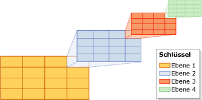
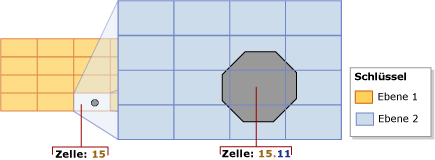
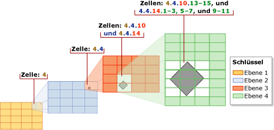
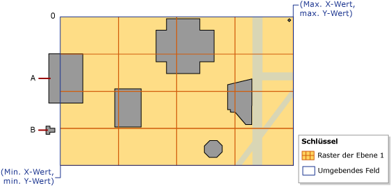
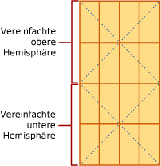

# <a name="spatial-indexes-overview"></a>Übersicht über räumliche Indizes
[!INCLUDE[appliesto-ss-asdb-xxxx-xxx-md](../../includes/appliesto-ss-asdb-xxxx-xxx-md.md)] [!INCLUDE[ssNoVersion](../../includes/ssnoversion-md.md)] unterstützt räumliche Daten und räumliche Indizes. Ein *räumlicher Index* ist ein erweiterter Index, der es Ihnen ermöglicht, eine räumliche Spalte zu indizieren. Eine räumliche Spalte ist eine Tabellenspalte mit Daten eines räumlichen Datentyps wie beispielsweise **geometry** oder **geography**.  
  
> [!IMPORTANT]  
>  Um eine ausführliche Beschreibung und Beispiele der in [!INCLUDE[ssSQL11](../../includes/sssql11-md.md)]eingeführten räumlichen Funktionen (z.B. Funktionen, die räumliche Indizes beeinflussen) zu erhalten, laden Sie das Whitepaper [New Spatial Features in SQL Server 2012](http://go.microsoft.com/fwlink/?LinkId=226407)(Neue räumliche Funktionen in SQL Server 2012) herunter.  
  
##  <a name="about"></a> Informationen zu räumlichen Indizes  
  
###  <a name="decompose"></a> Zerlegen von indiziertem Raum in eine Rasterhierarchie  
 In [!INCLUDE[ssNoVersion](../../includes/ssnoversion-md.md)]werden räumliche Indizes mithilfe von B-Strukturen erstellt; das heißt, dass die Indizes die zweidimensionalen räumlichen Daten in der linearen Reihenfolge der B-Strukturen darstellen müssen. Bevor Daten in einen räumlichen Index eingelesen werden, implementiert [!INCLUDE[ssNoVersion](../../includes/ssnoversion-md.md)] daher eine einheitliche hierarchische Zerlegung des Raums. Während der Indexerstellung wird der Raum in eine vier Ebenen umfassende *Rasterhierarchie* *zerlegt*. Diese Ebenen werden als *Ebene 1* (die oberste Ebene), *Ebene 2*, *Ebene 3*und *Ebene 4*bezeichnet.  
  
 Auf jeder nachfolgenden Ebene wird die ihr übergeordnete Ebene weiter zerlegt, sodass jede Zelle der übergeordneten Ebene ein vollständiges Raster der nächsten Ebene enthält. Auf einer gegebenen Ebene verfügen alle Raster an beiden Achsen über die gleiche Anzahl von Zellen (beispielweise 4&nbsp;x&nbsp;4 oder 8&nbsp;x&nbsp;8), und die Zellen sind alle gleich groß.  
  
 In der folgenden Abbildung wird dargestellt, wie die rechte obere Zelle auf jeder Ebene der Rasterhierarchie in ein Raster der Größe 4&nbsp;x&nbsp;4 zerlegt wird. In Wirklichkeit werden alle Zellen auf diese Art und Weise zerlegt. Wenn beispielsweise ein Raum in vier Ebenen von 4&nbsp;x&nbsp;4-Rastern zerlegt wird, resultieren daraus insgesamt 65.536&nbsp;Zellen auf Ebene&nbsp;4.  
  
   
  
> [!NOTE]  
>  Die Zerlegung des Raums in einen räumlichen Index ist unabhängig von der Maßeinheit, die die Anwendung verwendet.  
  
 Die Zellen einer Rasterhierarchie werden mithilfe einer Variante der Raum füllenden Hilbert-Kurve linear nummeriert. Zur Veranschaulichung wird hier jedoch eine einfache zeilenweise Nummerierung statt der durch die Hilbert-Kurve erzeugten Nummerierung verwendet. In der folgenden Abbildung wurden bereits verschiedene Polygone, die Gebäude darstellen, und Linien, die Straßen darstellen, in einem 4 x 4-Raster der Ebene 1 platziert. Die Zellen der Ebene 1 werden ab der linken oberen Zelle von 1 bis 16 nummeriert.  
  
   
  
#### <a name="grid-density"></a>Rasterdichte  
 Die Anzahl der Zellen entlang der Achsen eines Rasters bestimmt deren *Dichte*: je größer die Anzahl, desto dichter das Raster. Beispielsweise ist ein 8&nbsp;x&nbsp;8-Raster (das 64&nbsp;Zellen ergibt), dichter als ein 4&nbsp;x&nbsp;4-Raster(das 16&nbsp;Zellen ergibt). Die Rasterdichte wird pro Ebene definiert.  
  
 In der [CREATE SPATIAL INDEX](../../t-sql/statements/create-spatial-index-transact-sql.md)[!INCLUDE[tsql](../../includes/tsql-md.md)] -Anweisung kann eine GRIDS-Klausel angegeben werden, die es ermöglicht, für verschiedene Ebenen verschiedene Rasterdichten anzugeben. Die Rasterdichte für eine gegebene Ebene wird mit einem der folgenden Schlüsselwörter angegeben:  
  
|Schlüsselwort|Rasterkonfiguration|Anzahl von Zellen|  
|-------------|------------------------|---------------------|  
|LOW|4X4|16|  
|MEDIUM|8X8|64|  
|HIGH|16X16|256|  
  
 In [!INCLUDE[ssNoVersion](../../includes/ssnoversion-md.md)]ist die Standardeinstellung für alle Ebenen MEDIUM, wenn der Datenbank-Kompatibilitätsgrad auf 100 oder niedriger festgelegt wird. Wenn der Datenbank-Kompatibilitätsgrad auf 110 oder höher festgelegt wird, ist die Standardeinstellung ein automatisches Rasterschema. (Das automatische Raster zeigt eine 8-Ebenenkonfiguration von HLLLLLLL.) Anstelle einer wechselnden Indexrasterdichte können Sie Zellen pro Objekt variieren und Fensterzellen pro Objekt über Hinweise abfragen. 
  
 Sie können den Zerlegungsprozess steuern, indem Sie nicht standardmäßige Rasterdichten angeben. Beispielsweise können verschiedene Dichten auf verschiedenen Ebenen hilfreich sein, um einen Index auf die Größe des indizierten Raums und der Objekte in der räumlichen Spalte fein abzustimmen.  
  
> [!NOTE]  
>  Die Rasterdichten eines räumlichen Index sind in den Spalten level_1_grid, level_2_grid, level_3_grid und level_4_grid der [sys.spatial_index_tessellations](../../relational-databases/system-catalog-views/sys-spatial-index-tessellations-transact-sql.md) -Katalogsicht sichtbar, wenn der Datenbank-Kompatibilitätsgrad auf 100 oder niedriger festgelegt wird. Die Mosaikschemaoptionen **GEOMETRY_AUTO_GRID**/**GEOGRAPHY_AUTO_GRID** füllen diese Spalten nicht auf. Die sys.spatial_index_tessellations-Katalogsicht enthält **NULL** -Werte für diese Spalten, wenn die automatischen Rasteroptionen verwendet werden.  
  
###  <a name="tessellation"></a> Mosaik  
 Nach der Zerlegung eines indizierten Raums in eine Rasterhierarchie werden die Daten anhand des räumlichen Indexes zeilenweise aus der räumlichen Spalte gelesen. Nachdem die Daten für ein räumliches Objekt (bzw. eine räumliche Instanz) gelesen wurden, wird unter Verwendung des räumlichen Index ein *Mosaikprozess* für dieses Objekt durchgeführt. Durch den Mosaikprozess wird das Objekt in die Rasterhierarchie eingepasst, indem das Objekt einer Menge von Rasterzellen zugeordnet wird, die es berührt (*berührte Zellen*). Auf Ebene 1 der Rasterhierarchie beginnend, verläuft der Mosaikprozess *breitenorientiert* über der Ebene. Potenziell kann der Prozess über alle vier Ebenen fortgesetzt werden, wobei zu einem Zeitpunkt jeweils nur eine Ebene bearbeitet werden kann.  
  
 Ergebnis des Mosaikprozesses ist eine Menge berührter Zellen, die im räumlichen Index für das betreffende Objekt verzeichnet sind. Durch das Verweisen auf diese aufgezeichneten Zellen kann mit dem räumlichen Index die Position des Objekts im Raum relativ zu anderen Objekten der räumlichen Spalte, die ebenfalls im Index gespeichert sind, bestimmt werden.  
  
#### <a name="tessellation-rules"></a>Mosaikregeln  
 Um die Anzahl berührter Zellen zu beschränken, die für ein Objekt verzeichnet werden, werden im Mosaikprozess einige Mosaikregeln berücksichtigt. Diese Regeln bestimmen die Tiefe des Mosaikprozesses, und sie legen fest, welche der berührten Zellen im räumlichen Index verzeichnet werden.  
  
 Nachfolgend sind diese Regeln aufgeführt:  
  
-   Die Überlagerungsregel  
  
     Wenn das Objekt eine Zelle völlig bedeckt, heißt es, dass die Zelle vom Objekt *überlagert* wird. Eine überlagerte Zelle wird gezählt und nicht im Mosaikprozess berücksichtigt. Diese Regel ist auf allen Ebenen der Rasterhierarchie gültig. Die Überlagerungsregel vereinfacht den Mosaikprozess und verringert die Datenmenge, die in einem räumlichen Index aufgezeichnet wird.  
  
-   Die Zellen-pro-Objekt-Regel  
  
     Diese Regel erzwingt den *Zellen-pro-Objekt-Grenzwert*, der die maximale Anzahl von Zellen festlegt, die für jedes Objekt gezählt werden können. Dieser Grenzwert gilt nicht für Ebene 1. Auf tieferen Ebenen steuert die Zellen-pro-Objekt-Regel die Informationsmenge, die über das Objekt aufgezeichnet werden kann.  
  
-   Die Tiefste-Zelle-Regel  
  
     Die Tiefste-Zelle-Regel generiert die beste Näherung für ein Objekt, indem nur die Zellen der untersten Ebene aufgezeichnet werden, die im Mosaikprozess für das Objekt berücksichtigt wurden. Übergeordnete Zellen tragen nicht zur Zellen-pro-Objekt-Anzahl bei, und sie werden nicht im Index aufgezeichnet.  
  
 Diese Mosaikregeln werden rekursiv auf jeder Rasterebene angewendet. Im restlichen Teil dieses Abschnitts werden diese Mosaikregeln eingehender beschrieben.  
  
#### <a name="covering-rule"></a>Überlagerungsregel  
 Wenn ein Objekt eine Zelle völlig bedeckt, heißt es, dass die Zelle vom Objekt *überlagert* wird. In der folgenden Abbildung wird beispielsweise eine Zelle der zweiten Ebene (15.11) völlig vom mittleren Teil eines Oktagons überlagert.  
  
   
  
 Überlagerte Zellen werden gezählt und im Index verzeichnet. Diese Zellen unterliegen dem Mosaikprozess nicht weiter.  
  
#### <a name="cells-per-object-rule"></a>Zellen-pro-Objekt-Regel  
 Inwieweit ein Objekt dem Mosaikprozess unterliegt, hängt hauptsächlich vom *Zellen-pro-Objekt-Grenzwert* des räumlichen Index ab. Dieser Grenzwert definiert die maximale Anzahl von Zellen, die das Mosaik pro Objekt umfassen kann. Beachten Sie jedoch, dass dieser Grenzwert überschritten werden kann, weil die Einhaltung der Zellen-pro-Objekt-Regel auf Ebene&nbsp;1 nicht erzwungen wird. Wenn die Anzahl auf Ebene&nbsp;1 den Zellen-pro-Objekt-Grenzwert erreicht oder überschreitet, wird der Mosaikprozess auf den unteren Ebenen nicht weiter fortgesetzt.  
  
 Solange die Anzahl kleiner als der Zellen-pro-Objekt-Grenzwert ist, wird der Mosaikprozess fortgesetzt. Beginnend mit der überlagerten Zelle mit der niedrigsten Anzahl (in der vorstehenden Abbildung beispielsweise Zelle&nbsp;15,6), werden in diesem Prozess alle Zellen daraufhin überprüft, ob sie gezählt oder weiter zusammengesetzt werden sollen. Wenn eine Zelle bei einer weiteren Mosaikbearbeitung den Zellen-pro-Objekt-Grenzwert übersteigen würde, wird die Zelle gezählt und nicht weiter dem Mosaikprozess unterzogen. Andernfalls wird die Zelle im Mosaikprozess berücksichtigt, und es werden die Zellen der untergeordneten Ebene gezählt, die vom Objekt überlagert werden. Der Mosaikprozess wird auf diese Art breitenorientiert über die gesamte Ebene hinweg fortgesetzt. Dieser Prozess wird solange rekursiv in den Rastern untergeordneter Ebenen des Mosaikprozesses fortgesetzt, bis der Grenzwert erreicht wird oder keine zu zählenden Zellen mehr vorhanden sind.  
  
 Betrachten Sie beispielsweise die vorstehende Abbildung, die ein Oktagon zeigt, das vollständig in Zelle&nbsp;15 des Rasters der Ebene&nbsp;1 passt. In der Abbildung wurde Zelle&nbsp;15 dem Mosaikprozess unterzogen, wodurch das Oktagon in neun Zellen der Ebene&nbsp;2 zerlegt wurde. In dieser Illustration wird davon ausgegangen, dass der Zellen-pro-Objekt-Grenzwert gleich&nbsp;9 oder höher ist. Wäre der Zellen-pro-Objekt-Grenzwert gleich 8 oder kleiner, dann würde Zelle&nbsp;15 nicht im Mosaikprozess berücksichtigt, und nur diese eine Zelle&nbsp;15 würde für das Objekt gezählt.  
  
 In der Standardeinstellung ist der Zellen-pro-Objekt-Grenzwert mit 16&nbsp;Zellen pro Objekt definiert, was für die meisten räumlichen Indizes einen zufriedenstellenden Kompromiss zwischen Raum und Genauigkeit darstellt. In der [CREATE SPATIAL INDEX](../../t-sql/statements/create-spatial-index-transact-sql.md)[!INCLUDE[tsql](../../includes/tsql-md.md)] -Anweisung kann jedoch eine CELLS_PER_OBJECT**=***n* Klausel angegeben werden, die es Ihnen ermöglicht, einen Zellen-pro-Objekt-Grenzwert zwischen 1 und 8192 (einschließlich) festzulegen.  
  
> [!NOTE]  
>  Die **cells_per_object** -Einstellung eines räumlichen Index wird in der [sys.spatial_index_tessellations](../../relational-databases/system-catalog-views/sys-spatial-index-tessellations-transact-sql.md) -Katalogsicht angezeigt.  
  
#### <a name="deepest-cell-rule"></a>Tiefste-Zelle-Regel  
 Bei der Tiefste-Zelle-Regel wird die Tatsache genutzt, dass jede Zelle einer untergeordneten Ebene zu der ihr übergeordneten Zelle gehört: Eine Zelle auf Ebene 4 gehört zu einer Zelle auf Ebene 3, eine Zelle auf Ebene 3 gehört zu einer Zelle auf Ebene 2, und eine Zelle auf Ebene 2 gehört zu einer Zelle auf Ebene 1. Zum Beispiel gehört ein Objekt, das zu Zelle 1.1.1.1 gehört, auch zu Zelle 1.1.1, Zelle 1.1 und Zelle 1. Die Kenntnis solcher Beziehungen in der Zellenhierarchie wurde in den Abfrageprozessor integriert. Daher müssen nur die Zellen der tiefsten Ebene im Index verzeichnet werden, sodass im Index nur die minimale Menge an Informationen gespeichert werden muss.  
  
 In der folgenden Abbildung wird ein relativ kleines rautenförmiges Polygon durch den Mosaikprozess unterteilt. Für den Index wird der vordefinierte Zellen-pro-Objekt-Grenzwert 16 verwendet, die bei diesem kleinen Objekt nicht erreicht wird. Deshalb wird der Mosaikprozess bis zu Ebene 4 fortgesetzt. Das Polygon befindet sich in den folgenden Zellen der Ebene 1 bis Ebene 3: 4, 4.4, 4.4.10 und 4.4.14. Bei Verwendung der Tiefste-Zelle-Regel zählt das Mosaik jedoch nur die 12 Zellen auf Ebene 4: 4.4.10.13-15, 4.4.14.1-3, 4.4.14.5-7 und 4.4.14.9-11.  
  
   
  
###  <a name="schemes"></a> Mosaikschemas  
 Das Verhalten eines räumlichen Indexes hängt teilweise von seinem *Mosaikschema*ab. Das Mosaikschema ist datentypspezifisch. In [!INCLUDE[ssNoVersion](../../includes/ssnoversion-md.md)]werden zwei Mosaikschemas für räumliche Indizes unterstützt:  
  
-   Das*Geometrieraster-Mosaikschema*, das als Schema für den **geometry** -Datentyp vorgesehen ist.  
  
-   *Geografierastermosaik*, das für Spalten des **geography** -Datentyps gilt.  
  
> [!NOTE]  
>  Die **tessellation_scheme** -Einstellung eines räumlichen Index wird in der [sys.spatial_index_tessellations](../../relational-databases/system-catalog-views/sys-spatial-index-tessellations-transact-sql.md) -Katalogansicht angezeigt.  
  
#### <a name="geometry-grid-tessellation-scheme"></a>Geometrieraster-Mosaikschema  
 Das GEOMETRY_AUTO_GRID-Mosaik ist das Standardschema für den **geometry** -Datentyp für [!INCLUDE[ssNoVersion](../../includes/ssnoversion-md.md)] und höher.  Das GEOMETRY_GRID-Mosaik ist das einzige Mosaikschema, das für geometry-Datentypen in [!INCLUDE[ssNoVersion](../../includes/ssnoversion-md.md)]verfügbar ist. In diesem Abschnitt werden die Aspekte des Geometrierastermosaikschemas behandelt, die für die Arbeit mit räumlichen Indizes relevant sind: unterstützte Methoden und umgebende Felder.  
  
> [!NOTE]  
>  Dieses Mosaikschema kann mit der USING (GEOMETRY_AUTO_GRID/GEOMETRY_GRID)-Klausel der [CREATE SPATIAL INDEX](../../t-sql/statements/create-spatial-index-transact-sql.md)[!INCLUDE[tsql](../../includes/tsql-md.md)] -Anweisung explizit angegeben werden.  
  
##### <a name="the-bounding-box"></a>Das umgebende Feld  
 Geometrische Daten belegen eine Fläche, die unendlich sein kann. In [!INCLUDE[ssNoVersion](../../includes/ssnoversion-md.md)]erfordert ein räumlicher Index jedoch einen endlichen Raum. Um einen endlichen Raum für die Zerlegung einzurichten, erfordert das Geometrierastermosaikschema ein rechteckiges *umgebendes Feld*. Das umgebende Feld wird durch vier Koordinaten definiert, **(***x-min***,***y-min***)** und **(***x-max***,***y-max***)**, die als Eigenschaften des räumlichen Index gespeichert werden. Diese Koordinaten stellen Folgendes dar:  
  
-   *x-min* ist die X-Koordinate der linken unteren Ecke des umgebenden Felds.  
  
-   *y-min* ist die Y-Koordinate der unteren linken Ecke.  
  
-   *x-max* ist die X-Koordinate der oberen rechten Ecke.  
  
-   *y-max* ist die Y-Koordinate der oberen rechten Ecke.  
  
> [!NOTE]  
>  Diese Koordinaten werden in der BOUNDING_BOX-Klausel der [CREATE SPATIAL INDEX](../../t-sql/statements/create-spatial-index-transact-sql.md)[!INCLUDE[tsql](../../includes/tsql-md.md)] -Anweisung angegeben.  
  
 Die Koordinaten **(***x-min***,***y-min***)** und **(***x-max***,***y-max***)** bestimmen die Position und die Größe des umgebenden Felds. Der Raum außerhalb des umgebenden Felds wird als einzelne Zelle behandelt, die die Nummer&nbsp;0 erhält.  
  
 Der räumliche Index zerlegt den Raum im umgebenden Feld. Das Raster der Ebene&nbsp;1 der Rasterhierarchie füllt das umgebende Feld aus. Zur Platzierung eines geometrischen Objekts in der Rasterhierarchie vergleicht der räumliche Index die Koordinaten des Objekts mit den Koordinaten des umgebenden Felds.  
  
 Die folgende Abbildung zeigt die Punkte, die durch die Koordinaten **(***x-min***,***y-min***)** und **(***x-max***,***y-max***)** des umgebenden Felds definiert werden. Die obersten Ebene der Rasterhierarchie wird als 4&nbsp;x&nbsp;4-Raster angezeigt. Zur Veranschaulichung werden die niedrigeren Ebenen weggelassen. Der Raum außerhalb des umgebenden Felds wird durch eine Null (0) angegeben. Beachten Sie, dass Objekt 'A' teilweise über das Feld hinausragt und dass sich Objekt 'B' komplett außerhalb des Felds in Zelle&nbsp;0 befindet.  
  
   
  
 Ein umgebendes Feld entspricht zu einem gewissen Teil den räumlichen Daten einer Anwendung. Ob das umgebende Feld des Indexes die in der räumlichen Spalte gespeicherten Daten vollständig oder nur zum Teil enthält, hängt von der Anwendung ab. Nur Vorgänge, die mit Objekten berechnet werden, die vollständig im umgebenden Feld liegen, profitieren vom räumlichen Index. Damit der räumliche Index für eine **geometry** -Spalte den größtmöglichen Nutzen bietet, müssen Sie ein umgebendes Feld angeben, das alle oder die meisten Objekte enthält.  
  
> [!NOTE]  
>  Die Rasterdichten eines räumlichen Index werden in den Spalten bounding_box_xmin, bounding_box_ymin, bounding_box_xmax und bounding_box_ymax der [sys.spatial_index_tessellations](../../relational-databases/system-catalog-views/sys-spatial-index-tessellations-transact-sql.md) -Katalogsicht angezeigt.  
  
#### <a name="the-geography-grid-tessellation-scheme"></a>Das Geografierastermosaikschema  
 Dieses Mosaikschema gilt nur für eine **geography** -Spalte. In diesem Abschnitt werden die Methoden zusammengefasst, die vom Geografierastermosaikschema unterstützt werden, und es wird erläutert, wie geodätischer Raum auf eine Ebene projiziert wird, die dann in eine Rasterhierarchie zerlegt wird.  
  
> [!NOTE]  
>  Dieses Mosaikschema kann mit der USING (GEOGRAPHY_AUTO_GRID/GEOGRAPHY_GRID)-Klausel der [CREATE SPATIAL INDEX](../../t-sql/statements/create-spatial-index-transact-sql.md)[!INCLUDE[tsql](../../includes/tsql-md.md)] -Anweisung explizit angegeben werden.  
  
##### <a name="projection-of-the-geodetic-space-onto-a-plane"></a>Projektion des geodätischen Raums auf eine Ebene  
 In Berechnungen mit **geography** -Instanzen (Objekten) wird der Raum, der die Objekte enthält, als geodätisches Ellipsoid behandelt. Zur Zerlegung dieses Raums unterteilt das Geografierastermosaikschema die Oberfläche des Ellipsoids in eine obere und eine untere Hemisphäre und führt dann die folgenden Schritte aus:  
  
1.  Jede Hemisphäre wird auf die Facetten einer vierseitigen Pyramide projiziert.  
  
2.  Die beiden Pyramiden werden auf eine Ebene reduziert.  
  
3.  Die vereinfachten Pyramiden werden verbunden, sodass sie eine nicht-euklidische Ebene bilden.  
  
 In der folgenden Illustration wird dieser dreistufige Zerlegungsprozess schematisch dargestellt. In den Pyramiden stellen die gepunkteten Linien die Begrenzungen der vier Facetten jeder Pyramide dar. Die Schritte 1&nbsp;und&nbsp;2 veranschaulichen das geodätische Ellipsoid, wobei eine grüne waagrechte Linie den Längengrad am Äquator und eine Reihe von grünen senkrechten Linien verschiedene Breitengrade darstellt. Schritt&nbsp;1 zeigt die Pyramiden, die über die zwei Hemisphären projiziert werden. Schritt&nbsp;2 zeigt, wie die Pyramiden auf eine Ebene reduziert werden. Schritt&nbsp;3 veranschaulicht die reduzierten Pyramiden, nachdem diese zu einer Ebene kombiniert wurden, und zeigt einige projizierte Längengrade. Beachten Sie, dass diese projizierten Linien geglättet sind und eine unterschiedliche Länge haben, die davon abhängt, wo sie auf die Pyramiden auftreffen.  
  
   
  
 Nachdem der Raum auf eine Ebene projiziert wurde, wird der Raum in die vier Ebenen umfassende Rasterhierarchie zerlegt. In anderen Ebenen können andere Rasterdichten verwendet werden. Die folgende Illustration zeigt die Ebene, nachdem sie in ein 4&nbsp;x&nbsp;4-Raster der Ebene&nbsp;1 zerlegt wurde. Zur Veranschaulichung werden die niedrigeren Ebenen der Rasterhierarchie hier weggelassen. In Wirklichkeit wird die Ebene vollständig in eine vier Ebenen umfassende Rasterhierarchie zerlegt. Nach Abschluss des Zerlegungsprozesses werden die geografischen Daten zeilenweise aus der geography-Spalte gelesen, und der Mosaikprozess wird wiederum für jedes Objekt durchgeführt.  
  
   
  
##  <a name="methods"></a> Von räumlichen Indizes unterstützte Methoden  
  
###  <a name="geometry"></a> Von räumlichen Indizes unterstützte geometry-Methoden  
 Räumliche Indizes unterstützen unter bestimmten Bedingungen die folgenden mengenorientierten geometry-Methoden: STContains(), STDistance(), STEquals(), STIntersects(), STOverlaps(), STTouches() und STWithin(). Diese Methoden werden nur dann von einem räumlichen Index unterstützt, wenn sie in der WHERE-Klausel oder JOIN ON-Klausel einer Abfrage verwendet werden und in einem Prädikat der folgenden allgemeinen Form stehen:  
  
 *geometry1*.*method_name*(*geometry2*)*comparison_operator**valid_number*  
  
 Es wird nur dann ein Ergebnis ungleich NULL zurückgegeben, wenn *geometry1* und *geometry2* über den gleichen [SRID (Spatial Reference Identifier)](../../relational-databases/spatial/spatial-reference-identifiers-srids.md)verfügen. Anderenfalls gibt die Methode NULL zurück.  
  
 Räumliche Indizes unterstützen die folgenden Prädikatformen:  
  
-   *geometry1*.[STContains](../../t-sql/spatial-geometry/stcontains-geometry-data-type.md)(*geometry2*) = 1  
  
-   *geometry1*.[STDistance](../../t-sql/spatial-geometry/stdistance-geometry-data-type.md)(*geometry2*) < *number*  
  
-   *geometry1*.[STDistance](../../t-sql/spatial-geometry/stdistance-geometry-data-type.md)(*geometry2*) <= *number*  
  
-   *geometry1*.[STEquals](../../t-sql/spatial-geometry/stequals-geometry-data-type.md)(*geometry2*)= 1  
  
-   *geometry1*.[STIntersects](../../t-sql/spatial-geometry/stintersects-geometry-data-type.md)(*geometry2*)= 1  
  
-   *geometry1.* [STOverlaps](../../t-sql/spatial-geometry/stoverlaps-geometry-data-type.md) *(geometry2) = 1*  
  
-   *geometry1*.[STTouches](../../t-sql/spatial-geometry/sttouches-geometry-data-type.md)(*geometry2*) = 1  
  
-   *geometry1*.[STWithin](../../t-sql/spatial-geometry/stwithin-geometry-data-type.md)(*geometry2*)= 1  
  
###  <a name="geography"></a> Von räumlichen Indizes unterstützte geography-Methoden  
 Unter bestimmten Bedingungen unterstützen räumliche Indizes die folgenden mengenorientierten geography-Methoden: STIntersects(),STEquals() und STDistance(). Diese Methoden werden nur dann von einem räumlichen Index unterstützt, wenn sie in der WHERE-Klausel einer Abfrage verwendet werden und in einem Prädikat der folgenden allgemeinen Form stehen:  
  
 *geography1*.*method_name*(*geography2*)*comparison_operator**valid_number*  
  
 Es wird nur dann ein Ergebnis ungleich NULL zurückgegeben, wenn *geography1* und *geography2* über den gleichen [SRID (Spatial Reference Identifier)](../../relational-databases/spatial/spatial-reference-identifiers-srids.md)verfügen. Anderenfalls gibt die Methode NULL zurück.  
  
 Räumliche Indizes unterstützen die folgenden Prädikatformen:  
  
-   *geography1*.[STIntersects](../../t-sql/spatial-geography/stintersects-geography-data-type.md)(*geography2*)= 1  
  
-   *geography1*.[STEquals](../../t-sql/spatial-geography/stequals-geography-data-type.md)(*geography2*)= 1  
  
-   *geography1*.[STDistance](../../t-sql/spatial-geography/stdistance-geography-data-type.md)(*geography2*) < *number*  
  
-   *geography1*.[STDistance](../../t-sql/spatial-geography/stdistance-geography-data-type.md)(*geography2*) <= *number*  
  
### <a name="queries-that-use-spatial-indexes"></a>Abfragen auf der Grundlage räumlicher Indizes  
 Räumliche Indizes werden nur in Abfragen unterstützt, die einen indizierten räumlichen Operator in der **WHERE** -Klausel enthalten. Beispiele für diese Syntax sind:  
  
```  
[spatial object].SpatialMethod([reference spatial object]) [ = | < ] [const literal or variable]  
```  
  
 Der Abfrageoptimierer versteht die Vertauschbarkeit räumlicher Vorgänge ( `@a.STIntersects(@b) = @b.STInterestcs(@a)` ). Der räumliche Index wird jedoch nicht verwendet, wenn am Anfang eines Vergleichs kein räumlicher Operator steht (bei `WHERE 1 = spatial op` wird z. B. kein räumlicher Index verwendet). Um den räumlichen Index zu verwenden, schreiben Sie den Vergleich um (z. B. `WHERE spatial op = 1`).  
  
 Wenn räumliche Indizes unterstützt werden, wird die Entscheidung für die Verwendung des räumlichen Indexes wie bei jedem anderen Index auf Basis der Kosten gefällt. So kann es sein, dass der räumliche Index vom Abfrageoptimierer nicht ausgewählt wird, auch wenn alle Voraussetzungen für die Nutzung dieses Indexes erfüllt sind. Verwenden Sie Showplan, um festzustellen, ob der räumliche Index verwendet wurde, und geben Sie ggf. Abfragehinweise an, um einen gewünschten Abfrageplan zu erzwingen.  
  
 Der nächste Nachbartyp der Abfrage unterstützt ebenfalls räumliche Indizes, allerdings erfordert dies eine bestimmte Abfragesyntax. Die erforderliche Syntax lautet:  
  
```  
SELECT TOP(K) [WITH TIES] *   
FROM <Table> AS T [WITH(INDEX(<SpatialIndex>))]  
WHERE <SpatialColumn>.STDistance(@reference_object) IS NOT NULL  
ORDER BY <SpatialColumn>.STDistance(@reference_object) [;]  
```  
  
## <a name="see-also"></a>Siehe auch  
 [Räumliche Daten &#40;SQL Server&#41;](../../relational-databases/spatial/spatial-data-sql-server.md)  
  
  
