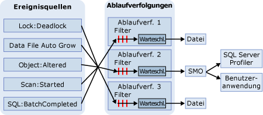

# SQL-Ablaufverfolgung
  Bei der SQL-Ablaufverfolgung werden Ereignisse gesammelt, wenn sie Instanzen von in der Ablaufverfolgungsdefinition aufgeführten Ereignisklassen sind. Diese Ereignisse können aus der Ablaufverfolgung herausgefiltert oder für ihr Ziel in Warteschlangen eingereiht werden. Bei dem Ziel kann es sich um eine Datei oder um [!INCLUDE[ssNoVersion](../../includes/ssnoversion-md.md)] Management Objects (SMO) handeln, die die Ablaufverfolgungsinformationen in Anwendungen verwenden können, die [!INCLUDE[ssNoVersion](../../includes/ssnoversion-md.md)] verwalten.  
  
> [!IMPORTANT]  
>  [!INCLUDE[ssNoteDepFutureAvoid](../../includes/ssnotedepfutureavoid-md.md)] Verwenden Sie stattdessen erweiterte Ereignisse.  
  
## Vorteile der SQL-Ablaufverfolgung  
 Microsoft [!INCLUDE[ssNoVersion](../../includes/ssnoversion-md.md)] stellt zum Erstellen von Ablaufverfolgungen für eine Instanz von [!INCLUDE[tsql](../../includes/tsql-md.md)] gespeicherte [!INCLUDE[ssDEnoversion](../../includes/ssdenoversion-md.md)]-Systemprozeduren zur Verfügung. Sie können aus Ihren Anwendungen heraus diese gespeicherten Systemprozeduren verwenden, um Ablaufverfolgungen statt mit [!INCLUDE[ssSqlProfiler](../../includes/sssqlprofiler-md.md)]manuell zu erstellen. Dadurch können Sie benutzerdefinierte Anwendungen schreiben, die den speziellen Anforderungen Ihres Unternehmens entsprechen.  
  
## Architektur der SQL-Ablaufverfolgung  
 Bei den Ereignisquellen kann es sich um jede Quelle handeln, die das Ablaufverfolgungsereignis erstellt, z. B. [!INCLUDE[tsql](../../includes/tsql-md.md)] -Batches oder [!INCLUDE[ssNoVersion](../../includes/ssnoversion-md.md)] -Ereignisse wie Deadlocks. Weitere Informationen zu Ereignissen finden Sie unter [SQL Server Event Class Reference](../../relational-databases/event-classes/sql-server-event-class-reference.md). Wenn ein Ereignis auftritt, werden die Ereignisinformationen von der Ablaufverfolgung gesammelt, sofern die Ereignisklasse in eine Ablaufverfolgungsdefinition aufgenommen wurde. Wenn Filter für die Ereignisklasse in der Ablaufverfolgungsdefinition definiert wurden, werden die Filter angewendet und die Informationen zum Ablaufverfolgungsereignis an eine Warteschlange übergeben. Von der Warteschlange werden die Ablaufverfolgungsinformationen entweder in eine Datei geschrieben oder können von SMO in Anwendungen wie [!INCLUDE[ssSqlProfiler](../../includes/sssqlprofiler-md.md)]verwendet werden. Das folgende Diagramm zeigt, wie die SQL-Ablaufverfolgung Ereignisse während einer Ablaufverfolgung sammelt.  
  
   
  
## Terminologie zur SQL-Ablaufverfolgung  
 Die folgenden Begriffe beschreiben die Schlüsselkonzepte der SQL-Ablaufverfolgung.  
  
 **Ereignis**  
 Das Auftreten einer Aktion innerhalb einer Instanz von [!INCLUDE[msCoName](../../includes/msconame-md.md)] [!INCLUDE[ssDEnoversion](../../includes/ssdenoversion-md.md)].  
  
 **Datenspalte**  
 Ein Attribut eines Ereignisses.  
  
 **Ereignisklasse**  
 Ein Ereignistyp, für den eine Ablaufverfolgung ausgeführt werden kann. Die Ereignisklasse enthält alle Datenspalten, die von einem Ereignis berichtet werden können.  
  
 **Ereigniskategorie**  
 Eine Gruppe von verwandten Ereignisklassen.  
  
 **Ablaufverfolgung** (Nomen)  
 Eine Sammlung von Ereignissen und Daten, die von [!INCLUDE[ssDE](../../includes/ssde-md.md)] zurückgegeben werden.  
  
 **Ablaufverfolgung ausführen** (Verb)  
 Das Sammeln und Überwachen von Ereignissen in einer Instanz von [!INCLUDE[ssNoVersion](../../includes/ssnoversion-md.md)].  
  
 **Ablaufverfolgungsdefinition**  
 Eine Sammlung von Ereignisklassen, Datenspalten und Filtern, die die Arten von Ereignissen, die während einer Ablaufverfolgung aufgelistet werden sollen, identifiziert.  
  
 **Filter**  
 Kriterien, die die in einer Ablaufverfolgung aufgelisteten Ereignisse eingrenzen.  
  
 **Ablaufverfolgungsdatei**  
 Eine Datei, die beim Speichern einer Ablaufverfolgung erstellt wird.  
  
 **Vorlage**  
 Eine Datei in [!INCLUDE[ssSqlProfiler](../../includes/sssqlprofiler-md.md)], die die in einer Ablaufverfolgung aufgelisteten Ereignisklassen und Datenspalten definiert.  
  
 **Ablaufverfolgungstabelle**  
 Eine Tabelle in [!INCLUDE[ssSqlProfiler](../../includes/sssqlprofiler-md.md)], die beim Speichern einer Ablaufverfolgung in einer Tabelle erstellt wird.  
  
## Verwenden von Datenspalten zum Beschreiben zurückgegebener Ereignisse  
 Die SQL-Ablaufverfolgung verwendet Datenspalten in der Ablaufverfolgungsausgabe, um Ereignisse zu beschreiben, die beim Ausführen der Ablaufverfolgung zurückgegeben werden. In der folgenden Tabelle werden die Datenspalten von [!INCLUDE[ssSqlProfiler](../../includes/sssqlprofiler-md.md)] beschrieben, die mit den von der SQL-Ablaufverfolgung verwendeten Datenspalten identisch sind. Außerdem wird auf die Spalten verwiesen, die standardmäßig ausgewählt sind.  
  
|Datenspalte|Spaltennummer|Beschreibung|  
|-----------------|-------------------|-----------------|  
|**ApplicationName***|10|Der Name der Clientanwendung, die die Verbindung mit einer Instanz von [!INCLUDE[ssNoVersion](../../includes/ssnoversion-md.md)]hergestellt hat. Diese Spalte wird mit den Werten aufgefüllt, die von der Anwendung übergeben werden, und nicht mit dem Namen des Programms.|  
|**BigintData1**|52|Ein Wert (Datentyp **bigint**), der von der Ereignisklasse abhängt, die in der Ablaufverfolgung angegeben ist.|  
|**BigintData2**|53|Ein Wert (Datentyp **bigint**), der von der Ereignisklasse abhängt, die in der Ablaufverfolgung angegeben ist.|  
|**Binärdaten**|2|Der binäre Wert, der von der Ereignisklasse abhängt, die in der Ablaufverfolgung aufgezeichnet wird.|  
|**ClientProcessID***|9|Die ID, die der Hostcomputer dem Prozess zuweist, in dem die Clientanwendung ausgeführt wird. Diese Datenspalte wird aufgefüllt, wenn die Clientprozess-ID durch den Client bereitgestellt wird.|  
|**ColumnPermissions**|44|Gibt an, ob eine Spaltenberechtigung festgelegt wurde. Sie können den Text der Anweisung analysieren, um zu bestimmen, welche Berechtigungen auf welche Spalten angewendet wurden.|  
|**CPU**|18|Die CPU-Zeit (in Millisekunden), die vom Ereignis verwendet wurde.|  
|**Datenbank-ID***|3|Die ID der Datenbank, die durch die USE *database_name*-Anweisung angegeben wurde, bzw. die ID der Standarddatenbank, wenn für eine bestimmte Instanz keine USE *database_name*-Anweisung ausgegeben wurde. [!INCLUDE[ssSqlProfiler](../../includes/sssqlprofiler-md.md)] zeigt den Namen der Datenbank an, wenn die **ServerName** -Datenspalte in der Ablaufverfolgung aufgezeichnet wird und der Server verfügbar ist. Der Wert für eine Datenbank kann mithilfe der DB_ID-Funktion ermittelt werden.|  
|**DatabaseName**|35|Der Name der Datenbank, in der die Benutzeranweisung ausgeführt wird.|  
|**DBUserName***|40|Der [!INCLUDE[ssNoVersion](../../includes/ssnoversion-md.md)] -Benutzername des Clients.|  
|**Dauer**|13|Die Dauer (in Millisekunden) des Ereignisses.   Der Server meldet die Dauer eines Ereignisses in Mikrosekunden (ein Millionstel oder 10-6 einer Sekunde) und den Umfang der vom Ereignis verbrauchten CPU-Zeit in Millisekunden (ein Tausendstel oder 10-3 einer Sekunde). In [!INCLUDE[ssSqlProfiler](../../includes/sssqlprofiler-md.md)] zeigt die grafische Benutzeroberfläche die **Duration** -Spalte standardmäßig in Millisekunden an. Wird jedoch eine Ablaufverfolgung entweder in einer Datei oder in einer Datenbanktabelle gespeichert, wird der Wert der **Duration** -Spalte in Mikrosekunden aufgezeichnet.|  
|**EndTime**|15|Die Beendigungszeit des Ereignisses. Diese Spalte wird nicht für Ereignisklassen, die auf ein startendes Ereignis verweisen, wie z. B. **SQL:BatchStarting** oder **SP:Starting**, aufgefüllt.|  
|**Fehler**|31|Die Fehlernummer eines Ereignisses. Dies ist häufig die in **sysmessages**gespeicherte Fehlernummer.|  
|**EventClass***|27|Der Typ der aufgezeichneten Ereignisklasse.|  
|**EventSequence**|51|Die Sequenznummer für dieses Ereignis.|  
|**EventSubClass***|21|Der Typ der Ereignisunterklasse, der weitere Informationen zu jeder Ereignisklasse bereitstellt. Beispielsweise repräsentieren Ereignisunterklassenwerte für die **Execution Warnings** -Ereignisklasse den Typ der Ausführungswarnung:   **1** = Abfragewartezeit. Die Abfrage muss auf Ressourcen warten (z. B. Arbeitsspeicher), bevor sie ausgeführt werden kann.   **2** = Timeout der Abfrage. Bei der Abfrage ist beim Warten auf Ressourcen, die für das Fortfahren notwendig waren, ein Timeout eingetreten. Diese Datenspalte wird nicht für alle Ereignisklassen aufgefüllt.|  
|**GUID**|54|Ein GUID-Wert, der von der Ereignisklasse abhängt, die in der Ablaufverfolgung angegeben ist.|  
|**FileName**|36|Der logische Name der Datei, die geändert wird.|  
|**Handle**|33|Die ganze Zahl, die von ODBC, OLE DB oder DB-Library zum Koordinieren der Serverausführung verwendet wird.|  
|**HostName***|8|Der Name des Computers, auf dem der Client ausgeführt wird. Diese Datenspalte wird aufgefüllt, wenn der Hostname durch den Client bereitgestellt wird. Der Hostname kann mithilfe der HOST_NAME-Funktion bestimmt werden.|  
|**IndexID**|24|Die ID für den Index des Objekts, das von dem Ereignis betroffen ist. Sie können die Index-ID für ein Objekt mithilfe der **indid** -Spalte der **sysindexes** -Systemtabelle ermitteln.|  
|**IntegerData**|25|Der ganzzahlige Wert, der von der Ereignisklasse abhängt, die in der Ablaufverfolgung aufgezeichnet wird.|  
|**IntegerData2**|55|Der ganzzahlige Wert, der von der Ereignisklasse abhängt, die in der Ablaufverfolgung aufgezeichnet wird.|  
|**IsSystem**|60|Gibt an, ob das Ereignis bei einem Systemprozess oder einem Benutzerprozess aufgetreten ist:   **1** = System   **0** = Benutzer|  
|**LineNumber**|5|Enthält die Nummer der Zeile mit dem Fehler. Für Ereignisse, an denen [!INCLUDE[tsql](../../includes/tsql-md.md)] -Anweisungen beteiligt sind, wie z. B. **SP:StmtStarting**, enthält der Wert von **LineNumber** die Zeilennummer der Anweisung in der gespeicherten Prozedur oder dem Batch.|  
|**LinkedServerName**|45|Name des Verbindungsservers|  
|**LoginName**|11|Anmeldename des Benutzers (Anmeldung der SQL Server-Sicherheit oder Windows-Anmeldeinformationen im Format DOMAIN\Username).|  
|**LoginSid***|41|Die Sicherheits-ID (SID) des angemeldeten Benutzers. Sie finden diese Informationen in der **sys.server_principals**-Sicht der **master**-Datenbank. Jede Anmeldung am Server weist eine eindeutige ID auf.|  
|**MethodName**|47|Der Name der OLE DB-Methode.|  
|**Mode**|32|Die ganze Zahl, die von verschiedenen Ereignissen verwendet wird, um einen Status zu beschreiben, den das Ereignis anfordert oder den es empfangen hat.|  
|**NestLevel**|29|Ganze Zahl, die die von @@NESTLEVEL zurückgegebenen Daten darstellt.|  
|**NTDomainName***|7|Die Microsoft Windows-Domäne, der der Benutzer angehört.|  
|**NTUserName***|6|Der Windows-Benutzername.|  
|**ObjectID**|22|Die vom System zugewiesene ID des Objekts.|  
|**ObjectID2**|56|Die ID des verbundenen Objekts bzw. der verbundenen Entität, soweit verfügbar.|  
|**ObjectName**|34|Der Name des Objekts, auf das verwiesen wird.|  
|**ObjectType***\*|28|Der Wert, der den Typ des am Ereignis beteiligten Objekts darstellt. Dieser Wert entspricht der **type** -Spalte in **sysobjects**.|  
|**Offset**|61|Der Startoffset der Anweisung in der gespeicherten Prozedur oder dem Batch.|  
|**OwnerID**|58|Nur für Sperrereignisse. Der Typ des Objekts, das eine Sperre aufweist.|  
|**OwnerName**|37|Der Datenbank-Benutzername des Objektbesitzers.|  
|**ParentName**|59|Der Name des Schemas, in dem sich dieses Objekt befindet.|  
|**Berechtigungen**|19|Der ganzzahlige Wert, der den Typ der überprüften Berechtigungen darstellt. Die Werte sind:   **1** = SELECT ALL   **2** = UPDATE ALL   **4** = REFERENCES ALL   **8** = INSERT   **16** = DELETE   **32** = EXECUTE (nur Prozeduren)   **4096** = SELECT ANY (mindestens eine Spalte)   **8192** = UPDATE ANY   **16384** = REFERENCES ANY|  
|**ProviderName**|46|Der Name des OLE DB-Anbieters.|  
|**Reads**|16|Die Anzahl der Lesevorgänge auf dem logischen Datenträger, die vom Server aufgrund dieses Ereignisses ausgeführt werden. Hierzu zählen alle Lesevorgänge aus Tabellen und Puffern während der Ausführung der Anweisung.|  
|**RequestID**|49|Die ID der Anforderung, die die Anweisung enthält.|  
|**RoleName**|38|Der Name der Anwendungsrolle, die aktiviert wird.|  
|**RowCounts**|48|Die Anzahl der Zeilen im Batch.|  
|**ServerName***|26|Der Name der Instanz von [!INCLUDE[ssNoVersion](../../includes/ssnoversion-md.md)] , für die eine Ablaufverfolgung erfolgt.|  
|**SessionLoginName**|64|Anmeldename des Benutzers, der die Sitzung geöffnet hat. Wenn Sie beispielsweise [!INCLUDE[ssNoVersion](../../includes/ssnoversion-md.md)] Login1 **verwenden, um eine Verbindung mit** herzustellen, und eine Anweisung als **Login2**ausführen, zeigt **SessionLoginName** den Wert **Login1**an und **LoginName** den Wert **Login2**. In dieser Datenspalte werden [!INCLUDE[ssNoVersion](../../includes/ssnoversion-md.md)] - und Windows-Anmeldenamen angezeigt.|  
|**Severity**|20|Der Schweregrad des Ausnahmeereignisses.|  
|**SourceDatabaseID**|62|Die ID der Datenbank, in der die Quelle des Objekts vorhanden ist.|  
|**SPID**|12|Die Serverprozess-ID (SPID), die von [!INCLUDE[ssNoVersion](../../includes/ssnoversion-md.md)] dem Prozess zugewiesen wurde, der diesem Client zugeordnet ist.|  
|**SqlHandle**|63|64-Bit-Hash, der auf dem Text einer Ad-hoc-Abfrage oder der Datenbank- und Objekt-ID eines SQL-Objekts basiert. Dieser Wert kann an **sys.dm_exec_sql_text()** übergeben werden, um den dazugehörigen SQL-Text abzurufen.|  
|**StartTime***|14|Der Zeitpunkt, zu dem das Ereignis begonnen hat, falls verfügbar.|  
|**Status**|30|Fehlerzustandscode.|  
|**Success**|23|Gibt an, ob das Ereignis erfolgreich war. Mögliche Werte sind:   **1** = Erfolg   **0** = Fehler   Eine **1** bedeutet z. B. eine erfolgreiche Berechtigungsüberprüfung, und **0** bedeutet einen Fehler bei dieser Überprüfung.|  
|**TargetLoginName**|42|Für Aktionen, die auf einen Anmeldenamen abzielen (z. B. das Hinzufügen eines neuen Anmeldenamens), der Anmeldename, auf den abgezielt wird.|  
|**TargetLoginSid**|43|Für Aktionen, die auf einen Anmeldenamen abzielen (z. B. das Hinzufügen eines neuen Anmeldenamens), die SID, auf die abgezielt wird.|  
|**TargetUserName**|39|Für Aktionen, die auf einen Datenbankbenutzer abzielen (z. B. das Erteilen von Berechtigungen für einen Benutzer), der Name des Benutzers.|  
|**TextData**|1|Der Textwert, der von der Ereignisklasse abhängt, die in der Ablaufverfolgung aufgezeichnet wird. Wenn Sie jedoch für eine parametrisierte Abfrage eine Ablaufverfolgung ausführen, werden in der **TextData** -Spalte die Variablen nicht mit Datenwerten angezeigt.|  
|**Transaction ID**|4|Die vom System zugewiesene ID der Transaktion.|  
|**Typ**|57|Der ganzzahlige Wert, der von der Ereignisklasse abhängt, die in der Ablaufverfolgung aufgezeichnet wird.|  
|**Writes**|17|Die Anzahl physischer Schreibvorgänge auf dem Datenträger, die vom Server aufgrund des Ereignisses ausgeführt werden.|  
|**XactSequence**|50|Ein Token zur Beschreibung der aktuellen Transaktion.|  
  
 *Diese Datenspalten werden standardmäßig für alle Ereignisse aufgefüllt.  
  
 \*\***Weitere Informationen zur Datenspalte **ObjectType** finden Sie unter [ObjectType (Spalte für Ablaufverfolgungsereignisse)](../../relational-databases/event-classes/objecttype-trace-event-column.md).  
  
## Tasks der SQL-Ablaufverfolgung  
  
|Taskbeschreibung|Thema|  
|----------------------|-----------|  
|Beschreibt, wie Ablaufverfolgungen mit gespeicherten Transact-SQL-Prozeduren erstellt und ausgeführt werden.|[Erstellen und Ausführen von Ablaufverfolgungen mit gespeicherten Transact-SQL-Prozeduren](../../relational-databases/sql-trace/create-and-run-traces-using-transact-sql-stored-procedures.md)|  
|Beschreibt, wie manuelle Ablaufverfolgungen mit gespeicherten Prozeduren auf einer Instanz von [!INCLUDE[ssDEnoversion](../../includes/ssdenoversion-md.md)] erstellt werden.|[Erstellen manueller Ablaufverfolgungen mit gespeicherten Prozeduren](../../relational-databases/sql-trace/create-manual-traces-using-stored-procedures.md)|  
|Beschreibt, wie Ablaufverfolgungsergebnisse in der Datei gespeichert werden, in die die Ablaufverfolgungsergebnisse geschrieben werden.|[Speichern von Ablaufverfolgungsergebnissen in einer Datei](../../relational-databases/sql-trace/save-trace-results-to-a-file.md)|  
|Beschreibt, wie Zugriff auf Ablaufverfolgungsdaten durch Verwendung von Speicherplatz im Verzeichnis **temp** verbessert wird.|[Verbessern des Zugriffs auf Ablaufverfolgungsdaten](../../relational-databases/sql-trace/improve-access-to-trace-data.md)|  
|Beschreibt, wie mit gespeicherten Prozeduren eine Ablaufverfolgung erstellt wird.|[Erstellen einer Ablaufverfolgung &#40;Transact-SQL&#41;](../../relational-databases/sql-trace/create-a-trace-transact-sql.md)|  
|Beschreibt, wie mit gespeicherten Prozeduren ein Filter erstellt wird, von dem nur die von Ihnen benötigten Informationen zum Nachverfolgen eines Ereignisses abgerufen werden.|[Festlegen eines Ablaufverfolgungsfilters &#40;Transact-SQL&#41;](../../relational-databases/sql-trace/set-a-trace-filter-transact-sql.md)|  
|Beschreibt, wie mit gespeicherten Prozeduren eine vorhandene Ablaufverfolgung geändert wird.|[Ändern einer vorhandenen Ablaufverfolgung &#40;Transact-SQL&#41;](../../relational-databases/sql-trace/modify-an-existing-trace-transact-sql.md)|  
|Beschreibt, wie Sie mit integrierten Funktionen eine gespeicherte Ablaufverfolgung anzeigen.|[Anzeigen einer gespeicherten Ablaufverfolgung &#40;Transact-SQL&#41;](../../relational-databases/sql-trace/view-a-saved-trace-transact-sql.md)|  
|Beschreibt, wie mit integrierten Funktionen Filterinformationen zur Ablaufverfolgung angezeigt werden.|[Anzeigen von Filterinformationen &#40;Transact-SQL&#41;](../../relational-databases/sql-trace/view-filter-information-transact-sql.md)|  
|Beschreibt, wie Sie mit gespeicherten Prozeduren eine Ablaufverfolgung löschen.|[Löschen einer Ablaufverfolgung &#40;Transact-SQL&#41;](../../relational-databases/sql-trace/delete-a-trace-transact-sql.md)|  
|Beschreibt, wie die durch eine Ablaufverfolgung verursachte Leistungseinbuße minimiert wird.|[Optimieren der SQL-Ablaufverfolgung](../../relational-databases/sql-trace/optimize-sql-trace.md)|  
|Beschreibt, wie eine Ablaufverfolgung gefiltert wird, um den während einer Ablaufverfolgung verursachten Aufwand zu minimieren.|[Filtern einer Ablaufverfolgung](../../relational-databases/sql-trace/filter-a-trace.md)|  
|Beschreibt, wie die von der Ablaufverfolgung gesammelte Datenmenge minimiert wird.|[Beschränken der Größe von Ablaufverfolgungsdatei und -tabelle](../../relational-databases/sql-trace/limit-trace-file-and-table-sizes.md)|  
|Beschreibt die zwei Möglichkeiten zum Planen der Ablaufverfolgung in Microsoft [!INCLUDE[ssNoVersion](../../includes/ssnoversion-md.md)].|[Planen von Ablaufverfolgungen](../../relational-databases/sql-trace/schedule-traces.md)|  
  
## Siehe auch  
 [Vorlagen und Berechtigungen in SQL Server Profiler](../../tools/sql-server-profiler/sql-server-profiler-templates-and-permissions.md)   
 [Programmierungshandbuch für SQL Server Management Objects &#40;SMO&#41;](../../relational-databases/server-management-objects-smo/sql-server-management-objects-smo-programming-guide.md)  
  
  