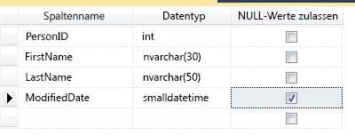
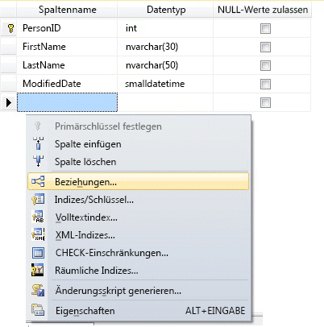
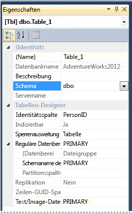

# <a name="create-tables-database-engine"></a>Erstellen von Tabellen (Datenbankmodul)
[!INCLUDE[tsql-appliesto-ss2016-all-md](../../includes/tsql-appliesto-ss2016-all-md.md)]

  Sie können mit [!INCLUDE[ssManStudioFull](../../includes/ssmanstudiofull-md.md)] oder [!INCLUDE[tsql](../../includes/tsql-md.md)] eine neue Tabelle erstellen, diese benennen und einer vorhandenen Datenbank hinzufügen.  
  

  
##  <a name="Permissions"></a> Überprüfen Sie zuerst Ihre Berechtigungen!  
Für diesen Task benötigen Sie die CREATE TABLE-Berechtigung in der Datenbank und die ALTER-Berechtigung für das Schema, in dem die Tabelle erstellt wird.  
  
 Wenn in der CREATE TABLE-Anweisung Spalten als CLR-benutzerdefinierter Typ definiert sind, ist entweder der Besitz des Typs oder die REFERENCES-Berechtigung für den Typ erforderlich.  
  
 Wenn einer Spalte in der CREATE TABLE-Anweisung eine XML-Schemaauflistung zugeordnet ist, ist entweder der Besitz der XML-Schemaauflistung oder die REFERENCES-Berechtigung für die Auflistung erforderlich.  
  
 
## <a name="using-table-designer"></a>Verwenden des Tabellen-Designers  
  
1.  Stellen Sie im **Objekt-Explorer**von SQL Server Management Studio (SSMS) eine Verbindung mit der [!INCLUDE[ssDE](../../includes/ssde-md.md)] -Instanz her, in der die zu ändernde Datenbank enthalten ist.  
  
2.  Erweitern Sie im **Objekt-Explorer**zuerst den Knoten **Datenbanken** und dann die Datenbank, in der die neue Tabelle angelegt werden soll.  
  
3.  Klicken Sie im Objekt-Explorer mit der rechten Maustaste auf den Knoten **Tabellen** der Datenbank, und klicken Sie auf **Neue Tabelle**.  
  
4.  Geben Sie für die einzelnen Spalten Spaltennamen ein, wählen Sie Datentypen aus, und legen Sie wie in der folgenden Abbildung veranschaulicht fest, ob NULL-Werte zulässig sein sollen:  
  
       
  
5.  Um weitere Eigenschaften für eine Spalte anzugeben, z. B. die Identität oder Werte für berechnete Spalten, klicken Sie auf die Spalte und wählen auf der Registerkarte mit den Spalteneigenschaften die geeigneten Eigenschaften aus. Weitere Informationen zu Spalteneigenschaften finden Sie unter [Tabellenspalteneigenschaften &#40;SQL Server Management Studio&#41;](../../relational-databases/tables/table-column-properties-sql-server-management-studio.md).  
  
6.  Um eine Spalte als Primärschlüssel festzulegen, klicken Sie mit der rechten Maustaste darauf, und wählen Sie **Primärschlüssel festlegen** aus. Weitere Informationen finden Sie unter [Create Primary Keys](../../relational-databases/tables/create-primary-keys.md).  
  
7.  Um Fremdschlüsselbeziehungen, CHECK-Einschränkungen oder Indizes zu erstellen, klicken Sie mit der rechten Maustaste in den Bereich des Tabellen-Designers, und wählen Sie, wie in der folgenden Abbildung veranschaulicht, ein Objekt aus der Liste aus:  
  
       
  
     Weitere Informationen zu diesen Objekten finden Sie unter [Create Foreign Key Relationships](../../relational-databases/tables/create-foreign-key-relationships.md), [Create Check Constraints](../../relational-databases/tables/create-check-constraints.md) und [Indexes](../../relational-databases/indexes/indexes.md).  
  
8.  Die Tabelle ist standardmäßig im **dbo** -Schema enthalten. Um ein anderes Schema für die Tabelle anzugeben, klicken Sie mit der rechten Maustaste in den Bereich des Tabellen-Designers, und wählen Sie **Eigenschaften** aus, wie in der folgenden Abbildung veranschaulicht. Wählen Sie in der Dropdownliste **Schema** das geeignete Schema aus.  
  
       
  
     Weitere Informationen zu Schemas finden Sie unter [Create a Database Schema](../../relational-databases/security/authentication-access/create-a-database-schema.md).  
  
9. Wählen Sie im Menü **Datei** den Befehl **Speichern** *Speichern*aus.  
  
10. Geben Sie im Dialogfeld **Namen auswählen** einen Namen für die Tabelle ein, und klicken Sie auf **OK**.  
  
11. Zum Anzeigen der neuen Tabelle erweitern Sie im **Objekt-Explorer**den Knoten **Tabellen** und drücken **F5** , um die Objektliste zu aktualisieren. Die neue Tabelle wird in der Tabellenliste angezeigt.  
  
##  <a name="TsqlProcedure"></a> Verwenden von Transact-SQL  
  
## <a name="using-query-editor"></a>Verwenden des Abfrage-Editors  
  
1.  Stellen Sie im **Objekt-Explorer**eine Verbindung mit einer [!INCLUDE[ssDE](../../includes/ssde-md.md)]-Instanz her.  
  
2.  Klicken Sie in der Standardleiste auf **Neue Abfrage**.  
  
3.  Kopieren Sie das folgende Beispiel, fügen Sie es in das Abfragefenster ein, und klicken Sie auf **Ausführen**.  
  
    ```  
    CREATE TABLE dbo.PurchaseOrderDetail  
    (  
        PurchaseOrderID int NOT NULL  
        ,LineNumber smallint NOT NULL  
        ,ProductID int NULL  
        ,UnitPrice money NULL  
        ,OrderQty smallint NULL  
        ,ReceivedQty float NULL  
        ,RejectedQty float NULL  
        ,DueDate datetime NULL  
    );  
    ```  
  
 Weitere Beispiele finden Sie unter [CREATE TABLE &#40;Transact-SQL&#41;](../../t-sql/statements/create-table-transact-sql.md).  
  
  
