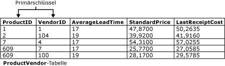

# Primärschlüssel- und Fremdschlüsseleinschränkungen
[!INCLUDE[tsql-appliesto-ss2016-asdb-xxxx-xxx-md](../../includes/tsql-appliesto-ss2016-asdb-xxxx-xxx-md.md)]

  Primärschlüssel und Fremdschlüssel sind zwei Typen von Einschränkungen, die zum Erzwingen der Datenintegrität in [!INCLUDE[ssNoVersion](../../includes/ssnoversion-md.md)] -Tabellen verwendet werden können. Diese sind wichtige Datenbankobjekte.  
  
 Dieses Thema enthält folgende Abschnitte:  
  
 [PRIMARY KEY-Einschränkungen](../../relational-databases/tables/primary-and-foreign-key-constraints.md#PKeys)  
  
 [Foreign Key Constraints](../../relational-databases/tables/primary-and-foreign-key-constraints.md#FKeys)  
  
 [Verwandte Aufgaben](../../relational-databases/tables/primary-and-foreign-key-constraints.md#Tasks)  
  
##   PRIMARY KEY-Einschränkungen  
 Eine Tabelle verfügt normalerweise über eine Spalte oder eine Kombination aus Spalten, die Werte enthalten, die jede Zeile in der Tabelle eindeutig identifizieren. Diese Spalte oder Kombination aus Spalten wird als Primärschlüssel (PK, Primary Key) der Tabelle bezeichnet und erzwingt die Entitätsintegrität der Tabelle. Da PRIMARY KEY-Einschränkungen eindeutige Daten garantieren, werden sie häufig für eine Identitätsspalte definiert.  
  
 Wenn Sie eine PRIMARY KEY-Einschränkung für eine Tabelle angeben, erzwingt [!INCLUDE[ssDE](../../includes/ssde-md.md)] die Eindeutigkeit der Daten, indem automatisch ein eindeutiger Index für die Primärschlüsselspalten erstellt wird. Der Index ermöglicht darüber hinaus den schnellen Zugriff auf Daten, wenn der Primärschlüssel in Abfragen verwendet wird. Wenn eine PRIMARY KEY-Einschränkung für mehrere Spalten definiert wird, können Werte innerhalb einer Spalte dupliziert werden; jede Kombination aus den Werten aller Spalten, die in der Definition der PRIMARY KEY-Einschränkung enthalten sind, muss jedoch eindeutig sein.  
  
 Wie in der nachfolgenden Abbildung dargestellt, müssen die Spalten **ProductID** und **VendorID** in der **Purchasing.ProductVendor** -Tabelle eine zusammengesetzte PRIMARY KEY-Einschränkung für diese Tabelle bilden. Dadurch wird sichergestellt, dass jede Zeile in der **ProductVendor** -Tabelle eine eindeutige Kombination aus **ProductID** und **VendorID**aufweist. Dies verhindert die Einfügung doppelter Zeilen.  
  
   
  
-   Eine Tabelle kann nur eine PRIMARY KEY-Einschränkung enthalten.  
  
-   Ein Primärschlüssel darf 16 Spalten und eine gesamte Schlüssellänge von 900 Bytes nicht überschreiten.  
  
-   Der durch eine PRIMARY KEY-Einschränkung generierte Index darf nicht dazu führen, dass die Anzahl der Indizes der Tabelle 999 nicht gruppierte Indizes und einen gruppierten Index übersteigt.  
  
-   Wenn CLUSTERED oder NONCLUSTERED für eine PRIMARY KEY-Einschränkung nicht angegeben ist, wird CLUSTERED verwendet, sofern keine gruppierten Indizes für die Tabelle vorliegen.  
  
-   Alle Spalten, für die eine PRIMARY KEY-Einschränkung definiert wurde, müssen ungleich NULL definiert sein. Falls keine NULL-Zulässigkeit angegeben ist, wird für alle Spalten, auf die eine PRIMARY KEY-Einschränkung angewendet wird, die NULL-Zulässigkeit auf NOT NULL festgelegt.  
  
-   Wenn ein Primärschlüssel für eine Spalte eines CLR-benutzerdefinierten Typs definiert wird, muss die Implementierung des Typs eine binäre Sortierreihenfolge unterstützen.  
  
##   Foreign Key Constraints  
 Ein Fremdschlüssel (FS) ist eine Spalte oder eine Kombination von Spalten, mit deren Hilfe eine Verknüpfung zwischen den Daten in zwei Tabellen eingerichtet und erzwungen wird, um die Daten zu steuern, die in der Fremdschlüsseltabelle gespeichert werden können. In einem Fremdschlüsselverweis wird zwischen zwei Tabellen ein Link erstellt, wenn eine Spalte bzw. mehrere Spalten einer Tabelle auf die Spalte bzw. Spalten mit dem Primärschlüsselwert einer anderen Tabelle verweisen. Diese Spalte wird zu einem Fremdschlüssel in der zweiten Tabelle.  
  
 Nehmen Sie beispielsweise an, die **Sales.SalesOrderHeader** -Tabelle weist eine Fremdschlüsselverknüpfung zur **Sales.SalesPerson** -Tabelle auf, da eine logische Beziehung zwischen „Sales Orders“ (Kaufaufträgen) und „Sales People“ (Vertriebsmitarbeiter) besteht. Die **SalesPersonID** -Spalte der **SalesOrderHeader** -Tabelle stimmt mit der Primärschlüsselspalte der **SalesPerson** -Tabelle überein. Die **SalesPersonID** -Spalte der **SalesOrderHeader** -Tabelle ist der Fremdschlüssel für die **SalesPerson** -Tabelle. Wenn Sie diese Fremdschlüsselbeziehung erstellen, kann ein Wert für **SalesPersonID** nicht in die **SalesOrderHeader** -Tabelle eingefügt werden, wenn er nicht bereits in der **SalesPerson** -Tabelle vorhanden ist.  
  
 Eine Tabelle kann auf maximal 253 andere Tabellen und Spalten als Fremdschlüssel (ausgehende Referenzen) verweisen. [!INCLUDE[ssSQL15](../../includes/sssql15-md.md)] erhöht den Grenzwert für die Anzahl der anderen Tabellen und Spalten, die auf Spalten in einer einzelnen Tabelle (eingehende Referenzen) verweisen können, von 253 auf 10.000. (Kompatibilitätsgrad 130 oder höher erforderlich.) Für die Erhöhung gelten folgende Einschränkungen:  
  
-   Mehr als 253 Fremdschlüsselverweise werden nur für DELETE DML-Operationen unterstützt. UPDATE- und MERGE-Operationen werden nicht unterstützt.  
  
-   Auch eine Tabelle mit einem Fremdschlüsselverweis auf sich selbst ist auf 253 Fremdschlüsselverweise beschränkt.  
  
-   Für Columnstore-Indizes, speicheroptimierte Tabellen, Datenbanken mit aktiviertem Stretch oder partitionierte Fremdschlüsseltabellen sind derzeit nicht mehr als 253 Fremdschlüsselverweise möglich.  
  
### Indizes für Fremdschlüsseleinschränkungen  
 Im Gegensatz zu PRIMARY KEY-Einschränkungen wird bei der Erstellung einer FOREIGN KEY-Einschränkung nicht automatisch ein entsprechender Index generiert. Das manuelle Erstellen eines Indexes für einen Fremdschlüssel empfiehlt sich jedoch aus folgenden Gründen:  
  
-   Fremdschlüsselspalten werden häufig in Joinkriterien verwendet, wenn Daten aus verbundenen Tabellen in Abfragen kombiniert werden, indem die Übereinstimmungen zwischen der oder den Spalten in der FOREIGN KEY-Einschränkung einer Tabelle und der oder den Spalten eines Primärschlüssels oder eines eindeutigen Schlüssels in der anderen Tabelle ermittelt werden. Ein Index ermöglicht [!INCLUDE[ssDE](../../includes/ssde-md.md)] , die verbundenen Daten in der Fremdschlüsseltabelle schnell zu finden. Es ist jedoch nicht zwingend erforderlich, einen Index zu erstellen. Daten aus zwei verbundenen Tabellen können auch dann kombiniert werden, wenn zwischen diesen Tabellen keine PRIMARY KEY-Einschränkung oder FOREIGN KEY-Einschränkung definiert ist. Eine Fremdschlüsselbeziehung zwischen zwei Tabellen weist jedoch darauf hin, dass die beiden Tabellen dahingehend optimiert wurden, um in einer Abfrage kombiniert zu werden, die die Schlüssel als Kriterium verwendet.  
  
-   Änderungen an PRIMARY KEY-Einschränkungen werden mithilfe von FOREIGN KEY-Einschränkungen in verbundenen Tabellen überprüft.  
  
### Referenzielle Integrität  
 Eine FOREIGN KEY-Einschränkung dient zwar in erster Linie zur Kontrolle der Daten, die in der Fremdschlüsseltabelle gespeichert werden können; sie kontrolliert jedoch auch die Änderungen, die an Daten in der Primärschlüsseltabelle vorgenommen werden. Wenn z.B. die Zeile für einen Vertriebsmitarbeiter aus der **Sales.SalesPerson** -Tabelle gelöscht, die ID des Vertriebsmitarbeiters jedoch weiterhin für Kaufaufträge in der **Sales.SalesOrderHeader** -Tabelle verwendet wird, ist die relationale Integrität zwischen den beiden Tabellen zerstört. Die Kaufaufträge des gelöschten Verkäufers sind in der **SalesOrderHeader** -Tabelle verwaist, da kein Link mehr zu Daten in der **SalesPerson** -Tabelle besteht.  
  
 Durch eine FOREIGN KEY-Einschränkung wird eine derartige Situation verhindert. Die Einschränkung erzwingt die referenzielle Integrität, indem sichergestellt wird, dass Änderungen an Daten in der Primärschlüsseltabelle nicht möglich sind, wenn diese Änderungen dazu führen, dass der Link zu Daten in der Fremdschlüsseltabelle ungültig wird. Wird ein Versuch unternommen, eine Zeile in einer Primärschlüsseltabelle zu löschen oder einen Primärschlüsselwert zu ändern, erzeugt diese Aktion einen Fehler, wenn der gelöschte oder geänderte Primärschlüsselwert einem Wert in der FOREIGN KEY-Einschränkung einer anderen Tabelle entspricht. Um eine Zeile in einer FOREIGN KEY-Einschränkung erfolgreich ändern oder löschen zu können, müssen Sie zuerst die Fremdschlüsseldaten in der Fremdschlüsseltabelle entweder löschen oder so ändern, dass der Fremdschlüssel mit anderen Primärschlüsseldaten verknüpft ist.  
  
#### Kaskadierende referenzielle Integrität  
 Durch Verwendung von Einschränkungen der referenziellen Integrität können Sie die Aktionen definieren, die [!INCLUDE[ssDE](../../includes/ssde-md.md)] durchführt, wenn ein Benutzer versucht, einen Schlüssel zu löschen oder zu aktualisieren, auf den Fremdschlüssel zeigen. Die folgenden kaskadierenden Aktionen können definiert werden.  
  
 NO ACTION  
 [!INCLUDE[ssDE](../../includes/ssde-md.md)] löst einen Fehler aus, und für die Aktion zum Löschen oder Aktualisieren der Zeile in der übergeordneten Tabelle wird ein Rollback ausgeführt.  
  
 CASCADE  
 Wenn diese Zeile in der übergeordneten Tabelle aktualisiert oder gelöscht wird, werden die entsprechenden Zeilen in der verweisenden Tabelle aktualisiert oder gelöscht. CASCADE kann nicht angegeben werden, wenn eine **timestamp** -Spalte Teil eines Fremdschlüssels oder des Schlüssels ist, auf den verwiesen wird. ON DELETE CASCADE kann nicht für eine Tabelle angegeben werden, die einen INSTEAD OF-Trigger aufweist. ON UPDATE CASCADE kann nicht für Tabellen angegeben werden, die INSTEAD OF UPDATE-Trigger aufweisen.  
  
 SET NULL  
 Alle Werte, aus denen sich der Fremdschlüssel zusammensetzt, werden auf NULL festgelegt, wenn die entsprechende Zeile in der übergeordneten Tabelle aktualisiert oder gelöscht wird. Die Fremdschlüsselspalten müssen NULL-Werte zulassen, um diese Einschränkung auszuführen. Diese Option kann nicht für Tabellen angegeben werden, die INSTEAD OF UPDATE-Trigger aufweisen.  
  
 SET DEFAULT  
 Alle Werte, aus denen sich der Fremdschlüssel zusammensetzt, werden auf ihre Standardwerte festgelegt, wenn die entsprechende Zeile in der übergeordneten Tabelle aktualisiert oder gelöscht wird. Alle Fremdschlüsselspalten müssen Standarddefinitionen aufweisen, damit diese Einschränkung ausgeführt wird. Wenn eine Spalte NULL-Werte zulässt, und es ist kein expliziter Standardwert festgelegt, wird NULL als der implizite Standardwert für die Spalte verwendet. Diese Option kann nicht für Tabellen angegeben werden, die INSTEAD OF UPDATE-Trigger aufweisen.  
  
 CASCADE, SET NULL, SET DEFAULT und NO ACTION können für Tabellen kombiniert werden, die referenzielle Beziehungen untereinander aufweisen. Wenn das [!INCLUDE[ssDE](../../includes/ssde-md.md)] die Einstellung NO ACTION feststellt, wird die Verarbeitung beendet und ein Rollback für verbundene CASCADE-, SET NULL- und SET DEFAULT-Aktionen ausgeführt. Wenn eine DELETE-Anweisung eine Kombination aus CASCADE-, SET NULL-, SET DEFAULT- und NO ACTION-Aktionen bewirkt, werden alle CASCADE-, SET NULL- und SET DEFAULT-Aktionen angewendet, bevor das [!INCLUDE[ssDE](../../includes/ssde-md.md)] nach der möglichen Angabe von NO ACTION sucht.  
  
### Trigger und kaskadierende referenzielle Aktionen  
 Kaskadierende referenzielle Aktionen lösen AFTER UPDATE- oder AFTER DELETE-Trigger in der folgenden Weise aus:  
  
-   Alle kaskadierenden referenziellen Aktionen, die direkt von der ursprünglichen DELETE- oder UPDATE-Anweisung ausgelöst werden, werden zuerst ausgeführt.  
  
-   Wenn für die betroffenen Tabellen AFTER-Trigger definiert wurden, werden diese Trigger ausgelöst, nachdem alle kaskadierenden Aktionen ausgeführt wurden. Diese Trigger werden in umgekehrter Reihenfolge zur kaskadierenden Aktion ausgelöst. Falls es mehrere Trigger für eine einzelne Tabelle gibt, werden diese in zufälliger Reihenfolge ausgelöst, sofern es für die Tabelle nicht einen dedizierten ersten oder letzten Trigger gibt. Diese Reihenfolge wird mithilfe von [sp_settriggerorder](../../relational-databases/system-stored-procedures/sp-settriggerorder-transact-sql.md)angegeben.  
  
-   Wenn mehrere kaskadierende Ketten ihren Ursprung in der Tabelle haben, die das direkte Ziel der UPDATE- oder DELETE-Aktion war, wird die Reihenfolge, in der diese Ketten ihre jeweiligen Trigger auslösen, nicht angegeben. Allerdings löst immer erst eine Kette alle ihre Trigger aus, bevor eine andere Kette die Auslösung startet.  
  
-   Ein AFTER-Trigger für die Tabelle, die das direkte Ziel einer UPDATE- oder DELETE-Aktion ist, wird unabhängig davon ausgelöst, ob davon irgendwelche Zeilen betroffen sind oder nicht. In diesem Fall sind keine weiteren Tabellen von der Kaskadierung betroffen.  
  
-   Wenn einer der vorherigen Trigger UPDATE- oder DELETE-Operationen für andere Tabellen ausführt, können diese Aktionen sekundäre kaskadierende Ketten starten. Die Verarbeitung dieser sekundären Ketten erfolgt für jede UPDATE- oder DELETE-Operation zu einem Zeitpunkt, nachdem alle Trigger für alle primären Ketten ausgelöst wurden. Dieser Prozess kann für alle nachfolgenden UPDATE- oder DELETE-Operationen rekursiv wiederholt werden.  
  
-   Die Ausführung von CREATE-, ALTER-, DELETE- oder anderen Operationen in der Datendefinitionssprache (DDL, Data Definition Language) können zur Auslösung von DDL-Triggern führen. Das kann schließlich zur Ausführung von DELETE- oder UPDATE-Operationen führen, die zusätzliche kaskadierende Ketten und Trigger starten.  
  
-   Tritt innerhalb einer bestimmten kaskadierenden referenziellen Aktionskette ein Fehler auf, wird ein Fehler ausgelöst, in dieser Kette werden keine AFTER-Trigger ausgelöst, und für die DELETE- oder UPDATE-Operation, mit der die Kette erzeugt wurde, wird ein Rollback ausgeführt.  
  
-   Eine Tabelle mit einem INSTEAD OF-Trigger kann nicht gleichzeitig eine REFERENCES-Klausel aufweisen, die eine kaskadierende Aktion angibt. Ein AFTER-Trigger in einer Tabelle, die das Ziel einer kaskadierenden Aktion ist, kann jedoch eine INSERT-, UPDATE- oder DELETE-Anweisung in einer anderen Tabelle oder Sicht ausführen, die einen für dieses Objekt definierten INSTEAD OF-Trigger auslöst.  
  
##   Verwandte Aufgaben  
 In der folgenden Tabelle sind die PRIMARY KEY- und FOREIGN KEY-Einschränkungen zugeordneten häufigen Tasks aufgeführt.  
  
|Task|Thema|  
|----------|-----------|  
|Beschreibt, wie ein Primärschlüssel erstellt wird.|[Erstellen von Primärschlüsseln](../../relational-databases/tables/create-primary-keys.md)|  
|Beschreibt, wie ein Primärschlüssel gelöscht wird.|[Löschen von Primärschlüsseln](../../relational-databases/tables/delete-primary-keys.md)|  
|Beschreibt, wie ein Primärschlüssel geändert wird.|[Ändern von Primärschlüsseln](../../relational-databases/tables/modify-primary-keys.md)|  
|Beschreibt, wie Fremdschlüsselbeziehungen erstellt werden.|[Erstellen von Fremdschlüssel-Beziehungen](../../relational-databases/tables/create-foreign-key-relationships.md)|  
|Beschreibt, wie Fremdschlüsselbeziehungen geändert werden.|[Ändern von Fremdschlüsselbeziehungen](../../relational-databases/tables/modify-foreign-key-relationships.md)|  
|Beschreibt, wie Fremdschlüsselbeziehungen gelöscht werden.|[Löschen von Primärschlüssel-Fremdschlüssel-Beziehungen](../../relational-databases/tables/delete-foreign-key-relationships.md)|  
|Beschreibt, wie Fremdschlüsseleigenschaften angezeigt werden.|[Anzeigen von Fremdschlüsseleigenschaften](../../relational-databases/tables/view-foreign-key-properties.md)|  
|Beschreibt, wie FOREIGN KEY-Einschränkungen zur Replikation deaktiviert werden.|[Deaktivieren von Fremdschlüsseleinschränkungen für die Replikation](../../relational-databases/tables/disable-foreign-key-constraints-for-replication.md)|  
|Beschreibt, wie FOREIGN KEY-Einschränkungen während einer INSERT- oder einer UPDATE-Anweisung deaktiviert werden.|[Deaktivieren von Fremdschlüsseleinschränkungen mit INSERT- und UPDATE-Anweisungen](../../relational-databases/tables/disable-foreign-key-constraints-with-insert-and-update-statements.md)|  
  
  

